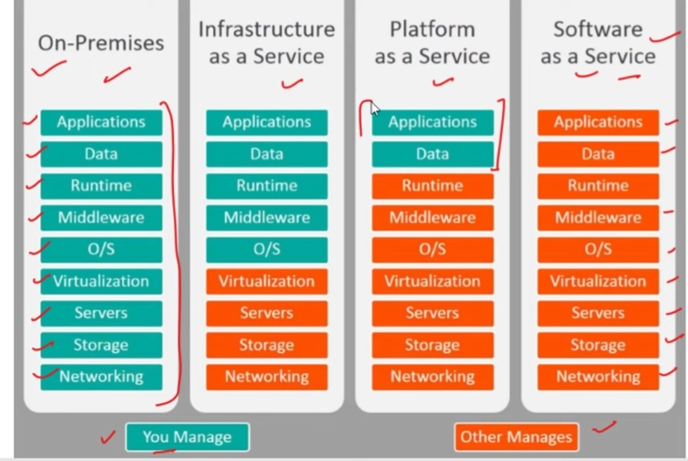
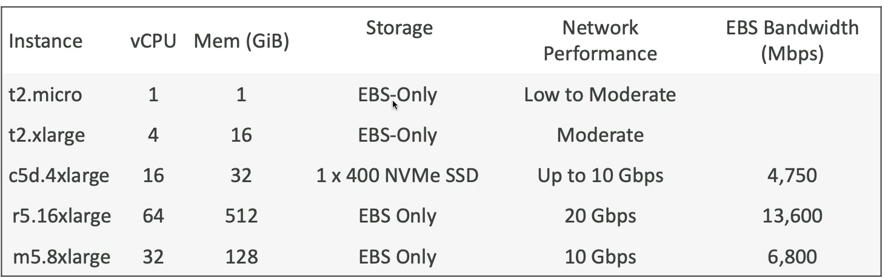

# About Cloud Computing

Cloud computing is a model for delivering computing services such as storage, processing power, and applications over the internet, instead of hosting and maintaining physical servers and hardware. Users access these resources through the internet ("the cloud") on a pay-as-you-go basis, which provides flexibility, scalability, and cost-efficiency.

### Key Characteristics of Cloud Computing:

1. **On-Demand Self-Service**: Users can access computing resources as needed, without requiring human intervention.
2. **Broad Network Access**: Services are available over the internet from any location and device.
3. **Resource Pooling**: Multiple users share the same physical resources (servers, storage) through virtualization.
4. **Rapid Elasticity**: Cloud resources can be scaled up or down dynamically according to demand.
5. **Measured Service**: Usage is monitored, controlled, and reported, ensuring that customers pay only for what they use.

### Types of Cloud Computing Services:

1. **Infrastructure as a Service (IaaS)**: Offers virtualized computing resources like virtual machines (VMs), storage, and networks. Example: Amazon Web Services (AWS) EC2.
2. **Platform as a Service (PaaS)**: Provides a platform that allows developers to build, run, and manage applications without worrying about the underlying infrastructure. Example: Google App Engine, Microsoft Azure.
3. **Software as a Service (SaaS)**: Delivers software applications over the internet on a subscription basis. Example: Google Workspace, Microsoft 365.

### Deployment Models:

1. **Public Cloud**: Services provided by third-party vendors over the internet to the general public. Example: AWS, Microsoft Azure, Google Cloud.
2. **Private Cloud**: Services are maintained on a private network, typically by a single organization for its own use, offering more control and security.
3. **Hybrid Cloud**: A combination of both public and private clouds, allowing data and applications to be shared between them.

### Benefits of Cloud Computing:

- **Cost Efficiency**: Reduces capital expenditure (CapEx) by eliminating the need to buy hardware and manage data centers.
- **Scalability**: Easily scale resources to handle increased workloads.
- **Flexibility and Mobility**: Access resources from anywhere with an internet connection.
- **Disaster Recovery and Backup**: Offers data backup, disaster recovery, and business continuity with minimal investment.

Cloud computing is widely adopted across industries for tasks like hosting websites, storing large datasets, running applications, and enabling artificial intelligence and machine learning operations.

# Amazon EC2

## Capability of EC2 are :

Renting virtual machines (EC2)
Storing data on virtual drives (EBS)
Distributing load across machine(ELB)
Scaling the services using the auto scaling group.

Amazon EC2 (Elastic Compute Cloud) is a web service provided by AWS (Amazon Web Services) that offers scalable virtual servers in the cloud. It allows you to run applications and services on virtual machines (called instances) with flexible configuration options. Here’s a breakdown of key details about Amazon EC2:

### 1. **Instance Types**

- EC2 offers a variety of instance types optimized for different use cases, including:
  - **General Purpose**: Balanced resources (e.g., t2, t3, m5 instances).
  - **Compute Optimized**: For compute-intensive tasks (e.g., c5 instances).
  - **Memory Optimized**: For memory-intensive applications (e.g., r5 instances).
  - **Storage Optimized**: For applications requiring high I/O operations (e.g., i3 instances).
  - **GPU Instances**: For tasks requiring GPU acceleration like machine learning (e.g., p3 instances).

### 2. **Elasticity and Scalability**

- **Elasticity**: You can dynamically scale up or down your EC2 instances to handle changes in traffic or workload.
- **Auto Scaling**: Automatically adjusts the number of instances based on defined policies, keeping performance and costs optimized.

### 3. **Pricing Models**

- **On-Demand**: Pay for compute capacity by the second without any long-term commitment.
- **Reserved Instances**: Offers significant discounts (up to 75%) if you reserve an instance for 1 or 3 years.
- **Spot Instances**: Purchase unused capacity at a discounted rate, suitable for fault-tolerant and flexible workloads.
- **Savings Plans**: A flexible pricing model that offers lower prices in exchange for a commitment to use a specific amount of compute power.

### 4. **Storage Options**

- **Elastic Block Store (EBS)**: Persistent block storage volumes that you can attach to EC2 instances. EBS volumes can be used for databases, file systems, or any other block storage needs.
- **Instance Store**: Temporary block storage that is physically attached to the instance. Data is lost when the instance is stopped or terminated.
- **Elastic File System (EFS)**: A managed file system that can be shared among multiple instances.

### 5. **Security**

- **Security Groups**: Acts as a virtual firewall to control inbound and outbound traffic for instances.
- **Key Pairs**: EC2 instances use public-private key pairs for SSH access.
- **IAM Roles**: You can assign IAM (Identity and Access Management) roles to EC2 instances to securely access other AWS services (e.g., S3, DynamoDB).

### 6. **Networking**

- **Elastic IP**: Static IP addresses that you can allocate to instances.
- **VPC**: Virtual Private Cloud lets you launch instances in an isolated network.
- **Elastic Load Balancing (ELB)**: Automatically distributes incoming traffic across multiple EC2 instances.

### 7. **Regions and Availability Zones**

- EC2 instances are available in various **AWS Regions** globally. Each region has multiple **Availability Zones** (AZs), which are distinct data centers. This allows for high availability and disaster recovery.

### 8. **Monitoring and Management**

- **Amazon CloudWatch**: Provides monitoring for EC2 instances, including metrics like CPU, memory, and disk I/O.
- **EC2 Auto Recovery**: Automatically recovers an instance if it becomes impaired.
- **Elastic IPs and Load Balancers**: Manage traffic to multiple instances across different AZs or Regions.

### 9. **Use Cases**

- **Web Hosting**: EC2 is often used for scalable web hosting solutions.
- **Data Processing**: High-compute instances can be used for real-time or batch data processing.
- **Machine Learning**: GPU instances are well-suited for training machine learning models.
- **Gaming**: EC2 is used for hosting game servers with scalable capacity.

Would you like more details on any specific aspect of EC2?

Amazon EC2 instance types are categorized based on their underlying hardware and are designed to fit different use cases. These instances differ in terms of their CPU, memory, storage, and networking capabilities. Here's a breakdown of the basics of EC2 instance types:

### **General-Purpose Instances**

- **Purpose**: Balanced CPU, memory, and networking resources, suitable for a variety of applications.
- **Use Cases**: Web servers, development and test environments, small databases, and general-purpose workloads.
- **Popular Instance Families**:
  - **T4g/T3/T3a**: Burstable performance instances with a baseline level of CPU performance that can burst to higher levels.
  - **M6g/M5/M5a/M5n**: Standard instances for a balanced mix of compute, memory, and networking.

### **Compute-Optimized Instances**

- **Purpose**: Optimized for compute-intensive tasks that require high CPU processing power.
- **Use Cases**: High-performance computing (HPC), batch processing, media transcoding, and gaming servers.
- **Popular Instance Families**:
  - **C6g/C5/C5n**: Instances designed for applications that benefit from high-performance processors.

### **Memory-Optimized Instances**

- **Purpose**: Provide more memory relative to CPU, optimized for memory-intensive applications.
- **Use Cases**: Large-scale databases, real-time big data processing, and in-memory caching.
- **Popular Instance Families**:
  - **R6g/R5/R5n**: High memory-to-CPU ratio, designed for memory-intensive workloads.
  - **X2idn/X2iedn**: Instances optimized for extremely large, memory-bound workloads like SAP HANA or high-performance databases.

### **Storage-Optimized Instances**

- **Purpose**: Optimized for high disk throughput and I/O, providing direct access to local storage.
- **Use Cases**: NoSQL databases, data warehousing, log processing, and other applications that require high sequential read/write access to large data sets.
- **Popular Instance Families**:
  - **I4i/I3**: High storage performance, often using NVMe-based SSDs for fast, low-latency access.
  - **D2/D3**: Dense storage instances optimized for massive amounts of hard drive storage.

### **Accelerated Computing Instances (GPU Instances)**

- **Purpose**: Utilize hardware accelerators like GPUs (Graphics Processing Units) to perform tasks that require massive parallel processing power.
- **Use Cases**: Machine learning training and inference, high-performance computing, video rendering, and 3D applications.
- **Popular Instance Families**:
  - **P4/P3**: Optimized for machine learning, AI, and deep learning applications.
  - **G5**: Instances with NVIDIA GPUs optimized for graphics-intensive applications and machine learning inference.

### **EC2 Instance Naming Convention**

The naming convention for EC2 instances follows a simple pattern:

- **Family (Instance Class)**: Denotes the type of instance (e.g., T for general-purpose, C for compute-optimized).
- **Generation**: A number that indicates the generation of the instance type (e.g., `M5`, `C6g`).
- **Size Modifier**: Indicates the instance size in terms of vCPUs and memory (e.g., `small`, `medium`, `large`, `xlarge`, etc.).

For example, **t3.medium** refers to:

- **t3**: General-purpose burstable instance, third generation.
- **medium**: Indicates its size, offering a moderate number of vCPUs and memory.

### **Instance Sizes**

Within each instance family, there are different sizes that determine the number of vCPUs, memory, storage, and network performance.

- Sizes range from **nano** to **16xlarge**, with increasing power and cost as you move up the scale.

### **Instance Pricing Models**

EC2 instances can be purchased using various pricing models to suit different needs:

- **On-Demand**: Pay by the second or hour without any long-term commitments.
- **Reserved Instances (RI)**: Commit to using instances for 1 or 3 years for a discounted price.
- **Spot Instances**: Purchase unused capacity at up to 90% discount, though AWS may interrupt the instance when capacity is needed elsewhere.
- **Savings Plans**: Flexible discount pricing plans where you commit to a specific amount of compute usage (measured in dollars per hour).

### **EC2 Instance Examples by Type**:

1. **General Purpose (T3)**:
   - **t3.micro**: 2 vCPUs, 1 GB RAM.
   - **t3.medium**: 2 vCPUs, 4 GB RAM.
2. **Compute Optimized (C5)**:

   - **c5.large**: 2 vCPUs, 4 GB RAM.
   - **c5.4xlarge**: 16 vCPUs, 32 GB RAM.

3. **Memory Optimized (R5)**:

   - **r5.large**: 2 vCPUs, 16 GB RAM.
   - **r5.12xlarge**: 48 vCPUs, 384 GB RAM.

4. **Storage Optimized (I3)**:
   - **i3.large**: 2 vCPUs, 16 GB RAM, 475 GB NVMe SSD storage.
   - **i3.8xlarge**: 32 vCPUs, 244 GB RAM, 6.4 TB NVMe SSD storage.

### Summary:

- EC2 instances are categorized into **General Purpose**, **Compute Optimized**, **Memory Optimized**, **Storage Optimized**, and **Accelerated Computing**.
- Each type is suited for specific workloads, offering flexibility for different performance and cost requirements.
- AWS provides a variety of instance sizes and pricing models, allowing you to customize your cloud resources to fit your workload and budget.

# AWS EBS (Elastic Block Store)

Amazon **EBS (Elastic Block Store)** is a block storage service designed for use with Amazon EC2 instances. EBS provides persistent storage volumes that can be attached to EC2 instances and are well-suited for databases, file systems, and other applications requiring reliable, high-performance storage.

Here are the key details about EBS volumes:

### 1. **Types of EBS Volumes**

EBS offers several types of volumes optimized for different use cases:

- **General Purpose SSD (gp2/gp3)**:
  - **gp2**: Provides baseline performance with burst capability.
  - **gp3**: Offers consistent performance with customizable IOPS and throughput, decoupling performance from capacity.
  - Use case: Most workloads, including boot volumes, small to medium databases, and development environments.
- **Provisioned IOPS SSD (io1/io2)**:

  - Designed for high-performance applications that require high IOPS (Input/Output Operations Per Second).
  - **io2** offers better durability (99.999%) and is often used for critical databases like Oracle, MySQL, and MongoDB.
  - Use case: Mission-critical applications, large databases, and workloads requiring consistent IOPS.

- **Throughput Optimized HDD (st1)**:

  - Provides low-cost, high-throughput storage for data that is accessed sequentially.
  - Use case: Large-scale data warehouses, big data processing, and log storage.

- **Cold HDD (sc1)**:
  - Lowest cost storage, designed for infrequently accessed data.
  - Use case: Archival storage and infrequently accessed data.

### 2. **EBS Volume Characteristics**

- **Persistence**: EBS volumes are persistent, meaning data is retained even if the EC2 instance is stopped, restarted, or terminated (except for the root volume if specified to delete on termination).
- **Scalability**: You can increase the size of an EBS volume, adjust performance characteristics (IOPS and throughput), and change volume types without stopping the instance.

- **Resilience**: EBS volumes are automatically replicated within the same availability zone (AZ) to prevent data loss due to hardware failure.

- **Snapshots**: EBS allows you to take point-in-time snapshots of volumes. Snapshots are stored in Amazon S3 and can be used to restore volumes or create new ones in different availability zones or regions.

### 3. **EBS Volume Attachment**

- **Attach to EC2 Instances**: An EBS volume can be attached to any running EC2 instance in the same availability zone. Once attached, it appears as a block device that can be formatted with a file system and mounted.
- **Multiple Attachments**: Only io1/io2 volumes can be attached to multiple instances simultaneously, using the **multi-attach** feature. However, this is typically used for clustered or shared file systems.
- **Detach**: EBS volumes can be detached from an EC2 instance and reattached to another instance. This makes it easy to migrate storage between instances.

### 4. **Performance Factors**

- **IOPS (Input/Output Operations per Second)**:
  - gp3, io1, and io2 volumes allow you to provision specific IOPS levels.
  - gp2 and gp3 volumes provide baseline IOPS with the ability to burst for short periods.
- **Throughput**: The speed at which data is read from or written to the volume. Some volume types like st1 and sc1 are optimized for high throughput.

### 5. **Data Encryption**

- EBS volumes can be encrypted to ensure data-at-rest security. EBS encryption uses AWS Key Management Service (KMS) to handle encryption keys.
  - Encryption applies to data in transit between the EC2 instance and EBS.
  - Snapshots created from encrypted volumes and volumes created from encrypted snapshots are also encrypted.

### 6. **Snapshots and Backup**

- **Snapshots**: You can take incremental snapshots of EBS volumes, which are stored in S3. Snapshots can be used to restore a volume or create new ones.
- **Automated Backups**: AWS provides automated backup policies to schedule periodic snapshots, making it easier to manage backups and disaster recovery.

### 7. **Resizing EBS Volumes**

- You can resize an EBS volume without downtime. This includes increasing the volume size, adjusting the IOPS (for io1/io2/gp3), and switching between different volume types.

### 8. **Pricing**

- **Pay-per-Use**: EBS pricing is based on the type and size of the volume, provisioned IOPS, and any additional snapshots you store.
- **Snapshot Costs**: You are charged for the amount of data stored in S3, which includes the data in the snapshot and incremental changes since the last snapshot.

### 9. **Use Cases**

- **Boot Volumes**: EBS volumes are often used to store operating systems and boot files for EC2 instances.
- **Database Storage**: High-performance EBS volumes (like io2) are used for running databases that require low-latency, high-reliability storage.
- **Big Data**: Throughput-optimized volumes (st1) are suitable for data-intensive applications like Hadoop clusters.
- **Backup and Disaster Recovery**: Snapshots provide an easy way to create backups of volumes and restore them when needed.

### 10. **Limitations**

- **Availability Zone Bound**: EBS volumes are tied to a single AZ and must be detached and reattached to migrate between AZs.
- **Maximum Size**: The maximum size for an EBS volume is 64 TiB.

Would you like to dive deeper into any specific feature of EBS?

# AWS Amazon Machine Image (AMI)

An **Amazon Machine Image (AMI)** is a pre-configured virtual machine image that provides the information required to launch an **EC2 instance** in the AWS cloud. AMIs include essential components like the operating system, application software, and configurations, making them fundamental to creating, deploying, and scaling EC2 instances.

### Key Components of an AMI:

1. **Root Volume Template**:

   - The AMI defines the root volume, which includes an operating system, the application server, and applications installed on that OS.
   - The root volume is typically stored on Amazon EBS or, for instance-store-backed instances, as an instance store.

2. **Launch Permissions**:

   - AMIs control which AWS accounts can launch instances from them. You can make an AMI private, share it with specific AWS accounts, or make it publicly accessible.

3. **Block Device Mapping**:
   - This specifies the volumes (e.g., EBS volumes) that will be attached to the instance when it is launched. It includes the root volume and any additional data volumes that might be needed.

### Types of AMIs:

1. **Amazon-provided AMIs**:

   - These are created and maintained by AWS and are the most common starting point for launching instances.
   - Examples: Standard Linux distributions (Amazon Linux, Ubuntu, Red Hat), Windows Server, etc.

2. **AWS Marketplace AMIs**:

   - Pre-configured AMIs available in the AWS Marketplace, which may include commercial software like databases, web servers, development environments, etc.

3. **Custom AMIs**:

   - Created by users based on their needs. For example, after setting up a specific application environment on an EC2 instance, you can create an AMI of that setup to use for future instances.
   - Custom AMIs are useful for cloning environments, ensuring consistency across instances, and scaling applications quickly.

4. **Community AMIs**:
   - AMIs shared by the AWS community that are publicly available and can be used by any AWS account.

### AMI Lifecycle:

1. **Launch an Instance**:

   - When you launch an EC2 instance, you must select an AMI to define what software will be installed on the instance.

2. **Instance Creation**:

   - Once an instance is running, you can modify its configuration (e.g., install software, change configurations) and then create a new custom AMI from that instance.

3. **Reuse and Scaling**:

   - Using an AMI allows you to quickly and consistently launch multiple EC2 instances with the same setup, which is useful for scaling or disaster recovery.

4. **Retirement**:
   - If an AMI is no longer needed, you can deregister it, preventing further use, but any existing instances launched from that AMI will continue to run.

### How AMIs Work:

1. **Region-Specific**:

   - AMIs are created in specific AWS regions and can only be used to launch EC2 instances within that region. However, you can copy an AMI to other regions if needed.

2. **Types of Backing Store**:
   - **EBS-backed AMI**:
     - The root device for an instance launched from an EBS-backed AMI is an EBS volume created from the AMI.
     - EBS-backed instances can be stopped and restarted, preserving data between reboots.
   - **Instance Store-backed AMI**:
     - The root device for an instance store-backed AMI uses the instance store, which is ephemeral storage directly attached to the host.
     - Data is lost when the instance stops or terminates, and it cannot be restarted (only rebooted).

### Common Use Cases:

1. **Scaling Applications**:

   - AMIs allow you to replicate an EC2 instance’s setup to launch identical instances, making it easy to scale applications by deploying pre-configured instances.

2. **Backup and Recovery**:

   - You can create an AMI from a running instance to use as a backup. If the instance fails or needs to be moved, you can launch a new instance from the AMI.

3. **Environment Standardization**:
   - Using custom AMIs ensures that all team members or servers are running the same environment, simplifying application development and operations.

### AMI Creation Process:

1. **Prepare the Instance**:

   - Launch an EC2 instance and install/configure the software and settings you want included in the AMI.

2. **Create the AMI**:

   - From the EC2 Dashboard, select the instance, right-click, and choose **Create Image**. This will create a new AMI based on that instance.

3. **Launch Instances**:

   - Once the AMI is created, you can launch new EC2 instances from that AMI, replicating the environment and software.

4. **Distribute the AMI**:
   - You can share the AMI with other AWS accounts or regions. You can also publish it to the AWS Marketplace or make it public for others to use.

### How to Choose an AMI:

When selecting or creating an AMI, consider the following factors:

- **Operating System**: Linux, Windows, or specific distributions like Ubuntu, Red Hat, etc.
- **Software Pre-installed**: AMIs may come with specific software (e.g., LAMP stack, MySQL).
- **Region**: Ensure the AMI is available in the region where you want to launch your instance.
- **Instance Store vs. EBS**: Choose based on whether you need persistent storage (EBS) or ephemeral storage (Instance Store).
- **Performance Requirements**: Some AMIs are optimized for specific performance needs like HPC (High-Performance Computing) workloads.

### Key Advantages of AMIs:

- **Fast Provisioning**: AMIs enable rapid deployment of pre-configured environments.
- **Consistency**: Ensure consistent application deployment across multiple instances.
- **Customizable**: Create custom AMIs tailored to specific workloads or applications.

### Summary:

An **AMI** is the blueprint for your EC2 instance, defining the operating system, application server, and any software installed. It allows for quick and efficient launching of new instances with the same configuration. AMIs are region-specific but can be copied across regions for flexibility. Users can choose from a variety of AMIs provided by AWS, the AWS Marketplace, or create custom AMIs for specific use cases.

# Security Groups

A **Security Group** in Amazon EC2 acts as a virtual firewall that controls the inbound and outbound traffic for your EC2 instances. It plays a key role in ensuring the security of your resources within AWS by allowing or denying specific types of network traffic.

### Key Concepts of Security Groups:

1. **Instance-Level Firewall**:

   - Security groups are applied to **instances**, not individual resources within an instance. All rules in a security group apply to every instance that the group is associated with.

2. **Stateful Nature**:

   - Security groups are **stateful**, meaning that if you allow an inbound connection, the return traffic for that connection is automatically allowed, even if you don't explicitly allow outbound traffic for that connection.

3. **Allow Rules Only**:

   - Security groups work by allowing traffic. You cannot explicitly block traffic using security groups (you'd use **Network ACLs** for that). If there is no allow rule for a certain type of traffic, it is denied by default.

4. **Inbound and Outbound Rules**:

   - **Inbound rules** control the incoming traffic to your instance.
   - **Outbound rules** control the outgoing traffic from your instance.

5. **Protocol and Port Control**:

   - You can specify traffic by **protocol** (e.g., TCP, UDP, ICMP) and **port number** (e.g., port 22 for SSH, port 80 for HTTP, port 443 for HTTPS).

6. **Source and Destination**:
   - For inbound rules, you define the **source** of the traffic (IP address, CIDR block, or another security group).
   - For outbound rules, you define the **destination** (IP address, CIDR block, or another security group).
7. **Security Group Scope**:
   - A security group can be associated with multiple instances.
   - Instances can have multiple security groups attached to them, and the rules from all attached security groups are evaluated to determine access.

### Common Use Cases:

1. **Web Servers**:

   - Allow inbound HTTP (port 80) and HTTPS (port 443) traffic from any IP address (0.0.0.0/0).
   - Allow outbound traffic to any IP address for updates or communication with external services.

   Example Inbound Rules:

   - Type: HTTP, Protocol: TCP, Port: 80, Source: 0.0.0.0/0
   - Type: HTTPS, Protocol: TCP, Port: 443, Source: 0.0.0.0/0

2. **SSH Access to EC2 Instance**:

   - Allow inbound SSH (port 22) access only from a specific IP address or range, preventing unauthorized login attempts.

   Example Inbound Rule:

   - Type: SSH, Protocol: TCP, Port: 22, Source: **your IP address** or **CIDR block** (e.g., 203.0.113.0/24)

3. **Database Access**:

   - Allow inbound MySQL or PostgreSQL access (port 3306 or 5432) from a specific set of trusted instances or IP ranges.

   Example Inbound Rule:

   - Type: MySQL/Aurora, Protocol: TCP, Port: 3306, Source: 10.0.0.0/16 (private IP range for instances in the same VPC).

### Example Security Group:

Imagine you're running a web application with a database backend, and you want to secure it:

1. **Web Server Security Group**:

   - Inbound Rules:
     - Allow HTTP (80) and HTTPS (443) traffic from the internet (0.0.0.0/0).
     - Allow SSH (22) traffic only from your IP address.
   - Outbound Rules:
     - Allow all outbound traffic.

2. **Database Server Security Group**:
   - Inbound Rules:
     - Allow MySQL (3306) traffic only from the web server's security group.
   - Outbound Rules:
     - Allow all outbound traffic.

### Security Group Example:

- **Inbound Rules**:
  | Type | Protocol | Port Range | Source |
  |-------------|----------|------------|-----------------------|
  | HTTP | TCP | 80 | 0.0.0.0/0 |
  | HTTPS | TCP | 443 | 0.0.0.0/0 |
  | SSH | TCP | 22 | Your IP (e.g., 203.x.x.x) |

- **Outbound Rules**:
  | Type | Protocol | Port Range | Destination |
  |-------------|----------|------------|-----------------------|
  | All Traffic | All | All | 0.0.0.0/0 |

### Best Practices for Security Groups:

1. **Principle of Least Privilege**:

   - Only allow the minimum amount of traffic necessary for your application to function. For example, don't allow all IP addresses to access your instances if it's unnecessary.

2. **Limit SSH and RDP Access**:

   - Restrict SSH (port 22) or RDP (port 3389) access to trusted IP addresses. If possible, use VPNs or bastion hosts to further secure access.

3. **Use Descriptive Security Group Names**:

   - Give security groups meaningful names and descriptions so you can easily identify their purpose.

4. **Regularly Review and Audit Rules**:

   - Periodically review your security groups to ensure you're not allowing unnecessary access.

5. **Use Security Groups with VPCs**:
   - Security groups work at the **instance level**, but when used in conjunction with **VPC** (Virtual Private Cloud), they provide a more robust security model that includes **network ACLs** and **route tables**.

### Summary:

- **Security Groups** act as a virtual firewall for EC2 instances, controlling inbound and outbound traffic.
- They allow only explicitly permitted traffic and block everything else by default.
- You can configure rules based on IP ranges, protocols, and ports.
- Security groups are stateful, and they allow return traffic for any allowed connection.

# AWS instance purchasing options

AWS offers several purchasing options for Amazon EC2 instances to provide flexibility based on cost, performance, and long-term resource needs. Here's a detailed breakdown of the main purchasing options:

### 1. **On-Demand Instances**

- **Description**: Pay for compute capacity by the second (or hour) without any long-term commitments.
- **Use Case**: Ideal for applications with unpredictable workloads or short-term projects where you need flexibility.
- **Advantages**:
  - No upfront payment.
  - Scale resources up or down based on demand.
  - Pay only for what you use.
- **Pricing**: Higher than other pricing models because of the flexibility, but offers freedom from commitments.
- **Best for**:
  - Testing and development environments.
  - Short-term or unpredictable workloads.
  - Applications that need flexibility to handle traffic spikes.

### 2. **Reserved Instances (RIs)**

- **Description**: Offers a significant discount (up to 72%) compared to On-Demand prices in exchange for committing to a 1-year or 3-year term.
- **Types**:
  - **Standard RIs**: Highest savings, but flexibility is limited (cannot change instance type).
  - **Convertible RIs**: Allows you to change instance type, operating system, or tenancy within the same instance family, but offers lower discounts than Standard RIs.
- **Payment Options**:
  - **All Upfront**: Pay the full cost upfront and get the maximum discount.
  - **Partial Upfront**: Pay a portion upfront and the rest over time.
  - **No Upfront**: Pay only as you go, but with a smaller discount.
- **Use Case**: Best for predictable workloads or long-running applications.
- **Advantages**:
  - Lower hourly rate.
  - Commitment allows significant savings.
- **Best for**:
  - Applications with steady state usage (e.g., databases, web servers).
  - Long-term projects with predictable resource needs.

### 3. **Savings Plans**

- **Description**: Flexible pricing model where you commit to a specific dollar amount of compute usage per hour over a 1-year or 3-year period, in exchange for lower prices (up to 66% off).
- **Types**:
  - **Compute Savings Plans**: Apply to any instance family, region, OS, or tenancy.
  - **EC2 Instance Savings Plans**: Offers lower savings but applies only to specific instance types in a specific region.
- **Use Case**: Flexible workloads that may need to switch instance types or regions over time.
- **Advantages**:
  - Flexibility to change instance types and regions while still getting discounts.
  - Automatic application of savings to any instance usage within your commitment.
- **Best for**:
  - Workloads where flexibility is needed across regions and instance types.
  - Businesses that want to reduce costs while still maintaining flexibility.

### 4. **Spot Instances**

- **Description**: Purchase unused EC2 capacity at discounts of up to 90% off the On-Demand price. However, these instances can be interrupted by AWS if capacity is needed elsewhere.
- **Use Case**: Best for fault-tolerant, flexible applications that can handle interruptions.
- **Advantages**:
  - Deep cost savings.
- **Challenges**:
  - Instances can be terminated by AWS with little notice (you typically get a 2-minute warning).
- **Best for**:
  - Batch processing, data analysis, and big data workloads.
  - Stateless and fault-tolerant applications.
  - Testing and development that can handle interruptions.

### 5. **Dedicated Hosts**

- **Description**: Physical servers dedicated for your use, giving you full control over the hardware, including the ability to use your own software licenses (e.g., Windows Server, SQL Server).
- **Use Case**: Best for regulatory compliance, software licensing that requires physical server allocation, or high-performance computing.
- **Advantages**:
  - Complete control over the physical host.
  - Compliance with specific regulatory or corporate requirements.
- **Best for**:
  - Applications requiring dedicated hardware.
  - Workloads requiring consistent performance at the physical server level.
  - Businesses with BYOL (Bring Your Own License) requirements.

### 6. **Dedicated Instances**

- **Description**: EC2 instances running on hardware that's dedicated to a single customer, but without the full control over the hardware as with Dedicated Hosts.
- **Use Case**: Suitable for customers who require dedicated hardware to meet compliance or regulatory requirements but don't need control over the host itself.
- **Advantages**:
  - Provides physical isolation from other AWS customers.
  - Can help meet compliance needs.
- **Best for**:
  - Organizations with strict regulatory or compliance requirements.
  - Applications that require physical isolation but do not require full host control.

### 7. **EC2 Fleet**

- **Description**: EC2 Fleet allows you to provision a combination of On-Demand, Reserved, and Spot Instances to optimize cost and performance.
- **Use Case**: Ideal for applications requiring large-scale compute capacity with varying resource requirements.
- **Advantages**:
  - Automatically provisions the most cost-effective combination of instance types and pricing options.
  - Simplifies management of mixed instance environments.
- **Best for**:
  - Large-scale applications that need flexible compute options.
  - Cost optimization across multiple pricing models.

### Summary Table:

| **Pricing Model**       | **Commitment** | **Cost Savings** | **Best for**                                                         |
| ----------------------- | -------------- | ---------------- | -------------------------------------------------------------------- |
| **On-Demand**           | No             | None             | Short-term or unpredictable workloads.                               |
| **Reserved Instances**  | 1-3 years      | Up to 72%        | Long-term, predictable workloads.                                    |
| **Savings Plans**       | 1-3 years      | Up to 66%        | Flexible workloads that may change instance type or region.          |
| **Spot Instances**      | No             | Up to 90%        | Fault-tolerant and flexible workloads that can handle interruptions. |
| **Dedicated Hosts**     | 1-3 years      | Varies           | Regulatory compliance, licensing, or full control over the host.     |
| **Dedicated Instances** | No             | Varies           | Applications requiring physical hardware isolation.                  |
| **EC2 Fleet**           | No             | Flexible         | Large-scale applications needing cost optimization.                  |

### Conclusion:

AWS provides multiple EC2 purchasing options to meet various business needs, offering flexibility, cost savings, and control. The best option depends on your specific workload, performance requirements, and budget. For cost-sensitive, fault-tolerant workloads, **Spot Instances** provide significant savings, while **On-Demand** is the most flexible for unpredictable needs. **Reserved Instances** and **Savings Plans** are ideal for long-term, predictable applications.

# AWS EC2 Image Builder

**AWS EC2 Image Builder** is a service that simplifies the process of creating, maintaining, and managing customized Amazon Machine Images (AMIs). It automates the process of building, testing, and distributing AMIs, ensuring that images are always up-to-date with the latest patches, software versions, and configurations.

Here’s an overview of **AWS EC2 Image Builder**:

### Key Features of EC2 Image Builder:

1. **Automated Image Creation**:

   - You can automate the creation of AMIs by specifying a **workflow** that includes the source image, software packages, custom scripts, and configuration settings.
   - The service will automatically create, test, and distribute new AMIs based on your schedule.

2. **Versioning and Pipeline Management**:

   - EC2 Image Builder manages the versioning of your AMIs. Each time a new image is created, it increments the version, allowing you to track updates and roll back if needed.
   - **Image pipelines** define the steps and rules for creating an image, including validation and distribution.

3. **Built-in Security and Compliance**:

   - The service integrates with AWS services like **AWS Inspector**, allowing you to include security and compliance checks in the AMI creation process.
   - This ensures that your images are always up-to-date with security patches and compliant with internal or regulatory standards.

4. **Customizable Components**:

   - You can create reusable components such as software packages, configurations, and test scripts, which can be applied across multiple images.
   - Components define the software and configurations that will be installed in the AMI, such as installing packages or running scripts.

5. **Testing and Validation**:

   - EC2 Image Builder includes automated **testing and validation** steps in the pipeline to verify that the AMI is functional and meets specified requirements before it’s distributed.
   - This helps catch issues early and ensures that only validated images are deployed.

6. **Multi-Region and Multi-Platform Support**:
   - You can build and distribute images across multiple AWS regions, ensuring that they are available globally.
   - EC2 Image Builder supports multiple operating systems, including **Linux** and **Windows**.

### Workflow of EC2 Image Builder:

1. **Source Image**: Start with a base image, such as an existing Amazon-provided AMI or a custom image.
2. **Custom Components**: Define the custom components (e.g., software, settings, patches) to apply to the base image.
3. **Build Recipe**: Specify a build recipe that includes the source image and the components.
4. **Testing**: Define validation steps to test the AMI after it is built, ensuring that it functions correctly and meets security standards.
5. **Distribution**: Once the AMI passes the tests, it is distributed across regions and made available for use.

### Steps to Create an Image with EC2 Image Builder:

1. **Create a Recipe**: Define the base AMI and the components that will be installed (software, configurations, patches).
2. **Set Up a Pipeline**: Create a pipeline that defines the build schedule (e.g., weekly, monthly) and the testing process.
3. **Build and Test**: EC2 Image Builder automatically builds the AMI, applies the defined components, and runs tests to ensure functionality.
4. **Distribute**: Once the image is validated, it can be distributed across AWS regions.

### Benefits of EC2 Image Builder:

- **Time-saving**: Automates the process of creating and maintaining images, reducing manual efforts.
- **Consistency**: Ensures that all AMIs are consistent and up-to-date with security patches and configurations.
- **Automation**: Automated pipelines allow for continuous image creation without manual intervention.
- **Security and Compliance**: Integrates security checks and compliance requirements directly into the image-building process.

### Example Use Case:

- An organization wants to regularly update their EC2 instances with the latest software and security patches. Using EC2 Image Builder, they can automate the creation of new AMIs every month, applying the latest patches and configurations, testing the images for functionality, and then automatically deploying them across different AWS regions.

### Pricing:

- EC2 Image Builder is a free service. You only pay for the underlying AWS resources that you use, such as EC2 instances, S3 storage for logs and images, and other AWS services that the pipeline interacts with.

### Conclusion:

AWS EC2 Image Builder provides a powerful, automated way to create, maintain, and distribute AMIs with minimal manual effort. By automating the image creation process, it ensures that your instances are always running the latest, secure, and compliant software, reducing operational overhead and improving security.
