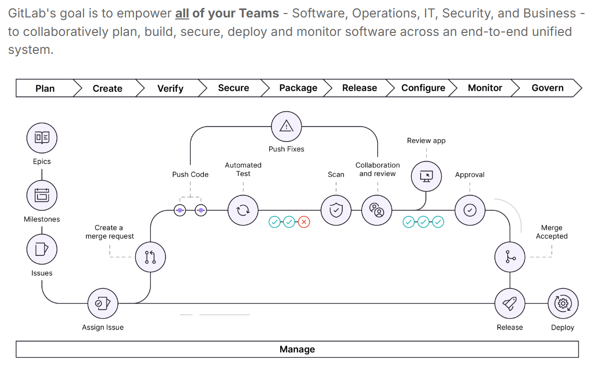
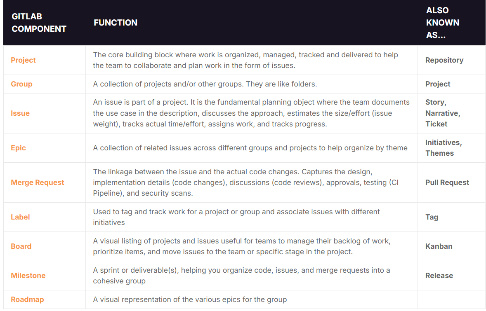
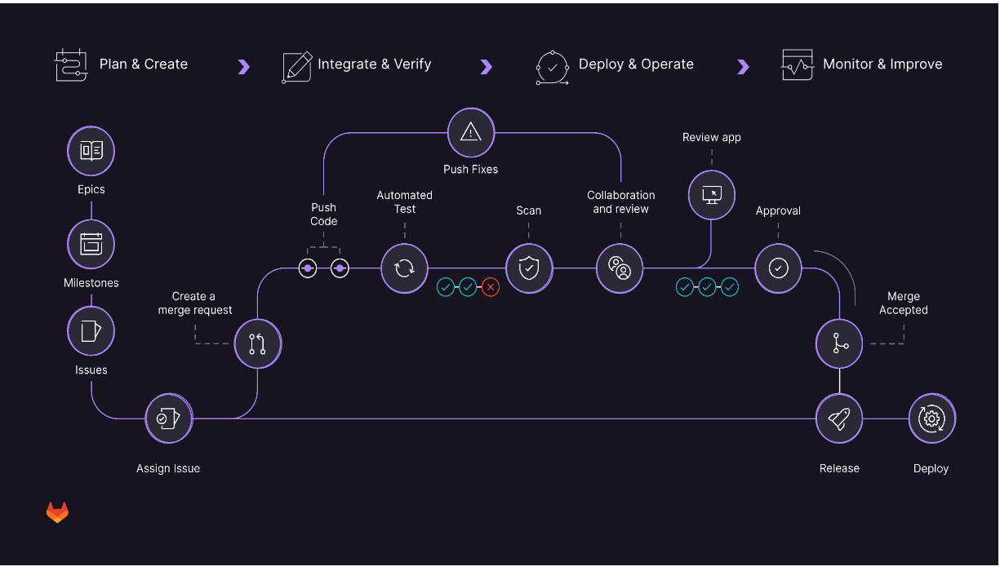

Devops Notes

The challenges with the SDLC (Software Development Lifecycle) and toolchain complexity are common as organizations grow and their development processes become more sophisticated. Let's break down each of these issues in detail:

### 1. **Redundant and Incompatible Tools**

**Problem:**
As organizations adopt different tools for various stages of the SDLC (e.g., planning, development, testing, deployment), they often end up with multiple tools that perform similar functions or don’t integrate well with each other. This redundancy can lead to inefficiencies and confusion.

**Implications:**

- **Duplication of Effort:** Teams may enter or manage the same information in multiple systems.
- **Increased Costs:** Licensing and maintenance of multiple tools can be expensive.
- **Tool Fatigue:** Users may become overwhelmed by the number of tools they need to use.

### 2. **Data and Process Silos**

**Problem:**
Disparate tools often result in data being stored in separate locations or formats, leading to silos where information isn’t easily accessible across the organization.

**Implications:**

- **Fragmented Insights:** Teams may lack a unified view of project status, making it difficult to understand overall progress and performance.
- **Inefficient Workflows:** Information needs to be manually transferred between tools or teams, which can be error-prone and time-consuming.
- **Delayed Decision-Making:** Lack of integrated data can slow down decision-making processes due to incomplete or inconsistent information.

### 3. **No Alignment Among Teams**

**Problem:**
When tools and processes aren’t integrated, different teams may follow different workflows and use different tools for similar tasks.

**Implications:**

- **Miscommunication:** Teams may have different understandings of project requirements or status.
- **Conflicting Priorities:** Without a shared view of project goals and progress, teams might work towards conflicting objectives.
- **Reduced Collaboration:** Disparate tools can hinder effective communication and collaboration among team members.

### 4. **No Consistent Application Security or Compliance**

**Problem:**
Without a unified approach, security and compliance practices may be applied inconsistently across different stages of the SDLC or between tools.

**Implications:**

- **Security Risks:** Inconsistent application of security practices can leave vulnerabilities exposed.
- **Compliance Issues:** Ensuring compliance with regulations and standards becomes more difficult if practices aren’t standardized.
- **Increased Risk of Breaches:** Lack of integration can lead to gaps in security monitoring and response.

### 5. **No Consistent Traceability**

**Problem:**
Traceability refers to the ability to track the history and changes of code, requirements, and issues throughout the SDLC.

**Implications:**

- **Difficulty in Audits:** It’s harder to audit changes and understand their impact when traceability is inconsistent.
- **Challenge in Troubleshooting:** Identifying the root cause of issues can be more difficult without clear traceability.
- **Reduced Accountability:** Lack of clear history can lead to unclear responsibility for decisions and changes.

### 6. **A High Degree of Context Switching**

**Problem:**
Context switching occurs when individuals or teams have to frequently move between different tools or systems to complete their work.

**Implications:**

- **Decreased Productivity:** Constantly switching between tools can disrupt focus and reduce overall productivity.
- **Increased Learning Curve:** Users need to become proficient in multiple tools, which can be time-consuming and mentally taxing.
- **Inconsistent Information:** Context switching can lead to inconsistencies and errors as users may not have all the information they need at their fingertips.

### Solutions and Best Practices

To address these challenges, organizations can consider the following approaches:

- **Adopt Integrated Platforms:** Use platforms that offer end-to-end solutions for managing the SDLC, such as GitLab, which integrates various functions into a single interface.
- **Implement Standardization:** Standardize processes and tools across teams to ensure consistency and reduce redundancy.
- **Improve Integration:** Ensure that tools used across the SDLC can integrate seamlessly with each other to facilitate smooth data flow and collaboration.
- **Automate Processes:** Implement automation where possible to reduce manual data transfer and improve efficiency.
- **Enhance Communication:** Foster better communication and collaboration among teams to align goals and practices.

By addressing these issues proactively, organizations can streamline their SDLC, improve efficiency, and enhance overall project success.

# Overview



# Types of Version Control System

Version control systems (VCS) can be categorized into several types based on their architecture and functionality:

### 1. **Local Version Control Systems**

**Description:** These systems manage versions of files on a local machine. They are useful for tracking changes and managing versions within a single user’s environment.

**Examples:**

- **RCS (Revision Control System):** Tracks changes to files and directories.
- **SCCS (Source Code Control System):** An early system for managing changes to source code.

### 2. **Centralized Version Control Systems (CVCS)**

**Description:** Centralized version control systems store all version history in a central server. Users commit their changes to this central repository and update their local copies from it.

**Examples:**

- **Subversion (SVN):** A widely used CVCS that tracks changes and handles versioning of files and directories.
- **CVS (Concurrent Versions System):** An older system that was popular before more modern VCS solutions emerged.
- **TFS (Team Foundation Server):** Provides version control along with project management and collaboration features.

### 3. **Distributed Version Control Systems (DVCS)**

**Description:** Distributed version control systems allow each user to have a full copy of the repository, including its history. Changes are shared among repositories, and users can work offline.

**Examples:**

- **Git:** A highly popular DVCS known for its branching and merging capabilities, as well as its performance.
- **Mercurial:** Another DVCS similar to Git, known for its simplicity and performance.
- **Bazaar:** A DVCS that provides support for different workflows and integrates well with various development environments.

### 4. **Hybrid Version Control Systems**

**Description:** Hybrid systems combine aspects of both centralized and distributed version control. They allow for both centralized and distributed workflows within the same system.

**Examples:**

- **Perforce Helix Core:** A version control system that can be used in a centralized manner but also supports distributed workflows.
- **BitKeeper:** Originally a commercial DVCS with both centralized and distributed features.

### Summary

- **Local VCS**: Tracks changes on a single machine.
- **Centralized VCS**: Uses a central repository for version control.
- **Distributed VCS**: Each user has a full repository copy and can work offline.
- **Hybrid VCS**: Combines features of both centralized and distributed systems.

Each type of version control system offers different advantages and is suited to different use cases depending on factors such as team size, project complexity, and workflow preferences.

### **Understanding Environment Branches in GitLab**

**1. **Default Branch:\*\*

When you create a new GitLab project, it automatically includes a default branch (often named `master` or `main`). This default branch is where the stable, production-ready code usually resides.

**2. **Environment Branches:\*\*

As projects evolve, teams create additional branches to manage different environments and stages of development. Common types of environment branches include:

- **`production` Branch:** Represents the code that is live in the production environment. It is the stable branch that end-users interact with.
- **`staging` or `pre-production` Branch:** Represents code that is almost ready for production but needs to be tested in an environment that mimics production as closely as possible. This environment is used for final testing and validation.

- **`development` Branch:** Often used for ongoing development and integrating features before they are ready for staging or production.

- **`feature` Branches:** Created for developing specific features or fixes. These branches are eventually merged into the `staging` or `production` branches.

**3. **Workflow with Environment Branches:\*\*

In a typical GitLab workflow involving environment branches:

- **Development:** Developers work on features or fixes in feature branches. These branches are created from the `development` or `staging` branch and contain specific changes.

- **Testing:** Once features are complete, they are merged into the `staging` branch. This branch is deployed to a staging environment where the changes are tested in conditions similar to production.

- **Release:** After successful testing, the `staging` branch is merged into the `production` branch. This ensures that the changes are deployed to the live environment.

- **Cherry-Picking:** If a hotfix (urgent fix) is needed, you can create a feature branch for the fix. This branch is merged into the `master` (or `production`) branch using a merge request. If the hotfix needs to be applied to other branches (like `staging`), you can create additional merge requests from the feature branch to those downstream branches. This ensures that the fix is propagated through all necessary environments.

**4. **Commit Flow:\*\*

In this workflow, commits flow downstream:

- Changes are first integrated into `feature` branches.
- Once validated, they move into the `staging` branch for more thorough testing.
- Finally, changes are merged into the `production` branch.

This ensures that each stage of development is tested progressively, and potential issues are caught early before reaching the production environment.

**5. **Cherry-Picking and Merge Requests:\*\*

If a hotfix is applied, it’s developed on a feature branch and merged into the `master` or `production` branch. If additional testing is required or if the fix needs to be applied to `staging`, you can create merge requests from the feature branch to these downstream branches.

**6. **Branch Deletion:\*\*

After a feature branch is merged, it’s typically deleted to keep the repository clean. However, if the branch is used for important hotfixes or ongoing work, it might be kept until the associated changes are fully integrated and tested across all relevant branches.

### **Summary**

- **Default Branch**: Stable branch (e.g., `master` or `main`).
- **Environment Branches**: Represent different stages like `production`, `staging`, and `development`.
- **Workflow**: Commits flow from feature branches → staging → production.
- **Cherry-Picking**: For urgent fixes, create feature branches and merge into necessary branches, ensuring changes propagate correctly.
- **Branch Management**: Delete branches after merging to keep the repository organized, but retain important branches as needed.

This structured approach helps manage and deploy code efficiently, ensuring stability and quality through multiple stages of development and testing.

### **Release Branches Overview**

**1. **Purpose of Release Branches:\*\*

Release branches are used to prepare and finalize software for a specific version or release. They allow you to stabilize and make last-minute adjustments before the software is released to users. Release branches typically follow a versioning scheme like `2.3-stable` or `2.4-stable`.

### **Workflow with Release Branches**

**1. **Creating Release Branches:\*\*

- **Creation:** When you’re ready to start preparing for a release, you create a release branch from the main development branch (often `master` or `main`). For example:

  ```bash
  git checkout -b release/2.3-stable
  ```

- **Purpose:** This branch is used to finalize the release. You can perform tasks like bug fixes, testing, and preparing documentation without affecting ongoing development in other branches.

**2. **Merging Changes:\*\*

- **Upstream First Policy:**

  - **Primary Approach:** To maintain consistency, you should follow an "upstream first" policy. This means that all changes, including bug fixes and new features, should first be merged into the main branch (e.g., `master` or `main`).
  - **Cherry-Picking:** After merging changes into the main branch, you can cherry-pick relevant commits into the release branch to ensure that bug fixes and important updates are also included in the release.
  - **Example:**
    ```bash
    git checkout master
    git merge <feature-branch>
    git checkout release/2.3-stable
    git cherry-pick <commit-id>
    ```

- **Tagging:** Once a release branch is finalized and the release is made, a new tag should be created to mark this specific version. Tags help in identifying and referencing specific versions of your software.
  ```bash
  git tag -a v2.3.0 -m "Release version 2.3.0"
  git push origin v2.3.0
  ```

**3. **Stable Branch:\*\*

- **Purpose:** Some projects maintain a `stable` branch that points to the latest released version. This branch provides a reference to the current stable state of the software, even if new release branches are created for future versions.
- **Usage:** The `stable` branch is often updated to reflect the latest stable release. It serves as a reference point and may be used for hotfixes or patches applied to released versions.

**4. **Production Branch:\*\*

- **Common Practice:** In many workflows, a separate `production` branch may not be necessary if the release branches and the `stable` branch effectively cover the needs for production deployment.
- **Alternative:** Instead of a dedicated production branch, the latest release branch or the `stable` branch may serve as the source of truth for what's currently in production.

### **Summary of Key Points**

- **Release Branches:** Used to finalize and prepare software for specific versions.
- **Upstream First Policy:** Merge changes into the main branch first and then cherry-pick them into the release branch to avoid inconsistencies.
- **Tagging:** Create a new tag for each release to mark the version clearly.
- **Stable Branch:** Maintains a reference to the latest stable version, and may be used for hotfixes.
- **Production Branch:** Not always necessary if the release and stable branches serve the purpose.

This approach ensures that your releases are well-managed, bug fixes are consistently applied, and your versioning is clear and organized.




