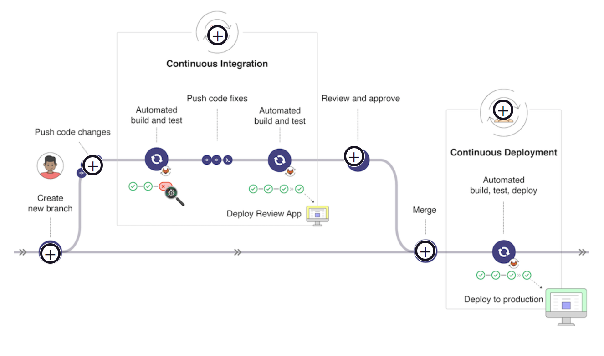

Devops Notes

The challenges with the SDLC (Software Development Lifecycle) and toolchain complexity are common as organizations grow and their development processes become more sophisticated. Let's break down each of these issues in detail:

### 1. **Redundant and Incompatible Tools**

**Problem:**
As organizations adopt different tools for various stages of the SDLC (e.g., planning, development, testing, deployment), they often end up with multiple tools that perform similar functions or don’t integrate well with each other. This redundancy can lead to inefficiencies and confusion.

**Implications:**

- **Duplication of Effort:** Teams may enter or manage the same information in multiple systems.
- **Increased Costs:** Licensing and maintenance of multiple tools can be expensive.
- **Tool Fatigue:** Users may become overwhelmed by the number of tools they need to use.

### 2. **Data and Process Silos**

**Problem:**
Disparate tools often result in data being stored in separate locations or formats, leading to silos where information isn’t easily accessible across the organization.

**Implications:**

- **Fragmented Insights:** Teams may lack a unified view of project status, making it difficult to understand overall progress and performance.
- **Inefficient Workflows:** Information needs to be manually transferred between tools or teams, which can be error-prone and time-consuming.
- **Delayed Decision-Making:** Lack of integrated data can slow down decision-making processes due to incomplete or inconsistent information.

### 3. **No Alignment Among Teams**

**Problem:**
When tools and processes aren’t integrated, different teams may follow different workflows and use different tools for similar tasks.

**Implications:**

- **Miscommunication:** Teams may have different understandings of project requirements or status.
- **Conflicting Priorities:** Without a shared view of project goals and progress, teams might work towards conflicting objectives.
- **Reduced Collaboration:** Disparate tools can hinder effective communication and collaboration among team members.

### 4. **No Consistent Application Security or Compliance**

**Problem:**
Without a unified approach, security and compliance practices may be applied inconsistently across different stages of the SDLC or between tools.

**Implications:**

- **Security Risks:** Inconsistent application of security practices can leave vulnerabilities exposed.
- **Compliance Issues:** Ensuring compliance with regulations and standards becomes more difficult if practices aren’t standardized.
- **Increased Risk of Breaches:** Lack of integration can lead to gaps in security monitoring and response.

### 5. **No Consistent Traceability**

**Problem:**
Traceability refers to the ability to track the history and changes of code, requirements, and issues throughout the SDLC.

**Implications:**

- **Difficulty in Audits:** It’s harder to audit changes and understand their impact when traceability is inconsistent.
- **Challenge in Troubleshooting:** Identifying the root cause of issues can be more difficult without clear traceability.
- **Reduced Accountability:** Lack of clear history can lead to unclear responsibility for decisions and changes.

### 6. **A High Degree of Context Switching**

**Problem:**
Context switching occurs when individuals or teams have to frequently move between different tools or systems to complete their work.

**Implications:**

- **Decreased Productivity:** Constantly switching between tools can disrupt focus and reduce overall productivity.
- **Increased Learning Curve:** Users need to become proficient in multiple tools, which can be time-consuming and mentally taxing.
- **Inconsistent Information:** Context switching can lead to inconsistencies and errors as users may not have all the information they need at their fingertips.

### Solutions and Best Practices

To address these challenges, organizations can consider the following approaches:

- **Adopt Integrated Platforms:** Use platforms that offer end-to-end solutions for managing the SDLC, such as GitLab, which integrates various functions into a single interface.
- **Implement Standardization:** Standardize processes and tools across teams to ensure consistency and reduce redundancy.
- **Improve Integration:** Ensure that tools used across the SDLC can integrate seamlessly with each other to facilitate smooth data flow and collaboration.
- **Automate Processes:** Implement automation where possible to reduce manual data transfer and improve efficiency.
- **Enhance Communication:** Foster better communication and collaboration among teams to align goals and practices.

By addressing these issues proactively, organizations can streamline their SDLC, improve efficiency, and enhance overall project success.

# Overview



# Types of Version Control System

Version control systems (VCS) can be categorized into several types based on their architecture and functionality:

### 1. **Local Version Control Systems**

**Description:** These systems manage versions of files on a local machine. They are useful for tracking changes and managing versions within a single user’s environment.

**Examples:**

- **RCS (Revision Control System):** Tracks changes to files and directories.
- **SCCS (Source Code Control System):** An early system for managing changes to source code.

### 2. **Centralized Version Control Systems (CVCS)**

**Description:** Centralized version control systems store all version history in a central server. Users commit their changes to this central repository and update their local copies from it.

**Examples:**

- **Subversion (SVN):** A widely used CVCS that tracks changes and handles versioning of files and directories.
- **CVS (Concurrent Versions System):** An older system that was popular before more modern VCS solutions emerged.
- **TFS (Team Foundation Server):** Provides version control along with project management and collaboration features.

### 3. **Distributed Version Control Systems (DVCS)**

**Description:** Distributed version control systems allow each user to have a full copy of the repository, including its history. Changes are shared among repositories, and users can work offline.

**Examples:**

- **Git:** A highly popular DVCS known for its branching and merging capabilities, as well as its performance.
- **Mercurial:** Another DVCS similar to Git, known for its simplicity and performance.
- **Bazaar:** A DVCS that provides support for different workflows and integrates well with various development environments.

### 4. **Hybrid Version Control Systems**

**Description:** Hybrid systems combine aspects of both centralized and distributed version control. They allow for both centralized and distributed workflows within the same system.

**Examples:**

- **Perforce Helix Core:** A version control system that can be used in a centralized manner but also supports distributed workflows.
- **BitKeeper:** Originally a commercial DVCS with both centralized and distributed features.

### Summary

- **Local VCS**: Tracks changes on a single machine.
- **Centralized VCS**: Uses a central repository for version control.
- **Distributed VCS**: Each user has a full repository copy and can work offline.
- **Hybrid VCS**: Combines features of both centralized and distributed systems.

Each type of version control system offers different advantages and is suited to different use cases depending on factors such as team size, project complexity, and workflow preferences.

### **Understanding Environment Branches in GitLab**

**1. **Default Branch:\*\*

When you create a new GitLab project, it automatically includes a default branch (often named `master` or `main`). This default branch is where the stable, production-ready code usually resides.

**2. **Environment Branches:\*\*

As projects evolve, teams create additional branches to manage different environments and stages of development. Common types of environment branches include:

- **`production` Branch:** Represents the code that is live in the production environment. It is the stable branch that end-users interact with.
- **`staging` or `pre-production` Branch:** Represents code that is almost ready for production but needs to be tested in an environment that mimics production as closely as possible. This environment is used for final testing and validation.

- **`development` Branch:** Often used for ongoing development and integrating features before they are ready for staging or production.

- **`feature` Branches:** Created for developing specific features or fixes. These branches are eventually merged into the `staging` or `production` branches.

**3. **Workflow with Environment Branches:\*\*

In a typical GitLab workflow involving environment branches:

- **Development:** Developers work on features or fixes in feature branches. These branches are created from the `development` or `staging` branch and contain specific changes.

- **Testing:** Once features are complete, they are merged into the `staging` branch. This branch is deployed to a staging environment where the changes are tested in conditions similar to production.

- **Release:** After successful testing, the `staging` branch is merged into the `production` branch. This ensures that the changes are deployed to the live environment.

- **Cherry-Picking:** If a hotfix (urgent fix) is needed, you can create a feature branch for the fix. This branch is merged into the `master` (or `production`) branch using a merge request. If the hotfix needs to be applied to other branches (like `staging`), you can create additional merge requests from the feature branch to those downstream branches. This ensures that the fix is propagated through all necessary environments.

**4. **Commit Flow:\*\*

In this workflow, commits flow downstream:

- Changes are first integrated into `feature` branches.
- Once validated, they move into the `staging` branch for more thorough testing.
- Finally, changes are merged into the `production` branch.

This ensures that each stage of development is tested progressively, and potential issues are caught early before reaching the production environment.

**5. **Cherry-Picking and Merge Requests:\*\*

If a hotfix is applied, it’s developed on a feature branch and merged into the `master` or `production` branch. If additional testing is required or if the fix needs to be applied to `staging`, you can create merge requests from the feature branch to these downstream branches.

**6. **Branch Deletion:\*\*

After a feature branch is merged, it’s typically deleted to keep the repository clean. However, if the branch is used for important hotfixes or ongoing work, it might be kept until the associated changes are fully integrated and tested across all relevant branches.

### **Summary**

- **Default Branch**: Stable branch (e.g., `master` or `main`).
- **Environment Branches**: Represent different stages like `production`, `staging`, and `development`.
- **Workflow**: Commits flow from feature branches → staging → production.
- **Cherry-Picking**: For urgent fixes, create feature branches and merge into necessary branches, ensuring changes propagate correctly.
- **Branch Management**: Delete branches after merging to keep the repository organized, but retain important branches as needed.

This structured approach helps manage and deploy code efficiently, ensuring stability and quality through multiple stages of development and testing.

### **Release Branches Overview**

**1. **Purpose of Release Branches:\*\*

Release branches are used to prepare and finalize software for a specific version or release. They allow you to stabilize and make last-minute adjustments before the software is released to users. Release branches typically follow a versioning scheme like `2.3-stable` or `2.4-stable`.

### **Workflow with Release Branches**

**1. **Creating Release Branches:\*\*

- **Creation:** When you’re ready to start preparing for a release, you create a release branch from the main development branch (often `master` or `main`). For example:

  ```bash
  git checkout -b release/2.3-stable
  ```

- **Purpose:** This branch is used to finalize the release. You can perform tasks like bug fixes, testing, and preparing documentation without affecting ongoing development in other branches.

**2. **Merging Changes:\*\*

- **Upstream First Policy:**

  - **Primary Approach:** To maintain consistency, you should follow an "upstream first" policy. This means that all changes, including bug fixes and new features, should first be merged into the main branch (e.g., `master` or `main`).
  - **Cherry-Picking:** After merging changes into the main branch, you can cherry-pick relevant commits into the release branch to ensure that bug fixes and important updates are also included in the release.
  - **Example:**
    ```bash
    git checkout master
    git merge <feature-branch>
    git checkout release/2.3-stable
    git cherry-pick <commit-id>
    ```

- **Tagging:** Once a release branch is finalized and the release is made, a new tag should be created to mark this specific version. Tags help in identifying and referencing specific versions of your software.
  ```bash
  git tag -a v2.3.0 -m "Release version 2.3.0"
  git push origin v2.3.0
  ```

**3. **Stable Branch:\*\*

- **Purpose:** Some projects maintain a `stable` branch that points to the latest released version. This branch provides a reference to the current stable state of the software, even if new release branches are created for future versions.
- **Usage:** The `stable` branch is often updated to reflect the latest stable release. It serves as a reference point and may be used for hotfixes or patches applied to released versions.

**4. **Production Branch:\*\*

- **Common Practice:** In many workflows, a separate `production` branch may not be necessary if the release branches and the `stable` branch effectively cover the needs for production deployment.
- **Alternative:** Instead of a dedicated production branch, the latest release branch or the `stable` branch may serve as the source of truth for what's currently in production.

### **Summary of Key Points**

- **Release Branches:** Used to finalize and prepare software for specific versions.
- **Upstream First Policy:** Merge changes into the main branch first and then cherry-pick them into the release branch to avoid inconsistencies.
- **Tagging:** Create a new tag for each release to mark the version clearly.
- **Stable Branch:** Maintains a reference to the latest stable version, and may be used for hotfixes.
- **Production Branch:** Not always necessary if the release and stable branches serve the purpose.

This approach ensures that your releases are well-managed, bug fixes are consistently applied, and your versioning is clear and organized.


In GitLab, an **Epic** is a high-level feature or large piece of work that is typically broken down into smaller, more manageable issues or tasks. Epics are used to organize and track work across multiple projects or issues and are particularly useful for managing large projects or features that span several milestones or iterations.

### Key Features of Epics in GitLab

1. **High-Level Organization:**

   - Epics provide a way to group related issues and merge requests under a single umbrella. This helps in organizing work at a broader level than individual issues or merge requests.

2. **Cross-Project Visibility:**

   - Epics can span across different projects within the same group. This is useful for large projects that involve multiple repositories.

3. **Tracking Progress:**

   - GitLab allows you to track the progress of an Epic by showing how many issues or merge requests are completed versus those that are still in progress. This provides a high-level view of the status of the larger feature or goal.

4. **Hierarchical Structure:**

   - Epics can be organized into a hierarchy where an Epic can have related child Epics. This hierarchical structure helps in managing complex projects with multiple layers of work.

5. **Roadmaps:**

   - GitLab provides a roadmap view where you can see the timeline of Epics, helping to visualize and plan the overall progress of large projects.

6. **Issue Linking:**
   - Issues and merge requests can be linked to an Epic, providing context and ensuring that all related work is tracked together.

When a merge request is created, it is marked as a draft by default. The Draft keyword in the title of the merge request indicates that the merge is currently a draft. A draft merge cannot be merged until it is marked as ready. This helps to prevent accidental merges.

### **Understanding GitLab CI/CD**

**Continuous Integration (CI)** and **Continuous Delivery (CD)** are fundamental practices in modern software development that aim to improve code quality, streamline workflows, and accelerate delivery cycles. Here’s a detailed explanation of each practice and how they work together in GitLab CI/CD:

### **Continuous Integration (CI)**

1. **Definition and Purpose:**

   - **Continuous Integration (CI)** is a development practice where code changes are frequently integrated into a shared repository. The key idea is to merge code changes from multiple developers into a central repository several times a day.
   - **Purpose:** CI helps in identifying integration issues early, improving code quality, and fostering collaboration among team members. It ensures that code changes do not break the existing codebase and that the software remains functional and stable.

2. **Process:**

   - **Code Commit:** Developers commit their code changes to a shared repository.
   - **Automated Build:** Each commit triggers an automated build process to compile the code and ensure that it integrates correctly with the existing codebase.
   - **Automated Testing:** Automated tests are run to validate the changes. This includes unit tests, integration tests, and other types of testing to ensure code correctness and stability.
   - **Feedback:** Developers receive feedback on their changes, allowing them to address issues quickly before the code is integrated into the main branch.

3. **Benefits:**
   - **Early Issue Detection:** CI helps catch integration problems and bugs early in the development cycle.
   - **Improved Collaboration:** By frequently integrating code, team members can collaborate more effectively and avoid conflicts.
   - **Maintained Code Quality:** Automated testing ensures that the codebase remains reliable and stable.

### **Continuous Delivery (CD)**

1. **Definition and Purpose:**

   - **Continuous Delivery (CD)** extends the principles of CI to automate the delivery of code changes to production or staging environments. The goal is to ensure that software is always in a deployable state and that deployments can occur frequently and reliably.
   - **Purpose:** CD streamlines the release process, making it easier to deploy new features, respond to customer feedback, and fix bugs promptly.

2. **Process:**

   - **Automated Deployment:** After successful integration and testing, code changes are automatically deployed to a staging environment. This environment closely mirrors the production environment.
   - **Manual Approval (Optional):** Depending on the configuration, a manual approval step may be required before deploying changes to the production environment.
   - **Production Deployment:** Once approved, changes are deployed to the production environment, where they are made available to end users.

3. **Benefits:**
   - **Frequent Releases:** CD allows for frequent and reliable releases of new features, enhancements, and fixes.
   - **Reduced Risk:** By automating deployment and testing processes, CD reduces the risk associated with manual deployments and ensures that software is always in a releasable state.
   - **Faster Response:** Teams can respond more quickly to user feedback and market demands.


# Anatomy of a CI/CD Pipeline

This is an example of a pipeline graph that shows what the CI/CD build looks like. It lets you see how a set of one or more jobs are executed in the stages you define in the YAML file for the pipeline.


# Git Command

### Getting & Creating Projects

| Command                                                           | Description                                |
| ----------------------------------------------------------------- | ------------------------------------------ |
| `git init`                                                        | Initialize a local Git repository          |
| `git clone ssh://git@github.com/[username]/[repository-name].git` | Create a local copy of a remote repository |

### Basic Snapshotting

| Command                            | Description                                       |
| ---------------------------------- | ------------------------------------------------- |
| `git status`                       | Check status                                      |
| `git add [file-name.txt]`          | Add a file to the staging area                    |
| `git add -A`                       | Add all new and changed files to the staging area |
| `git commit -m "[commit message]"` | Commit changes                                    |
| `git rm -r [file-name.txt]`        | Remove a file (or folder)                         |

### Branching & Merging

| Command                                              | Description                                             |
| ---------------------------------------------------- | ------------------------------------------------------- |
| `git branch`                                         | List branches (the asterisk denotes the current branch) |
| `git branch -a`                                      | List all branches (local and remote)                    |
| `git branch [branch name]`                           | Create a new branch                                     |
| `git branch -d [branch name]`                        | Delete a branch                                         |
| `git push origin --delete [branch name]`             | Delete a remote branch                                  |
| `git checkout -b [branch name]`                      | Create a new branch and switch to it                    |
| `git checkout -b [branch name] origin/[branch name]` | Clone a remote branch and switch to it                  |
| `git branch -m [old branch name] [new branch name]`  | Rename a local branch                                   |
| `git checkout [branch name]`                         | Switch to a branch                                      |
| `git checkout -`                                     | Switch to the branch last checked out                   |
| `git checkout -- [file-name.txt]`                    | Discard changes to a file                               |
| `git merge [branch name]`                            | Merge a branch into the active branch                   |
| `git merge [source branch] [target branch]`          | Merge a branch into a target branch                     |
| `git stash`                                          | Stash changes in a dirty working directory              |
| `git stash clear`                                    | Remove all stashed entries                              |

### Sharing & Updating Projects

| Command                                                                           | Description                                                 |
| --------------------------------------------------------------------------------- | ----------------------------------------------------------- |
| `git push origin [branch name]`                                                   | Push a branch to your remote repository                     |
| `git push -u origin [branch name]`                                                | Push changes to remote repository (and remember the branch) |
| `git push`                                                                        | Push changes to remote repository (remembered branch)       |
| `git push origin --delete [branch name]`                                          | Delete a remote branch                                      |
| `git pull`                                                                        | Update local repository to the newest commit                |
| `git pull origin [branch name]`                                                   | Pull changes from remote repository                         |
| `git remote add origin ssh://git@github.com/[username]/[repository-name].git`     | Add a remote repository                                     |
| `git remote set-url origin ssh://git@github.com/[username]/[repository-name].git` | Set a repository's origin branch to SSH                     |

### Inspection & Comparison

| Command                                    | Description                    |
| ------------------------------------------ | ------------------------------ |
| `git log`                                  | View changes                   |
| `git log --summary`                        | View changes (detailed)        |
| `git log --oneline`                        | View changes (briefly)         |
| `git diff [source branch] [target branch]` | Preview changes before merging |

# Head in Git


The `git checkout HEAD^` command is used to check out the commit immediately before the current commit. Here's a breakdown of what this command does and how it works:

### Understanding `HEAD^`

- **`HEAD`**: Refers to the current commit your working directory is based on.
- **`HEAD^`**: Refers to the parent commit of `HEAD`. In Git, `HEAD^` is shorthand for `HEAD~1`, which means "one commit before the current commit." If you want to go further back, you can use `HEAD^^` (or `HEAD~2`), `HEAD~~~` (or `HEAD~3`), and so on.

### Using `git checkout HEAD^`

1. **Checkout the Parent Commit**:

   ```bash
   git checkout HEAD^
   ```

   This command checks out the parent commit of the current commit, placing your working directory into a "detached HEAD" state.

2. **Viewing Changes**: Once checked out, you can inspect files and see the state of the repository at the parent commit.

### Example Scenario

Imagine your commit history looks like this:

```
A -- B -- C -- D (HEAD)
```

If you run `git checkout HEAD^`, you will switch to commit `C`.

### Working with Detached HEAD State

- **Inspect Files**: You can view the files as they were in the parent commit.
- **Make Changes**: If you make changes and want to keep them, you should create a new branch:
  ```bash
  git checkout -b new-branch-name
  ```
- **Return to the Branch**: To go back to the latest commit on your branch:
  ```bash
  git checkout main
  ```
  Replace `main` with whatever branch you were on before.

### Important Notes

- **Detached HEAD State**: In this state, any new commits won’t be saved to a branch unless you explicitly create a new branch or otherwise integrate them.
- **Recovery**: If you make changes in the detached HEAD state and don’t create a new branch, those changes might be lost when switching to another commit or branch.

Using `HEAD^` is useful for viewing or reverting to previous states in your repository, but remember to manage your commits and branches carefully to avoid losing work.

# Branch Forcing


### `git reset`

The `git reset` command is used to move the current branch's HEAD to a specified state, and it can also modify the staging area and working directory. There are three primary forms of `git reset`:

1. **Soft Reset (`--soft`)**:

   - **Usage**: `git reset --soft <commit>`
   - **Effect**: Moves the HEAD to the specified commit, but keeps changes in the index (staging area) and working directory. This means changes made after the specified commit are still staged and can be committed again.
   - **Example**:
     ```bash
     git reset --soft HEAD~1
     ```
     This command will move HEAD to the previous commit while keeping your changes staged.

2. **Mixed Reset (default)**:

   - **Usage**: `git reset <commit>`
   - **Effect**: Moves the HEAD to the specified commit and updates the staging area to match it, but does not modify the working directory. This effectively unstages any changes made after the specified commit but leaves the changes in your working directory.
   - **Example**:
     ```bash
     git reset HEAD~1
     ```
     This command will move HEAD to the previous commit and unstage changes made after that commit, but the changes will still be in your working directory.

3. **Hard Reset (`--hard`)**:
   - **Usage**: `git reset --hard <commit>`
   - **Effect**: Moves the HEAD to the specified commit, updates the staging area, and modifies the working directory to match the commit. All changes in the working directory and staging area are discarded.
   - **Example**:
     ```bash
     git reset --hard HEAD~1
     ```
     This command will reset your branch to the previous commit and discard all changes in your working directory and staging area.

### `git revert`

The `git revert` command is used to create a new commit that undoes the changes made by a previous commit. Unlike `git reset`, `git revert` does not alter the commit history but instead adds a new commit that effectively reverses the changes.

- **Usage**: `git revert <commit>`
- **Effect**: Creates a new commit that reverses the changes introduced by the specified commit. This is useful for undoing changes in a shared history without rewriting the commit history.
- **Example**:
  ```bash
  git revert a1b2c3d4
  ```
  This command will create a new commit that reverses the changes made in commit `a1b2c3d4`.

### Key Differences

- **History Modification**:

  - `git reset` can alter commit history, especially with `--hard` or `--soft`, which can affect collaborators if pushed to a shared repository.
  - `git revert` does not change commit history; it creates a new commit that undoes the changes, making it safer for shared branches.

- **Usage Context**:

  - Use `git reset` for local changes, when you want to undo or redo commits before they’re shared with others.
  - Use `git revert` for undoing changes in a way that is safe for shared branches, as it preserves commit history.

- **Effect on Working Directory**:
  - `git reset --hard` will affect your working directory and discard changes.
  - `git revert` will leave your working directory as is but adds a new commit to reverse the changes.

### Summary

- **`git reset`**: Alters branch history and can modify the working directory. Use for local changes and history adjustments.
- **`git revert`**: Creates a new commit to reverse changes without altering commit history. Use for undoing changes safely in shared repositories.

### Role Hierarchy Overview


In GitLab, roles and permissions are crucial for managing access and controlling what users can do within projects and groups. Here's a detailed explanation of the role hierarchy and how it works when a user is assigned multiple roles:

When managing users in GitLab, roles are assigned to determine the level of access and control a user has within a project or group. GitLab uses a hierarchical system where different roles have varying levels of permissions.

#### **Project vs. Group Roles**

- **Project Roles**: Define permissions specifically for a single project.
- **Group Roles**: Define permissions within a group that can contain multiple projects. These roles can apply to all projects within the group.

### Hierarchical Role System

1. **Role Levels**:

   - **Guest**: Limited access, mostly read-only. Can view issues, merge requests, and some other elements but cannot make changes.
   - **Reporter**: Can view and comment on issues, view code, and see most aspects of the project but cannot make changes.
   - **Developer**: Can push code, manage issues, and perform other development-related tasks. Has more permissions than Reporter.
   - **Maintainer**: Can manage project settings, handle project configuration, and have broad control over the project. Higher level than Developer.
   - **Owner**: (For groups) Has the highest level of control over a group and its projects. Owners can change group settings, manage members, and more.

2. **Permissions Hierarchy**:
   - **Project Roles**: When a user is assigned a role at the project level, their permissions are confined to that specific project.
   - **Group Roles**: When a user is assigned a role at the group level, it applies to all projects within the group. If a project has its own roles defined, the group role will apply to all projects under the group by default.

### When a User is Added to Both a Project and a Group

If a user is added to both a group and a project with different roles, GitLab uses the higher role to determine their effective permissions. Here’s how it works:

1. **Role Assignment**:

   - **Group Role**: If a user is assigned a role (e.g., Developer) at the group level, this role will apply to all projects within that group.
   - **Project Role**: If the same user is also assigned a different role (e.g., Maintainer) at the project level, the project-specific role takes precedence.

2. **Effective Permissions**:
   - The user’s permissions are governed by the highest role they hold in any of the contexts where they are assigned. For example, if a user has a Developer role at the group level and a Maintainer role at the project level, they will have the permissions associated with the Maintainer role in that project.

### Example

Consider a user who is assigned:

- **Developer** role in a group.
- **Maintainer** role in a specific project within that group.

In this case:

- **For the group**: The user will have Developer-level permissions across all projects in the group.
- **For the specific project**: The user will have Maintainer-level permissions due to the project-specific role, which overrides the group-level role for this particular project.

### Summary

- **Group Roles**: Apply to all projects within the group and define default permissions.
- **Project Roles**: Apply specifically to individual projects and can override group-level permissions.
- **Role Precedence**: When a user has roles at both the group and project levels, the higher role’s permissions apply in the specific context where the higher role is assigned.

Understanding this hierarchy helps ensure that users have appropriate access levels and that permissions are correctly managed across both group-wide and project-specific contexts in GitLab.

# Milestones

Milestones
Milestones in GitLab are a way to track issues and merge requests created to achieve a broader goal in a certain period of time. Milestones allow you to organize issues and merge requests into a cohesive group, with an optional start date and an optional due date.

For example, if you have a lot of issues related to a specific deliverable or goal, you can create a milestone and assign all of the issues to it.

Key features/functions

You can assign both issues and merge requests to milestones
Everything assigned to the same milestone shares the same start date and end date
Milestones can exist at the project or group level
The milestone view also contains a burndown and burnup chart showing the progress of completing a milestone

# Iterations

Iterations are a way to track issues over a period of time. This allows teams to track velocity and volatility metrics. For tracking over different time periods, you can use iterations milestones. You can create and manage various iteration cadences.

For example, you can use:

Milestones for Program Increments, which span 8-12 weeks.
Iterations for Sprints, which span 2 weeks.

Key features/functions

You can consider an iteration like a sprint and assign issues to your iterations
Iterations are at the group level only and groups can have only 1 active iteration at a time
Iterations are grouped into iteration cadences
Iterations require start and end dates
Iteration date ranges cannot overlap within an iteration cadence
The iteration detail page shows you overall % complete as well as burndown and burnup charts


# PIPELINE

A pipeline is made of multiple stages , and stages consists of one or multiple job and the job are executed by the runner that makes job complete and hand it over to the Gitlab.

<!-- Gitlab pipeline details  -->

<!-- ////////////////////////// -->

# Docker Image

A Docker image is a lightweight, standalone, and executable package that includes everything needed to run a piece of software. This includes the code, runtime, libraries, environment variables, and configuration files.

In more detail:

- **Layered Structure:** Docker images are made up of layers. Each layer represents a set of file changes or additions and is built on top of previous layers. This layered structure allows for efficient use of disk space and makes it easier to distribute and update images.

- **Immutability:** Once a Docker image is created, it doesn’t change. This immutability ensures that the software runs the same way regardless of where it is deployed, leading to consistent environments.

- **Portability:** Docker images can be run on any system that has Docker installed, regardless of the underlying operating system or hardware. This portability is one of the main benefits of using Docker.

- **Reusability:** Since Docker images can be built from a base image (like an official operating system or language runtime image) and then customized, they promote reuse and sharing of common configurations and dependencies.

- **Dockerfile:** The Docker image is typically built from a `Dockerfile`, which is a text file containing instructions on how to construct the image. The `Dockerfile` specifies the base image, copies files, installs dependencies, and sets up the environment for the application.

Overall, Docker images help streamline development, testing, and deployment processes by providing a consistent environment across different stages and platforms.

# Services

The services keyword allows us to augment our base image with an additional image if one container isn't enough. This additional image is used to create another container, which is available for the first container. These two containers have access to one another and can communicate when running the job.

The service image can run any application, but the most common use case is to run a database container as we've done in the example above by adding a Postgres container.

In GitLab, artifacts and cache are two important concepts used to optimize the CI/CD pipeline and improve build efficiency.

### **Artifacts and Cache**

Artifacts in GitLab are files or directories created by a job that you want to save and use in later stages of your pipeline or share with other jobs. Artifacts are typically generated by build or test jobs and can be used for a variety of purposes:

- **Storing Build Results:** For example, if you have a build job that generates a compiled binary or a set of reports, these files can be saved as artifacts.
- **Passing Data Between Jobs:** Artifacts can be used to share data between different jobs in a pipeline. For instance, you might need to pass build outputs to a deployment job.

**Configuration Example:**

Here’s an example of how you might configure artifacts in a `.gitlab-ci.yml` file:

```yaml
build:
  stage: build
  script:
    - make build
  artifacts:
    paths:
      - build/
    expire_in: 1 week
```

In this example, the `build` job generates files in the `build/` directory, which are then stored as artifacts. The `expire_in` field specifies how long the artifacts should be kept before being automatically deleted.

### **Cache**

Cache in GitLab is used to speed up the execution of jobs by reusing data from previous jobs. Caching is typically used for dependencies or other files that are expensive to generate or download repeatedly.

**Usage Examples:**

- **Dependency Caching:** You can cache dependencies (like npm modules or Maven dependencies) to avoid re-downloading them on every pipeline run.
- **Build Caching:** Cache build directories to speed up incremental builds.

**Configuration Example:**

Here’s an example of how to configure caching in a `.gitlab-ci.yml` file:

```yaml
build:
  stage: build
  script:
    - npm install
    - npm run build
  cache:
    key: ${CI_COMMIT_REF_SLUG}
    paths:
      - node_modules/
```

In this example, the `node_modules/` directory is cached between builds. The `key` field ensures that the cache is specific to a particular branch or commit, which helps avoid using outdated cache data.

### **Key Differences**

- **Artifacts:** Used to store files generated by jobs and to make them available to later jobs in the pipeline. Artifacts are often used for outputs that need to be preserved beyond the lifetime of a single job.
- **Cache:** Used to speed up pipeline execution by reusing previously stored data. Caches are typically used for dependencies or build artifacts that are expensive to regenerate or download.

By using artifacts and cache effectively, you can improve the efficiency and speed of your CI/CD pipelines in GitLab.

Dependencies
Dependencies restrict which artifacts are passed to a specific job by providing a list of jobs to fetch artifacts from selectively. They are defined in the job and pass a list of all previous jobs the artifacts should be downloaded from. See below for an example YAML file with dependencies.

```yaml
build:osx:
  stage: build
  script: make build:osx
  artifacts:
    paths:
      - binaries/

build:linux:
  stage: build
  script: make build:linux
  artifacts:
    paths:
      - binaries/

test:osx:
  stage: test
  script: make test:osx
  dependencies:
    - build:osx

test:linux:
  stage: test
  script: make test:linux
  dependencies:
    - build:linux

deploy:
  stage: deploy
  script: make deploy
```

# Rules

Rules are a way to define under what conditions a job should run. Have a deploy job that should only be run on a particular branch? Want to skip a job if no changes are made to a corresponding file? Need to delay when a job runs to avoid peak hours? The rules syntax in your YAML file can be configured to handle all of these use cases. Order matters

Rules are evaluated in order until the first match, so order matters. When the first condition is met, the job is either included or excluded from the pipeline depending on the configuration.

Example 1: Only Deploy from Main Branch
This deploy job will always run on the main branch. Otherwise, it will never run.

```yaml
pseudo-deploy:
  stage: deploy
  script:
    - command deploy_review
  rules:
    - if: '$CI_COMMIT_REF_NAME == "main"'
      when: always
    - when: never
```

Close Example 2: Triggered by a Merge Request
This conditional rule ensures that a pipeline only runs when a merge request event is triggered:

```yaml
job:
  script: "echo Hello, Rules!"
  rules:
    - if: ‘$CI_PIPELINE_SOURCE == “merge_request_event”’
```

Close Example 3: Delayed Job Start & Allowed Failure
This job will run 3 hours after triggered and will be allowed to fail (will not prevent further stages from firing):

```yaml
docker build:
  script: docker build -t my-image:$CI_COMMIT_REF_SLUG .
  rules:
    - if: '$CI_COMMIT_BRANCH == "main"'
    when: delayed
    start_in: '3 hours'
    allow_failure: true
```

Close Example 4: Workflow Rules
This pipeline will not run if the commit message ends with “-wip”. It also will not run if it was triggered by a tag being applied. Otherwise, this pipeline will run.

```yaml
workflow:
  rules:
   - if: $CI_COMMIT_MESSAGE =~ /-wip$/
      when: never
    - if: $CI_COMMIT_TAG
   when: never
    - when: always
<<<<<<< HEAD
```

# Needs

The needs keyword enables executing jobs out-of-order, allowing you to implement a directed acyclic graph (DAG) in your CI configuration.

This lets you run some jobs without waiting for other ones, disregarding stage ordering so you can have multiple stages running concurrently. You can ignore stage ordering and run some jobs without waiting for others to complete. Jobs in multiple stages can run concurrently. See below for an example YAML with needs utilized.

```yaml
linux:build:
  stage: build

mac:build:
  stage: build

lint:
  stage: test
  needs: []

linux:rspec:
  stage: test
  needs: ["linux:build"]

mac:rubocop:
  stage: test
  needs: ["mac:build"]

production:
  stage: deploy
```

# Reusable Pipeline

Creating a reusable pipeline in GitLab is a great way to streamline your CI/CD processes and ensure consistency across projects. In GitLab, you can create reusable pipelines by using templates, including predefined jobs, or defining custom pipeline configurations that can be included in multiple `.gitlab-ci.yml` files.

Here's how you can create a reusable pipeline in GitLab:

### 1. **Create a Template Repository**

- Create a repository that will hold your reusable pipeline definitions.
- In this repository, you can define your pipeline stages, jobs, and variables.

### 2. **Define Reusable Jobs in the Template**

- In your template repository, create a `.gitlab-ci.yml` file where you define the jobs you want to reuse.

Example:

```yaml
# .gitlab-ci.yml in the template repository
.build_job_template:
  script:
    - echo "Running the build job"
    - make build

.test_job_template:
  script:
    - echo "Running tests"
    - make test

.deploy_job_template:
  script:
    - echo "Deploying application"
    - make deploy
```

Here, `.build_job_template`, `.test_job_template`, and `.deploy_job_template` are defined as hidden jobs (jobs prefixed with a dot) that are not executed directly but can be included in other pipelines.

### 3. **Include the Template in Other Projects**

- In the `.gitlab-ci.yml` of your other projects, you can include the jobs defined in the template repository.

Example:

```yaml
include:
  - project: "namespace/template-repository"
    file: "/.gitlab-ci.yml"

stages:
  - build
  - test
  - deploy

build:
  extends: .build_job_template

test:
  extends: .test_job_template

deploy:
  extends: .deploy_job_template
```

Here, `include` is used to pull the `.gitlab-ci.yml` from the template repository, and `extends` is used to reuse the jobs defined there.

### 4. **Use Pipeline Variables**

- You can use pipeline variables to customize the behavior of the reusable jobs.

Example:

```yaml
variables:
  BUILD_ENV: "production"

build:
  extends: .build_job_template
  script:
    - echo "Building for $BUILD_ENV"
    - make build
```

The `BUILD_ENV` variable can be customized per project or pipeline.

### 5. **Test and Maintain the Template**

- Test the reusable pipeline by running it in different projects.
- Keep the template repository updated and version-controlled to maintain consistency across all pipelines that use it.

### Benefits of Reusable Pipelines:

- **Consistency**: Ensures that the same steps are followed in different projects.
- **Maintainability**: Changes can be made in one place (the template repository) and automatically propagate to all pipelines that include the template.
- **Efficiency**: Reduces duplication of code and configuration, making your pipelines easier to manage.

This approach allows you to create scalable and maintainable CI/CD pipelines across multiple projects in GitLab.

# Shifting security left

"Shifting security left" in GitLab refers to integrating security practices and testing early in the software development lifecycle (SDLC), rather than waiting until later stages like deployment. This approach aims to identify and resolve security vulnerabilities as early as possible, reducing the cost and effort of fixing issues and improving overall security.

### How to Shift Security Left in GitLab

1. **Enable Security Scanning in CI/CD Pipelines**
   GitLab provides several built-in security scanning features that can be integrated into your CI/CD pipelines:

   - **Static Application Security Testing (SAST):** Scans your source code for vulnerabilities.
   - **Dependency Scanning:** Identifies vulnerabilities in your project's dependencies.
   - **Container Scanning:** Scans container images for known vulnerabilities.
   - **Dynamic Application Security Testing (DAST):** Simulates attacks on a live application to find vulnerabilities.

   Example configuration in `.gitlab-ci.yml`:

   ```yaml
   include:
     - template: Security/SAST.gitlab-ci.yml
     - template: Security/Dependency-Scanning.gitlab-ci.yml
     - template: Security/Container-Scanning.gitlab-ci.yml
     - template: Security/DAST.gitlab-ci.yml

   stages:
     - build
     - test
     - security

   sast:
     stage: security

   dependency_scanning:
     stage: security

   container_scanning:
     stage: security

   dast:
     stage: security
   ```

2. **Incorporate Security Scanning Early in the Development Process**

   - **Pre-commit Hooks:** Use Git hooks to run security checks before code is committed to the repository.
   - **Merge Request Scanning:** Configure security scans to automatically run on merge requests, ensuring that vulnerabilities are caught before code is merged into the main branch.

3. **Use GitLab’s Security Dashboard**

   - The Security Dashboard in GitLab provides an overview of vulnerabilities across your projects. This allows you to monitor and manage security issues effectively and prioritize fixes.

4. **Automate Security Remediation**

   - GitLab can automatically suggest security patches for vulnerabilities found in dependencies, making it easier for developers to apply fixes quickly.

5. **Custom Security Policies**

   - GitLab allows you to define custom security policies using code, which can be enforced across your projects. These policies can include rules for branch protection, required scans, and more.

6. **Security Training and Awareness**
   - Educate your development team on the importance of security and how to write secure code. Incorporating tools and practices into daily workflows helps developers consider security from the outset.

### Benefits of Shifting Security Left

- **Early Detection of Vulnerabilities:** Identifying and fixing issues early in the development process reduces the risk of deploying vulnerable code.
- **Cost Efficiency:** Fixing security issues earlier in the SDLC is typically less costly than addressing them after deployment.
- **Continuous Improvement:** Regular security testing helps create a culture of continuous improvement in security practices.

Shifting security left in GitLab aligns with DevSecOps principles, ensuring that security is an integral part of the development process rather than an afterthought.

# The GitLab Package Registry

The GitLab Package Registry is a feature within GitLab that allows you to build, publish, share, and manage packages (such as libraries, dependencies, and other reusable components) directly within GitLab. It serves as a centralized, single source of truth for storing and distributing various types of packages used in your projects.

### Key Features of the GitLab Package Registry:

1. **Support for Multiple Package Formats:**

   - The GitLab Package Registry supports a wide range of package formats, including:
     - **Maven:** Java-based packages.
     - **npm:** Node.js packages.
     - **PyPI:** Python packages.
     - **Composer:** PHP packages.
     - **NuGet:** .NET packages.
     - **Docker:** Container images.
     - **Go Modules:** Go packages.
     - **Conan:** C/C++ packages.
     - **Helm:** Kubernetes charts.

2. **Integrated with GitLab CI/CD:**

   - The Package Registry is tightly integrated with GitLab's CI/CD pipelines, making it easy to automate the process of building and publishing packages as part of your CI/CD workflow.

   Example of publishing an npm package in `.gitlab-ci.yml`:

   ```yaml
   stages:
     - build
     - publish

   build:
     stage: build
     script:
       - npm install
       - npm run build

   publish:
     stage: publish
     script:
       - npm publish
     only:
       - tags
   ```

3. **Version Control for Packages:**

   - Like source code, packages in the GitLab Package Registry can be versioned, allowing you to maintain and manage different versions of a package.

4. **Access Control and Permissions:**

   - You can control who has access to your packages using GitLab’s role-based access control (RBAC). This ensures that only authorized users can publish or access certain packages.

5. **Package Discovery:**

   - Packages can be easily searched and discovered within the GitLab interface, making it simple for teams to find and use the correct versions of dependencies.

6. **Private and Public Repositories:**

   - The GitLab Package Registry supports both private and public repositories, giving you the flexibility to keep packages internal to your organization or share them publicly with the community.

7. **Dependency Management:**
   - By using the GitLab Package Registry, you can manage and track dependencies across your projects, ensuring consistency and reducing the risk of using outdated or insecure packages.

### Use Cases for the GitLab Package Registry:

- **Internal Package Distribution:** Host and manage private packages within your organization, reducing dependency on external package registries.
- **Dependency Management:** Keep track of all the dependencies used in your projects, ensuring you’re always using the correct versions.
- **Automated Package Publishing:** Use GitLab CI/CD to automate the process of building, testing, and publishing packages to the registry.
- **Secure Package Hosting:** Ensure that your packages are stored securely with access controls, reducing the risk of supply chain attacks.

The GitLab Package Registry helps teams streamline their development processes by providing a unified platform for managing code, CI/CD, and packages in a single interface.

# Gitlab Security Scanners

GitLab provides several security scanning features to help identify and address vulnerabilities and security issues in your code and dependencies. Here’s a breakdown of the different types of security scanners available in GitLab:

### 1. **Static Application Security Testing (SAST)**

- **Description:** Analyzes source code to find vulnerabilities and coding errors without executing the program.
- **Types of Vulnerabilities Detected:** SQL injection, cross-site scripting (XSS), insecure data storage, and other security flaws.
- **How to Enable:** GitLab includes a built-in SAST template in its CI/CD configuration. Simply include the SAST template in your `.gitlab-ci.yml` file.
  ```yaml
  include:
    - template: Security/SAST.gitlab-ci.yml
  ```

### 2. **Dynamic Application Security Testing (DAST)**

- **Description:** Scans running web applications to identify vulnerabilities by simulating attacks.
- **Types of Vulnerabilities Detected:** Cross-site scripting (XSS), SQL injection, and other runtime issues.
- **How to Enable:** Add the DAST configuration to your `.gitlab-ci.yml` file. You need to configure the URL of your web application.

  ```yaml
  include:
    - template: Security/DAST.gitlab-ci.yml

  dast:
    stage: test
    variables:
      DAST_WEBSITE: "http://your-website-url"
  ```

### 3. **Dependency Scanning**

- **Description:** Scans your project's dependencies for known vulnerabilities.
- **Types of Vulnerabilities Detected:** Issues in third-party libraries and packages.
- **How to Enable:** Add the dependency scanning configuration to your `.gitlab-ci.yml` file using the built-in template.
  ```yaml
  include:
    - template: Security/Dependency-Scanning.gitlab-ci.yml
  ```

### 4. **Container Scanning**

- **Description:** Analyzes Docker images for vulnerabilities.
- **Types of Vulnerabilities Detected:** Issues in base images and installed packages within your Docker containers.
- **How to Enable:** Add the container scanning configuration to your `.gitlab-ci.yml` file.
  ```yaml
  include:
    - template: Security/Container-Scanning.gitlab-ci.yml
  ```

### 5. **Secret Detection**

- **Description:** Identifies sensitive information such as API keys and passwords in your codebase.
- **Types of Secrets Detected:** Hardcoded secrets, API keys, credentials.
- **How to Enable:** Add the secret detection configuration to your `.gitlab-ci.yml` file.
  ```yaml
  include:
    - template: Security/Secret-Detection.gitlab-ci.yml
  ```

### 6. **License Compliance**

- **Description:** Checks dependencies for compliance with licensing requirements.
- **Types of Issues Detected:** License conflicts, non-compliance with open-source licenses.
- **How to Enable:** Add the license compliance configuration to your `.gitlab-ci.yml` file.
  ```yaml
  include:
    - template: Security/License-Compliance.gitlab-ci.yml
  ```

### 7. **Infrastructure as Code (IaC) Scanning**

- **Description:** Analyzes IaC configuration files for security issues.
- **Types of Issues Detected:** Misconfigurations in files like Terraform, Ansible, and Kubernetes manifests.
- **How to Enable:** Add the IaC scanning configuration to your `.gitlab-ci.yml` file.
  ```yaml
  include:
    - template: Security/IaC-Scanning.gitlab-ci.yml
  ```

### Enabling Security Scanning

To enable any of these scanners, you typically include the corresponding GitLab CI/CD template in your `.gitlab-ci.yml` file. You can customize each scan's settings according to your project's needs. For detailed information on configuring and using these scanners, you can refer to GitLab's official [Security Documentation](https://docs.gitlab.com/ee/user/application_security/).

### Summary

GitLab provides comprehensive security scanning tools to help you identify and address vulnerabilities in your code, dependencies, and container images. By incorporating these scanners into your CI/CD pipelines, you can enhance the security and compliance of your applications.

SAST can be considered white box testing, meaning that it's able to look inside your application to look at the code. DAST is black box testing, meaning that the application is tested from the outside.

Dynamic Application Security Testing (DAST) is a type of security testing that analyzes a running application to find vulnerabilities and security flaws. Unlike Static Application Security Testing (SAST), which examines the source code, DAST tests the application from the outside, simulating real-world attacks.

GitLab offers built-in DAST capabilities as part of its DevSecOps tools, allowing you to integrate security testing into your CI/CD pipeline. Here's a detailed overview of how DAST works in GitLab:

### 1. **How DAST Works in GitLab**

- **Scanning**: DAST scans a running application for vulnerabilities, such as SQL injection, cross-site scripting (XSS), and others. It does this by interacting with the application just as a user or attacker would, sending various inputs to see how the application responds.
- **Reporting**: After the scan, GitLab generates a report that lists all the detected vulnerabilities, including details on the type of issue, its severity, and potential remediation steps.
- **Automation**: DAST in GitLab can be automated as part of your CI/CD pipeline. This means every time you push code, the application can be automatically scanned for vulnerabilities.

### 2. **Setting Up DAST in GitLab**

To set up DAST in your GitLab CI/CD pipeline, follow these steps:

- **1. Add DAST to your `.gitlab-ci.yml`**:
  You can add a DAST job to your GitLab pipeline by including the `DAST.gitlab-ci.yml` template. Here's a basic example:

  ```yaml
  include:
    - template: DAST.gitlab-ci.yml

  dast:
    stage: test
    script:
      - echo "Running DAST"
    variables:
      DAST_WEBSITE: "https://example.com"
  ```

- **2. Configure DAST Variables**:
  You need to configure several variables to define how the DAST job should run:

  - **`DAST_WEBSITE`**: The URL of the website or application you want to scan.
  - **`DAST_EXCLUDE_URLS`**: URLs to exclude from the scan.
  - **`DAST_FULL_SCAN_ENABLED`**: If set to `true`, enables a more comprehensive scan (disabled by default).
  - **`DAST_AUTH_URL`, `DAST_USERNAME`, `DAST_PASSWORD`**: For scanning applications that require authentication.

  These variables can be set directly in the `.gitlab-ci.yml` file or through GitLab's CI/CD settings.

- **3. Run the Pipeline**:
  Once configured, running the pipeline will trigger the DAST job, which will scan the specified website and produce a report on detected vulnerabilities.

### 3. **Understanding DAST Reports**

- **Vulnerability List**: The report will contain a list of all detected vulnerabilities, categorized by type (e.g., SQL Injection, XSS).
- **Severity Levels**: Each vulnerability is assigned a severity level (e.g., Critical, High, Medium, Low).
- **Detailed Findings**: For each vulnerability, the report provides detailed information, including the affected URL, attack vector, and suggestions for remediation.

GitLab allows you to view these reports directly in the Merge Request (MR) interface, making it easy to review and address security issues before merging code.

### 4. **Integrating DAST with Other GitLab Security Tools**

- **Security Dashboards**: GitLab provides a security dashboard where you can view all the vulnerabilities detected across your projects. This helps in tracking and managing security issues at a higher level.
- **Vulnerability Management**: GitLab allows you to create issues directly from the DAST report, assign them to team members, and track their resolution.
- **SAST and Dependency Scanning**: DAST can be used in conjunction with SAST and Dependency Scanning (which checks for vulnerabilities in your code dependencies) for comprehensive security testing.

### 5. **Best Practices for Using DAST in GitLab**

- **Run DAST on Staging Environments**: Since DAST requires a running application, it's typically run on a staging environment rather than in production.
- **Use Authentication**: If your application requires login, configure DAST with authentication details to scan areas that are behind login screens.
- **Review and Triage**: Regularly review DAST reports and prioritize fixing high-severity issues.

### Summary

GitLab's DAST feature provides an automated way to test your applications for security vulnerabilities as part of your CI/CD pipeline. By integrating DAST into your DevSecOps workflow, you can catch security issues early in the development process, reducing the risk of vulnerabilities in your production environment.


# IAC Security SCanning

Infrastructure as Code (IaC) Scanning is a security feature in GitLab designed to automatically detect security and compliance issues within your infrastructure as code configurations. IaC involves managing and provisioning computing infrastructure through machine-readable files, rather than through physical hardware configuration or interactive configuration tools. Examples of IaC include Terraform, AWS CloudFormation, and Ansible.

GitLab's IaC scanning helps to identify potential misconfigurations or vulnerabilities in these files, ensuring that your infrastructure is secure before it is deployed.

### Key Features of IaC Scanning in GitLab

1. **Automatic Detection of Vulnerabilities**:

   - GitLab scans IaC files for known security issues and misconfigurations, such as open security groups in AWS or public access to storage buckets.
   - It supports various IaC tools like Terraform, CloudFormation, and Kubernetes YAML files.

2. **Integration with CI/CD**:

   - IaC scanning can be integrated directly into your GitLab CI/CD pipelines, allowing you to automatically scan IaC files every time code is committed or a merge request is created.
   - This ensures that any issues are caught early in the development process, before changes are deployed to production.

3. **Comprehensive Security Reports**:

   - The results of IaC scans are provided in detailed security reports, which are available within the GitLab interface.
   - Reports include information on detected vulnerabilities, their severity, and recommendations for remediation.

4. **Compliance Checks**:

   - IaC scanning also includes compliance checks to ensure that your infrastructure meets industry standards and best practices.
   - This is particularly useful for organizations that need to adhere to regulatory requirements like GDPR, HIPAA, or PCI-DSS.

5. **Continuous Monitoring**:
   - GitLab can continuously monitor IaC files for changes and automatically scan them whenever they are modified.
   - This continuous monitoring helps to maintain the security and compliance of your infrastructure over time.

### How to Set Up IaC Scanning in GitLab

Setting up IaC scanning in GitLab involves a few simple steps:

1. **Add IaC Scanning to Your `.gitlab-ci.yml`**:

   - To enable IaC scanning, you need to include the `IaC.gitlab-ci.yml` template in your GitLab CI/CD pipeline configuration file.
   - Here’s an example of how to include it:

     ```yaml
     include:
       - template: IaC-Scan.gitlab-ci.yml

     iac_scan:
       stage: test
       script:
         - echo "Running IaC Scan"
     ```

   - This template automatically configures the IaC scanning job in your pipeline.

2. **Configure Scan Settings**:

   - You can configure various settings for the IaC scanning job using environment variables. For example:
     - **`IAC_SCAN_ENABLED`**: Enables or disables IaC scanning.
     - **`IAC_SCAN_FILE_PATHS`**: Specifies the paths to the IaC files you want to scan.
     - **`IAC_SCAN_EXCLUDE_PATHS`**: Specifies paths that should be excluded from the scan.

3. **Run the Pipeline**:

   - Once the IaC scanning is configured, it will run as part of your CI/CD pipeline. Each time code is committed or a merge request is created, the IaC files will be automatically scanned for vulnerabilities and misconfigurations.

4. **Review the Security Report**:
   - After the pipeline runs, you can review the IaC scanning results in the security tab of your project or merge request.
   - The report will highlight any issues found, along with recommendations for fixing them.

### Understanding IaC Scanning Reports

The IaC scanning report in GitLab provides detailed information about any detected issues, including:

- **Vulnerability Type**: The category of the issue, such as "Insecure Security Group" or "Open Storage Bucket."
- **Severity**: The impact of the issue, usually categorized as Critical, High, Medium, Low, or Info.
- **File and Line Number**: The specific location in the IaC file where the issue was detected.
- **Recommendation**: Suggested steps for remediating the issue.

The report helps developers and security teams quickly understand and address any risks associated with their infrastructure code.

### Best Practices for Using IaC Scanning

1. **Integrate Early in the Pipeline**:

   - Integrate IaC scanning as early as possible in your CI/CD pipeline to catch issues before they reach production.
   - This helps reduce the risk of deploying vulnerable or misconfigured infrastructure.

2. **Regularly Review and Update Scans**:

   - Regularly review the IaC scanning reports and address any issues promptly.
   - Keep your scanning configurations and rules up-to-date to ensure that new types of vulnerabilities are detected.

3. **Use with Other Security Tools**:

   - Combine IaC scanning with other security tools available in GitLab, such as SAST, DAST, and Dependency Scanning, for comprehensive security coverage.
   - This layered approach ensures that both your application code and infrastructure are secure.

4. **Educate Your Team**:
   - Educate your development and operations teams on the importance of secure infrastructure as code and how to use IaC scanning effectively.
   - Encourage best practices like least privilege, encryption, and proper access controls in IaC.

### Summary

GitLab's IaC scanning feature is a powerful tool that helps ensure the security and compliance of your infrastructure as code. By integrating IaC scanning into your CI/CD pipeline, you can automatically detect and fix misconfigurations and vulnerabilities in your infrastructure before they are deployed, reducing the risk of security incidents and compliance violations. This tool is essential for maintaining a secure and compliant infrastructure in modern DevOps environments.

# Dependency Scanning

**Dependency Scanning** in GitLab is a security feature that automatically analyzes the dependencies in your project to identify known vulnerabilities. This tool scans the libraries and packages your application relies on and checks them against databases of known vulnerabilities, helping to ensure that your software is secure before it is deployed.

### Key Features of Dependency Scanning

1. **Automatic Vulnerability Detection**:

   - Dependency Scanning identifies vulnerabilities in the open-source libraries and components your project uses.
   - It compares the dependencies against a database of known vulnerabilities, such as the National Vulnerability Database (NVD) and other security advisories.

2. **Integration with CI/CD**:

   - The scanning process is integrated directly into GitLab’s CI/CD pipeline, meaning every time you push code or create a merge request, the dependencies are automatically scanned for vulnerabilities.
   - This ensures that vulnerabilities are caught early in the development lifecycle.

3. **Detailed Security Reports**:

   - GitLab generates detailed security reports that list all detected vulnerabilities, including their severity, affected versions, and recommendations for remediation.
   - These reports are accessible directly within the GitLab interface, making it easy for developers to review and address issues.

4. **Support for Multiple Languages**:

   - GitLab Dependency Scanning supports a wide range of programming languages and package managers, including but not limited to:
     - JavaScript (npm, Yarn)
     - Python (pip, pipenv)
     - Ruby (Bundler)
     - Java (Maven, Gradle)
     - PHP (Composer)
     - Go (Go modules)
     - .NET (NuGet)

5. **Continuous Monitoring**:

   - Once vulnerabilities are detected, GitLab can continuously monitor your project for new vulnerabilities as they are disclosed, ensuring that you are always aware of potential security risks in your dependencies.

6. **Custom Dependency Scanning**:
   - You can customize the scanning process by excluding certain paths, files, or specific vulnerabilities from being reported, allowing for more fine-grained control over the results.

### Setting Up Dependency Scanning in GitLab

1. **Add Dependency Scanning to Your `.gitlab-ci.yml`**:

   - To enable Dependency Scanning, you need to include the `Dependency-Scanning.gitlab-ci.yml` template in your CI/CD pipeline configuration file.
   - Here’s an example:

     ```yaml
     include:
       - template: Dependency-Scanning.gitlab-ci.yml

     dependency_scanning:
       stage: test
       script:
         - echo "Running Dependency Scanning"
     ```

   - This will add a Dependency Scanning job to your CI/CD pipeline.

2. **Configure the Scanning Process**:

   - While the default configuration works for most projects, you can customize it using environment variables or additional configuration files.
   - For example, you can set the following variables:
     - **`DS_EXCLUDED_PATHS`**: Exclude specific directories from being scanned.
     - **`DS_DISABLE_DISTRIBUTION`**: Disable certain package managers or languages from being scanned.

3. **Run the Pipeline**:

   - Once configured, run your CI/CD pipeline. The Dependency Scanning job will automatically scan the dependencies and produce a report.

4. **Review the Security Report**:
   - After the pipeline completes, you can review the Dependency Scanning report, which will be available under the "Security" tab of your project or merge request.
   - The report includes details on each vulnerability, including its severity, impact, and remediation steps.

### Understanding Dependency Scanning Reports

The Dependency Scanning report provides detailed information about the vulnerabilities found in your project's dependencies, including:

- **Vulnerability Name**: The name or identifier of the vulnerability (e.g., CVE number).
- **Severity Level**: The severity of the vulnerability, classified as Critical, High, Medium, Low, or Unknown.
- **Affected Dependency**: The specific library or package that contains the vulnerability.
- **Vulnerable Version**: The version of the dependency that is vulnerable.
- **Fixed Version**: The version of the dependency that contains the fix.
- **Description and Recommendations**: Detailed information about the vulnerability and suggested remediation steps, such as upgrading to a newer version.

### Best Practices for Using Dependency Scanning

1. **Regularly Update Dependencies**:

   - Make it a practice to regularly update your project’s dependencies to the latest versions to minimize the risk of vulnerabilities.

2. **Integrate Early in the Development Process**:

   - Integrate Dependency Scanning into your CI/CD pipeline early in the development process to catch vulnerabilities before they reach production.

3. **Automate Remediation**:

   - Use tools like Renovate or Dependabot to automatically create merge requests for updating vulnerable dependencies. GitLab can also be configured to automatically create issues for vulnerabilities found.

4. **Monitor Security Advisories**:

   - Stay informed about new vulnerabilities in the libraries and packages you use. Continuous monitoring in GitLab helps with this, but it’s also good practice to keep an eye on relevant security advisories.

5. **Review and Triage Vulnerabilities**:

   - Regularly review the Dependency Scanning reports and prioritize fixing high-severity issues. Not all vulnerabilities are critical, so effective triaging is important.

6. **Custom Exclusions**:
   - If certain paths or dependencies should not be scanned (e.g., test-only dependencies), configure the scanner to exclude them to avoid unnecessary alerts.

### Summary

Dependency Scanning in GitLab is an essential tool for securing your software supply chain by automatically identifying vulnerabilities in the third-party libraries and components your project depends on. By integrating it into your CI/CD pipeline, you can ensure that your software is built on secure foundations, reducing the risk of introducing vulnerabilities into your production
environment. This tool, combined with regular updates and vigilant monitoring, forms a key part of a comprehensive security strategy.

# Container Scanning

**Container Scanning** in GitLab is a security feature designed to automatically analyze Docker images for vulnerabilities. It scans the container images used in your projects and checks for known security issues in the software components that make up the image. This helps to ensure that the containers you deploy to production are secure and free from vulnerabilities that could be exploited.

### Key Features of Container Scanning

1. **Automatic Vulnerability Detection**:

   - Container Scanning identifies vulnerabilities in the packages and libraries within your Docker images by comparing them against databases of known vulnerabilities, such as the National Vulnerability Database (NVD) and other security advisories.

2. **Integration with CI/CD**:

   - Container Scanning is integrated directly into GitLab’s CI/CD pipelines, meaning every time you build a Docker image as part of your CI/CD process, it can be automatically scanned for vulnerabilities.
   - This helps catch security issues early in the development lifecycle, before the image is deployed to production.

3. **Comprehensive Security Reports**:

   - GitLab generates detailed reports that list all the detected vulnerabilities in the container images, including their severity, affected components, and remediation recommendations.
   - These reports are accessible directly within the GitLab interface, making it easy for developers and security teams to review and address issues.

4. **Support for Multiple Container Registries**:

   - GitLab Container Scanning can be used with Docker images stored in various container registries, including GitLab's own container registry, Docker Hub, and other third-party registries.

5. **Continuous Monitoring**:
   - Once vulnerabilities are detected, GitLab can continuously monitor your Docker images for new vulnerabilities as they are disclosed, helping to maintain the security of your containers over time.

### Setting Up Container Scanning in GitLab

To set up Container Scanning in GitLab, you need to include the appropriate configuration in your CI/CD pipeline. Here’s how to do it:

1. **Add Container Scanning to Your `.gitlab-ci.yml`**:

   - To enable Container Scanning, you need to include the `Container-Scanning.gitlab-ci.yml` template in your CI/CD pipeline configuration file.
   - Here’s an example:

     ```yaml
     include:
       - template: Container-Scanning.gitlab-ci.yml

     container_scanning:
       stage: test
       script:
         - echo "Running Container Scanning"
     ```

   - This template automatically configures a Container Scanning job in your CI/CD pipeline.

2. **Configure the Scanning Process**:

   - You can configure various aspects of the Container Scanning job using environment variables. For example:
     - **`CS_IMAGE`**: Specifies the Docker image to scan.
     - **`CS_EXCLUDED_PATHS`**: Specifies paths that should be excluded from the scan.
     - **`CS_DISABLE_DISTRIBUTION`**: Disables scanning for specific distributions or package managers.

3. **Run the Pipeline**:

   - Once configured, running the pipeline will trigger the Container Scanning job. The Docker image specified in the configuration will be scanned for vulnerabilities.

4. **Review the Security Report**:
   - After the pipeline completes, you can review the Container Scanning report, which will be available under the "Security" tab of your project or merge request.
   - The report includes details on each vulnerability, including its severity, impact, and remediation steps.

### Understanding Container Scanning Reports

The Container Scanning report provides detailed information about the vulnerabilities found in your Docker images, including:

- **Vulnerability Name**: The name or identifier of the vulnerability (e.g., CVE number).
- **Severity Level**: The severity of the vulnerability, classified as Critical, High, Medium, Low, or Unknown.
- **Affected Component**: The specific package or library within the Docker image that contains the vulnerability.
- **Vulnerable Version**: The version of the component that is vulnerable.
- **Fixed Version**: The version of the component that contains the fix.
- **Description and Recommendations**: Detailed information about the vulnerability and suggested remediation steps, such as updating to a newer version of the component.

### Best Practices for Using Container Scanning

1. **Scan Images Regularly**:

   - Make it a practice to regularly scan your Docker images for vulnerabilities. This helps ensure that any new vulnerabilities introduced by updated base images or dependencies are detected promptly.

2. **Integrate Early in the Development Process**:

   - Integrate Container Scanning into your CI/CD pipeline early in the development process. This ensures that vulnerabilities are caught before the images are deployed to production.

3. **Use Minimal Base Images**:

   - Use minimal base images for your Docker containers. Smaller images with fewer components reduce the attack surface and the number of potential vulnerabilities.

4. **Automate Image Updates**:

   - Regularly update your Docker images to the latest versions of base images and dependencies. Automation tools like Renovate can help keep your images up to date.

5. **Monitor and Address Vulnerabilities**:

   - Regularly review the Container Scanning reports and address high-severity vulnerabilities promptly. Consider using GitLab’s automated issue creation to track vulnerabilities and their remediation.

6. **Combine with Other Security Tools**:
   - Use Container Scanning in conjunction with other GitLab security tools, such as Dependency Scanning, SAST, and DAST, for comprehensive security coverage.

### Summary

Container Scanning in GitLab is an essential tool for securing your containerized applications. By integrating Container Scanning into your CI/CD pipeline, you can automatically detect and fix vulnerabilities in your Docker images before they are deployed to production. This proactive approach to security helps protect your applications from potential exploits and ensures that your containerized environments are secure and compliant with industry standards.


# Fuzz Testing

**Fuzz Testing**, also known as fuzzing, is a software testing technique that involves providing invalid, unexpected, or random data as inputs to a program. The goal of fuzz testing is to discover vulnerabilities, bugs, or security flaws by observing how the program handles this malformed input. Fuzz testing is particularly effective at uncovering memory leaks, crashes, assertion failures, and input validation issues.

### Key Concepts of Fuzz Testing

1. **Input Generation**:

   - Fuzz testing tools automatically generate a large volume of random or semi-random input data. This data is then fed to the software under test to observe how it behaves.
   - Inputs can be completely random or based on specific rules or formats (e.g., fuzzing a web server by generating malformed HTTP requests).

2. **Automated Execution**:

   - Fuzz testing is usually automated, allowing it to run continuously and systematically against the target application.
   - The fuzzing process can run for an extended period, increasing the likelihood of discovering rare and subtle bugs.

3. **Error Detection**:

   - The primary objective of fuzz testing is to identify how the software reacts to unexpected inputs. The test monitors the program for crashes, memory leaks, unhandled exceptions, and other anomalous behavior.
   - When a vulnerability is triggered, the tool captures information about the input that caused the issue, making it easier to reproduce and diagnose the problem.

4. **Targeted vs. Blind Fuzzing**:

   - **Targeted Fuzzing**: This approach uses some knowledge about the input structure or expected behavior of the application. The fuzzing process is tailored to the specific context, making it more efficient at finding vulnerabilities in certain areas.
   - **Blind Fuzzing**: This approach involves generating completely random inputs without any specific knowledge of the program's input structure. It’s less efficient but can still be effective in finding unexpected issues.

5. **Mutational vs. Generational Fuzzing**:
   - **Mutational Fuzzing**: This technique starts with valid inputs and then mutates them to create variations, which are used as fuzz inputs. This is useful when you have a set of valid inputs that represent common use cases.
   - **Generational Fuzzing**: This approach generates inputs from scratch, often based on a specification or model of the input format. It’s useful for exploring a wider range of input scenarios.

### Benefits of Fuzz Testing

- **Finding Edge Cases**: Fuzz testing is particularly good at finding edge cases that might not be covered by conventional testing methods.
- **Automated and Scalable**: Fuzzing tools can run continuously and scale to test large applications over time, making it a powerful method for uncovering issues that would be difficult to find manually.
- **Uncovering Security Vulnerabilities**: Fuzz testing is highly effective at identifying security vulnerabilities, such as buffer overflows, which can lead to exploitation.

### Limitations of Fuzz Testing

- **False Positives**: Fuzz testing can sometimes produce false positives, where an input triggers an error that is not actually a vulnerability.
- **Requires Time and Resources**: Fuzzing can be resource-intensive, requiring significant computational power and time to explore all potential inputs effectively.
- **Limited by Input Space**: Fuzz testing is only as good as the input space it explores. If the fuzzing process doesn't generate inputs that reach certain parts of the code, those areas may go untested.

### Fuzz Testing in GitLab

GitLab does not have a built-in fuzz testing tool, but it can be integrated with external fuzzing tools within the CI/CD pipeline to enhance the security and reliability of your software.

#### How to Integrate Fuzz Testing with GitLab CI/CD

1. **Choose a Fuzz Testing Tool**:

   - Select a fuzz testing tool that suits your application and programming language. Popular fuzzing tools include:
     - **AFL (American Fuzzy Lop)**: A popular open-source fuzz testing tool for C/C++ programs.
     - **libFuzzer**: A library for in-process, coverage-guided fuzzing for C/C++.
     - **OSS-Fuzz**: A fuzzing infrastructure for continuous fuzzing of open-source software.

2. **Set Up Your GitLab Pipeline**:

   - Configure your `.gitlab-ci.yml` file to include fuzz testing as part of your CI/CD pipeline. The fuzzing job will typically follow the build stage.
   - Example pipeline configuration for fuzz testing:

     ```yaml
     stages:
       - build
       - fuzz

     build:
       stage: build
       script:
         - make

     fuzz_testing:
       stage: fuzz
       script:
         - ./fuzzing_tool ./my_program
     ```

3. **Monitor and Analyze Results**:

   - After the fuzz testing job runs, review the results. The tool should provide information on any crashes or issues encountered, along with the input that triggered the problem.
   - You can configure the pipeline to automatically fail if certain types of vulnerabilities or issues are detected.

4. **Iterate and Improve**:
   - Regularly update and refine the fuzz testing process based on the results. Adjust the input generation, target different parts of the application, and integrate fuzz testing into your continuous development workflow.

### Best Practices for Fuzz Testing

1. **Run Fuzz Testing Regularly**:

   - Integrate fuzz testing into your CI/CD pipeline to ensure that it runs with every code change, catching new vulnerabilities as they are introduced.

2. **Start with Known Good Inputs**:

   - Use mutational fuzzing to start with known good inputs and then create variations. This helps ensure that the fuzzing process remains relevant to the application’s expected behavior.

3. **Monitor and Address Issues Promptly**:

   - When fuzz testing discovers issues, address them promptly to prevent vulnerabilities from reaching production.

4. **Combine with Other Testing Methods**:

   - Use fuzz testing alongside other security and functional testing methods, such as SAST, DAST, and unit testing, for comprehensive coverage.

5. **Optimize Fuzzing for Efficiency**:
   - Focus on critical parts of the application that handle user inputs, as these areas are more likely to contain vulnerabilities. Adjust fuzzing strategies based on the application's architecture and critical components.

### Summary

Fuzz testing is a powerful and automated technique for uncovering vulnerabilities, especially in scenarios where traditional testing might miss edge cases. By integrating fuzz testing into your GitLab CI/CD pipeline, you can continuously monitor and improve the security and robustness of your software, ensuring that unexpected inputs don’t lead to vulnerabilities or system crashes.

# Coverage-Guided Fuzzing and Web API Fuzzing

**Coverage-Guided Fuzzing** and **Web API Fuzzing** are specialized techniques within fuzz testing that focus on maximizing code coverage and testing web APIs, respectively. Here's a detailed overview of each:

### Coverage-Guided Fuzzing

**Coverage-Guided Fuzzing** is a sophisticated fuzzing technique that uses code coverage information to guide the input generation process. The goal is to maximize the code paths explored by the fuzzing process, increasing the likelihood of discovering vulnerabilities or bugs in rarely executed code paths.

#### Key Concepts of Coverage-Guided Fuzzing

1. **Instrumentation**:

   - The target program is instrumented (modified) to provide feedback on which code paths are executed during the fuzzing process. This feedback helps the fuzzer understand which inputs lead to new or interesting behaviors in the code.
   - Instrumentation can be done at compile-time or runtime, depending on the fuzzing tool used.

2. **Input Mutation Based on Coverage**:

   - The fuzzer starts with an initial set of inputs and mutates them to create new inputs. It then runs these inputs through the instrumented program and analyzes the coverage data.
   - If a mutated input leads to the execution of a new code path, the fuzzer will favor that input and continue mutating it to explore further.

3. **Maximizing Code Coverage**:

   - The primary objective is to maximize the number of unique code paths tested. The fuzzer continually refines its inputs based on the coverage data, ensuring that more of the codebase is tested over time.
   - This approach helps uncover bugs in edge cases that might not be triggered by traditional testing methods.

4. **Common Tools for Coverage-Guided Fuzzing**:
   - **AFL (American Fuzzy Lop)**: A widely used open-source coverage-guided fuzzer for C/C++ programs.
   - **libFuzzer**: A library for in-process, coverage-guided fuzzing, primarily used with Clang/LLVM for C/C++.
   - **Honggfuzz**: Another popular coverage-guided fuzzer with support for multiple programming languages.

#### Benefits of Coverage-Guided Fuzzing

- **High Efficiency**: By focusing on inputs that explore new code paths, coverage-guided fuzzing is more efficient than blind fuzzing.
- **Effective Bug Discovery**: It is particularly effective at finding bugs in complex codebases, especially in code paths that are difficult to reach with conventional testing methods.
- **Automation**: The process is automated and can be run continuously, providing ongoing feedback on the robustness of the software.

#### Limitations

- **Requires Instrumentation**: The need to instrument the code can be a barrier, especially for binary-only applications or large, complex codebases.
- **Computationally Intensive**: Coverage-guided fuzzing can be resource-intensive, requiring significant CPU and memory to explore all possible code paths.

### Web API Fuzzing

**Web API Fuzzing** is a technique specifically designed to test the security and robustness of web APIs. The goal is to identify vulnerabilities, such as SQL injection, XSS (Cross-Site Scripting), authentication bypass, and other security flaws, by sending a wide range of unexpected or malformed HTTP requests to the API.

#### Key Concepts of Web API Fuzzing

1. **Fuzzing HTTP Requests**:

   - Web API fuzzing involves sending a variety of HTTP requests with random or malformed data in headers, parameters, request bodies, and other parts of the request.
   - The fuzzer checks how the API handles these inputs, looking for unexpected behaviors, crashes, or security vulnerabilities.

2. **Common Vulnerabilities Targeted**:

   - **SQL Injection**: Sending inputs that attempt to manipulate the API’s interaction with a database.
   - **Cross-Site Scripting (XSS)**: Injecting malicious scripts into the API responses to see if they are executed by the client.
   - **Authentication Bypass**: Testing the API’s authentication mechanisms to identify flaws that might allow unauthorized access.
   - **Input Validation Issues**: Sending inputs that exceed expected size limits or contain invalid characters to test the API's validation logic.

3. **Tools for Web API Fuzzing**:

   - **OWASP ZAP (Zed Attack Proxy)**: An open-source tool for finding vulnerabilities in web applications, including web APIs. It includes a fuzzing component.
   - **Burp Suite**: A popular web security testing tool that includes advanced fuzzing capabilities for testing web APIs.
   - **Postman with Fuzzing Plugins**: Postman, a widely-used tool for testing APIs, can be extended with plugins or scripts to perform fuzzing.
   - **Fuzzapi**: A specific tool for fuzzing REST APIs, designed to be simple and effective.

4. **Automated vs. Manual Web API Fuzzing**:
   - **Automated Fuzzing**: Tools automatically generate a wide range of requests and monitor the API for unexpected responses or behaviors.
   - **Manual Fuzzing**: Security testers manually craft specific requests based on their knowledge of the API and its potential vulnerabilities.

#### Benefits of Web API Fuzzing

- **Comprehensive Security Testing**: Web API fuzzing helps uncover security vulnerabilities that might be missed during regular testing.
- **Early Detection**: By integrating fuzzing into the development process, security issues can be identified and fixed early, reducing the risk of exploitation in production.
- **Customizable**: Fuzzing can be tailored to the specific API, focusing on areas that are most likely to contain vulnerabilities.

#### Limitations

- **Complex Setup**: Setting up effective fuzzing for a web API, especially one with complex authentication or stateful sessions, can be challenging.
- **False Positives**: Automated fuzzing tools might generate false positives, where the tool reports a vulnerability that doesn’t actually exist.
- **Resource-Intensive**: Fuzzing a large or complex API can be time-consuming and may require significant computational resources.

### Summary

- **Coverage-Guided Fuzzing** is a highly effective method for exploring and testing deep and complex code paths, making it ideal for discovering subtle bugs that other testing methods might miss.
- **Web API Fuzzing** focuses specifically on the security and robustness of web APIs by sending malformed or unexpected HTTP requests, aiming to uncover vulnerabilities like SQL injection, XSS, and authentication bypass.

Both fuzzing techniques can be integrated into a continuous integration (CI) pipeline, such as GitLab CI/CD, to automate the process of discovering and addressing vulnerabilities before they reach production.

# Scan Execution Policies

**Scan execution policies** in the context of CI/CD pipelines, particularly in platforms like GitLab, are rules and configurations that govern when and how security scans (such as SAST, DAST, dependency scanning, container scanning, etc.) are executed. These policies help ensure that security testing is consistently applied across different projects and environments, reducing the risk of security vulnerabilities slipping through the cracks.

### Key Concepts of Scan Execution Policies

1. **Policy Definition**:

   - Policies define the conditions under which security scans should be triggered. This could include specific branches (e.g., `main`, `develop`), specific events (e.g., merge requests, commits), or time-based triggers (e.g., daily or weekly scans).
   - Policies can also dictate which scans to run, such as SAST (Static Application Security Testing), DAST (Dynamic Application Security Testing), dependency scanning, or container scanning.

2. **Automated Enforcement**:

   - Once defined, scan execution policies are automatically enforced within the CI/CD pipeline. This ensures that security scans are run consistently, regardless of who is contributing code to the project.
   - For example, a policy might require that every merge request to the `main` branch must pass a SAST scan before it can be merged.

3. **Customizable Rules**:

   - Policies can be customized to fit the specific needs of a project or organization. This includes setting thresholds for acceptable levels of risk, defining which security scans are mandatory, and specifying actions to take if a scan fails (e.g., block the merge request, notify security teams).

4. **Integration with CI/CD Pipelines**:

   - Scan execution policies are integrated directly into the CI/CD pipeline. This means they are executed automatically as part of the development workflow, ensuring that security is a continuous part of the software development lifecycle.
   - In GitLab, for example, these policies are often defined in a YAML file (`.gitlab-ci.yml`) and can be applied across multiple projects.

5. **Policy as Code**:
   - In some platforms, scan execution policies can be managed as code. This means the policies themselves are version-controlled, audited, and can be reviewed like any other piece of code. This approach ensures transparency and traceability of security policies.

### Benefits of Scan Execution Policies

- **Consistent Security Testing**: By defining and enforcing scan execution policies, organizations ensure that security testing is applied consistently across all projects and environments. This reduces the likelihood of human error or oversight.

- **Early Detection of Vulnerabilities**: Automated security scans catch vulnerabilities early in the development process, allowing developers to fix issues before they reach production.

- **Compliance and Governance**: Scan execution policies help organizations meet regulatory requirements and internal security standards. They provide a clear, auditable record of security testing activities.

- **Risk Management**: Policies can be tailored to assess and manage risks according to the project's needs. For example, high-risk projects might require more frequent or thorough scans than lower-risk ones.

### Example of a Scan Execution Policy

Here’s an example of a basic scan execution policy in GitLab:

```yaml
stages:
  - test
  - security
  - deploy

security_scan:
  stage: security
  script:
    - ./run_security_scans.sh
  rules:
    - if: $CI_COMMIT_REF_NAME == "main"
    - if: $CI_PIPELINE_SOURCE == "merge_request"
  allow_failure: false
```

### Breakdown of the Example:

- **Stages**: Defines the stages in the pipeline (`test`, `security`, `deploy`).

- **Security Scan Job**:
  - Runs in the `security` stage.
  - Executes a script (`run_security_scans.sh`) that contains the commands to run the security scans.
  - **Rules**:
    - The scan runs if the commit is on the `main` branch or if the pipeline is triggered by a merge request.
  - **Allow Failure**: `false` ensures that the pipeline will fail if the security scans fail, enforcing the policy.

### Summary

**Scan execution policies** are a critical component of a secure CI/CD pipeline, ensuring that security scans are consistently and automatically applied across all stages of development. By defining these policies, organizations can manage risk, maintain compliance, and ensure that security is an integral part of the software development lifecycle.


# DOCKER

The command `docker run -p 3000:3000 524d80f7d9b5` is used to run a Docker container from an image with the ID `524d80f7d9b5`, and map port 3000 of the host machine to port 3000 of the container. Here's a breakdown:

- **`docker run`**: This is the command to create and start a container from a Docker image.

- **`-p 3000:3000`**: This option maps port 3000 on your local machine (host) to port 3000 inside the container. The format is `host_port:container_port`, meaning that any traffic sent to port 3000 on your host will be forwarded to port 3000 in the container.

- **`524d80f7d9b5`**: This is the ID of the Docker image you want to run. Each Docker image has a unique ID, and you can use either the ID or the image name (e.g., `nginx`, `node`) to refer to it.

When you execute this command, Docker will:

1. Start a new container from the image with the ID `524d80f7d9b5`.
2. Map port 3000 on your host machine to port 3000 on the container.
3. Run the container, allowing you to access whatever service is running on port 3000 inside the container by accessing `localhost:3000` on your host machine.

This command is typically used when the application inside the container listens on port 3000 (such as a Node.js app).

# Docker Architecture

Docker architecture is based on a client-server model and consists of several key components that work together to enable containerization. Here's an overview of the Docker architecture:

### 1. **Docker Client**

- The Docker client (`docker`) is the primary way users interact with Docker. When you run Docker commands (e.g., `docker run`, `docker build`), you are using the Docker client.
- The client sends commands to the Docker daemon, which carries them out. The client can communicate with more than one daemon.

### 2. **Docker Daemon (dockerd)**

- The Docker daemon (`dockerd`) is responsible for managing Docker containers, images, networks, and storage volumes on the host system.
- It listens for Docker API requests and acts on them (e.g., managing containers and images).
- The daemon can communicate with other daemons to manage Docker services.

### 3. **Docker Images**

- Docker images are read-only templates that contain the application code, dependencies, and the environment required to run a container.
- Images are created using a Dockerfile, which defines a set of instructions to build the image.
- Images are stored in a registry, such as Docker Hub, and can be pulled and shared.

### 4. **Docker Containers**

- Containers are runnable instances of Docker images. They are lightweight and isolated, running directly on the host machine's kernel.
- Each container is created from an image and includes everything needed to run an application, including code, runtime, system tools, libraries, and settings.
- Containers are isolated from each other and from the host system, providing a secure environment for running applications.

### 5. **Docker Registry**

- A Docker registry is a repository for Docker images. Docker Hub is the default public registry, but you can also set up private registries.
- Registries are used to store and distribute Docker images. Users can push (upload) images to a registry or pull (download) images from it.
- The registry allows for versioning of images and easy sharing between different environments or teams.

### 6. **Docker Engine**

- The Docker Engine is the core of Docker, consisting of the Docker Daemon, REST API, and CLI. It is responsible for building, running, and managing containers.
- The engine can run on various platforms, including Linux, Windows, and macOS.

### 7. **Docker Networking**

- Docker provides networking capabilities that allow containers to communicate with each other, the host, and external networks.
- Docker supports several networking drivers, including bridge, host, overlay, and macvlan, allowing for different network configurations and levels of isolation.

### 8. **Docker Storage**

- Docker containers use storage volumes to persist data beyond the container's lifecycle.
- Docker provides different storage drivers that manage how data is stored and accessed by containers, including volumes, bind mounts, and tmpfs.

### Diagram of Docker Architecture (Conceptual)

```
+------------------+               +------------------+
|  Docker Client   | <-----------> |  Docker Daemon   |
+------------------+   REST API    +------------------+
                                   /        |          \
                            +-----+         |           +----+
                            |                |                |
                +-----------------+  +-----------------+  +-----------------+
                |  Docker Images  |  |  Docker Network |  | Docker Volumes  |
                +-----------------+  +-----------------+  +-----------------+

                             +-----------------------------------+
                             |  Docker Containers (Running)      |
                             +-----------------------------------+
```

### Summary

- **Client-Server Architecture**: The client interacts with the Docker daemon via the Docker API.
- **Images and Containers**: Docker images are templates for creating containers, and containers are the running instances of these images.
- **Registry**: Docker images are stored and distributed using a registry.
- **Networking and Storage**: Docker provides mechanisms for container networking and persistent storage.

This architecture allows Docker to be both powerful and flexible, supporting a wide range of applications and workflows.

Docker networking allows Docker containers to communicate with each other, the Docker host, and external networks like the internet. It is a crucial component for managing how containers interact in a Dockerized environment. Here’s an overview of Docker networking:

### 1. **Docker Network Types**

Docker provides several types of networks that you can use depending on your needs:

#### **Bridge Network (Default)**

- **Description**: This is the default network type for containers. It allows containers to communicate with each other on the same host via an isolated network.
- **Use Case**: When you want containers on the same host to communicate securely. It’s commonly used in standalone Docker setups.
- **How It Works**: Containers connected to the same bridge network can communicate using their container names as hostnames.

#### **Host Network**

- **Description**: In this network mode, a container shares the network stack of the host. There is no network isolation between the container and the host.
- **Use Case**: When you need high-performance networking with no overhead from container network abstraction, like running a network service that needs direct access to the host network.
- **How It Works**: The container’s network interfaces are bound directly to the host’s network interfaces.

#### **Overlay Network**

- **Description**: This network type is used for Docker Swarm services. It enables communication between containers running on different Docker hosts.
- **Use Case**: For deploying distributed applications across multiple Docker hosts in a Docker Swarm or Kubernetes cluster.
- **How It Works**: Docker creates a distributed network that spans multiple Docker hosts and allows containers to communicate securely.

#### **Macvlan Network**

- **Description**: This allows you to assign a MAC address to a container, making it appear as a physical device on your network.
- **Use Case**: When you need to integrate Docker containers directly into an existing physical network with custom MAC addresses.
- **How It Works**: Containers are given a unique MAC address and can interact with physical network devices directly.

#### **None Network**

- **Description**: Containers are isolated and do not have any external network interfaces.
- **Use Case**: When you want to run containers in complete isolation without any network access.
- **How It Works**: No network interfaces are created for the container, except the loopback interface.

### 2. **Docker Networking Commands**

Here are some common commands for managing Docker networks:

- **Create a Network:**

  ```bash
  docker network create my_network
  ```

  Creates a user-defined bridge network named `my_network`.

- **List Networks:**

  ```bash
  docker network ls
  ```

  Lists all available Docker networks.

- **Inspect a Network:**

  ```bash
  docker network inspect my_network
  ```

  Provides detailed information about `my_network`.

- **Connect a Container to a Network:**

  ```bash
  docker network connect my_network my_container
  ```

  Connects an existing container `my_container` to the `my_network`.

- **Disconnect a Container from a Network:**

  ```bash
  docker network disconnect my_network my_container
  ```

  Disconnects `my_container` from `my_network`.

- **Remove a Network:**
  ```bash
  docker network rm my_network
  ```
  Deletes the `my_network`. Ensure no containers are connected to it before removing.

### 3. **DNS in Docker Networks**

- Docker networks have built-in DNS to resolve container names to their IP addresses.
- Containers can reach other containers using the container name if they are on the same user-defined network.

### 4. **Container Communication**

- **Same Network**: Containers on the same network can communicate directly using container names or IP addresses.
- **Different Networks**: Containers on different networks require special setup, like routing rules or connecting them to the same network, to communicate.

### 5. **Network Security**

- **Isolated Networks**: By using different networks for different services, you can isolate containers for security purposes.
- **Network Policies**: You can implement network security policies to control traffic between containers, even on the same network.

### 6. **Advanced Networking (Docker Compose and Swarm)**

- **Docker Compose**: When using Docker Compose, networks are created automatically based on the configuration in the `docker-compose.yml` file.
- **Docker Swarm**: In a Swarm, services are automatically connected to overlay networks, facilitating communication across different Docker hosts.

### Summary

Docker networking is a flexible and powerful feature that allows you to manage container communication within a host, across multiple hosts, and with external networks. Understanding Docker networking is essential for deploying secure, scalable, and high-performance applications in a containerized environment.

The Container Network Model (CNM) is a foundational framework for Docker networking that defines how networking works in Docker. It abstracts the details of network connectivity, enabling containers to communicate with each other, the host, and external networks. The CNM is crucial for managing network interactions in containerized environments.

### Core Components of CNM

The Container Network Model consists of three main components:

1. **Network Sandbox**:

   - **Description**: This is the isolated network environment that contains the network configuration of a container. It includes the container’s interfaces, routing tables, and DNS settings.
   - **Role**: The sandbox isolates network settings for each container, ensuring they don't interfere with each other or the host network unless explicitly connected.
   - **Example**: When a container is started, Docker creates a sandbox with its network interfaces (e.g., eth0) and network stack settings.

2. **Endpoint**:

   - **Description**: An endpoint is a virtual network interface that connects a container to a network. It represents a container’s connection point to a Docker network.
   - **Role**: Endpoints allow containers to connect to networks, enabling communication between containers, the host, or external networks.
   - **Example**: When you connect a container to a Docker network, Docker creates an endpoint in that network, which is attached to the container’s sandbox.

3. **Network**:
   - **Description**: A network is a logical group of endpoints that can communicate with each other. Docker supports various network types (e.g., bridge, overlay, host) that define how containers on the same network can communicate.
   - **Role**: Networks define the scope of communication between containers. Containers on the same network can reach each other using their container names as hostnames.
   - **Example**: The default bridge network that Docker creates when it’s installed is an example of a network that containers can be connected to by default.

### How CNM Components Interact

When you start a container in Docker, the CNM components work together to manage networking:

1. **Create a Network**: Docker creates or uses an existing network that will be used to connect containers.

2. **Create a Sandbox**: A sandbox is created for the container, containing its network configuration (interfaces, IP addresses, etc.).

3. **Create an Endpoint**: Docker creates an endpoint in the chosen network and associates it with the container’s sandbox.

4. **Attach the Endpoint**: The endpoint is then attached to the network, connecting the container to the network and allowing communication with other containers, the host, or external networks.

### Types of Docker Networks in the CNM

- **Bridge Network**: The default network type that connects containers on a single Docker host. Containers communicate using an isolated virtual bridge.
- **Host Network**: The container shares the host’s network stack, with no isolation. The container’s network is directly linked to the host.

- **Overlay Network**: Used in Docker Swarm for multi-host networking. It connects containers across multiple Docker hosts, enabling them to communicate as if they were on the same network.

- **Macvlan Network**: Allows containers to have unique MAC addresses and appear as physical devices on the network.

- **None Network**: Completely isolates the container with no network interfaces apart from the loopback interface.

### Plugins and Extensibility

The CNM allows for the use of network plugins, which can extend Docker’s networking capabilities:

- **Network Plugins**: These allow third-party networking solutions to integrate with Docker, providing custom network drivers and advanced networking features (e.g., CNI plugins for Kubernetes).

- **IPAM (IP Address Management) Plugins**: Manage the allocation of IP addresses within Docker networks, allowing custom IP management policies.

The Container Network Model (CNM) in Docker is a way of organizing and managing how containers communicate with each other and with the outside world. It has three main parts:

1. **Network Sandbox**:

   - **What it is**: Think of this as a private space where a container’s network settings live. This includes things like its IP address, routing rules, and DNS settings.
   - **Why it matters**: This private space keeps each container’s network setup separate, so they don’t accidentally mess with each other or the host machine’s network settings.
   - **Example**: When you start a container, Docker creates a little box (sandbox) for it, where it has its own network settings, like a mini version of your computer’s network.

2. **Endpoint**:

   - **What it is**: This is like a virtual plug that connects a container to a network. It’s the point where the container’s network joins a Docker network.
   - **Why it matters**: These “plugs” let containers connect to networks, so they can talk to each other, to the host machine, or to external networks.
   - **Example**: When you connect a container to a network, Docker creates an endpoint that links the container’s network settings to that network.

3. **Network**:
   - **What it is**: A network in Docker is a group where endpoints (containers) can communicate. There are different types of networks that control how containers talk to each other.
   - **Why it matters**: Networks determine which containers can communicate with each other. Containers on the same network can easily find and talk to each other.
   - **Example**: The “bridge” network that Docker sets up by default is a type of network where containers can connect and communicate with each other right away.

### Summary

The Container Network Model (CNM) provides a structured way to manage container networking in Docker. By separating network configuration (sandbox), connection points (endpoints), and communication groups (networks), the CNM offers flexibility, scalability, and security in containerized environments. Understanding the CNM is key to effectively designing and managing Docker-based applications.

Docker storage volumes are a key component of Docker's storage mechanism, providing a way to persist data generated and used by Docker containers. Here's a breakdown in simple terms:

### What is a Docker Volume?

A Docker volume is a directory or a storage location outside the container's filesystem that allows you to persist data generated by containers. This means that even if the container is stopped, removed, or recreated, the data stored in the volume remains intact.

### Why Use Docker Volumes?

1. **Data Persistence**: Volumes ensure that data is not lost when a container stops or is removed.
2. **Data Sharing**: Volumes allow data to be shared between multiple containers.
3. **Performance**: Volumes are designed to be more efficient than using bind mounts, particularly on Docker Desktop for Mac or Windows, or when using the Docker Engine on Linux.
4. **Backup and Restore**: Volumes can be easily backed up or restored by accessing the volume directly on the host system.

### How to Use Docker Volumes?

1. **Create a Volume**

   - You can create a volume with the following command:
     ```bash
     docker volume create myvolume
     ```
   - This creates a volume named `myvolume` that can be used by containers.

2. **Attach a Volume to a Container**

   - When you run a container, you can attach a volume to it:
     ```bash
     docker run -d --name mycontainer -v myvolume:/app/data myimage
     ```
   - In this example, the volume `myvolume` is mounted to the `/app/data` directory inside the container. Any data written to `/app/data` inside the container is stored in the volume.

3. **List Volumes**

   - To see all volumes on your system:
     ```bash
     docker volume ls
     ```

4. **Inspect a Volume**

   - You can inspect a volume to see its details:
     ```bash
     docker volume inspect myvolume
     ```

5. **Remove a Volume**
   - To remove a volume:
     ```bash
     docker volume rm myvolume
     ```
   - **Note**: Be cautious when removing volumes as this will delete all the data stored in them.

### Types of Docker Storage

- **Volumes**: Managed by Docker, and they are the recommended way to persist data.
- **Bind Mounts**: A specific location on the host filesystem is mounted into the container. This is more flexible but also more dependent on the host's filesystem layout.
- **tmpfs Mounts**: Store data in the host system’s memory only, not on the disk. Useful for storing temporary files.

### Practical Example

Imagine you have a database container that stores data. By using a Docker volume, you can ensure that even if the container is restarted or updated, the database data is preserved:

```bash
docker run -d --name db -v dbdata:/var/lib/mysql mysql:latest
```

In this command:

- `dbdata` is the volume that stores the database files.
- `/var/lib/mysql` is where MySQL stores its data inside the container.

### Summary

Docker volumes provide a simple, efficient way to manage persistent data in Docker containers. They are versatile, easy to use, and critical for managing data that needs to survive container restarts, updates, and removals.

Let's break down the different types of Docker storage and how they work:

### 1. **Bind Mounts**

- **What is it?**: A bind mount is a way to link a specific directory or file on your host machine (your computer) directly into the filesystem of a Docker container.
- **How does it work?**: When you use a bind mount, whatever is in the specified directory on your host will appear in the container at the designated path. This means changes made in the container reflect on the host, and vice versa.
- **Why use it?**: Bind mounts are useful when you want a container to directly access files on your host, like code files for development, or configuration files.
- **Considerations**: Since bind mounts rely on the host's directory structure, they can be less portable than volumes (which Docker manages). Also, they might behave differently across different environments (e.g., Windows vs. Linux).

### 2. **tmpfs Mounts**

- **What is it?**: `tmpfs` mounts store data in the system's memory (RAM) rather than on a disk.
- **How does it work?**: When you mount a `tmpfs` filesystem in a container, the data stored there will not be saved on the host’s disk; instead, it is stored in RAM, making it temporary.
- **Why use it?**: This is useful for temporary data that doesn’t need to be persistent, like caches or session data. It’s also faster because accessing data in RAM is quicker than reading or writing to disk.
- **Considerations**: Since data is stored in RAM, it is lost when the container stops or the system reboots. Also, `tmpfs` mounts use up the system’s memory, which could affect performance if not managed properly.

### Use Cases

- **Bind Mounts**: If you’re developing a web app and want the container to use the code on your local machine, you’d use a bind mount to link your code directory to the container’s web server directory.
- **tmpfs Mounts**: If your container needs to process some data very quickly and doesn’t need to save it permanently, you might use a `tmpfs` mount.

### Summary

- **Bind Mounts** allow a container to directly access and modify files on the host system. They're flexible but tightly coupled to the host's file structure.
- **tmpfs Mounts** store data in memory (RAM) for fast, temporary storage that doesn’t persist after the container stops.

These storage options let you decide how and where your containerized applications store data, depending on your needs for speed, persistence, and flexibility.

Let's break down the different types of Docker storage and how they work:

### 1. **Bind Mounts**

- **What is it?**: A bind mount is a way to link a specific directory or file on your host machine (your computer) directly into the filesystem of a Docker container.
- **How does it work?**: When you use a bind mount, whatever is in the specified directory on your host will appear in the container at the designated path. This means changes made in the container reflect on the host, and vice versa.
- **Why use it?**: Bind mounts are useful when you want a container to directly access files on your host, like code files for development, or configuration files.
- **Considerations**: Since bind mounts rely on the host's directory structure, they can be less portable than volumes (which Docker manages). Also, they might behave differently across different environments (e.g., Windows vs. Linux).

### 2. **tmpfs Mounts**

- **What is it?**: `tmpfs` mounts store data in the system's memory (RAM) rather than on a disk.
- **How does it work?**: When you mount a `tmpfs` filesystem in a container, the data stored there will not be saved on the host’s disk; instead, it is stored in RAM, making it temporary.
- **Why use it?**: This is useful for temporary data that doesn’t need to be persistent, like caches or session data. It’s also faster because accessing data in RAM is quicker than reading or writing to disk.
- **Considerations**: Since data is stored in RAM, it is lost when the container stops or the system reboots. Also, `tmpfs` mounts use up the system’s memory, which could affect performance if not managed properly.

### Use Cases

- **Bind Mounts**: If you’re developing a web app and want the container to use the code on your local machine, you’d use a bind mount to link your code directory to the container’s web server directory.
- **tmpfs Mounts**: If your container needs to process some data very quickly and doesn’t need to save it permanently, you might use a `tmpfs` mount.
  **Volumes** and **bind mounts** are two ways to store data outside of your Docker containers, but they work a bit differently:

### Volumes

- **What They Are**: Volumes are Docker-managed storage locations. When you create a volume, Docker takes care of where and how the data is stored.
- **Why Use Them**: Volumes are great if you want Docker to handle everything for you, and they are stored in a specific place on your system, separate from your regular files. They’re also easier to back up and share between containers.
- **Example**: If you’re running a database in a container and you want the data to stick around even if you delete the container, you’d use a volume.

### Bind Mounts

- **What They Are**: Bind mounts link a specific folder or file on your host machine (your actual computer) to a folder or file inside the Docker container.
- **Why Use Them**: Bind mounts give you more control because you can directly link your own files and folders to the container. However, this means you’re responsible for managing those files.
- **Example**: If you’re working on a web app and want to edit the files on your computer while seeing the changes live inside the container, you’d use a bind mount.

### Key Differences:

- **Control**: Bind mounts give you more direct control over the files since they’re just regular files and folders on your computer. Volumes are managed by Docker.
- **Management**: Docker takes care of volumes, making them easier to use, while bind mounts require you to handle file management.
- **Usage**: Volumes are better for container-specific storage that needs to be easily shared between containers or backed up. Bind mounts are better for linking existing files on your computer to a container for direct editing or access.

### Summary

- **Bind Mounts** allow a container to directly access and modify files on the host system. They're flexible but tightly coupled to the host's file structure.
- **tmpfs Mounts** store data in memory (RAM) for fast, temporary storage that doesn’t persist after the container stops.

These storage options let you decide how and where your containerized applications store data, depending on your needs for speed, persistence, and flexibility.

# Dockerfile

Environment variables in a Dockerfile are used to configure your containerized application and control its behavior. They allow you to set values that can be accessed by your application at runtime. Here's how you can use environment variables in a Dockerfile:

### 1. **Setting Environment Variables with `ENV`**

The `ENV` instruction in a Dockerfile sets an environment variable that will be available during the build process and in the running container.

#### Example:

```dockerfile
# Set the base image
FROM node:14

# Set environment variables
ENV NODE_ENV=production
ENV PORT=8080

# Set the working directory
WORKDIR /app

# Copy the application code
COPY . .

# Install dependencies
RUN npm install

# Expose the necessary port
EXPOSE 8080

# Start the application
CMD ["npm", "start"]
```

In this example:

- `NODE_ENV=production` and `PORT=8080` are environment variables that will be available to the application running inside the container.

### 2. **Overriding Environment Variables at Runtime**

You can override the environment variables set in the Dockerfile when you run the container using the `-e` flag with the `docker run` command.

#### Example:

```bash
docker run -e NODE_ENV=development -e PORT=3000 -p 3000:3000 myapp
```

This command runs the container with `NODE_ENV` set to `development` and `PORT` set to `3000`, overriding the values specified in the Dockerfile.

### 3. **Using Environment Variables in Commands**

Environment variables can also be used within the Dockerfile to make commands more dynamic.

#### Example:

```dockerfile
ENV USER_NAME=appuser
RUN adduser --disabled-password --gecos '' $USER_NAME
```

In this example, the environment variable `USER_NAME` is used in the `RUN` instruction to create a new user.

### 4. **Environment Variables with Default Values**

You can set a default value for an environment variable in the Dockerfile, which can be overridden at runtime.

#### Example:

```dockerfile
ENV DB_HOST=localhost
```

If `DB_HOST` is not specified during runtime, it will default to `localhost`.

### 5. **Using `.env` Files**

While not directly a Dockerfile feature, you can use `.env` files with `docker-compose` to manage environment variables more easily.

#### Example:

```bash
# .env file
NODE_ENV=production
PORT=8080
```

You can reference these in your `docker-compose.yml`:

```yaml
version: "3"
services:
  app:
    image: myapp
    env_file:
      - .env
    ports:
      - "${PORT}:8080"
```

### 6. **Best Practices**

- **Sensitive Information:** Avoid hardcoding sensitive information (e.g., passwords) in the Dockerfile. Use Docker secrets or environment variables set at runtime instead.
- **Documentation:** Document the environment variables and their purpose in the Dockerfile or related documentation.

By using environment variables effectively, you can make your Docker images more flexible and configurable, allowing for different settings depending on the environment in which your container is deployed.

# About Dockerfile

A Dockerfile is a script that contains a series of instructions on how to build a Docker image. It’s essentially a blueprint for creating a Docker image, specifying everything needed for the application to run, including the operating system, dependencies, configurations, and commands.

### Key Components of a Dockerfile:

1. **FROM:**

   - **Purpose:** Specifies the base image to use for the new image.
   - **Example:** `FROM ubuntu:20.04`
   - **Explanation:** This line tells Docker to start building the image from the official Ubuntu 20.04 image.

2. **RUN:**

   - **Purpose:** Executes commands in the shell during the image build process.
   - **Example:** `RUN apt-get update && apt-get install -y python3`
   - **Explanation:** This installs Python 3 in the image. Each `RUN` command creates a new layer in the Docker image.

3. **COPY:**

   - **Purpose:** Copies files or directories from the host machine into the Docker image.
   - **Example:** `COPY . /app`
   - **Explanation:** This copies all files from the current directory on the host machine to the `/app` directory in the container.

4. **WORKDIR:**

   - **Purpose:** Sets the working directory for any `RUN`, `CMD`, `ENTRYPOINT`, `COPY`, and `ADD` instructions that follow.
   - **Example:** `WORKDIR /app`
   - **Explanation:** This sets `/app` as the current directory for subsequent commands.

5. **CMD:**

   - **Purpose:** Provides the default command to run when a container starts.
   - **Example:** `CMD ["python3", "app.py"]`
   - **Explanation:** This runs the `app.py` Python script when the container starts.

6. **ENTRYPOINT:**

   - **Purpose:** Configures a container that will run as an executable.
   - **Example:** `ENTRYPOINT ["python3", "app.py"]`
   - **Explanation:** Similar to `CMD`, but it’s harder to override. It makes the container act like an executable.

7. **EXPOSE:**

   - **Purpose:** Documents the port on which the container listens at runtime.
   - **Example:** `EXPOSE 8080`
   - **Explanation:** This indicates that the container will listen on port 8080.

8. **ENV:**

   - **Purpose:** Sets environment variables inside the container.
   - **Example:** `ENV DEBUG=true`
   - **Explanation:** This sets the `DEBUG` environment variable to `true` in the container.

9. **VOLUME:**

   - **Purpose:** Creates a mount point with a specified path and marks it as holding externally mounted volumes.
   - **Example:** `VOLUME /data`
   - **Explanation:** This designates `/data` as a directory to be used for volumes.

10. **ADD:**
    - **Purpose:** Copies files, directories, or remote URLs to the image and can automatically unpack local archives.
    - **Example:** `ADD my_archive.tar.gz /app/`
    - **Explanation:** This unpacks `my_archive.tar.gz` into the `/app/` directory in the image.

### Example of a Simple Dockerfile:

```dockerfile
# Start with a base image
FROM node:14

# Set the working directory
WORKDIR /app

# Copy package.json and install dependencies
COPY package.json ./
RUN npm install

# Copy the rest of the application code
COPY . .

# Expose the port the app runs on
EXPOSE 3000

# Run the application
CMD
```

# Docker Best Practice

When writing a Dockerfile, following best practices ensures that your Docker images are efficient, secure, and easy to maintain. Here are some of the best practices to consider:

### 1. **Use Official Base Images**

- **Why:** Official images are maintained and updated regularly, ensuring security and stability.
- **How:** Start with a minimal base image relevant to your application.
- **Example:** `FROM node:14-alpine` (using the Alpine version for a smaller image size).

### 2. **Minimize the Number of Layers**

- **Why:** Each instruction in a Dockerfile creates a new layer, so reducing the number of layers helps keep your image size smaller.
- **How:** Combine commands using `&&` or use multi-stage builds.
- **Example:**
  ```dockerfile
  RUN apt-get update && apt-get install -y \
      curl \
      vim
  ```

### 3. **Use Multi-Stage Builds**

- **Why:** Multi-stage builds allow you to keep your final image small by only including the necessary artifacts.
- **How:** Use multiple `FROM` statements, with the final stage copying only what's needed from the earlier stages.
- **Example:**

  ```dockerfile
  FROM golang:1.16 AS builder
  WORKDIR /app
  COPY . .
  RUN go build -o myapp

  FROM alpine:latest
  COPY --from=builder /app/myapp /usr/local/bin/myapp
  CMD ["myapp"]
  ```

### 4. **Leverage .dockerignore**

- **Why:** Similar to `.gitignore`, the `.dockerignore` file excludes unnecessary files and directories from the Docker build context, reducing build time and image size.
- **How:** Create a `.dockerignore` file in your project root.
- **Example:**
  ```
  node_modules
  .git
  *.log
  ```

### 5. **Keep Layers Clean**

- **Why:** Removing unnecessary files and cleaning up after package installations reduces image size.
- **How:** Clean up with `rm` or use package manager cleanup commands within the same `RUN` instruction.
- **Example:**
  ```dockerfile
  RUN apt-get update && apt-get install -y --no-install-recommends \
      curl \
      vim \
      && rm -rf /var/lib/apt/lists/*
  ```

### 6. **Use Environment Variables**

- **Why:** Environment variables make your Dockerfile more flexible and configurable.
- **How:** Use `ENV` to set environment variables or pass them during runtime.
- **Example:**
  ```dockerfile
  ENV NODE_ENV=production
  ```

### 7. **Set a Default `CMD` or `ENTRYPOINT`**

- **Why:** This ensures that your container runs the correct application or command by default.
- **How:** Use `CMD` for default commands and `ENTRYPOINT` for containers that need to be run like executables.
- **Example:**
  ```dockerfile
  ENTRYPOINT ["python3"]
  CMD ["app.py"]
  ```

### 8. **Use Specific Tags for Base Images**

- **Why:** Pinning to a specific version of a base image ensures consistent builds and avoids unexpected changes.
- **How:** Use version tags like `python:3.9-slim` instead of just `python`.
- **Example:**
  ```dockerfile
  FROM python:3.9-slim
  ```

### 9. **Document Your Dockerfile**

- **Why:** Comments make your Dockerfile easier to understand and maintain.
- **How:** Use `#` to add comments explaining your decisions.
- **Example:**

  ```dockerfile
  # Use official Python runtime as a parent image
  FROM python:3.9-slim

  # Set the working directory
  WORKDIR /app

  # Install dependencies
  COPY requirements.txt ./
  RUN pip install --no-cache-dir -r requirements.txt
  ```

### 10. **Avoid Installing Unnecessary Packages**

- **Why:** Unnecessary packages increase the size of your image and potential attack surface.
- **How:** Only install the packages that are needed for your application to run.
- **Example:**
  ```dockerfile
  RUN apt-get update && apt-get install -y --no-install-recommends \
      ca-certificates \
      && rm -rf /var/lib/apt/lists/*
  ```

### 11. **Use Non-Root User**

- **Why:** Running containers as a non-root user enhances security by reducing the impact of a compromised container.
- **How:** Create a user and switch to it in the Dockerfile.
- **Example:**
  ```dockerfile
  RUN useradd -m myuser
  USER myuser
  ```

### 12. **Expose Only Necessary Ports**

- **Why:** Exposing only the ports that are required minimizes security risks.
- **How:** Use `EXPOSE` to define which ports should be accessible.
- **Example:**
  ```dockerfile
  EXPOSE 8080
  ```

### 13. **Label Your Images**

- **Why:** Labels provide metadata about the image, such as author, version, or purpose.
- **How:** Use the `LABEL` instruction to add key-value pairs.
- **Example:**
  ```dockerfile
  LABEL maintainer="you@example.com"
  LABEL version="1.0"
  LABEL description="My web app"
  ```

### 14. **Use `COPY` Instead of `ADD`**

- **Why:** `COPY` is simpler and more predictable, while `ADD` has extra functionality (e.g., extracting tar files) that can lead to unexpected behavior.
- **How:** Use `COPY` unless you specifically need `ADD`'s extra features.
- **Example:**
  ```dockerfile
  COPY . /app
  ```

By following these best practices, you ensure that your Docker images are efficient, secure, and maintainable, making your containerized applications more reliable and easier to manage.

# Environment Variables in Docker File

Environment variables in a Dockerfile are used to configure your containerized application and control its behavior. They allow you to set values that can be accessed by your application at runtime. Here's how you can use environment variables in a Dockerfile:

### 1. **Setting Environment Variables with `ENV`**

The `ENV` instruction in a Dockerfile sets an environment variable that will be available during the build process and in the running container.

#### Example:

```dockerfile
# Set the base image
FROM node:14

# Set environment variables
ENV NODE_ENV=production
ENV PORT=8080

# Set the working directory
WORKDIR /app

# Copy the application code
COPY . .

# Install dependencies
RUN npm install

# Expose the necessary port
EXPOSE 8080

# Start the application
CMD ["npm", "start"]
```

In this example:

- `NODE_ENV=production` and `PORT=8080` are environment variables that will be available to the application running inside the container.

### 2. **Overriding Environment Variables at Runtime**

You can override the environment variables set in the Dockerfile when you run the container using the `-e` flag with the `docker run` command.

#### Example:

```bash
docker run -e NODE_ENV=development -e PORT=3000 -p 3000:3000 myapp
```

This command runs the container with `NODE_ENV` set to `development` and `PORT` set to `3000`, overriding the values specified in the Dockerfile.

### 3. **Using Environment Variables in Commands**

Environment variables can also be used within the Dockerfile to make commands more dynamic.

#### Example:

```dockerfile
ENV USER_NAME=appuser
RUN adduser --disabled-password --gecos '' $USER_NAME
```

In this example, the environment variable `USER_NAME` is used in the `RUN` instruction to create a new user.

### 4. **Environment Variables with Default Values**

You can set a default value for an environment variable in the Dockerfile, which can be overridden at runtime.

#### Example:

```dockerfile
ENV DB_HOST=localhost
```

If `DB_HOST` is not specified during runtime, it will default to `localhost`.

### 5. **Using `.env` Files**

While not directly a Dockerfile feature, you can use `.env` files with `docker-compose` to manage environment variables more easily.

#### Example:

```bash
# .env file
NODE_ENV=production
PORT=8080
```

You can reference these in your `docker-compose.yml`:

```yaml
version: "3"
services:
  app:
    image: myapp
    env_file:
      - .env
    ports:
      - "${PORT}:8080"
```

### 6. **Best Practices**

- **Sensitive Information:** Avoid hardcoding sensitive information (e.g., passwords) in the Dockerfile. Use Docker secrets or environment variables set at runtime instead.
- **Documentation:** Document the environment variables and their purpose in the Dockerfile or related documentation.

By using environment variables effectively, you can make your Docker images more flexible and configurable, allowing for different settings depending on the environment in which your container is deployed.

# Build Arguments in Dockerfile

Build arguments in Dockerfiles, referred to as `ARG`, are variables that you can define and pass to the Docker build process. Unlike environment variables, which are available at runtime, build arguments are only available during the build process itself.

### How to Use Build Arguments (`ARG`) in Dockerfile

#### 1. **Defining a Build Argument**

You can define a build argument in your Dockerfile using the `ARG` instruction.

```dockerfile
ARG VERSION=1.0
FROM myapp:${VERSION}
```

Here, `VERSION` is a build argument with a default value of `1.0`. If you don’t pass a value during the build, Docker will use this default.

#### 2. **Using Build Arguments**

Build arguments can be used anywhere in the Dockerfile after they are defined.

```dockerfile
ARG VERSION=1.0
FROM myapp:${VERSION}

# Set environment variables using ARG values
ARG USER_NAME=appuser
ENV USER=${USER_NAME}

RUN echo "Building version ${VERSION} for user ${USER_NAME}"
```

In this example:

- The base image is chosen based on the `VERSION` argument.
- An environment variable `USER` is set using the value of `USER_NAME`.

#### 3. **Passing Build Arguments During Build**

You can pass build arguments to the `docker build` command using the `--build-arg` flag.

```bash
docker build --build-arg VERSION=2.0 --build-arg USER_NAME=admin -t myapp:2.0 .
```

In this command:

- `VERSION` is set to `2.0`, overriding the default `1.0`.
- `USER_NAME` is set to `admin`.

#### 4. **Example: Multi-Stage Builds**

Build arguments are especially useful in multi-stage builds to pass different parameters to different stages.

```dockerfile
# Stage 1: Build
FROM golang:1.16 AS builder
ARG APP_VERSION=1.0
WORKDIR /app
COPY . .
RUN go build -o myapp-${APP_VERSION}

# Stage 2: Runtime
FROM alpine:latest
WORKDIR /app
COPY --from=builder /app/myapp-${APP_VERSION} .
CMD ["./myapp-${APP_VERSION}"]
```

In this example:

- The `APP_VERSION` argument is used to control the build process and the final artifact name.

### Key Points to Remember

- **Scope:** Build arguments are available only during the build process. They do not persist in the final image.
- **Default Values:** If an `ARG` is defined in the Dockerfile with a default value, it can be overridden during the build.
- **Security:** Unlike environment variables, build arguments are not available in the final image, making them somewhat more secure for sensitive build-time information. However, they are still visible in the Docker build history, so avoid using them for secrets.

### Best Practices

- **Fallback Values:** Always provide a default value in the Dockerfile if the build argument is not mandatory.
- **Documentation:** Clearly document which build arguments are available and what they control in the build process.
- **Usage with Environment Variables:** If you need a variable both at build time and runtime, consider setting an environment variable from a build argument:

  ```dockerfile
  ARG PORT=8080
  ENV PORT=${PORT}
  ```

By using build arguments effectively, you can make your Docker builds more flexible and dynamic, allowing for easy customization without modifying the Dockerfile itself.

# Build arguments vs Environment variables

Build arguments (`ARG`) and environment variables (`ENV`) in Dockerfiles are both used to pass and set variables, but they serve different purposes and have different scopes. Here’s a breakdown of the differences:

### 1. **Purpose**

- **`ARG`:** Used to define variables that are available only during the build process of the Docker image. They allow you to pass dynamic values to the Dockerfile at build time.
- **`ENV`:** Used to define environment variables that are available both during the build process and at runtime, when the container is running.

### 2. **Scope**

- **`ARG`:** The scope of a build argument is limited to the build stage. Once the image is built, `ARG` values are not preserved in the final image.
- **`ENV`:** Environment variables are available during the build process and persist in the final image, making them accessible when the container is running.

### 3. **Visibility**

- **`ARG`:** Build arguments are not available in the final container. They are only used to customize the build process.
- **`ENV`:** Environment variables are embedded in the final container, meaning they can be used by applications running inside the container.

### 4. **Usage**

- **`ARG`:** Typically used for parameters like versions, package names, or any build-specific options. For example:
  ```dockerfile
  ARG NODE_VERSION=14
  FROM node:${NODE_VERSION}
  ```
- **`ENV`:** Used to set variables that your application might need to read at runtime. For example:
  ```dockerfile
  ENV NODE_ENV=production
  ```

### 5. **Default Values**

- **`ARG`:** Can have a default value in the Dockerfile, but this can be overridden at build time using the `--build-arg` flag.
- **`ENV`:** Can also have a default value, but this value will persist in the image and can be overridden when the container is run using the `-e` flag with `docker run`.

### 6. **Security**

- **`ARG`:** Slightly more secure because they do not persist in the final image. However, they are still visible in the Docker image history.
- **`ENV`:** Less secure if used for sensitive information like passwords, because they are stored in the final image and can be exposed.

### 7. **Example**

- **`ARG` Example:**

  ```dockerfile
  ARG VERSION=1.0
  FROM myapp:${VERSION}
  ```

  - Here, `VERSION` is used only during the build process to specify the image version.

- **`ENV` Example:**
  ```dockerfile
  ENV NODE_ENV=production
  ```
  - Here, `NODE_ENV` is available during both the build process and when the container is running.

### Summary

- **`ARG`:** Build-time only, not persistent, good for build configurations.
- **`ENV`:** Persistent in the container, available at runtime, good for application configurations.

Understanding when to use `ARG` vs. `ENV` helps you create more flexible and secure Docker images.

# Non Previliged User

Working with non-privileged users in Docker is an important security best practice, especially when deploying containers in production environments. Running containers as a non-privileged user (instead of the default `root` user) helps minimize the impact of potential security vulnerabilities. Here's how you can work with non-privileged users in Docker:

### 1. **Create a Non-Privileged User in the Dockerfile**

- You can create a non-privileged user inside your Dockerfile and switch to that user using the `USER` directive.
- Example Dockerfile:

  ```dockerfile
  # Use an official base image
  FROM ubuntu:latest

  # Create a non-privileged user
  RUN useradd -m -s /bin/bash appuser

  # Switch to the non-privileged user
  USER appuser

  # Set the working directory
  WORKDIR /home/appuser

  # Copy the application files
  COPY . .

  # Run the application
  CMD ["./your-application"]
  ```

### 2. **Switching Users After Container Start**

- If you are using an existing Docker image and want to run it as a non-root user, you can override the user when you start the container using the `--user` flag.
- Example command:
  ```bash
  docker run --user 1000:1000 my-image
  ```
- Here, `1000:1000` represents the UID and GID of the non-privileged user.

### 3. **Permissions and Ownership**

- Ensure that the files and directories your application needs to access are owned by the non-privileged user or have the appropriate permissions.
- Example Dockerfile:

  ```dockerfile
  # Use an official base image
  FROM node:14

  # Create a non-privileged user
  RUN useradd -m -s /bin/bash appuser

  # Change ownership of the application directory
  COPY . /app
  RUN chown -R appuser:appuser /app

  # Switch to the non-privileged user
  USER appuser

  # Set the working directory
  WORKDIR /app

  # Install dependencies and run the application
  RUN npm install
  CMD ["npm", "start"]
  ```

### 4. **Handling Root-Owned Files**

- If your application needs to modify files that are owned by `root`, consider either changing the ownership of those files during the image build or adjusting file permissions to allow access by the non-privileged user.

### 5. **Using Pre-built Images with Non-Root Users**

- Some official Docker images come with a default non-root user. For example, the `node` image often runs as the `node` user instead of `root`.
- You can verify this by checking the `USER` directive in the Dockerfile of the base image.

### 6. **Security Considerations**

- Running as a non-privileged user reduces the risk of container escape and minimizes potential damage if an attacker gains access to your container.
- Avoid running your applications as `root` unless absolutely necessary, and always aim to run with the least privilege required.

### Summary

- **Non-privileged user:** A safer way to run containers, minimizing security risks.
- **Creating users:** Use the `USER` directive in Dockerfile.
- **Overriding users:** Use the `--user` flag in `docker run`.
- **File permissions:** Ensure proper ownership and permissions for files.

By following these practices, you can help ensure that your Docker containers are more secure and adhere to the principle of least privilege.

# Order of Execution of Dockerfile

In a Dockerfile, the order of execution is crucial for how the image is built and how it functions. Here’s the typical order of execution for Dockerfile instructions:

### 1. **FROM**

- **Purpose:** Specifies the base image for the Dockerfile.
- **Execution:** The first instruction that must be executed.
- **Example:** `FROM ubuntu:20.04`

### 2. **LABEL (Optional)**

- **Purpose:** Adds metadata to the image, such as author or version information.
- **Execution:** Executes after the `FROM` instruction.
- **Example:** `LABEL maintainer="yourname@example.com"`

### 3. **ENV (Optional)**

- **Purpose:** Sets environment variables that can be used later in the Dockerfile or by the container when it runs.
- **Execution:** Executes early to allow subsequent instructions to use these variables.
- **Example:** `ENV NODE_ENV=production`

### 4. **ARG (Optional)**

- **Purpose:** Defines build-time variables that can be passed at build time using the `docker build --build-arg` command.
- **Execution:** Can be defined anywhere in the Dockerfile, but it's best to define them before they're used.
- **Example:** `ARG version=1.0`

### 5. **RUN**

- **Purpose:** Executes commands in a new layer on top of the current image and commits the results.
- **Execution:** Each `RUN` instruction creates a new layer.
- **Example:** `RUN apt-get update && apt-get install -y curl`

### 6. **COPY/ADD**

- **Purpose:** Copies files or directories from the host system to the image. `ADD` can also handle URLs and tar archives.
- **Execution:** After the `RUN` instructions or before, depending on when files are needed.
- **Example:** `COPY . /app`

### 7. **WORKDIR (Optional)**

- **Purpose:** Sets the working directory for subsequent `RUN`, `CMD`, `ENTRYPOINT`, `COPY`, and `ADD` instructions.
- **Execution:** Whenever you need to change the directory context in the Dockerfile.
- **Example:** `WORKDIR /app`

### 8. **USER (Optional)**

- **Purpose:** Specifies the user under which the container should run.
- **Execution:** After setting up everything as `root`, switch to a non-root user.
- **Example:** `USER appuser`

### 9. **EXPOSE (Optional)**

- **Purpose:** Informs Docker that the container listens on the specified network ports at runtime.
- **Execution:** Typically placed towards the end of the Dockerfile.
- **Example:** `EXPOSE 8080`

### 10. **CMD**

- **Purpose:** Provides the default command to run when the container starts.
- **Execution:** Executes when the container starts, but only if no other command is specified in `docker run`.
- **Example:** `CMD ["npm", "start"]`

### 11. **ENTRYPOINT (Optional)**

- **Purpose:** Configures a container that will run as an executable.
- **Execution:** Similar to `CMD`, but has higher priority; it's the "entry point" for a container.
- **Example:** `ENTRYPOINT ["docker-entrypoint.sh"]`

### 12. **VOLUME (Optional)**

- **Purpose:** Creates a mount point with a specified path and marks it as holding externally mounted volumes.
- **Execution:** Specifies directories that should persist and can be mounted from the host.
- **Example:** `VOLUME /data`

### 13. **HEALTHCHECK (Optional)**

- **Purpose:** Tests to check if the container is still working.
- **Execution:** Set towards the end to monitor the health of the container.
- **Example:** `HEALTHCHECK CMD curl --fail http://localhost:8080 || exit 1`

### 14. **ONBUILD (Optional)**

- **Purpose:** Adds instructions that will be executed when the image is used as the base for another build.
- **Execution:** Only runs during the next build, when the current image is used as the base image.
- **Example:** `ONBUILD COPY . /app/src`

### 15. **STOPSIGNAL (Optional)**

- **Purpose:** Sets the system call signal that will be sent to the container to exit.
- **Execution:** Used towards the end to control how the container stops.
- **Example:** `STOPSIGNAL SIGTERM`

### 16. **SHELL (Optional)**

- **Purpose:** Overrides the default shell used in the `RUN` command.
- **Execution:** Use when a non-default shell is required for `RUN` commands.
- **Example:** `SHELL ["/bin/bash", "-c"]`

### Summary of Order:

1. **Base image** (`FROM`)
2. **Metadata** (`LABEL`)
3. **Environment variables** (`ENV`)
4. **Build arguments** (`ARG`)
5. **Install dependencies and perform actions** (`RUN`)
6. **Copy files** (`COPY/ADD`)
7. **Set working directory** (`WORKDIR`)
8. **Switch user** (`USER`)
9. **Expose ports** (`EXPOSE`)
10. **Default command or entry point** (`CMD` / `ENTRYPOINT`)
11. **Volume mounting** (`VOLUME`)
12. **Health checks** (`HEALTHCHECK`)
13. **Build triggers** (`ONBUILD`)
14. **Stop signal** (`STOPSIGNAL`)
15. **Shell customization** (`SHELL`)

This order ensures that Docker builds images efficiently and that your containers run as expected.

# Volume Instructions

In a Dockerfile, the `VOLUME` instruction is used to create a mount point and mark it as holding externally mounted volumes from the host or other containers. This ensures that data in the specified directories is persisted even when the container is deleted.

### Basic Syntax

```Dockerfile
VOLUME ["<path>"]
```

### Key Points:

- **Persistence**: The `VOLUME` instruction ensures that any data written to the specified directory inside the container is stored on the host system and can be reused by other containers or persists after the container is stopped or removed.
- **Sharing Data**: Volumes can be shared between multiple containers, allowing them to share data.
- **Host-Independent**: Volumes are independent of the container's lifecycle, so they survive container restarts and deletions.

### Example

```Dockerfile
FROM nginx:alpine

# Create a volume for the /var/www/html directory
VOLUME ["/var/www/html"]

# Copy website files into the container's volume
COPY . /var/www/html

CMD ["nginx", "-g", "daemon off;"]
```

In this example:

- The `VOLUME` instruction creates a mount point at `/var/www/html`.
- When this image is used to create a container, Docker ensures that the data in `/var/www/html` is persisted outside the container.

### Usage in Docker Commands:

- You can override the volume location at runtime using the `docker run -v` or `--mount` options to specify a different directory on the host.

### Important Considerations:

- **Data Initialization**: If data exists in the directory inside the image at the time of the `VOLUME` instruction, it is copied to the volume the first time the container is started.
- **No Changes in Image Layer**: Data written to a `VOLUME` location does not form part of the image's filesystem, and thus, it won't be part of any new layers created after the `VOLUME` instruction.
- **Permissions**: Ensure the correct file permissions are set, as the container will have the same permissions as the directory in the host system.

# Entrypoint vs CMD

In a Dockerfile, both `ENTRYPOINT` and `CMD` are used to specify commands that run when a container starts. However, they serve slightly different purposes and interact with each other in specific ways.

### `CMD`

- **Purpose**: The `CMD` instruction provides defaults for an executing container. It can include the executable and its default arguments or just the arguments if combined with `ENTRYPOINT`.
- **Override**: When you run a container, you can override the `CMD` by specifying a different command or arguments.
- **Usage**: Typically used for setting the default command that runs when the container starts.

#### Example:

```Dockerfile
FROM ubuntu

CMD ["echo", "Hello, World!"]
```

- In this case, if you run the container without specifying any command, it will print "Hello, World!".

### `ENTRYPOINT`

- **Purpose**: The `ENTRYPOINT` instruction is used to set the main command that will always run when the container starts. It is not easily overridden like `CMD`.
- **Forced Execution**: The command specified in `ENTRYPOINT` will always run, and any arguments passed via the command line when starting the container will be passed as arguments to the `ENTRYPOINT`.
- **Usage**: Ideal for setting up a container to run as an executable.

#### Example:

```Dockerfile
FROM ubuntu

ENTRYPOINT ["echo"]
```

- Here, when you run the container, `echo` will always be executed.

### How `ENTRYPOINT` and `CMD` Work Together

- **Combined**: When both `ENTRYPOINT` and `CMD` are used, the `CMD` will provide default arguments to the `ENTRYPOINT`.

  ```Dockerfile
  FROM ubuntu

  ENTRYPOINT ["echo"]
  CMD ["Hello, World!"]
  ```

  - Running this container without any arguments will output "Hello, World!" because `CMD` provides arguments to `ENTRYPOINT`.

- **Override CMD**: You can override the `CMD` arguments by passing new arguments when you start the container:

  ```bash
  docker run <image> "Goodbye, World!"
  ```

  - This will output "Goodbye, World!".

### Summary

- **`CMD`**: Sets the default command and/or arguments. Can be easily overridden.
- **`ENTRYPOINT`**: Sets the command to be executed. Typically not overridden; instead, additional arguments can be passed to it.

By combining both, you can create flexible and reusable Docker images where the core command (via `ENTRYPOINT`) is consistent, but the behavior (via `CMD` or command-line arguments) can be customized.

Let's look at how `ENTRYPOINT` and `CMD` work in a Dockerfile with some code examples.

### Example 1: Using `CMD` Alone

```Dockerfile
# Use the official Python image as the base image
FROM python:3.8-slim

# Set the default command to run
CMD ["echo", "Hello, World!"]
```

- **What Happens**: When you run a container from this image, it will execute `echo "Hello, World!"`. You can override the command by specifying a different command when running the container.
  ```bash
  docker run my-image           # Outputs: Hello, World!
  docker run my-image echo Hi   # Outputs: Hi
  ```

### Example 2: Using `ENTRYPOINT` Alone

```Dockerfile
# Use the official Python image as the base image
FROM python:3.8-slim

# Set the entrypoint to always run
ENTRYPOINT ["echo", "Hello,"]

# CMD is not set, so the entrypoint will always execute as is
```

- **What Happens**: The container will always start by running `echo "Hello,"`. If you pass additional arguments when running the container, they’ll be appended to the `ENTRYPOINT`.
  ```bash
  docker run my-image            # Outputs: Hello,
  docker run my-image World!     # Outputs: Hello, World!
  ```

### Example 3: Using Both `ENTRYPOINT` and `CMD`

```Dockerfile
# Use the official Python image as the base image
FROM python:3.8-slim

# Set the entrypoint to always run
ENTRYPOINT ["echo", "Hello,"]

# Set the default argument to be used with the entrypoint
CMD ["World!"]
```

- **What Happens**:
  - By default, the container runs `echo "Hello, World!"`.
  - If you pass a different argument, it replaces `"World!"`.
  ```bash
  docker run my-image            # Outputs: Hello, World!
  docker run my-image Docker!    # Outputs: Hello, Docker!
  ```

### Example 4: Overriding `ENTRYPOINT`

If you really need to override the `ENTRYPOINT`, you can do so with the `--entrypoint` flag:

```bash
docker run --entrypoint /bin/bash my-image -c "echo Overridden"
```

- **What Happens**: This completely overrides the `ENTRYPOINT` and runs the new command instead.

### Summary

- **`CMD` Alone**: Provides a default command that can be easily overridden.
- **`ENTRYPOINT` Alone**: Forces a command to run, with the possibility to append additional arguments.
- **Both Together**: `ENTRYPOINT` runs a mandatory command, and `CMD` provides default arguments that can be overridden.

# Image Building in Docker

Building a Docker image involves creating a Dockerfile, which is a script containing instructions on how to build the image. Once the Dockerfile is ready, you use the `docker build` command to create the image. Let’s walk through the process:

### 1. Create a Dockerfile

The first step is to create a Dockerfile in your project directory. Here’s a simple example:

```Dockerfile
# Use the official Node.js image as a base image
FROM node:14

# Set the working directory inside the container
WORKDIR /app

# Copy package.json and package-lock.json to the working directory
COPY package*.json ./

# Install dependencies
RUN npm install

# Copy the rest of the application code
COPY . .

# Expose the application port
EXPOSE 3000

# Define the command to run the application
CMD ["node", "app.js"]
```

### 2. Build the Docker Image

Once your Dockerfile is ready, you can build the image using the `docker build` command.

```bash
docker build -t my-node-app .
```

- **`-t my-node-app`**: Tags the image with the name `my-node-app`.
- **`.`**: Indicates that the Dockerfile is in the current directory.

### 3. Verify the Image

After building, you can verify that your image has been created successfully by listing all Docker images:

```bash
docker images
```

You should see `my-node-app` listed among the available images.

### 4. Run the Docker Image

Now, you can run a container from the image you just built:

```bash
docker run -p 3000:3000 my-node-app
```

- **`-p 3000:3000`**: Maps port 3000 on your local machine to port 3000 in the container, so you can access your application at `localhost:3000`.

### Summary of Commands

- **Create a Dockerfile**: Write your instructions in a `Dockerfile`.
- **Build the Image**: Use `docker build -t my-app .` to create the image.
- **Verify the Image**: List images with `docker images`.
- **Run the Image**: Start a container using `docker run`.

This is the basic process to build and run a Docker image. You can build more complex images by adding additional steps in your Dockerfile.

# Tag in Docker

In Docker, the `-t` flag in the `docker build` command is used to **tag** the image you're building with a specific name and optionally a version (or tag).

### What Does Tagging Mean?

Tagging is a way to name your Docker image so you can easily reference it later. The tag typically includes two parts:

1. **Repository Name** (e.g., `my-node-app`): This is like a label or identifier for the image. It helps you identify the image when you're listing images or pushing/pulling it from a Docker registry.
2. **Tag/Version** (optional, e.g., `my-node-app:1.0`): This part specifies a particular version of the image. If you don't provide a version, Docker uses `latest` as the default.

### Example of Tagging:

- **`docker build -t my-node-app .`**:

  - This command tags the image with the name `my-node-app`.
  - Since no version is provided, it defaults to `latest`, making the full tag `my-node-app:latest`.

- **`docker build -t my-node-app:1.0 .`**:
  - Here, the image is tagged as `my-node-app` with the version `1.0`.
  - This is useful if you want to maintain different versions of the same image.

### Why Tagging Is Important:

- **Organization**: It helps keep your images organized, especially when you have multiple images or different versions of the same image.
- **Deployment**: Tags make it easier to deploy specific versions of an image.
- **Registry Management**: When pushing images to a Docker registry (like Docker Hub), tags are essential for identifying and pulling the correct image.

In summary, tagging is like labeling your image with a name and, optionally, a version, making it easier to manage and reference in future Docker commands.

# Ways to build a Image in Docker

You can build a Docker image directly from a URL in three different ways:

### 1. **Using a Git Repository URL:**

- You can build a Docker image from a Dockerfile located in a Git repository.
- Docker will clone the repository, find the Dockerfile, and build the image.

**Command:**

```bash
docker build https://github.com/username/repository.git#branch
```

**Example:**

```bash
docker build https://github.com/docker/example-voting-app.git#master
```

### 2. **Using a URL to a Tarball:**

- If you have a compressed tarball (`.tar`, `.tar.gz`, `.tgz`, etc.) containing the Dockerfile and necessary context files, you can build an image from it.

**Command:**

```bash
docker build https://example.com/path/to/your/archive.tar.gz
```

**Example:**

```bash
docker build https://example.com/dockerfiles/myapp.tar.gz
```

### 3. **Using a URL to a Dockerfile:**

- You can build an image directly from a URL pointing to a raw Dockerfile. Docker will download the Dockerfile and any necessary build context from the provided URL.

**Command:**

```bash
docker build - <(curl -sL https://example.com/path/to/Dockerfile)
```

**Example:**

```bash
docker build - <(curl -sL https://raw.githubusercontent.com/docker-library/hello-world/master/Dockerfile)
```

### Summary:

- **Git Repository URL**: Use `docker build https://github.com/username/repository.git#branch`.
- **Tarball URL**: Use `docker build https://example.com/path/to/your/archive.tar.gz`.
- **Raw Dockerfile URL**: Use `docker build - <(curl -sL https://example.com/path/to/Dockerfile)`.

These methods allow you to quickly build Docker images from remote locations without needing to download and manage files locally.

# Multi-Stage Build in Docker

**Multi-stage builds** in Docker allow you to use multiple `FROM` statements in your Dockerfile, each representing a different stage of the build process. This technique is particularly useful for optimizing image size by reducing the final image to only what's necessary to run your application, excluding any intermediate build artifacts.

### Benefits:

- **Smaller Final Image**: By only including the final artifacts, you can significantly reduce the size of your Docker image.
- **Cleaner Separation**: Each stage can have its own environment, which helps keep your Dockerfile organized and modular.

### Example of a Multi-Stage Build

Suppose you have a Go application. The build process involves compiling the source code, which requires a large build environment, but the final application binary is small.

```Dockerfile
# Stage 1: Build the application
FROM golang:1.20-alpine as builder

# Set the working directory inside the builder container
WORKDIR /app

# Copy the source code into the container
COPY . .

# Compile the application
RUN go build -o myapp

# Stage 2: Create the final image
FROM alpine:latest

# Copy the compiled binary from the builder stage
COPY --from=builder /app/myapp /usr/local/bin/myapp

# Set the entrypoint to the application binary
ENTRYPOINT ["myapp"]
```

### Explanation:

1. **First Stage (`builder`)**:

   - **Base Image**: `golang:1.20-alpine` - This image has all the tools needed to compile Go code.
   - **Work Directory**: `/app` - All operations will happen in this directory.
   - **Copy Source Code**: The source code is copied into the `/app` directory.
   - **Build**: The `go build -o myapp` command compiles the Go application into a binary named `myapp`.

2. **Second Stage (`final`)**:
   - **Base Image**: `alpine:latest` - This is a minimal image that only contains the necessary runtime environment.
   - **Copy from Builder**: The compiled binary `myapp` is copied from the `builder` stage.
   - **Entry Point**: The `myapp` binary is set as the entry point, meaning it will be the default executable when the container starts.

### Building the Image:

```bash
docker build -t myapp:latest .
```

### Running the Container:

```bash
docker run --rm myapp:latest
```

### Summary:

- **Multi-Stage Builds** allow you to optimize Docker images by splitting the build process into multiple stages.
- **Each Stage** can have a different base image, allowing for a full build environment initially and a minimal runtime environment in the final image.
- **Result**: Smaller, cleaner, and more secure Docker images.

Distributing images on Docker Hub involves creating, tagging, and pushing your Docker images to Docker Hub so they can be shared and used by others. Docker Hub is a cloud-based repository where you can store, manage, and distribute your Docker container images.

### Steps to Distribute Images on Docker Hub:

#### 1. **Create a Docker Hub Account**

- If you don’t already have an account, sign up at [Docker Hub](https://hub.docker.com/).
- Once you have an account, log in.

#### 2. **Log in to Docker Hub from the Command Line**

- Use the Docker CLI to log in to Docker Hub.
- Command:
  ```bash
  docker login
  ```
- You will be prompted to enter your Docker Hub username and password.

#### 3. **Build Your Docker Image**

- Build your Docker image using the Dockerfile.
- Command:
  ```bash
  docker build -t yourusername/yourimagename:tag .
  ```
- Replace `yourusername` with your Docker Hub username, `yourimagename` with the name of your image, and `tag` with the version or tag you want to assign.

#### 4. **Tag Your Image (if not done during the build)**

- If you didn’t tag your image during the build, you can tag it afterward.
- Command:
  ```bash
  docker tag local-image-name yourusername/yourimagename:tag
  ```
- Example:
  ```bash
  docker tag myapp myusername/myapp:v1.0
  ```

#### 5. **Push the Image to Docker Hub**

- Push your tagged image to Docker Hub.
- Command:
  ```bash
  docker push yourusername/yourimagename:tag
  ```
- Example:
  ```bash
  docker push myusername/myapp:v1.0
  ```
- This uploads the image to Docker Hub under your account.

#### 6. **Verify the Image on Docker Hub**

- Go to Docker Hub and navigate to your repository to verify that the image has been uploaded.
- You should see the image with the specified tag.

#### 7. **Pull the Image (Optional)**

- To test the distribution, you can pull the image from Docker Hub on any machine.
- Command:
  ```bash
  docker pull yourusername/yourimagename:tag
  ```

### Best Practices for Distributing Images:

- **Use Descriptive Tags:** Tags like `v1.0`, `stable`, or `latest` help users know what version of the image they are pulling.
- **Include Documentation:** On Docker Hub, provide a description of what your image does, usage instructions, and any required environment variables or configurations.
- **Keep Your Images Small:** Minimize the size of your Docker images to reduce the time required to push, pull, and deploy them.
- **Use Multi-Stage Builds:** Optimize your Dockerfile using multi-stage builds to reduce the final image size and include only necessary dependencies.

### Example:

1. **Build and Tag Image:**

   ```bash
   docker build -t myusername/myapp:v1.0 .
   ```

2. **Push to Docker Hub:**

   ```bash
   docker push myusername/myapp:v1.0
   ```

3. **Pull from Docker Hub:**
   ```bash
   docker pull myusername/myapp:v1.0
   ```

This process makes it easy to share your Docker images with others or use them across different environments.

# Copy vs Add command

In Docker, the `COPY` and `ADD` commands are used to copy files and directories from the host machine into a Docker image. While they might seem similar, they have some differences in functionality.

### `COPY` Command

- **Purpose:** The `COPY` command is used to copy files and directories from the host file system to the Docker image.
- **Syntax:**
  ```dockerfile
  COPY <source> <destination>
  ```
- **Key Points:**

  - `COPY` is straightforward and only supports copying files and directories.
  - It does not perform any additional processing, like unpacking compressed files.
  - It is generally recommended for simple file copying.

- **Example:**
  ```dockerfile
  COPY ./myapp /usr/src/app
  ```
  This command copies the `myapp` directory from the host into the Docker image at `/usr/src/app`.

### `ADD` Command

- **Purpose:** The `ADD` command is more versatile than `COPY`. In addition to copying files and directories, it can also do some additional things, like downloading files from URLs and automatically unpacking compressed files (like `.tar`, `.gz`).
- **Syntax:**
  ```dockerfile
  ADD <source> <destination>
  ```
- **Key Points:**

  - `ADD` can handle remote URLs, copying files from the web directly into the Docker image.
  - It can automatically decompress certain archive formats.
  - Use `ADD` when you need these extra features; otherwise, `COPY` is preferred.

- **Example:**
  ```dockerfile
  ADD https://example.com/file.tar.gz /usr/src/app
  ```
  This command downloads `file.tar.gz` from the given URL and automatically unpacks it into `/usr/src/app` inside the Docker image.

### Best Practices

- **Use `COPY` for Simple Copying:** If all you need is to copy files from your host to the image, use `COPY`. It’s more transparent and less prone to unexpected behavior.
- **Use `ADD` for Specific Use Cases:** Use `ADD` only when you need its additional features, such as downloading files from a URL or automatically unpacking archives.

### Example of Both Commands in a Dockerfile:

```dockerfile
# Use COPY to add local files to the image
COPY ./myapp /usr/src/app

# Use ADD to download and extract a file
ADD https://example.com/archive.tar.gz /usr/src/app

# Use ADD to copy and unpack a local archive
ADD ./files.tar.gz /usr/src/app/files
```

In most cases, prefer `COPY` unless you specifically need `ADD`'s additional capabilities.

# Docker Image History

Docker image history refers to the list of layers or changes that make up a Docker image. Each image in Docker is built in layers, and the history of an image shows how it was constructed, layer by layer. Each layer corresponds to a command in the Dockerfile or an action like copying files, running a command, or setting environment variables.

### Viewing Docker Image History

You can view the history of a Docker image using the `docker history` command. This command lists all the layers that make up the image, showing details about each layer, such as the command that created it, the size of the layer, and more.

### Syntax

```bash
docker history <image_name_or_id>
```

### Example

Suppose you have an image called `myapp` and you want to see its history. You would run:

```bash
docker history myapp
```

### Output Explanation

The output might look something like this:

```bash
IMAGE          CREATED        CREATED BY                                      SIZE      COMMENT
<image_id>     2 days ago     /bin/sh -c #(nop)  CMD ["node"]                 0B
<image_id>     2 days ago     /bin/sh -c npm install                          525MB
<image_id>     2 days ago     /bin/sh -c #(nop) COPY dir:1234abc in /app      67.2MB
<image_id>     2 days ago     /bin/sh -c #(nop)  ENV NODE_ENV=production      0B
<image_id>     2 days ago     /bin/sh -c #(nop)  WORKDIR /app                 0B
<image_id>     2 days ago     /bin/sh -c FROM node:14-alpine                  5.6MB
```

### Breakdown of Columns:

1. **IMAGE**: The ID of the layer or image.
2. **CREATED**: How long ago the layer was created.
3. **CREATED BY**: The command that was run to create this layer. This typically corresponds to a command in the Dockerfile.
4. **SIZE**: The size of the layer. This is how much space this layer occupies in the image.
5. **COMMENT**: Any comments or notes associated with this layer (though usually empty).

### Importance of Image History

- **Debugging:** You can use the image history to debug issues in your Docker image by seeing exactly how it was built.
- **Optimizing Image Size:** Reviewing the history can help you identify large layers and optimize your Dockerfile to reduce the final image size.
- **Understanding Layering:** It helps you understand how Docker layers your image, which can be useful for improving caching and build performance.

By looking at the image history, you gain insights into the build process of the Docker image, helping you manage, optimize, and troubleshoot your Docker images more effectively.

To view the history of a Docker image, including the layers that make up the image and the commands used to create each layer, you can use the `docker history` command.

### Command:

```bash
docker history <image_name_or_id>
```

### Example:

```bash
docker history my-image:latest
```

or

```bash
docker history 7a86f8ffcb25
```

### Explanation:

- **`<image_name_or_id>`**: Replace this with the name, tag, or ID of the Docker image whose history you want to inspect.
- **`my-image:latest`**: If you know the image name and tag.
- **`7a86f8ffcb25`**: If you prefer to use the image ID.

### Sample Output:

```bash
IMAGE          CREATED        CREATED BY                                      SIZE      COMMENT
7a86f8ffcb25   2 hours ago    /bin/sh -c #(nop)  CMD ["node" "app.js"]        0B
<missing>      2 hours ago    /bin/sh -c npm install                          105MB
<missing>      2 hours ago    /bin/sh -c #(nop) COPY dir:4cb13a1f629e482b...  45kB
<missing>      2 hours ago    /bin/sh -c #(nop)  WORKDIR /app                 0B
<missing>      2 hours ago    /bin/sh -c #(nop)  ENV NODE_ENV=production      0B
<missing>      3 hours ago    /bin/sh -c apt-get update && apt-get install... 152MB
<missing>      3 hours ago    /bin/sh -c #(nop)  FROM node:alpine             5.6MB
```

### Columns Explained:

- **`IMAGE`**: The image ID for each layer (some may show `<missing>` if the layer is shared across images and not uniquely identifiable).
- **`CREATED`**: The time since the layer was created.
- **`CREATED BY`**: The command that was used to create this layer, showing what was run in the Dockerfile.
- **`SIZE`**: The size of the layer.
- **`COMMENT`**: Any additional comments that might have been included (often empty).

### Useful Options:

- **`--no-trunc`**: Shows the full-length command in the `CREATED BY` column, which is truncated by default.
  ```bash
  docker history --no-trunc <image_name_or_id>
  ```
- **`--format`**: Customize the output format using Go templates.
  ```bash
  docker history --format "{{.ID}}: {{.CreatedBy}}" <image_name_or_id>
  ```

This command is particularly useful for understanding how an image was built, optimizing the Dockerfile, or troubleshooting build issues.

The `--quiet` (or `-q`) option in the `docker history` command is used to display only the IDs of the image layers without any additional details. This can be useful when you want a quick overview of the layers that make up an image without the verbose output.

### Command Usage:

```bash
docker history --quiet <image_name_or_id>
```

or

```bash
docker history -q <image_name_or_id>
```

### Example:

```bash
docker history --quiet my-image:latest
```

### Output:

This command will output just the layer IDs, one per line, like this:

```bash
7a86f8ffcb25
<missing>
<missing>
<missing>
<missing>
```

### Explanation:

- **Layer IDs**: Each line represents a layer in the Docker image, listed in reverse order (from the most recent to the oldest).
- **`<missing>`**: This indicates a layer that cannot be uniquely identified, often because it is shared with other images and its ID is not stored separately.

The `--quiet` option is particularly useful in scripts or when you need to work with just the image layer IDs without additional information.

In Docker, you can save and load images as tar files. This is useful for sharing Docker images offline, backing them up, or moving them between systems that might not have access to a Docker registry. Here's how you can save and load Docker images.

### Saving a Docker Image

The `docker save` command allows you to save a Docker image (and its layers) into a tar file.

#### Syntax:

```bash
docker save -o <path_to_output_file> <image_name_or_id>
```

#### Example:

Let's say you want to save an image called `myapp:latest` to a file named `myapp_image.tar`. You would run:

```bash
docker save -o myapp_image.tar myapp:latest
```

This command will create a file named `myapp_image.tar` in the current directory containing the entire image and its layers.

### Loading a Docker Image

The `docker load` command is used to load a Docker image from a tar file that was previously saved using `docker save`.

#### Syntax:

```bash
docker load -i <path_to_tar_file>
```

#### Example:

If you have a tar file named `myapp_image.tar` and you want to load this image back into Docker, you would run:

```bash
docker load -i myapp_image.tar
```

This command will restore the image into your local Docker environment, making it available for use.

### Use Cases:

1. **Transferring Images:** If you need to move a Docker image from one machine to another without using a registry, you can save it to a tar file, transfer it (e.g., via USB or network), and then load it on the other machine.

2. **Backup and Restore:** You can save a Docker image to a tar file as a backup, which you can later load to restore the image.

3. **Offline Usage:** In environments where internet access is limited or unavailable, saving and loading images manually allows you to work with Docker images without needing to pull them from an online registry.

### Example Workflow:

1. **On the Source Machine:**

   - Save the image: `docker save -o myapp_image.tar myapp:latest`
   - Transfer the `myapp_image.tar` file to the destination machine (e.g., using a USB drive or network transfer).

2. **On the Destination Machine:**
   - Load the image: `docker load -i myapp_image.tar`
   - Verify the image is loaded: `docker images`

This process ensures that Docker images can be easily shared and reused across different environments, even in the absence of network connectivity or a Docker registry.

# Inspect Container Process

To inspect the processes running inside a Docker container, you can use the `docker top` command. This command shows the running processes inside a specified container, similar to how the `ps` command works on a Linux system.

### Command to Inspect Container Processes

```bash
docker top <container_name_or_id>
```

### Example

Suppose you have a container running with the name `myapp_container`. To see what processes are running inside it, you would use:

```bash
docker top myapp_container
```

This command will output a list of processes currently running inside the container. The output typically includes the PID (process ID), the user running the process, and the command associated with each process.

### Example Output

Here’s what the output might look like:

```bash
UID                 PID                 PPID                C                   STIME               TTY                 TIME                CMD
root                1342                1319                0                   16:07               pts/0               00:00:00            /bin/bash
root                1356                1342                0                   16:07               pts/0               00:00:00            ps aux
```

### Use Cases

1. **Debugging:** Inspecting the running processes in a container can help you debug issues such as high CPU usage, unexpected behavior, or to check if a particular service is running as expected.

2. **Monitoring:** You can monitor the status of your containerized applications by regularly checking the running processes.

3. **Security Auditing:** Ensuring that only expected processes are running in a container can help maintain the security of your application.

### Additional Inspection with `docker exec`

For more detailed inspection, you can also use the `docker exec` command to start an interactive shell session within the container and then manually run commands like `ps aux`, `top`, or any other process monitoring tools.

```bash
docker exec -it <container_name_or_id> /bin/bash
```

This command gives you an interactive terminal session inside the container, where you can execute commands just like you would on a regular Linux system.

# Docker Container Start Automatically

To have a Docker container start automatically after a system reboot or when the Docker daemon restarts, you can use the `--restart` policy option when running a container. This option specifies the restart behavior of the container under various conditions.

### Common `--restart` Policies

1. **`no`** (default): The container does not restart automatically.
2. **`on-failure[:max-retries]`**: Restart the container only if it exits with a non-zero exit status. You can optionally specify a maximum number of retries.
3. **`always`**: Always restart the container if it stops, regardless of the exit status. The container will not restart if it is manually stopped.
4. **`unless-stopped`**: Always restart the container unless it is manually stopped. This policy is similar to `always`, but the container does not restart after a manual stop or when the Docker daemon restarts.

### Example Commands

1. **Restart on Failure:**

   ```bash
   docker run --restart on-failure:5 <image_name>
   ```

   This command runs a container with a policy to restart up to 5 times if the container exits with an error.

2. **Always Restart:**

   ```bash
   docker run --restart always <image_name>
   ```

   This command ensures the container will automatically restart whenever it stops, unless you manually stop it.

3. **Restart Unless Stopped:**
   ```bash
   docker run --restart unless-stopped <image_name>
   ```
   This command ensures the container will restart automatically unless it was manually stopped.

### Adding Restart Policy to Existing Container

You can also set a restart policy for an existing container using the `docker update` command:

```bash
docker update --restart=always <container_name_or_id>
```

This command will update the restart policy for an existing container without needing to recreate it.

### Use Cases

- **Critical Services**: For containers running critical services, using the `always` or `unless-stopped` policies ensures that they automatically come back online after a failure or system reboot.
- **Development and Testing**: The `on-failure` policy is useful during development and testing when you want to retry a container after failures but don’t want it to restart indefinitely.

- **Avoiding Manual Intervention**: With the appropriate restart policy, you can minimize the need for manual intervention in case of unexpected shutdowns.

# Docker Events

Docker events are a way to monitor real-time activity in your Docker environment. Docker emits events related to various actions like starting, stopping, creating, or destroying containers, and these events can be tracked using the `docker events` command. This is particularly useful for debugging, monitoring, and automating responses to changes in your Docker ecosystem.

### Using `docker events`

The `docker events` command streams real-time events from the Docker daemon to your terminal.

#### Basic Usage

```bash
docker events
```

Running this command will show a continuous stream of events as they occur in your Docker environment.

#### Example Output

When you run `docker events` and perform some Docker actions (like starting or stopping a container), you'll see output like this:

```
2024-09-01T12:45:00.000000000Z container create b1d3bc7c3f6e (image=busybox, name=my_busybox)
2024-09-01T12:45:01.000000000Z container start b1d3bc7c3f6e (image=busybox, name=my_busybox)
2024-09-01T12:45:05.000000000Z container stop b1d3bc7c3f6e (image=busybox, name=my_busybox)
2024-09-01T12:45:06.000000000Z container destroy b1d3bc7c3f6e (image=busybox, name=my_busybox)
```

#### Filtering Events

You can filter the events you want to monitor using various options:

- **By Event Type**: Monitor specific event types like `create`, `start`, `stop`, etc.

  ```bash
  docker events --filter event=start
  ```

- **By Container Name or ID**: Monitor events related to a specific container.

  ```bash
  docker events --filter container=my_busybox
  ```

- **By Image Name**: Monitor events related to a specific image.

  ```bash
  docker events --filter image=busybox
  ```

- **By Label**: Monitor events associated with a specific label.

  ```bash
  docker events --filter label=my_label=my_value
  ```

- **By Time Range**: You can also get historical events within a certain time range.

  ```bash
  docker events --since '2024-09-01T00:00:00' --until '2024-09-01T23:59:59'
  ```

#### Use Cases

- **Monitoring**: Keep track of what's happening in your Docker environment in real-time.
- **Automation**: Trigger scripts or actions in response to specific Docker events (e.g., restart a service if a container stops).
- **Debugging**: Investigate issues by reviewing what events occurred before a problem started.
- **Auditing**: Review historical events to understand changes in your Docker environment over time.

Docker events provide a powerful way to gain insights into your containerized environment and to create automated workflows based on the real-time state of your containers.

# Managing the Stopped Container

Managing stopped containers in Docker involves a few key operations: listing, restarting, removing, and inspecting them. Here’s how you can manage stopped containers:

### 1. **Listing Stopped Containers**

To see a list of all stopped containers:

```bash
docker ps -a -f "status=exited"
```

- `-a`: Shows all containers, including stopped ones.
- `-f "status=exited"`: Filters the list to show only containers that have stopped.

### 2. **Restarting a Stopped Container**

You can restart a stopped container using:

```bash
docker start <container_id_or_name>
```

This command will start the container again with the same settings it had when it was initially started.

### 3. **Removing Stopped Containers**

To remove a stopped container:

```bash
docker rm <container_id_or_name>
```

This command deletes the container, freeing up resources like disk space. If you want to remove all stopped containers at once, you can use:

```bash
docker container prune
```

This will remove all containers that are in the "exited" state.

### 4. **Inspecting a Stopped Container**

To inspect a stopped container, which can be useful for debugging or understanding why it was stopped:

```bash
docker inspect <container_id_or_name>
```

This command provides detailed information about the container, including its configuration, state, and the reason it was stopped.

### 5. **Starting a Container with Different Options**

If you need to start a stopped container with different options or a different command, you can remove the old container and create a new one:

```bash
docker rm <container_id_or_name>
docker run <new_options> <image_name>
```

This ensures that the container starts with the desired configuration.

### 6. **Viewing Logs of a Stopped Container**

To view the logs of a stopped container, which might give insights into why it stopped:

```bash
docker logs <container_id_or_name>
```

This command shows the output that the container generated before it stopped.

### 7. **Renaming a Stopped Container**

If you want to rename a stopped container before restarting it:

```bash
docker rename <old_name> <new_name>
```

### 8. **Checking Disk Usage**

Stopped containers can take up disk space. To check how much space they are using:

```bash
docker system df
```

This will give you an overview of the disk space used by images, containers, and volumes.

By using these commands, you can effectively manage stopped containers in your Docker environment, ensuring that resources are used efficiently and that your containers behave as expected.

# Docker Compose

**Docker Compose** is a tool that allows you to define and run multi-container Docker applications. With Docker Compose, you can manage complex applications with multiple services (containers) using a single configuration file. This makes it easier to orchestrate and manage your applications compared to running individual Docker commands for each container.

### Key Features of Docker Compose:

- **Multi-container Deployment**: You can define multiple containers and their configurations in one file.
- **Easy Configuration**: Use a YAML file (`docker-compose.yml`) to configure application services, networks, and volumes.
- **Single Command**: Start and stop all your services with a single command (`docker-compose up` or `docker-compose down`).
- **Networking**: Automatically creates a network for your services to communicate with each other.
- **Environment Variables**: Easily set and manage environment variables for your containers.

### How to Use Docker Compose

#### 1. **Installing Docker Compose**

Docker Compose comes pre-installed with Docker Desktop. If you're using Docker on a server, you can install Docker Compose manually. Check the official documentation for the installation process for your OS.

#### 2. **Creating a `docker-compose.yml` File**

The `docker-compose.yml` file is where you define your application services. Here's a simple example:

```yaml
version: "3" # Specify the Compose file format version

services: # Define the services
  web: # Name of the service
    image: nginx # Use the official Nginx image
    ports:
      - "8080:80" # Map port 8080 on the host to port 80 in the container

  db: # Another service
    image: postgres # Use the official Postgres image
    environment: # Environment variables
      POSTGRES_USER: user
      POSTGRES_PASSWORD: password
```

In this example:

- Two services are defined: `web` (using the Nginx image) and `db` (using the Postgres image).
- The `web` service maps port 8080 on the host to port 80 on the container.
- The `db` service sets environment variables for the Postgres database.

#### 3. **Running Your Application**

To start your application defined in the `docker-compose.yml` file, navigate to the directory containing the file and run:

```bash
docker-compose up
```

This command will:

- Pull the specified images (if not already available).
- Create the containers as defined in the configuration.
- Start the containers.

You can run it in detached mode (in the background) by adding the `-d` flag:

```bash
docker-compose up -d
```

#### 4. **Stopping Your Application**

To stop the running services, use:

```bash
docker-compose down
```

This will stop and remove the containers, networks, and volumes created by `docker-compose up`.

#### 5. **Scaling Services**

You can scale the number of instances of a service using the `--scale` flag:

```bash
docker-compose up --scale web=3
```

This command will start three instances of the `web` service.

#### 6. **Viewing Logs**

To see logs from your services, use:

```bash
docker-compose logs
```

You can also view logs for a specific service:

```bash
docker-compose logs web
```

### Example: A Simple Web Application

Here’s a more complete example that includes a web application using Flask and a Redis database:

**`docker-compose.yml`:**

```yaml
version: "3"

services:
  web:
    build: ./web # Specify the build context
    ports:
      - "5000:5000"
    depends_on:
      - redis

  redis:
    image: redis
```

**Directory Structure:**

```
.
├── docker-compose.yml
└── web
    ├── Dockerfile
    └── app.py
```

**`Dockerfile` in `./web`:**

```Dockerfile
FROM python:3.9

WORKDIR /app

COPY . .

RUN pip install flask redis

CMD ["python", "app.py"]
```

**`app.py`:**

```python
from flask import Flask
import redis

app = Flask(__name__)
cache = redis.Redis(host='redis', port=6379)

@app.route('/')
def index():
    visits = cache.incr('visits')
    return f'Number of visits: {visits}'

if __name__ == "__main__":
    app.run(host='0.0.0.0', port=5000)
```

### Running the Example:

1. Navigate to the directory with `docker-compose.yml`.
2. Run:

   ```bash
   docker-compose up
   ```

3. Access the application at `http://localhost:5000`.

### Conclusion

Docker Compose simplifies the process of managing multi-container Docker applications by allowing you to define and run them with a single command. It is ideal for development, testing, and deploying applications with multiple services and dependencies. By using `docker-compose.yml`, you can easily manage the configuration, scaling, and networking of your applications in a clean and organized manner.

# Docker Security

Docker security is about protecting the containerized applications, data, and host systems from vulnerabilities and threats. Here are the key elements of Docker security:

### 1. **Container Isolation**

- **Namespaces**: Docker uses Linux namespaces to isolate containers, ensuring that the processes inside one container don’t interfere with others or the host.
- **Control Groups (cgroups)**: Docker uses cgroups to limit the resources (CPU, memory, disk I/O, etc.) a container can use, ensuring no container consumes too many resources and affects others.

### 2. **Run Containers with Least Privileges**

- **Non-Root User**: Avoid running containers as the root user. Instead, create and use a non-privileged user to reduce the risk of privilege escalation attacks.
- **Capabilities**: Use the `--cap-drop` option to remove unnecessary Linux capabilities, and only add the ones your container requires using `--cap-add`.

### 3. **Image Security**

- **Trusted Images**: Use images from trusted sources, such as official Docker Hub repositories, and always verify their authenticity using Docker Content Trust (DCT).
- **Image Scanning**: Scan Docker images for vulnerabilities before running them using tools like **Trivy** or **Clair**.

### 4. **Secure Networking**

- **Network Segmentation**: Use Docker networks to isolate containers. Containers on different networks should not communicate unless explicitly allowed.
- **Firewall and Ports**: Control incoming/outgoing traffic using firewall rules, and limit the exposure of ports by only opening the necessary ones.

### 5. **Secrets Management**

- **Docker Secrets**: Store sensitive data such as passwords or API keys securely using Docker secrets rather than exposing them in environment variables.

### 6. **Host Security**

- **Regular Updates**: Keep Docker Engine and the underlying host OS up to date with the latest security patches.
- **Host Hardening**: Use host-level security tools like SELinux, AppArmor, or Seccomp to apply security policies on containers.

### 7. **Runtime Security and Monitoring**

- **Runtime Monitoring**: Use tools like **Falco** to monitor containers for suspicious behavior or abnormal activities.
- **Logging and Auditing**: Implement logging and auditing to track container activities and respond to security incidents.

### 8. **Use Security Tools**

- **Docker Bench for Security**: Run Docker Bench for Security to check if your Docker setup follows best practices.
- **Seccomp, SELinux, AppArmor**: These tools help enforce security policies and restrict container actions to mitigate security risks.

By following these practices, you can ensure that your Docker environment remains secure and resilient to potential attacks.

# Kernel Namespace

**Kernel namespaces** are a foundational technology in containerization that provide isolation for processes in Linux. They create a separate environment for processes, ensuring that a container's processes don't interfere with those on the host or in other containers. Here’s a breakdown of the key kernel namespaces used in Docker and containers in general:

### 1. **PID Namespace (Process Isolation)**

- **Purpose**: Isolates process IDs (PIDs), ensuring that processes inside a container only see and interact with other processes within the same namespace.
- **How it works**: Each container has its own PID namespace, meaning processes inside the container can have the same PID as processes in another container or on the host. However, they are isolated and can’t affect or even "see" each other.
- **Example**: A container might think its process is PID 1 (the first process), even though many processes exist on the host.

### 2. **Network Namespace (Network Isolation)**

- **Purpose**: Provides a separate network stack for each container, including its own network interfaces, IP addresses, routing tables, and port numbers.
- **How it works**: Each container operates as if it has its own network card and can use its IP address, isolated from the host and other containers unless explicitly connected through bridges or overlays.
- **Example**: A container might have an IP address like `172.17.0.2`, which is different from the host’s IP address, and other containers won’t know about this IP unless connected to the same network.

### 3. **Mount Namespace (Filesystem Isolation)**

- **Purpose**: Isolates the file system, ensuring that processes inside the container cannot see or modify files outside of their namespace.
- **How it works**: Each container has its own view of the filesystem, usually limited to the directories specified in the container’s image (and possibly bind-mounted host directories). This ensures that the container can only interact with files that have been intentionally exposed to it.
- **Example**: The root (`/`) of the container's filesystem is different from the host’s root filesystem.

### 4. **UTS Namespace (Hostname Isolation)**

- **Purpose**: Isolates system identifiers, such as hostname and domain name, allowing containers to have different hostnames than the host system.
- **How it works**: Each container can have its own hostname, which can be different from the host’s or other containers’. This is useful for distinguishing containers in networking contexts.
- **Example**: A container might think its hostname is `web-server-1`, while the actual host machine has a different hostname.

### 5. **IPC Namespace (Inter-Process Communication Isolation)**

- **Purpose**: Isolates communication between processes, ensuring that shared memory and semaphore resources are contained within a namespace.
- **How it works**: Containers cannot access or interfere with the IPC mechanisms of the host or other containers, keeping their communication safe and isolated.
- **Example**: If a container uses shared memory to communicate between processes, those memory segments won’t be visible to processes outside the container.

### 6. **User Namespace (User and Group ID Isolation)**

- **Purpose**: Isolates user and group IDs, allowing containers to have a different set of user privileges than the host system.
- **How it works**: In a user namespace, the container might think it’s running as the root user, but on the host system, that user is actually mapped to a non-privileged user. This enhances security by preventing root access to the host from within a container.
- **Example**: A container might have processes running as UID 0 (root) inside the container, but on the host, this UID maps to a non-privileged user like UID 1000.

### Benefits of Kernel Namespaces:

- **Process isolation**: Ensures that processes in containers don’t affect or interact with each other or the host system.
- **Security**: Restricts containers from accessing or modifying host resources or data.
- **Flexibility**: Provides containers with a virtualized environment, allowing them to behave as though they are separate systems while sharing the same host.

In combination with **cgroups** (control groups), which limit resources, kernel namespaces provide the foundational building blocks for containerization technologies like Docker.

# Docker Capabilities

**Capabilities** in Linux are a finer-grained alternative to giving processes full root privileges. Rather than granting a process complete administrative control (as root), capabilities allow you to give a process only the specific permissions it needs. This enhances security by reducing the risk of misuse or exploitation of unnecessary privileges.

In the context of Docker, capabilities play a key role in controlling what a container can and cannot do on the host system. By default, Docker runs containers with a restricted set of capabilities, ensuring they have enough permissions to function without being overly powerful.

### Key Concepts:

1. **What are Capabilities?**

   - **Purpose**: Linux capabilities break the root user’s privileges into distinct units. Each unit (capability) controls a specific operation, like modifying system files or network settings.
   - **How it works**: Instead of granting full root access, you assign only the capabilities required by a process or container. For instance, a process may need to open network ports, but not the ability to modify system files.

2. **Example of Capabilities**:

   - **CAP_NET_ADMIN**: This capability allows a process to configure network interfaces or routing tables. A container with this capability could change its own network configuration.
   - **CAP_SYS_TIME**: This capability permits a process to change the system clock. Normally, containers don't need this capability.
   - **CAP_SYS_ADMIN**: A powerful, all-encompassing capability that gives many administrative privileges, like mounting file systems. It’s generally not recommended for most containers unless necessary.

3. **Docker and Capabilities**:

   - By default, Docker removes many capabilities to limit the potential for damage if a container is compromised. However, you can explicitly add or remove capabilities depending on the container’s requirements.
   - **Adding a capability**: You can add a specific capability to a Docker container using the `--cap-add` flag:
     ```bash
     docker run --cap-add CAP_NET_ADMIN my-container
     ```
     This gives the container the ability to configure its network interfaces.
   - **Removing a capability**: If you want to restrict even more capabilities than Docker's default, you can use the `--cap-drop` flag:
     ```bash
     docker run --cap-drop CAP_SYS_ADMIN my-container
     ```

4. **Why Use Capabilities?**
   - **Security**: Limiting capabilities reduces the attack surface of a container. Even if a container is compromised, it cannot perform dangerous operations without the necessary capabilities.
   - **Flexibility**: Instead of giving full root access, you grant only the permissions a container actually needs, allowing for more fine-tuned control.

### Common Docker Capabilities:

- **CAP_CHOWN**: Change file ownership.
- **CAP_DAC_OVERRIDE**: Bypass file read, write, and execute permission checks.
- **CAP_FOWNER**: Bypass restrictions on file operations (e.g., setting file ownership).
- **CAP_NET_BIND_SERVICE**: Bind to network ports below 1024 (e.g., running a web server on port 80).
- **CAP_KILL**: Allow sending signals to processes outside the container's PID namespace.

### Summary:

- **Capabilities** provide a way to grant specific privileges to processes or containers without giving them full root permissions.
- Docker uses capabilities to enhance security by default, but you can add or remove capabilities based on your container’s needs.

In Docker, you can limit **CPU usage** and manage **capabilities** to enhance container performance and security. Here's how you can do both:

---

### **Limiting CPU in Docker**

Docker allows you to control how much CPU a container can use. You can either allocate a certain percentage of CPU or limit it to specific cores.

#### 1. **Limit CPU usage by percentage**:

You can limit the CPU usage by using the `--cpus` flag, which specifies the number of CPU cores that the container can use.

**Command**:

```bash
docker run --cpus=".5" my-container
```

In this example, the container is limited to 50% of a single CPU core.

#### 2. **Limit by CPU shares**:

By default, each container gets 1024 CPU shares. You can assign more or fewer shares to control how the container uses CPU relative to others.

**Command**:

```bash
docker run --cpu-shares=512 my-container
```

In this case, the container is assigned half the CPU share (512), meaning it will receive fewer CPU resources than a container with the default 1024 shares.

#### 3. **Pin to specific CPU cores**:

You can restrict a container to specific CPU cores using the `--cpuset-cpus` flag.

**Command**:

```bash
docker run --cpuset-cpus="0,1" my-container
```

This command restricts the container to use only CPU cores 0 and 1.

---

### **Managing Capabilities in Docker**

**Capabilities** let you manage what a container is allowed to do. Docker containers run with a restricted set of Linux capabilities, but you can add or remove specific capabilities using the `--cap-add` and `--cap-drop` flags.

#### 1. **Add a capability**:

To allow a container to perform certain actions, you can add the necessary capabilities.

**Example**:

```bash
docker run --cap-add CAP_NET_ADMIN my-container
```

This command allows the container to modify network settings (which is restricted by default).

#### 2. **Drop a capability**:

If you want to make the container more secure by removing unnecessary privileges, you can drop capabilities.

**Example**:

```bash
docker run --cap-drop CAP_SYS_ADMIN my-container
```

This command removes the ability to perform certain administrative tasks like mounting filesystems, enhancing security.

#### 3. **Combining CPU limits with capabilities**:

You can combine both CPU limits and capability management in a single Docker command:

**Example**:

```bash
docker run --cpus="1" --cap-add CAP_NET_BIND_SERVICE --cap-drop CAP_SYS_ADMIN my-container
```

In this command:

- The container is limited to using 1 CPU core.
- It can bind to privileged network ports (below 1024).
- It cannot perform certain system administrative tasks.

---

### **Summary**:

- **CPU Limiting**: You can control a container’s CPU usage by setting the percentage, assigning shares, or restricting access to specific cores.
- **Capabilities**: You can add necessary capabilities for certain actions or drop unnecessary ones to reduce security risks.

# Docker Content Trust

**Docker Content Trust (DCT)** is a security feature in Docker that allows you to verify the authenticity and integrity of images when pulling or pushing them to a Docker registry. It ensures that you only work with signed images, providing a layer of protection against tampered or malicious images.

### **Key Concepts of Docker Content Trust:**

1. **Image Signing**:
   Docker Content Trust uses **digital signatures** to sign Docker images. The person or system creating the image signs it with a private key, and others can verify the image's authenticity using the corresponding public key.

2. **Enabling Content Trust**:
   You can enable Docker Content Trust by setting the `DOCKER_CONTENT_TRUST` environment variable to `1`. When DCT is enabled, Docker will only pull or push images that are signed.

3. **Verification of Image Integrity**:
   When pulling a signed image, Docker Content Trust verifies that the image's digital signature matches the one stored in the registry. If the signature is invalid or missing, the image will not be pulled.

### **How Docker Content Trust Works**:

- When a developer pushes an image to a Docker registry, Docker uses **Notary** to create a signed record of the image.
- The signature is created using the private key of the publisher, and the public key is distributed to the consumers.
- When pulling the image, Docker verifies the signature against the public key to ensure that the image has not been altered.

### **Enabling and Using Docker Content Trust**:

1. **Enable Docker Content Trust**:
   To enable Docker Content Trust for all your Docker operations, set the following environment variable:

   ```bash
   export DOCKER_CONTENT_TRUST=1
   ```

2. **Pulling a Signed Image**:
   When Docker Content Trust is enabled, you can pull images only if they are signed. For example:

   ```bash
   docker pull myrepo/myimage:latest
   ```

   If the image is unsigned or tampered with, Docker will return an error.

3. **Pushing a Signed Image**:
   To push a signed image to a Docker registry:

   ```bash
   docker push myrepo/myimage:latest
   ```

   Docker will automatically sign the image and push both the image and its signature to the registry.

### **Disabling Docker Content Trust**:

In cases where you don't need image verification (such as pulling unsigned images), you can temporarily disable DCT by setting `DOCKER_CONTENT_TRUST` to `0`:

```bash
export DOCKER_CONTENT_TRUST=0
```

### **Why Docker Content Trust Matters**:

- **Security**: Ensures that the images you pull from registries have not been tampered with.
- **Integrity**: Verifies that the image you’re using is exactly the one the publisher intended.
- **Trust**: Helps build trust in Docker images, especially for production environments where image integrity is critical.

### **Limitations**:

- Docker Content Trust works only for Docker Hub and Notary-supported registries.
- It does not enforce signing for private registries unless they have Notary support.

Here's how you can manage Docker Content Trust (DCT) with keys, signers, and managing them for repositories:

### 1. **Creating a key**

Docker Content Trust uses keys to sign and verify images. You can create a new key for signing images by doing the following:

```bash
docker trust key generate <your_key_name>
```

This command generates a new private key (`<your_key_name>`), which will be used for signing images.

### 2. **Importing an existing key**

If you have an existing private key, you can import it using:

```bash
docker trust key load <path_to_private_key> --name <your_key_name>
```

This command loads the existing key from the specified file location for use with Docker Content Trust.

### 3. **Add a signer to a repository**

To add a signer to a repository, first, you must initialize Docker Content Trust for the repository, then add a signer:

```bash
docker trust signer add --key <path_to_public_key> <signer_name> <your_repo>
```

For example:

```bash
docker trust signer add --key ./mykey.pub alice myrepo/myimage
```

This will add a signer called `alice` to the repository `myrepo/myimage`.

### 4. **Remove a signer from a repository**

To remove a signer from a repository, use:

```bash
docker trust signer remove <signer_name> <your_repo>
```

For example:

```bash
docker trust signer remove alice myrepo/myimage
```

This command removes the `alice` signer from the `myrepo/myimage` repository.

### Example workflow

1. Generate a new signing key:

   ```bash
   docker trust key generate mynewkey
   ```

2. Add a signer to a repository:

   ```bash
   docker trust signer add --key ./mynewkey.pub alice myrepo/myimage
   ```

3. Remove the signer if no longer needed:
   ```bash
   docker trust signer remove alice myrepo/myimage
   ```

These steps help manage the security and signing of your Docker images with trusted signers.


# Working with Secrets

Working with **secrets** in Docker allows you to securely manage sensitive information, such as passwords, API keys, and certificates, and provide them to your containers at runtime. Docker Swarm mode provides built-in support for managing secrets, but Docker also supports using secrets in standalone containers.

### Why use Docker Secrets?

- **Security**: Secrets are stored securely and are only available to containers that explicitly need them.
- **Access control**: Only services running in Docker Swarm can access these secrets, and they are only available at runtime.

### How to work with secrets in Docker Swarm:

#### 1. **Create a secret**

Before you can use a secret in a service, you must create it and store it securely in the Docker swarm.

```bash
echo "your-secret-value" | docker secret create my_secret -
```

In this command, `my_secret` is the name of the secret, and the content of the secret (`your-secret-value`) is piped from the echo command.

#### 2. **List secrets**

To see all the secrets stored in Docker, you can use:

```bash
docker secret ls
```

#### 3. **Use a secret in a service**

When deploying a service, you can provide access to a secret by using the `--secret` flag.

```bash
docker service create --name my_service --secret my_secret alpine:latest sleep 1000
```

In this example:

- `my_service` is the name of the service.
- `my_secret` is the secret being made available to the service.

The secret is mounted inside the container at `/run/secrets/my_secret`.

#### 4. **Inspect a secret**

You can inspect the details of a secret using the following command:

```bash
docker secret inspect my_secret
```

This command will provide metadata about the secret but won't reveal its contents.

#### 5. **Remove a secret**

To delete a secret, use:

```bash
docker secret rm my_secret
```

### Accessing Secrets Inside Containers:

Once a secret is available to a container, it is automatically placed in the `/run/secrets/` directory within the container. For example, if you use the `my_secret` secret in a container, you can access it as follows:

```bash
cat /run/secrets/my_secret
```

This command will display the contents of the secret inside the container.

### Best Practices for Using Docker Secrets:

- **Never hardcode secrets** in your Docker images or configuration files.
- **Use secrets only for sensitive data** (like passwords, tokens, etc.).
- **Control access to secrets** by limiting which services can access specific secrets.
- **Rotate secrets regularly** to improve security, especially for long-lived services.

# GitLab Implementation Services

# Nginx (Engine - X)


Here we have VPN which connect to the client on behalf of server and then VPN connect with the server and get's the request ,


A **forward proxy** is an intermediary server that sits between a client and the internet, forwarding client requests to the destination server and returning the server's responses back to the client. Unlike a reverse proxy, which handles requests on behalf of a server, a forward proxy handles requests on behalf of clients. Forward proxies are commonly used for various purposes, including content filtering, privacy, and caching.

### Key Concepts of a Forward Proxy

1. **Client Intermediary**:

   - The forward proxy acts on behalf of the client. When a client makes a request to a destination server (e.g., a website), the request is first sent to the forward proxy server.
   - The forward proxy then forwards the request to the destination server, receives the server's response, and sends it back to the client.

2. **Anonymity and Privacy**:

   - Forward proxies can hide the client's IP address from the destination server, enhancing the client's privacy. The server only sees the IP address of the proxy server, not the original client.
   - This feature is often used to bypass geo-restrictions, censorship, or access content that is otherwise blocked or restricted in certain regions.

3. **Content Filtering**:

   - Organizations often use forward proxies to enforce internet usage policies. The proxy can filter content based on predefined rules, blocking access to certain websites or types of content (e.g., adult content, social media).
   - Forward proxies can inspect the content of requests and responses, allowing for detailed control over what users can access.

4. **Caching**:

   - Forward proxies can cache frequently accessed content, such as web pages, images, or videos. When a client requests a cached item, the proxy can serve the content directly from the cache, reducing bandwidth usage and speeding up response times.
   - This is particularly useful in environments with limited bandwidth or where reducing load times is a priority.

5. **Access Control**:

   - Forward proxies can be configured to control which clients are allowed to access certain resources or services. This can be based on client IP addresses, user authentication, or other criteria.
   - This is useful in corporate environments to manage and monitor employee internet usage.

6. **Logging and Monitoring**:
   - Forward proxies often log client requests and responses, providing detailed records of user activity. This logging can be used for auditing, monitoring, or analyzing traffic patterns.
   - Logs can help identify suspicious behavior, such as attempts to access restricted sites or download large amounts of data.

### Use Cases for Forward Proxies

1. **Corporate Networks**:

   - Forward proxies are widely used in corporate environments to manage and control employee access to the internet. They enforce policies, such as blocking social media sites during work hours or filtering out harmful content.

2. **Anonymity and Bypassing Restrictions**:

   - Individuals or organizations use forward proxies to browse the internet anonymously or to bypass geo-restrictions. For example, accessing content that is only available in certain countries or avoiding government censorship.

3. **Caching for Performance**:

   - In environments with limited bandwidth or high-latency connections, forward proxies can cache content to improve performance and reduce bandwidth usage. This is often seen in educational institutions, remote offices, or areas with poor internet connectivity.

4. **Security and Malware Protection**:

   - Forward proxies can inspect and filter out potentially harmful content, such as malware or phishing sites, before it reaches the client. This adds an additional layer of security to the network.

5. **Load Balancing**:
   - Although typically a reverse proxy function, a forward proxy can distribute client requests across multiple servers, acting as a load balancer in some scenarios.

### Example Configuration with Nginx

While Nginx is more commonly used as a reverse proxy, it can also be configured as a forward proxy. Here’s a basic example:

```nginx
server {
    listen 8080;
    resolver 8.8.8.8;

    location / {
        proxy_pass http://$http_host$request_uri;
        proxy_set_header Host $http_host;
        proxy_set_header X-Real-IP $remote_addr;
        proxy_set_header X-Forwarded-For $proxy_add_x_forwarded_for;
    }
}
```

### Breakdown of the Example:

- **Listening Port**: The proxy listens on port 8080.
- **DNS Resolver**: Nginx uses Google’s public DNS resolver (8.8.8.8) to resolve domain names.
- **Proxy Pass**: Requests are passed to the destination server based on the `Host` and `URI` specified by the client.
- **Headers**: Additional headers, like `X-Real-IP` and `X-Forwarded-For`, are set to maintain information about the original client.

### Summary

A **forward proxy** is a versatile tool used to manage client requests to the internet, offering benefits such as enhanced privacy, content filtering, caching, and security. While Nginx is typically used as a reverse proxy, it can be configured as a forward proxy to handle client requests and improve network management. Whether in a corporate setting or for individual use, forward proxies play a crucial role in controlling and securing internet access.


A **reverse proxy** is a server that sits between client devices and backend servers, forwarding client requests to the appropriate server and then returning the server's response back to the client. Unlike a forward proxy, which serves clients by fetching resources on their behalf, a reverse proxy serves the servers by acting as an intermediary between the clients and the servers.

### Key Functions of a Reverse Proxy

1. **Load Balancing**:

   - A reverse proxy can distribute incoming client requests across multiple backend servers. This helps balance the load, ensuring that no single server is overwhelmed with too many requests, thus improving the overall availability and performance of the application.

2. **SSL Termination**:

   - Reverse proxies often handle SSL/TLS encryption and decryption (SSL termination) on behalf of the backend servers. The proxy terminates the SSL connection with the client, decrypts the request, and then forwards it to the backend server in plain HTTP. This offloads the SSL processing from the backend servers, which can improve performance.

3. **Caching**:

   - Reverse proxies can cache responses from backend servers and serve these cached responses to clients for subsequent requests. This reduces the load on backend servers and speeds up response times for clients.

4. **Security**:

   - Reverse proxies can provide an additional layer of security by hiding the identity and structure of the backend servers from the outside world. They can also enforce security policies, such as filtering out malicious traffic, blocking IP addresses, and preventing DDoS attacks.

5. **Compression**:

   - Reverse proxies can compress responses before sending them to the client, reducing bandwidth usage and speeding up the delivery of content, especially over slow networks.

6. **Content Routing**:

   - Reverse proxies can route requests to different backend servers based on the content of the request. For example, requests for static assets (like images or CSS files) might be routed to a server optimized for serving static content, while dynamic content requests could be routed to a different server.

7. **Anonymity**:
   - By routing client requests through the reverse proxy, the backend servers' IP addresses and infrastructure details are hidden from the client, enhancing the privacy and security of the internal network.

### Common Use Cases for Reverse Proxies

1. **Load Balancing**:

   - In a web application with multiple backend servers, a reverse proxy distributes incoming requests among these servers to balance the load and ensure that no single server is overwhelmed. This setup also allows for horizontal scaling by adding more servers as needed.

2. **Improving Security**:

   - Reverse proxies can protect backend servers from direct exposure to the internet. They can also be configured to filter incoming requests, block malicious traffic, and mitigate DDoS attacks.

3. **SSL Termination**:

   - Handling SSL termination at the reverse proxy level simplifies certificate management and reduces the overhead on backend servers, which can then focus on serving application content.

4. **Content Caching**:

   - A reverse proxy can cache frequently requested content, reducing the load on backend servers and improving response times for clients. This is particularly useful for static content like images, scripts, and stylesheets.

5. **Global Server Load Balancing (GSLB)**:

   - In global applications, reverse proxies can be used to route client requests to the closest or least-loaded data center, reducing latency and improving performance for users around the world.

6. **API Gateway**:
   - Reverse proxies can act as an API gateway, routing requests to the appropriate microservice based on the URL path or headers, and providing a single entry point for clients accessing multiple services.

### Example Configuration with Nginx

Nginx is a popular choice for implementing a reverse proxy due to its high performance and flexibility. Here’s a basic Nginx configuration to set up a reverse proxy:

```nginx
server {
    listen 80;
    server_name example.com;

    location / {
        proxy_pass http://backend_server;
        proxy_set_header Host $host;
        proxy_set_header X-Real-IP $remote_addr;
        proxy_set_header X-Forwarded-For $proxy_add_x_forwarded_for;
        proxy_set_header X-Forwarded-Proto $scheme;
    }
}
```

### Breakdown of the Example:

- **Listening on Port 80**: The server listens for incoming HTTP requests on port 80.
- **Server Name**: Requests for `example.com` are handled by this server block.
- **Proxy Pass**: Requests are forwarded to the backend server specified by `http://backend_server`.
- **Headers**: The `proxy_set_header` directives set various headers that maintain the original client's information. This is important for logging and security.

### Advanced Configuration Example: SSL Termination

Here’s an example of a reverse proxy setup with SSL termination:

```nginx
server {
    listen 443 ssl;
    server_name example.com;

    ssl_certificate /etc/nginx/ssl/example.com.crt;
    ssl_certificate_key /etc/nginx/ssl/example.com.key;

    location / {
        proxy_pass http://backend_server;
        proxy_set_header Host $host;
        proxy_set_header X-Real-IP $remote_addr;
        proxy_set_header X-Forwarded-For $proxy_add_x_forwarded_for;
        proxy_set_header X-Forwarded-Proto $scheme;
    }
}

server {
    listen 80;
    server_name example.com;
    return 301 https://$host$request_uri;
}
```

### Breakdown of the SSL Termination Example:

- **SSL Configuration**: The first server block listens on port 443 for HTTPS requests. It uses SSL certificates specified by `ssl_certificate` and `ssl_certificate_key` to encrypt traffic.
- **HTTP to HTTPS Redirection**: The second server block listens on port 80 and redirects all HTTP traffic to HTTPS, ensuring secure communication.

### Summary

A **reverse proxy** is an essential component in modern web architecture, providing load balancing, SSL termination, caching, security, and more. By acting as an intermediary between clients and backend servers, a reverse proxy enhances the performance, security, and scalability of web applications. Nginx, with its powerful and flexible configuration, is a popular choice for implementing reverse proxies in a variety of environments.

# Gitlab Shell

**GitLab Shell** is a component of GitLab that handles Git SSH connections, which are essential for performing Git operations like cloning repositories, pushing code, and fetching updates via SSH. GitLab Shell interacts with the GitLab Rails application, the primary backend of GitLab, to facilitate these operations while enforcing the necessary permissions and access controls.

### Key Functions of GitLab Shell

1. **SSH Key Management**:

   - GitLab Shell manages the SSH keys that users upload to their GitLab accounts. When a user attempts to perform a Git operation over SSH, GitLab Shell verifies the user's SSH key against the keys stored in the GitLab database.
   - It ensures that the correct user is associated with the SSH key being used, providing secure and authenticated access to the Git repositories.

2. **Git Command Execution**:

   - When a user runs a Git command over SSH (e.g., `git clone`, `git push`), GitLab Shell interprets the command and ensures that the user has the necessary permissions to perform the requested action.
   - It then executes the Git command in the appropriate repository directory on the server.

3. **GitLab API Integration**:

   - GitLab Shell communicates with the GitLab Rails application through the GitLab API. It uses this API to fetch user information, repository details, and permission data to determine if the requested Git operation should be allowed.
   - This integration ensures that GitLab Shell is always in sync with the state of the GitLab application, particularly regarding user permissions and repository access.

4. **Gitaly Communication**:

   - GitLab Shell interacts with Gitaly, another GitLab component responsible for handling Git repository storage and management. Gitaly ensures that Git operations are executed efficiently, even in large-scale environments with many repositories.
   - By communicating with Gitaly, GitLab Shell can execute Git commands more effectively, particularly when dealing with complex repository structures or large volumes of data.

5. **Error Handling and Logging**:
   - GitLab Shell handles errors that occur during SSH connections or Git operations. It provides detailed logs of these errors, which can be used for troubleshooting and auditing.
   - The logs help administrators identify issues related to SSH access, permission problems, or Git command failures.

### Architecture Overview

- **SSH Daemon (sshd)**: The SSH daemon on the GitLab server listens for incoming SSH connections. When a connection is made, the SSH daemon invokes GitLab Shell as part of the authentication and command execution process.

- **GitLab Shell**: Upon invocation, GitLab Shell checks the user's SSH key against the GitLab database, determines the requested Git operation, and verifies that the user has the necessary permissions.

- **GitLab Rails API**: GitLab Shell communicates with the GitLab Rails application through its API to fetch necessary data, such as user permissions and repository information.

- **Gitaly**: GitLab Shell then interacts with Gitaly to perform the actual Git operations on the repository.

### Common Operations

1. **Cloning a Repository**:

   - When a user clones a repository using SSH (e.g., `git clone git@example.com:namespace/project.git`), the SSH connection is established, and GitLab Shell checks the user’s SSH key.
   - If the key is valid and the user has the appropriate permissions, GitLab Shell interacts with Gitaly to provide the repository data to the user.

2. **Pushing Changes**:

   - When a user pushes changes to a repository (e.g., `git push`), GitLab Shell verifies the user's permissions to push to the target branch. It ensures that the operation complies with the project's rules (e.g., protected branches).
   - After verification, GitLab Shell coordinates with Gitaly to apply the changes to the repository.

3. **Fetching and Pulling**:
   - For fetching updates (e.g., `git fetch`) or pulling changes (e.g., `git pull`), GitLab Shell handles the authentication and permission checks, then retrieves the necessary updates from the repository via Gitaly.

### Configuration and Customization

- **gitlab-shell.yml**: GitLab Shell is configured through the `gitlab-shell.yml` file, which defines various settings like the API endpoint for the GitLab Rails application, logging configuration, and custom hooks.

- **Custom Hooks**: Administrators can configure custom hooks in GitLab Shell to execute specific scripts or actions during certain Git operations. This is useful for integrating with other systems or enforcing additional policies.

### Troubleshooting GitLab Shell

- **Logs**: GitLab Shell logs are typically found in `/var/log/gitlab/gitlab-shell/` on Omnibus installations. These logs provide insight into SSH connection attempts, errors, and other relevant events.

- **Common Issues**: Issues with GitLab Shell often relate to SSH key authentication failures, permission errors, or connectivity problems with the GitLab Rails application. Logs and API responses can help diagnose these issues.

### Summary

GitLab Shell is a crucial component of GitLab, responsible for managing SSH connections and executing Git commands on behalf of users. It ensures secure, authenticated access to Git repositories while integrating closely with the GitLab Rails application and Gitaly for efficient operation handling. Understanding GitLab Shell's role and configuration is essential for maintaining a secure and well-functioning GitLab environment.

# Gitlab Workhorse

**GitLab Workhorse** is a key component of the GitLab architecture, acting as a lightweight reverse proxy server that handles various tasks to offload work from the main GitLab Rails application. It is designed to manage and optimize the handling of HTTP requests, especially those related to large file uploads and downloads, Git operations, and other time-consuming or resource-intensive processes.

### Key Functions of GitLab Workhorse

1. **Handling Large File Uploads**:

   - GitLab Workhorse manages large file uploads, such as when users upload large repositories, images, or other files through the GitLab web interface.
   - Instead of passing the entire file through the GitLab Rails application, Workhorse streams the upload directly to object storage (like Amazon S3) or to the appropriate backend service. This reduces the load on the Rails application and improves performance.

2. **Accelerating Git Operations**:

   - Workhorse handles Git HTTP requests, such as `git clone`, `git fetch`, and `git push` over HTTP/HTTPS. It processes these requests more efficiently than the Rails application could alone.
   - It directly interacts with Gitaly, the GitLab service responsible for Git repository storage, to perform these operations, bypassing the need to route everything through the Rails application.

3. **Managing Static and Dynamic Content**:

   - Workhorse serves static assets (like images, CSS, and JavaScript files) directly to clients, reducing the workload on the Rails application.
   - For dynamic content, Workhorse forwards requests to the Rails application after performing initial processing, such as verifying session tokens or checking the request method.

4. **Handling Repository Downloads**:

   - When users download repository archives (like ZIP or tarball files), Workhorse generates and streams these files to the user. This process is offloaded from the Rails application, allowing it to handle more concurrent requests without performance degradation.

5. **Accelerating CI/CD Pipeline Artifacts**:

   - Workhorse handles the upload and download of CI/CD pipeline artifacts, such as build logs, binary files, and other output generated during the CI/CD process.
   - This offloading is crucial in large installations where the CI/CD system generates significant amounts of data.

6. **Reverse Proxy for Websockets**:

   - Workhorse can act as a reverse proxy for WebSocket connections, which are used for features like live updates in the GitLab web interface (e.g., issue boards, merge requests).
   - It ensures that WebSocket connections are efficiently routed to the appropriate backend service, maintaining real-time communication between clients and the server.

7. **Authentication and Security**:
   - Before forwarding requests to the GitLab Rails application, Workhorse can validate session cookies, API tokens, and other authentication mechanisms.
   - This helps ensure that only authenticated and authorized requests reach the Rails application, adding an extra layer of security.

### How GitLab Workhorse Fits into GitLab's Architecture

1. **Client Requests**:

   - When a user sends an HTTP request (e.g., accessing the GitLab web interface, performing Git operations over HTTP, or uploading files), the request first reaches GitLab Workhorse.

2. **Initial Processing by Workhorse**:

   - Workhorse handles tasks like verifying authentication, processing large file uploads, serving static files, and managing WebSocket connections.

3. **Interfacing with Gitaly**:

   - For Git-related operations, Workhorse communicates directly with Gitaly, the service responsible for managing Git repositories. This allows for efficient handling of repository data without involving the Rails application in every request.

4. **Forwarding to Rails Application**:

   - For dynamic content, API requests, or operations that require business logic, Workhorse forwards the processed request to the GitLab Rails application, which handles the core application logic.

5. **Returning the Response**:
   - After processing the request (either within Workhorse or by forwarding it to the Rails application), Workhorse sends the appropriate response back to the client.

### Configuration and Customization

- **Configuration**: GitLab Workhorse is typically configured through GitLab's main configuration file (`gitlab.rb` in Omnibus installations). Configuration options include settings for handling large files, WebSocket support, and connection timeouts.

- **Customization**: Administrators can customize how Workhorse handles specific types of requests, such as adjusting the limits on file uploads or configuring how certain URLs are routed.

### Performance and Optimization

- **Load Reduction**: By offloading tasks like file uploads, Git operations, and static content serving from the Rails application, Workhorse significantly reduces the load on GitLab's main application server. This allows GitLab to handle more concurrent users and operations.

- **Efficient Resource Use**: Workhorse is written in Go, which is known for its efficiency in handling concurrent tasks. This makes Workhorse particularly effective at managing multiple simultaneous requests with minimal overhead.

- **Scaling**: In large GitLab installations, multiple instances of GitLab Workhorse can be deployed to distribute the load and improve redundancy. This is especially useful in high-availability setups.

### Summary

**GitLab Workhorse** is a crucial component in the GitLab ecosystem, responsible for efficiently handling HTTP requests, particularly those involving large file uploads, Git operations, and WebSocket connections. By offloading these tasks from the GitLab Rails application, Workhorse improves the overall performance and scalability of GitLab, ensuring a smoother and more responsive user experience. Understanding its role and configuration is vital for optimizing a GitLab installation, especially in environments with high traffic or large-scale operations.

# Sidekiq

**Sidekiq** is a background job processing framework used in GitLab to handle asynchronous tasks. It plays a crucial role in offloading tasks that don’t need to be executed immediately and that might be time-consuming, allowing the main application to respond faster to user requests. Sidekiq is an integral part of GitLab's architecture, ensuring that tasks such as sending emails, updating repositories, and processing CI/CD pipelines are handled efficiently in the background.

### Key Functions of Sidekiq in GitLab

1. **Background Job Processing**:

   - Sidekiq processes tasks that don’t need to be handled during the main request/response cycle. For example, when a user triggers an action like creating a merge request, the main application delegates tasks such as sending notification emails to Sidekiq, which handles these tasks asynchronously.

2. **Scalability**:

   - By using Sidekiq, GitLab can scale more effectively. Instead of blocking the application while waiting for tasks to complete, Sidekiq queues the tasks and processes them in the background, allowing the application to serve other user requests in the meantime.

3. **Retry Mechanism**:

   - If a background job fails (due to network issues, temporary service downtime, etc.), Sidekiq has a built-in retry mechanism. It automatically retries the job a certain number of times before marking it as failed, ensuring higher reliability and resilience.

4. **Job Prioritization**:

   - Sidekiq supports different job queues with varying priorities. In GitLab, critical tasks can be placed in high-priority queues to ensure they are processed promptly, while less critical tasks are placed in lower-priority queues.

5. **Concurrency**:

   - Sidekiq is designed to handle multiple jobs concurrently, making it highly efficient. It uses multiple threads to process jobs in parallel, which is particularly useful in environments with high workloads.

6. **Real-Time Monitoring**:
   - Sidekiq provides a web interface that allows administrators to monitor the status of queues, job success and failure rates, and other metrics. This helps in diagnosing issues and optimizing job processing.

### How Sidekiq Works in GitLab

1. **Job Creation**:

   - When an action in GitLab requires asynchronous processing (e.g., sending an email, updating a repository, or running a CI/CD job), a background job is created. This job is typically a Ruby object that contains the logic needed to perform the task.

2. **Job Queuing**:

   - The job is then placed into a Sidekiq queue. GitLab has multiple queues for different types of tasks, with each queue potentially having a different priority level.

3. **Job Processing**:

   - Sidekiq workers pick up jobs from the queues and execute them. Workers are threads within the Sidekiq process, and each worker handles one job at a time. Depending on the server's resources, multiple workers can run concurrently, processing many jobs in parallel.

4. **Job Completion**:

   - Once a job is completed, Sidekiq removes it from the queue. If the job fails, Sidekiq may retry it automatically depending on the configured retry logic.

5. **Monitoring and Troubleshooting**:
   - Administrators can monitor job queues, see which jobs are currently being processed, and view logs of completed or failed jobs through the Sidekiq web interface.

### Common Use Cases of Sidekiq in GitLab

1. **Sending Emails**:

   - Notifications, password reset emails, and other automated communications are sent via background jobs managed by Sidekiq.

2. **Repository Updates**:

   - When changes are pushed to a Git repository, Sidekiq handles the post-push processing tasks like updating repository metadata, syncing mirrors, and notifying webhooks.

3. **CI/CD Pipelines**:

   - Sidekiq processes jobs related to GitLab CI/CD, including running pipeline jobs, saving artifacts, and updating pipeline statuses.

4. **Issue Tracking and Management**:

   - Sidekiq handles tasks such as updating issue statuses, processing comments, and synchronizing with external issue trackers.

5. **Database Cleanup and Maintenance**:
   - Routine maintenance tasks, such as cleaning up old records or optimizing database tables, are often performed by Sidekiq jobs to minimize impact on the application's performance.

### Configuration and Management

- **Configuration**: Sidekiq is configured within the GitLab installation through `gitlab.rb` or environment variables. Configuration options include the number of worker threads, queue settings, and retry behavior.

- **Scaling Sidekiq**: In large GitLab installations, multiple Sidekiq processes can be run across different machines to distribute the load. Each process can handle its own set of queues, enabling more efficient job processing.

- **Monitoring**: GitLab provides a built-in Sidekiq monitoring dashboard, accessible through the GitLab Admin Area. This dashboard shows real-time data on job queues, processing rates, and errors, helping administrators manage and optimize the background job processing.

### Summary

**Sidekiq** is a powerful background job processor used by GitLab to manage asynchronous tasks, allowing the main application to remain responsive by offloading time-consuming operations. It supports job prioritization, retries, and concurrency, making it a vital component for scaling and maintaining the performance of GitLab, especially in large and busy environments. With its robust monitoring and retry mechanisms, Sidekiq ensures that critical background tasks are handled reliably and efficiently.

# Gitaly

**Gitaly** is a service within GitLab that manages all Git repository storage and operations. It was developed to handle the complexities and scalability challenges associated with managing large numbers of Git repositories efficiently. By centralizing and optimizing how Git operations are executed, Gitaly plays a crucial role in ensuring that GitLab can scale to meet the demands of large enterprises and high-traffic environments.

### Key Functions of Gitaly

1. **Git Operations Management**:

   - Gitaly handles all Git operations, such as cloning repositories, fetching changes, pushing updates, and managing branches. It directly interacts with the Git repositories on disk, executing these operations efficiently and securely.

2. **Centralized Repository Access**:

   - Instead of having multiple services or components directly interact with the Git repositories, Gitaly acts as the central service through which all repository-related operations are routed. This centralization simplifies the architecture and makes it easier to optimize performance.

3. **Scalability**:

   - Gitaly is designed to scale horizontally. Multiple Gitaly servers can be deployed to distribute the load across different machines or even data centers. This ensures that GitLab can handle a high volume of Git operations without bottlenecks.

4. **Efficient Resource Usage**:

   - By optimizing how Git commands are executed, Gitaly reduces the CPU and memory overhead associated with these operations. It is designed to handle large repositories and a high number of concurrent operations efficiently.

5. **Custom Git Features**:

   - Gitaly supports custom Git features and enhancements that are specific to GitLab, such as repository mirroring, smart HTTP operations, and custom access controls. These features are tightly integrated with GitLab’s overall functionality.

6. **Repository Integrity and Security**:
   - Gitaly ensures the integrity of repositories by managing access controls and performing checks during Git operations. It integrates with GitLab’s authentication and authorization mechanisms to enforce permissions and secure access to repositories.

### How Gitaly Fits into GitLab's Architecture

1. **Client Requests**:

   - When a user performs a Git operation (e.g., cloning a repository, pushing changes), the request is routed through GitLab’s various components, ultimately reaching Gitaly.

2. **Interaction with GitLab Components**:

   - Gitaly interacts with other GitLab components like GitLab Rails (the main application), GitLab Workhorse, and GitLab Shell. These components handle different aspects of the request, such as authentication and authorization, before passing the Git operation to Gitaly.

3. **Direct Git Repository Access**:

   - Once the operation reaches Gitaly, it directly accesses the Git repositories stored on disk. Gitaly executes the requested Git command and returns the results to the appropriate GitLab component, which then responds to the user.

4. **Communication Protocols**:

   - Gitaly uses a gRPC-based protocol for communication, which is efficient and well-suited for handling the high throughput of Git operations. This protocol ensures low-latency communication between Gitaly and other GitLab services.

5. **Horizontal Scaling**:
   - In large GitLab installations, multiple Gitaly nodes can be deployed. These nodes can be geographically distributed to optimize access times for users in different locations. Load balancing ensures that requests are evenly distributed among available Gitaly servers.

### Common Use Cases of Gitaly in GitLab

1. **Repository Cloning and Fetching**:

   - When a user clones or fetches a repository, Gitaly handles the operation, ensuring that the data is retrieved efficiently from the repository storage.

2. **Pushing Changes**:

   - When users push changes to a repository, Gitaly manages the process, applying the changes to the repository on disk while ensuring that all access controls and permissions are enforced.

3. **Repository Maintenance**:

   - Gitaly also performs routine maintenance tasks on repositories, such as garbage collection (cleaning up unnecessary files) and packing objects to optimize storage usage.

4. **Mirroring Repositories**:

   - For repositories that are mirrored across different GitLab instances or external Git services, Gitaly manages the synchronization process, ensuring that the mirrors are up to date with the latest changes.

5. **Handling Large Repositories**:
   - Gitaly is optimized for handling very large repositories with complex histories. It ensures that operations on these repositories are performed efficiently, even when the repository contains large binary files or a vast number of commits.

### Configuration and Management

- **Configuration**: Gitaly can be configured through GitLab’s main configuration files, with options for setting up multiple Gitaly nodes, defining repository storage paths, and configuring gRPC settings.

- **Scaling Gitaly**: In environments with high demand, Gitaly can be scaled horizontally by adding more Gitaly nodes. Each node can be configured to handle specific repositories or groups of repositories, optimizing resource usage.

- **Monitoring**: GitLab provides tools for monitoring Gitaly’s performance, including metrics on the number of operations processed, latency, and resource usage. These metrics help administrators ensure that Gitaly is performing optimally.

### Performance and Optimization

- **Caching**: Gitaly employs various caching mechanisms to speed up common Git operations, such as reading repository metadata or fetching specific commits.

- **Optimized Storage**: Gitaly optimizes how repositories are stored on disk, including strategies for object packing and storage layout that reduce the disk space required for repositories and improve access times.

- **Custom Git Commands**: Gitaly includes custom Git commands and optimizations that are specific to GitLab’s needs, such as handling large files more efficiently and supporting advanced repository configurations.

### Summary

**Gitaly** is a central service in GitLab’s architecture, responsible for managing Git repository storage and operations. It ensures that Git operations are executed efficiently, securely, and at scale, making it possible for GitLab to handle large numbers of repositories and high volumes of Git activity. By centralizing repository access and optimizing Git commands, Gitaly enhances GitLab’s performance and scalability, especially in enterprise environments. Understanding Gitaly’s role and configuration is essential for maintaining a high-performance GitLab installation.

# GitLab Rails / Puma

"GitLab Rails is the main application code for GitLab. Puma is the rails web server that serves the ruby code. This is where the Application UI, the API, and most of the operations occur. It communicates with almost every other component of GitLab and visa-versa. You will observe most log errors from this component."

# Redis & Postgres

Redis is used primarily as a storage backup to Sidekiq. It's also used to store temporary data, such as authentication tokens and session data. However, most of its data can be ephemeral. If the Sidekiq queue data gets lost, there can be data loss elsewhere on the instance.
Postgres is where all persistent data is stored and kept. The data is encrypted using secret files that GitLab Rails/Puma uses to read it.

# Object Storage

Object Storage is a way to manage and store files in a scalable and efficient manner. It’s especially useful for applications like GitLab, which manage a lot of data.

### What is Object Storage?

Imagine Object Storage as a giant, online filing cabinet where you can store all sorts of digital files. This "filing cabinet" can be accessed from anywhere and is designed to handle large amounts of data with ease.

### Why Use Object Storage with GitLab?

1. **Backup Simplicity**: Normally, when GitLab backs up your data, it includes everything, which can lead to very large backup files. By using Object Storage, GitLab can skip backing up files stored in Object Storage because these files are already safely stored and managed by the Object Storage service. This makes your backups smaller and faster to create.

2. **Reliable Backups**: Object Storage services often come with built-in redundancy and backups, meaning your data is protected and available even if something goes wrong. This helps ensure that your backup files are not only smaller but also more secure.

3. **Data Redundancy in HA/GEO Instances**: In setups where GitLab is spread across multiple servers or locations, Object Storage helps by keeping data accessible from all parts of the system. This means if one server or location has an issue, the data is still available from other locations.

### Setting Up Object Storage

To use Object Storage with GitLab, you need to:

1. **Create Buckets**: Set up a "bucket" in the Object Storage service for different types of data GitLab handles.
2. **Configure GitLab**: Adjust settings in GitLab's configuration files to connect to your Object Storage service.

Even if you’re using GitLab's standard installation (Omnibus) and don't need Object Storage, it’s still a good idea to use it for its benefits, like improved backup processes and data redundancy.

# Gitlab Omnibus

GitLab Omnibus is a packaged version of GitLab that includes everything you need to run GitLab on a single server. It’s a straightforward, all-in-one installer that bundles GitLab with its dependencies, making it easier to set up and manage compared to manual installations. Here’s a quick overview:

### Key Features of GitLab Omnibus

1. **All-in-One Package**: Omnibus GitLab includes GitLab itself, along with all necessary components like PostgreSQL (the database), Redis (for caching), and Nginx (the web server), all bundled together. This simplifies installation and maintenance because you don’t need to install and configure these components separately.

2. **Ease of Installation**: You can install GitLab Omnibus using package managers like `apt` for Debian-based systems or `yum` for Red Hat-based systems. This simplifies the installation process.

3. **Integrated Configuration**: Omnibus GitLab comes with a pre-configured setup, so you don’t need to manually configure services or dependencies. You only need to adjust a few settings to get GitLab up and running.

4. **Built-in Updates**: It provides a simple way to keep your GitLab instance up to date. You can easily apply updates and security patches through the package manager.

### Storage with GitLab Omnibus

By default, GitLab Omnibus stores all its data on the local server. This includes repositories, logs, and other important files. However, you can use Object Storage to handle large files and backups more efficiently.

- **Object Storage**: Even if you use Omnibus GitLab, it’s recommended to set up Object Storage for large file storage and backups. This is because Object Storage can manage large volumes of data more effectively and provide features like redundancy and high availability.

### Benefits of GitLab Omnibus

1. **Simplified Management**: Since everything is bundled together, you don’t need to worry about setting up and managing multiple services separately.

2. **Pre-configured Settings**: GitLab Omnibus comes with default configurations that are optimized for general use, reducing the need for manual setup.

3. **Convenient Upgrades**: Updating your GitLab instance is straightforward with Omnibus, as it handles upgrades for both GitLab and its dependencies.

Overall, GitLab Omnibus is ideal for users who want a simple, unified setup for GitLab without having to deal with the complexities of configuring each component individually.

# GitLab Cloud Native Hybrid (GitLab CNH)

The **GitLab Cloud Native Hybrid (GitLab CNH)** is a special way to set up GitLab using Kubernetes, a popular platform for managing and deploying applications. This setup is designed to be very stable and reliable because GitLab is often used as a critical tool by organizations, meaning that any issues with it can cause big problems.

### What Makes GitLab CNH Different?

1. **Built for Kubernetes**: Unlike other GitLab setups, GitLab CNH is made specifically to work with Kubernetes. This means it uses Kubernetes features like containerization (where each part of GitLab runs in its own isolated environment) and an Ingress Router (which manages web traffic). It also handles logs and data differently to make it more scalable and efficient.

2. **Separation of Storage**: The key difference with the Cloud Native Hybrid setup is that important parts of GitLab, like the databases (Redis and Postgres) and Gitaly (which handles Git data), are not run inside Kubernetes. Instead, they are hosted on separate virtual machines (VMs) outside of Kubernetes. This separation is done because GitLab’s use of these databases is very demanding, and running them in Kubernetes can cause performance issues.

3. **Why It Matters**: GitLab is often a central part of an organization’s operations. For example, a company might use GitLab to store all its infrastructure code and manage deployments. If GitLab goes down, it can disrupt the entire workflow. Therefore, it’s crucial that GitLab is as stable as possible, which is why GitLab CNH is designed with reliability in mind.

### How to Set Up GitLab CNH

1. **Evaluate the Need**: Before jumping into this setup, it’s important to consider if deploying GitLab on Kubernetes is the right choice for your organization. Kubernetes is powerful but complex, so it’s important to plan carefully.

2. **Prepare for VMs**: You will need to set up VMs to host the stateful parts of GitLab (Redis, Postgres, and Gitaly). Some organizations use cloud-managed services for Redis and Postgres, but Gitaly will still need to be managed on VMs. If you want high availability (to ensure everything keeps running smoothly even if something fails), you’ll need multiple VMs for each component.

3. **Install with Helm**: To install GitLab CNH, you’ll use a tool called Helm, which is standard in the Kubernetes world. Helm uses a configuration file called a “Helm Values” file to set up everything, similar to how the `gitlab.rb` file is used in other GitLab installations.

### Summary

The GitLab Cloud Native Hybrid setup is a powerful but complex way to run GitLab on Kubernetes, designed for maximum stability and performance. It’s recommended for organizations that need the flexibility and scalability of Kubernetes but also require a very reliable and stable GitLab environment. Due to its complexity, it’s advised to consult with GitLab Professional Services if you’re considering this setup.

# GitLab Environment Toolkit (GET)

The **GitLab Environment Toolkit (GET)** is a tool designed to simplify the process of setting up large and complex GitLab installations, whether you’re using Kubernetes or traditional virtual machines (VMs). Let’s break down how it works and why it’s useful.

### Why Use GET?

Setting up GitLab on multiple machines can be a complicated and time-consuming process. You might need to configure and manage 10 or more machines, making sure that everything is set up in the right order. GET helps streamline this process by automating much of the work.

### What Does GET Do?

1. **Automated Setup**: GET uses tools like **Ansible** and **Terraform** to automate the setup of the infrastructure you need for GitLab. Terraform is used to create the necessary cloud resources (like servers, databases, and load balancers), and Ansible is used to configure those resources to run GitLab.

2. **Flexibility with Cloud Resources**: Even though GitLab Omnibus is an all-in-one package, GET allows you to replace certain components with cloud services if you prefer. For example, you could use Amazon’s ElastiCache instead of Redis or an AWS Elastic Load Balancer (ELB) instead of Nginx.

3. **Simplified Configuration**: Once the cloud resources are set up, GET will automatically configure the VMs with the necessary GitLab settings. It uses a configuration file called `gitlab.rb` to ensure each machine is set up correctly to run GitLab Omnibus.

4. **Kubernetes Support**: If you’re using Kubernetes, GET can also help. Instead of setting up VMs, GET will use a Helm Chart to deploy GitLab’s components on your Kubernetes cluster. It will configure everything needed for GitLab to run in this environment, though it won’t set up Kubernetes itself—that’s something you’d need to do separately.

### Why Is GET Useful?

- **Simplifies Complex Setups**: For large GitLab installations, especially those with High Availability (HA) or GEO (geographically distributed) configurations, GET makes the process much easier and more consistent.

- **Reduces Errors**: By automating the setup process, GET helps reduce the chance of human errors that could occur when manually setting up and configuring multiple machines.

- **Built on Experience**: Before GET, people had to create their own scripts and processes for setting up GitLab in the cloud, leading to inconsistent methods. GET now incorporates the best practices learned from those experiences, providing a more standardized approach.

### Limitations

While GET is powerful, it’s also very "opinionated." This means it follows a specific method or approach for setting up GitLab. If your environment or requirements are unique, you might need to customize GET to fit your needs.

### In Summary

The GitLab Environment Toolkit is a tool designed to make the complex process of setting up GitLab across multiple machines or in a Kubernetes environment much easier and more reliable. It automates many of the tasks involved, ensuring that your GitLab installation is consistent and well-configured, whether you're using traditional VMs or cloud-native solutions.

# Gitlab Geo and HA

GitLab Geo and GitLab HA (High Availability) are both designed to ensure that GitLab remains available and performant, but they do so in different ways and are suited to different use cases. Here's a detailed explanation:

### GitLab Geo

**Purpose:**  
GitLab Geo is designed to improve access and availability of GitLab instances across multiple geographic locations. It is particularly useful for organizations with globally distributed teams.

**Key Features:**

1. **Geographic Distribution:**

   - **Multiple Locations:** Geo allows you to set up secondary GitLab instances in different regions or countries. These secondary instances are read-only replicas of the primary instance.
   - **Reduced Latency:** Users can interact with the GitLab instance closest to them, which reduces latency when pulling code or accessing data.

2. **Data Replication:**

   - **Postgres Database:** The primary GitLab instance uses streaming replication to keep the Postgres database synchronized with the secondary instances. This ensures that the secondary databases are always up to date, with a small replication delay.
   - **Object Storage:** For large files like CI artifacts, attachments, and LFS objects, GitLab Geo replicates these to secondary instances. If an Object Storage provider supports replication, it will handle this; otherwise, GitLab will replicate the data over HTTPS.
   - **Git Repository Data:** Git repositories are synchronized from the primary instance to the secondary instances using Gitaly nodes over HTTPS. When a user pushes code to a secondary instance, the push is proxied to the primary instance. However, when a user pulls code, it is served directly from the closest instance.

3. **Synchronization Management:**
   - **Change Tracking:** A separate Postgres database on the primary instance tracks all changes, ensuring they are replicated to secondary instances. This helps maintain consistency across all locations.
   - **Monitoring:** The status of this replication and synchronization can be monitored through the GitLab Geo Dashboard or by using the command `gitlab-rake gitlab:geo:check`.

**Use Case:**  
GitLab Geo is ideal for organizations with teams distributed across different geographic locations who need low-latency access to GitLab repositories and data. It also provides a disaster recovery option since secondary instances can be promoted to primary in case of failure.

### GitLab HA (High Availability)

**Purpose:**  
GitLab HA is focused on ensuring the availability of a GitLab instance within a single geographic location. It is designed to prevent downtime and ensure continuous operation by providing redundancy within that location.

**Key Features:**

1. **Single Location, Multiple Instances:**

   - **Redundancy:** GitLab HA involves deploying multiple instances of GitLab components (like Postgres, Gitaly, Redis, etc.) within the same region or data center. This setup ensures that if one instance fails, another can take over, minimizing downtime.
   - **Failover and Load Balancing:** Components are usually behind load balancers, which can redirect traffic to healthy instances in case of failure.

2. **No Geographic Distribution:**
   - **Latency Considerations:** Due to the need for low latency between components, GitLab HA instances should not be spread across different regions. All instances should be within the same geographic area to ensure optimal performance.

**Use Case:**  
GitLab HA is best suited for organizations that need to ensure their GitLab instance is always available within a single location. It is focused on redundancy and fault tolerance rather than geographic distribution.

### Complementary Nature

- **Disaster Recovery and Performance:** GitLab Geo and HA can be used together. For instance, you can have a highly available GitLab instance in one region (using HA) and then use Geo to replicate this instance to other regions for disaster recovery and improved global access.
- **Differentiation:** While GitLab HA is about maintaining uptime within a single location, GitLab Geo is about making GitLab accessible and performant across multiple locations. They address different aspects of availability and can be deployed together for comprehensive coverage.

When deciding between GitLab Geo and GitLab HA, the choice hinges on an organization's specific needs, use cases, and resources. Here's a breakdown of how to approach this decision:

### Understanding the Needs

1. **Downtime Tolerance:**

   - **GitLab Geo:** If an organization can tolerate a short downtime (10-20 minutes) in the event of a failure and prioritizes global accessibility and low latency, GitLab Geo might be the better option. It allows for a quick failover to a secondary instance in another geographic location, but this requires some manual intervention.
   - **GitLab HA:** For organizations that cannot tolerate downtime and need continuous availability, GitLab HA is designed to keep services running even if some components fail. However, it is more complex to manage and may lead to longer maintenance periods due to its intricate setup.

2. **Global Distribution vs. Single Location:**

   - **GitLab Geo:** Ideal for organizations with teams spread across multiple geographic locations, where reducing latency and ensuring fast access to repositories is crucial. Geo provides global access to a read-only replica, which can be promoted to a primary if needed.
   - **GitLab HA:** Suitable for organizations that operate primarily in one region and need to ensure that their GitLab services remain up and running without interruption. It focuses on redundancy within a single geographic location.

3. **Complexity and Resource Management:**

   - **GitLab Geo:** Simpler to manage compared to GitLab HA, especially for organizations that do not have a large team of DevOps engineers. Automation can assist with failover processes, but some manual steps are still required.
   - **GitLab HA:** Requires a higher level of expertise and resources to manage, given its complexity. The setup involves multiple instances of each component (Postgres, Redis, etc.), which need to be managed and monitored closely. The complexity can lead to longer downtime during issues or maintenance if not managed properly.

4. **Capacity and Scalability:**
   - **GitLab Geo:** Does not add capacity; it primarily focuses on replication and availability across regions. It’s more about data accessibility rather than scaling for high traffic.
   - **GitLab HA:** Offers additional capacity and is ideal for high-traffic instances. It supports zero-downtime upgrades and maintenance, which can be crucial for larger organizations with continuous operations.

### Which to Choose?

- **For Organizations with Global Teams and Moderate Downtime Tolerance:**

  - GitLab Geo is often the better choice. It provides a way to distribute access geographically and offers a backup solution with a manageable downtime window for failover. It’s also less complex and easier to manage for teams without deep expertise in high-availability setups.

- **For Organizations Requiring Continuous Uptime and Operating in a Single Location:**

  - GitLab HA might be necessary. It ensures redundancy at the component level, reducing the risk of service disruption. However, it comes with the need for more sophisticated management, which could require additional staff and resources.

- **For Larger Organizations or Those Needing Both Global Access and High Availability:**
  - Implementing both GitLab Geo and GitLab HA can provide comprehensive coverage. Geo can handle global distribution and failover, while HA ensures redundancy and continuous operation within the primary region. This approach, however, requires significant resources and careful planning.

### Conclusion

The decision should be based on an organization's tolerance for downtime, the geographic distribution of its teams, the available expertise, and the need for capacity. Properly evaluating these factors will help determine whether GitLab Geo, GitLab HA, or a combination of both is the best fit.

# Gitlab Runner

The GitLab Runner is a crucial part of GitLab's CI/CD (Continuous Integration/Continuous Deployment) ecosystem. It is responsible for executing the jobs defined in your CI/CD pipelines. Here's a detailed overview of how the GitLab Runner works:

### GitLab Runner Basics

1. **What is a GitLab Runner?**

   - **Core Function:** The GitLab Runner is an independent service that works with GitLab CI/CD to run jobs. These jobs are defined in the `.gitlab-ci.yml` file of your repository.
   - **Single Binary:** The Runner is a single executable binary, which simplifies installation and management. It comes with a configuration file where you can define various settings, including the type of executor it should use.

2. **How It Works:**

   - **Check-In Process:** The Runner continuously checks in with the GitLab server (every few seconds) to see if there are any jobs it needs to execute. This check-in process is an outbound connection from the Runner to GitLab, meaning the Runner doesn't need to accept inbound connections, enhancing security and flexibility.
   - **Job Execution:** When a job is assigned to the Runner, it executes the job according to the defined CI/CD pipeline. If no jobs are pending, the Runner remains idle until the next check-in.

3. **Installation Flexibility:**
   - **Anywhere Deployment:** The GitLab Runner's lightweight nature allows it to be installed almost anywhere. This could range from traditional environments like Virtual Machines (VMs) or Kubernetes clusters to more unconventional locations like IoT devices or even kitchen appliances.
   - **Versatility:** This flexibility allows organizations to execute CI/CD pipelines in diverse environments, automating a wide range of tasks beyond just software builds and tests.

### Executors in GitLab Runner

1. **What is an Executor?**
   - **Definition:** An executor is a plugin that the GitLab Runner uses to determine how and where to execute a CI/CD job. The choice of executor depends on the environment and the specific requirements of the job.
2. **Common Executors:**

   - **Shell Executor:** This is the simplest executor, which runs the CI/CD job directly on the machine where the Runner is installed, using a bash shell.
   - **Docker Executor:** The Docker executor runs the job inside a Docker container, providing a clean and isolated environment for each job. This is useful for consistent environments and managing dependencies.
   - **Kubernetes Executor:** With this executor, jobs are run inside a Kubernetes cluster. The Runner interacts with Kubernetes to spin up and tear down pods for each job, making it ideal for cloud-native applications.
   - **VirtualBox/Parallels Executors:** These executors spin up a new virtual machine for each job, providing full isolation from the host machine. This is useful for testing in different OS environments or for jobs requiring heavy resource isolation.

3. **Custom Executors:**
   - **Community Contributions:** GitLab allows for the creation of custom executors. This is particularly useful when you need to run CI/CD jobs in environments or platforms not officially supported by GitLab. For example, the GitLab community has developed custom executors like the GitLab Runner Tart Driver, enabling even more specialized use cases.

### Installing a GitLab Runner on a Virtual Machine

1. **Preparation:**

   - Ensure the VM has the necessary operating system and access to the internet or your GitLab server.
   - Download the GitLab Runner binary suitable for your OS.

2. **Installation Steps:**

   - **Binary Installation:** Download and install the GitLab Runner binary on the VM.
   - **Configuration:** Set up the Runner by registering it with your GitLab instance. During registration, you'll be prompted to provide information like the GitLab URL, registration token, and the executor type (e.g., Shell, Docker, etc.).
   - **Start the Runner:** Once configured, start the Runner service. It will begin checking in with GitLab and be ready to execute CI/CD jobs as soon as they are assigned.

3. **Advanced Configuration:**
   - You can further configure the Runner with additional options, such as defining caching strategies, setting up concurrent job limits, and specifying custom environment variables.

By understanding and configuring GitLab Runners and their executors, you can tailor your CI/CD environment to meet the specific needs of your projects, whether you need a simple setup on a local machine or a complex, distributed system.
