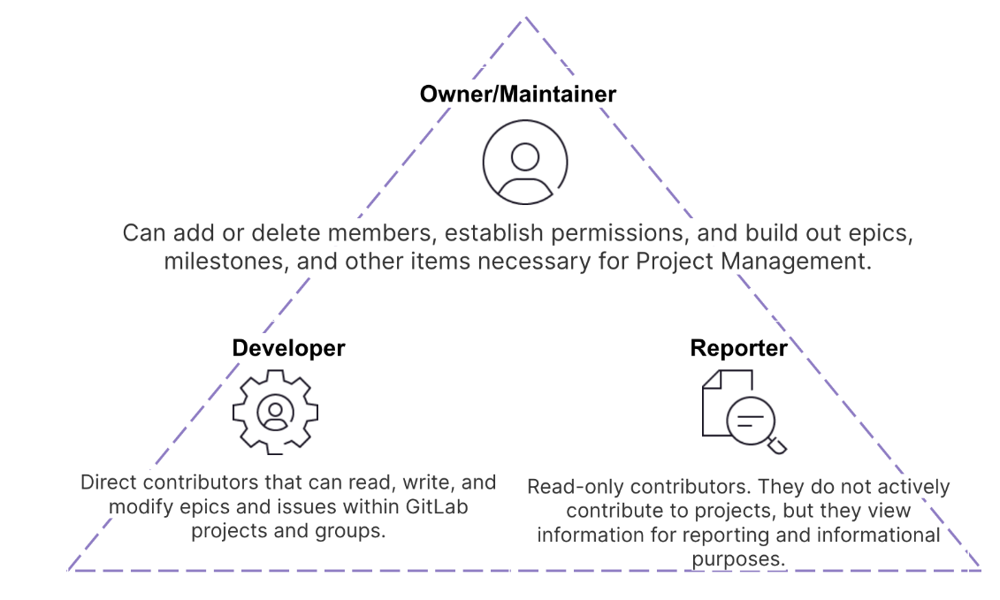

Devops Notes

The challenges with the SDLC (Software Development Lifecycle) and toolchain complexity are common as organizations grow and their development processes become more sophisticated. Let's break down each of these issues in detail:

### 1. **Redundant and Incompatible Tools**

**Problem:**
As organizations adopt different tools for various stages of the SDLC (e.g., planning, development, testing, deployment), they often end up with multiple tools that perform similar functions or don’t integrate well with each other. This redundancy can lead to inefficiencies and confusion.

**Implications:**

- **Duplication of Effort:** Teams may enter or manage the same information in multiple systems.
- **Increased Costs:** Licensing and maintenance of multiple tools can be expensive.
- **Tool Fatigue:** Users may become overwhelmed by the number of tools they need to use.

### 2. **Data and Process Silos**

**Problem:**
Disparate tools often result in data being stored in separate locations or formats, leading to silos where information isn’t easily accessible across the organization.

**Implications:**

- **Fragmented Insights:** Teams may lack a unified view of project status, making it difficult to understand overall progress and performance.
- **Inefficient Workflows:** Information needs to be manually transferred between tools or teams, which can be error-prone and time-consuming.
- **Delayed Decision-Making:** Lack of integrated data can slow down decision-making processes due to incomplete or inconsistent information.

### 3. **No Alignment Among Teams**

**Problem:**
When tools and processes aren’t integrated, different teams may follow different workflows and use different tools for similar tasks.

**Implications:**

- **Miscommunication:** Teams may have different understandings of project requirements or status.
- **Conflicting Priorities:** Without a shared view of project goals and progress, teams might work towards conflicting objectives.
- **Reduced Collaboration:** Disparate tools can hinder effective communication and collaboration among team members.

### 4. **No Consistent Application Security or Compliance**

**Problem:**
Without a unified approach, security and compliance practices may be applied inconsistently across different stages of the SDLC or between tools.

**Implications:**

- **Security Risks:** Inconsistent application of security practices can leave vulnerabilities exposed.
- **Compliance Issues:** Ensuring compliance with regulations and standards becomes more difficult if practices aren’t standardized.
- **Increased Risk of Breaches:** Lack of integration can lead to gaps in security monitoring and response.

### 5. **No Consistent Traceability**

**Problem:**
Traceability refers to the ability to track the history and changes of code, requirements, and issues throughout the SDLC.

**Implications:**

- **Difficulty in Audits:** It’s harder to audit changes and understand their impact when traceability is inconsistent.
- **Challenge in Troubleshooting:** Identifying the root cause of issues can be more difficult without clear traceability.
- **Reduced Accountability:** Lack of clear history can lead to unclear responsibility for decisions and changes.

### 6. **A High Degree of Context Switching**

**Problem:**
Context switching occurs when individuals or teams have to frequently move between different tools or systems to complete their work.

**Implications:**

- **Decreased Productivity:** Constantly switching between tools can disrupt focus and reduce overall productivity.
- **Increased Learning Curve:** Users need to become proficient in multiple tools, which can be time-consuming and mentally taxing.
- **Inconsistent Information:** Context switching can lead to inconsistencies and errors as users may not have all the information they need at their fingertips.

### Solutions and Best Practices

To address these challenges, organizations can consider the following approaches:

- **Adopt Integrated Platforms:** Use platforms that offer end-to-end solutions for managing the SDLC, such as GitLab, which integrates various functions into a single interface.
- **Implement Standardization:** Standardize processes and tools across teams to ensure consistency and reduce redundancy.
- **Improve Integration:** Ensure that tools used across the SDLC can integrate seamlessly with each other to facilitate smooth data flow and collaboration.
- **Automate Processes:** Implement automation where possible to reduce manual data transfer and improve efficiency.
- **Enhance Communication:** Foster better communication and collaboration among teams to align goals and practices.

By addressing these issues proactively, organizations can streamline their SDLC, improve efficiency, and enhance overall project success.

# Overview


# Types of Version Control System

Version control systems (VCS) can be categorized into several types based on their architecture and functionality:

### 1. **Local Version Control Systems**

**Description:** These systems manage versions of files on a local machine. They are useful for tracking changes and managing versions within a single user’s environment.

**Examples:**

- **RCS (Revision Control System):** Tracks changes to files and directories.
- **SCCS (Source Code Control System):** An early system for managing changes to source code.

### 2. **Centralized Version Control Systems (CVCS)**

**Description:** Centralized version control systems store all version history in a central server. Users commit their changes to this central repository and update their local copies from it.

**Examples:**

- **Subversion (SVN):** A widely used CVCS that tracks changes and handles versioning of files and directories.
- **CVS (Concurrent Versions System):** An older system that was popular before more modern VCS solutions emerged.
- **TFS (Team Foundation Server):** Provides version control along with project management and collaboration features.

### 3. **Distributed Version Control Systems (DVCS)**

**Description:** Distributed version control systems allow each user to have a full copy of the repository, including its history. Changes are shared among repositories, and users can work offline.

**Examples:**

- **Git:** A highly popular DVCS known for its branching and merging capabilities, as well as its performance.
- **Mercurial:** Another DVCS similar to Git, known for its simplicity and performance.
- **Bazaar:** A DVCS that provides support for different workflows and integrates well with various development environments.

### 4. **Hybrid Version Control Systems**

**Description:** Hybrid systems combine aspects of both centralized and distributed version control. They allow for both centralized and distributed workflows within the same system.

**Examples:**

- **Perforce Helix Core:** A version control system that can be used in a centralized manner but also supports distributed workflows.
- **BitKeeper:** Originally a commercial DVCS with both centralized and distributed features.

### Summary

- **Local VCS**: Tracks changes on a single machine.
- **Centralized VCS**: Uses a central repository for version control.
- **Distributed VCS**: Each user has a full repository copy and can work offline.
- **Hybrid VCS**: Combines features of both centralized and distributed systems.

Each type of version control system offers different advantages and is suited to different use cases depending on factors such as team size, project complexity, and workflow preferences.

### **Understanding Environment Branches in GitLab**

**1. **Default Branch:\*\*

When you create a new GitLab project, it automatically includes a default branch (often named `master` or `main`). This default branch is where the stable, production-ready code usually resides.

**2. **Environment Branches:\*\*

As projects evolve, teams create additional branches to manage different environments and stages of development. Common types of environment branches include:

- **`production` Branch:** Represents the code that is live in the production environment. It is the stable branch that end-users interact with.
- **`staging` or `pre-production` Branch:** Represents code that is almost ready for production but needs to be tested in an environment that mimics production as closely as possible. This environment is used for final testing and validation.

- **`development` Branch:** Often used for ongoing development and integrating features before they are ready for staging or production.

- **`feature` Branches:** Created for developing specific features or fixes. These branches are eventually merged into the `staging` or `production` branches.

**3. **Workflow with Environment Branches:\*\*

In a typical GitLab workflow involving environment branches:

- **Development:** Developers work on features or fixes in feature branches. These branches are created from the `development` or `staging` branch and contain specific changes.

- **Testing:** Once features are complete, they are merged into the `staging` branch. This branch is deployed to a staging environment where the changes are tested in conditions similar to production.

- **Release:** After successful testing, the `staging` branch is merged into the `production` branch. This ensures that the changes are deployed to the live environment.

- **Cherry-Picking:** If a hotfix (urgent fix) is needed, you can create a feature branch for the fix. This branch is merged into the `master` (or `production`) branch using a merge request. If the hotfix needs to be applied to other branches (like `staging`), you can create additional merge requests from the feature branch to those downstream branches. This ensures that the fix is propagated through all necessary environments.

**4. **Commit Flow:\*\*

In this workflow, commits flow downstream:

- Changes are first integrated into `feature` branches.
- Once validated, they move into the `staging` branch for more thorough testing.
- Finally, changes are merged into the `production` branch.

This ensures that each stage of development is tested progressively, and potential issues are caught early before reaching the production environment.

**5. **Cherry-Picking and Merge Requests:\*\*

If a hotfix is applied, it’s developed on a feature branch and merged into the `master` or `production` branch. If additional testing is required or if the fix needs to be applied to `staging`, you can create merge requests from the feature branch to these downstream branches.

**6. **Branch Deletion:\*\*

After a feature branch is merged, it’s typically deleted to keep the repository clean. However, if the branch is used for important hotfixes or ongoing work, it might be kept until the associated changes are fully integrated and tested across all relevant branches.

### **Summary**

- **Default Branch**: Stable branch (e.g., `master` or `main`).
- **Environment Branches**: Represent different stages like `production`, `staging`, and `development`.
- **Workflow**: Commits flow from feature branches → staging → production.
- **Cherry-Picking**: For urgent fixes, create feature branches and merge into necessary branches, ensuring changes propagate correctly.
- **Branch Management**: Delete branches after merging to keep the repository organized, but retain important branches as needed.

This structured approach helps manage and deploy code efficiently, ensuring stability and quality through multiple stages of development and testing.

### **Release Branches Overview**

**1. **Purpose of Release Branches:\*\*

Release branches are used to prepare and finalize software for a specific version or release. They allow you to stabilize and make last-minute adjustments before the software is released to users. Release branches typically follow a versioning scheme like `2.3-stable` or `2.4-stable`.

### **Workflow with Release Branches**

**1. **Creating Release Branches:\*\*

- **Creation:** When you’re ready to start preparing for a release, you create a release branch from the main development branch (often `master` or `main`). For example:

  ```bash
  git checkout -b release/2.3-stable
  ```

- **Purpose:** This branch is used to finalize the release. You can perform tasks like bug fixes, testing, and preparing documentation without affecting ongoing development in other branches.

**2. **Merging Changes:\*\*

- **Upstream First Policy:**

  - **Primary Approach:** To maintain consistency, you should follow an "upstream first" policy. This means that all changes, including bug fixes and new features, should first be merged into the main branch (e.g., `master` or `main`).
  - **Cherry-Picking:** After merging changes into the main branch, you can cherry-pick relevant commits into the release branch to ensure that bug fixes and important updates are also included in the release.
  - **Example:**
    ```bash
    git checkout master
    git merge <feature-branch>
    git checkout release/2.3-stable
    git cherry-pick <commit-id>
    ```

- **Tagging:** Once a release branch is finalized and the release is made, a new tag should be created to mark this specific version. Tags help in identifying and referencing specific versions of your software.
  ```bash
  git tag -a v2.3.0 -m "Release version 2.3.0"
  git push origin v2.3.0
  ```

**3. **Stable Branch:\*\*

- **Purpose:** Some projects maintain a `stable` branch that points to the latest released version. This branch provides a reference to the current stable state of the software, even if new release branches are created for future versions.
- **Usage:** The `stable` branch is often updated to reflect the latest stable release. It serves as a reference point and may be used for hotfixes or patches applied to released versions.

**4. **Production Branch:\*\*

- **Common Practice:** In many workflows, a separate `production` branch may not be necessary if the release branches and the `stable` branch effectively cover the needs for production deployment.
- **Alternative:** Instead of a dedicated production branch, the latest release branch or the `stable` branch may serve as the source of truth for what's currently in production.

### **Summary of Key Points**

- **Release Branches:** Used to finalize and prepare software for specific versions.
- **Upstream First Policy:** Merge changes into the main branch first and then cherry-pick them into the release branch to avoid inconsistencies.
- **Tagging:** Create a new tag for each release to mark the version clearly.
- **Stable Branch:** Maintains a reference to the latest stable version, and may be used for hotfixes.
- **Production Branch:** Not always necessary if the release and stable branches serve the purpose.

This approach ensures that your releases are well-managed, bug fixes are consistently applied, and your versioning is clear and organized.


In GitLab, an **Epic** is a high-level feature or large piece of work that is typically broken down into smaller, more manageable issues or tasks. Epics are used to organize and track work across multiple projects or issues and are particularly useful for managing large projects or features that span several milestones or iterations.

### Key Features of Epics in GitLab

1. **High-Level Organization:**

   - Epics provide a way to group related issues and merge requests under a single umbrella. This helps in organizing work at a broader level than individual issues or merge requests.

2. **Cross-Project Visibility:**

   - Epics can span across different projects within the same group. This is useful for large projects that involve multiple repositories.

3. **Tracking Progress:**

   - GitLab allows you to track the progress of an Epic by showing how many issues or merge requests are completed versus those that are still in progress. This provides a high-level view of the status of the larger feature or goal.

4. **Hierarchical Structure:**

   - Epics can be organized into a hierarchy where an Epic can have related child Epics. This hierarchical structure helps in managing complex projects with multiple layers of work.

5. **Roadmaps:**

   - GitLab provides a roadmap view where you can see the timeline of Epics, helping to visualize and plan the overall progress of large projects.

6. **Issue Linking:**
   - Issues and merge requests can be linked to an Epic, providing context and ensuring that all related work is tracked together.

When a merge request is created, it is marked as a draft by default. The Draft keyword in the title of the merge request indicates that the merge is currently a draft. A draft merge cannot be merged until it is marked as ready. This helps to prevent accidental merges.

### **Understanding GitLab CI/CD**

**Continuous Integration (CI)** and **Continuous Delivery (CD)** are fundamental practices in modern software development that aim to improve code quality, streamline workflows, and accelerate delivery cycles. Here’s a detailed explanation of each practice and how they work together in GitLab CI/CD:

### **Continuous Integration (CI)**

1. **Definition and Purpose:**

   - **Continuous Integration (CI)** is a development practice where code changes are frequently integrated into a shared repository. The key idea is to merge code changes from multiple developers into a central repository several times a day.
   - **Purpose:** CI helps in identifying integration issues early, improving code quality, and fostering collaboration among team members. It ensures that code changes do not break the existing codebase and that the software remains functional and stable.

2. **Process:**

   - **Code Commit:** Developers commit their code changes to a shared repository.
   - **Automated Build:** Each commit triggers an automated build process to compile the code and ensure that it integrates correctly with the existing codebase.
   - **Automated Testing:** Automated tests are run to validate the changes. This includes unit tests, integration tests, and other types of testing to ensure code correctness and stability.
   - **Feedback:** Developers receive feedback on their changes, allowing them to address issues quickly before the code is integrated into the main branch.

3. **Benefits:**
   - **Early Issue Detection:** CI helps catch integration problems and bugs early in the development cycle.
   - **Improved Collaboration:** By frequently integrating code, team members can collaborate more effectively and avoid conflicts.
   - **Maintained Code Quality:** Automated testing ensures that the codebase remains reliable and stable.

### **Continuous Delivery (CD)**

1. **Definition and Purpose:**

   - **Continuous Delivery (CD)** extends the principles of CI to automate the delivery of code changes to production or staging environments. The goal is to ensure that software is always in a deployable state and that deployments can occur frequently and reliably.
   - **Purpose:** CD streamlines the release process, making it easier to deploy new features, respond to customer feedback, and fix bugs promptly.

2. **Process:**

   - **Automated Deployment:** After successful integration and testing, code changes are automatically deployed to a staging environment. This environment closely mirrors the production environment.
   - **Manual Approval (Optional):** Depending on the configuration, a manual approval step may be required before deploying changes to the production environment.
   - **Production Deployment:** Once approved, changes are deployed to the production environment, where they are made available to end users.

3. **Benefits:**
   - **Frequent Releases:** CD allows for frequent and reliable releases of new features, enhancements, and fixes.
   - **Reduced Risk:** By automating deployment and testing processes, CD reduces the risk associated with manual deployments and ensures that software is always in a releasable state.
   - **Faster Response:** Teams can respond more quickly to user feedback and market demands.


# Anatomy of a CI/CD Pipeline

This is an example of a pipeline graph that shows what the CI/CD build looks like. It lets you see how a set of one or more jobs are executed in the stages you define in the YAML file for the pipeline.


# Git Command

### Getting & Creating Projects

| Command                                                           | Description                                |
| ----------------------------------------------------------------- | ------------------------------------------ |
| `git init`                                                        | Initialize a local Git repository          |
| `git clone ssh://git@github.com/[username]/[repository-name].git` | Create a local copy of a remote repository |

### Basic Snapshotting

| Command                            | Description                                       |
| ---------------------------------- | ------------------------------------------------- |
| `git status`                       | Check status                                      |
| `git add [file-name.txt]`          | Add a file to the staging area                    |
| `git add -A`                       | Add all new and changed files to the staging area |
| `git commit -m "[commit message]"` | Commit changes                                    |
| `git rm -r [file-name.txt]`        | Remove a file (or folder)                         |

### Branching & Merging

| Command                                              | Description                                             |
| ---------------------------------------------------- | ------------------------------------------------------- |
| `git branch`                                         | List branches (the asterisk denotes the current branch) |
| `git branch -a`                                      | List all branches (local and remote)                    |
| `git branch [branch name]`                           | Create a new branch                                     |
| `git branch -d [branch name]`                        | Delete a branch                                         |
| `git push origin --delete [branch name]`             | Delete a remote branch                                  |
| `git checkout -b [branch name]`                      | Create a new branch and switch to it                    |
| `git checkout -b [branch name] origin/[branch name]` | Clone a remote branch and switch to it                  |
| `git branch -m [old branch name] [new branch name]`  | Rename a local branch                                   |
| `git checkout [branch name]`                         | Switch to a branch                                      |
| `git checkout -`                                     | Switch to the branch last checked out                   |
| `git checkout -- [file-name.txt]`                    | Discard changes to a file                               |
| `git merge [branch name]`                            | Merge a branch into the active branch                   |
| `git merge [source branch] [target branch]`          | Merge a branch into a target branch                     |
| `git stash`                                          | Stash changes in a dirty working directory              |
| `git stash clear`                                    | Remove all stashed entries                              |

### Sharing & Updating Projects

| Command                                                                           | Description                                                 |
| --------------------------------------------------------------------------------- | ----------------------------------------------------------- |
| `git push origin [branch name]`                                                   | Push a branch to your remote repository                     |
| `git push -u origin [branch name]`                                                | Push changes to remote repository (and remember the branch) |
| `git push`                                                                        | Push changes to remote repository (remembered branch)       |
| `git push origin --delete [branch name]`                                          | Delete a remote branch                                      |
| `git pull`                                                                        | Update local repository to the newest commit                |
| `git pull origin [branch name]`                                                   | Pull changes from remote repository                         |
| `git remote add origin ssh://git@github.com/[username]/[repository-name].git`     | Add a remote repository                                     |
| `git remote set-url origin ssh://git@github.com/[username]/[repository-name].git` | Set a repository's origin branch to SSH                     |

### Inspection & Comparison

| Command                                    | Description                    |
| ------------------------------------------ | ------------------------------ |
| `git log`                                  | View changes                   |
| `git log --summary`                        | View changes (detailed)        |
| `git log --oneline`                        | View changes (briefly)         |
| `git diff [source branch] [target branch]` | Preview changes before merging |

# Head in Git


The `git checkout HEAD^` command is used to check out the commit immediately before the current commit. Here's a breakdown of what this command does and how it works:

### Understanding `HEAD^`

- **`HEAD`**: Refers to the current commit your working directory is based on.
- **`HEAD^`**: Refers to the parent commit of `HEAD`. In Git, `HEAD^` is shorthand for `HEAD~1`, which means "one commit before the current commit." If you want to go further back, you can use `HEAD^^` (or `HEAD~2`), `HEAD~~~` (or `HEAD~3`), and so on.

### Using `git checkout HEAD^`

1. **Checkout the Parent Commit**:

   ```bash
   git checkout HEAD^
   ```

   This command checks out the parent commit of the current commit, placing your working directory into a "detached HEAD" state.

2. **Viewing Changes**: Once checked out, you can inspect files and see the state of the repository at the parent commit.

### Example Scenario

Imagine your commit history looks like this:

```
A -- B -- C -- D (HEAD)
```

If you run `git checkout HEAD^`, you will switch to commit `C`.

### Working with Detached HEAD State

- **Inspect Files**: You can view the files as they were in the parent commit.
- **Make Changes**: If you make changes and want to keep them, you should create a new branch:
  ```bash
  git checkout -b new-branch-name
  ```
- **Return to the Branch**: To go back to the latest commit on your branch:
  ```bash
  git checkout main
  ```
  Replace `main` with whatever branch you were on before.

### Important Notes

- **Detached HEAD State**: In this state, any new commits won’t be saved to a branch unless you explicitly create a new branch or otherwise integrate them.
- **Recovery**: If you make changes in the detached HEAD state and don’t create a new branch, those changes might be lost when switching to another commit or branch.

Using `HEAD^` is useful for viewing or reverting to previous states in your repository, but remember to manage your commits and branches carefully to avoid losing work.

# Branch Forcing


### `git reset`

The `git reset` command is used to move the current branch's HEAD to a specified state, and it can also modify the staging area and working directory. There are three primary forms of `git reset`:

1. **Soft Reset (`--soft`)**:

   - **Usage**: `git reset --soft <commit>`
   - **Effect**: Moves the HEAD to the specified commit, but keeps changes in the index (staging area) and working directory. This means changes made after the specified commit are still staged and can be committed again.
   - **Example**:
     ```bash
     git reset --soft HEAD~1
     ```
     This command will move HEAD to the previous commit while keeping your changes staged.

2. **Mixed Reset (default)**:

   - **Usage**: `git reset <commit>`
   - **Effect**: Moves the HEAD to the specified commit and updates the staging area to match it, but does not modify the working directory. This effectively unstages any changes made after the specified commit but leaves the changes in your working directory.
   - **Example**:
     ```bash
     git reset HEAD~1
     ```
     This command will move HEAD to the previous commit and unstage changes made after that commit, but the changes will still be in your working directory.

3. **Hard Reset (`--hard`)**:
   - **Usage**: `git reset --hard <commit>`
   - **Effect**: Moves the HEAD to the specified commit, updates the staging area, and modifies the working directory to match the commit. All changes in the working directory and staging area are discarded.
   - **Example**:
     ```bash
     git reset --hard HEAD~1
     ```
     This command will reset your branch to the previous commit and discard all changes in your working directory and staging area.

### `git revert`

The `git revert` command is used to create a new commit that undoes the changes made by a previous commit. Unlike `git reset`, `git revert` does not alter the commit history but instead adds a new commit that effectively reverses the changes.

- **Usage**: `git revert <commit>`
- **Effect**: Creates a new commit that reverses the changes introduced by the specified commit. This is useful for undoing changes in a shared history without rewriting the commit history.
- **Example**:
  ```bash
  git revert a1b2c3d4
  ```
  This command will create a new commit that reverses the changes made in commit `a1b2c3d4`.

### Key Differences

- **History Modification**:

  - `git reset` can alter commit history, especially with `--hard` or `--soft`, which can affect collaborators if pushed to a shared repository.
  - `git revert` does not change commit history; it creates a new commit that undoes the changes, making it safer for shared branches.

- **Usage Context**:

  - Use `git reset` for local changes, when you want to undo or redo commits before they’re shared with others.
  - Use `git revert` for undoing changes in a way that is safe for shared branches, as it preserves commit history.

- **Effect on Working Directory**:
  - `git reset --hard` will affect your working directory and discard changes.
  - `git revert` will leave your working directory as is but adds a new commit to reverse the changes.

### Summary

- **`git reset`**: Alters branch history and can modify the working directory. Use for local changes and history adjustments.
- **`git revert`**: Creates a new commit to reverse changes without altering commit history. Use for undoing changes safely in shared repositories.

### Role Hierarchy Overview



In GitLab, roles and permissions are crucial for managing access and controlling what users can do within projects and groups. Here's a detailed explanation of the role hierarchy and how it works when a user is assigned multiple roles:

When managing users in GitLab, roles are assigned to determine the level of access and control a user has within a project or group. GitLab uses a hierarchical system where different roles have varying levels of permissions.

#### **Project vs. Group Roles**

- **Project Roles**: Define permissions specifically for a single project.
- **Group Roles**: Define permissions within a group that can contain multiple projects. These roles can apply to all projects within the group.

### Hierarchical Role System

1. **Role Levels**:

   - **Guest**: Limited access, mostly read-only. Can view issues, merge requests, and some other elements but cannot make changes.
   - **Reporter**: Can view and comment on issues, view code, and see most aspects of the project but cannot make changes.
   - **Developer**: Can push code, manage issues, and perform other development-related tasks. Has more permissions than Reporter.
   - **Maintainer**: Can manage project settings, handle project configuration, and have broad control over the project. Higher level than Developer.
   - **Owner**: (For groups) Has the highest level of control over a group and its projects. Owners can change group settings, manage members, and more.

2. **Permissions Hierarchy**:
   - **Project Roles**: When a user is assigned a role at the project level, their permissions are confined to that specific project.
   - **Group Roles**: When a user is assigned a role at the group level, it applies to all projects within the group. If a project has its own roles defined, the group role will apply to all projects under the group by default.

### When a User is Added to Both a Project and a Group

If a user is added to both a group and a project with different roles, GitLab uses the higher role to determine their effective permissions. Here’s how it works:

1. **Role Assignment**:

   - **Group Role**: If a user is assigned a role (e.g., Developer) at the group level, this role will apply to all projects within that group.
   - **Project Role**: If the same user is also assigned a different role (e.g., Maintainer) at the project level, the project-specific role takes precedence.

2. **Effective Permissions**:
   - The user’s permissions are governed by the highest role they hold in any of the contexts where they are assigned. For example, if a user has a Developer role at the group level and a Maintainer role at the project level, they will have the permissions associated with the Maintainer role in that project.

### Example

Consider a user who is assigned:

- **Developer** role in a group.
- **Maintainer** role in a specific project within that group.

In this case:

- **For the group**: The user will have Developer-level permissions across all projects in the group.
- **For the specific project**: The user will have Maintainer-level permissions due to the project-specific role, which overrides the group-level role for this particular project.

### Summary

- **Group Roles**: Apply to all projects within the group and define default permissions.
- **Project Roles**: Apply specifically to individual projects and can override group-level permissions.
- **Role Precedence**: When a user has roles at both the group and project levels, the higher role’s permissions apply in the specific context where the higher role is assigned.

Understanding this hierarchy helps ensure that users have appropriate access levels and that permissions are correctly managed across both group-wide and project-specific contexts in GitLab.

# Milestones

Milestones
Milestones in GitLab are a way to track issues and merge requests created to achieve a broader goal in a certain period of time. Milestones allow you to organize issues and merge requests into a cohesive group, with an optional start date and an optional due date.

For example, if you have a lot of issues related to a specific deliverable or goal, you can create a milestone and assign all of the issues to it.

Key features/functions

You can assign both issues and merge requests to milestones
Everything assigned to the same milestone shares the same start date and end date
Milestones can exist at the project or group level
The milestone view also contains a burndown and burnup chart showing the progress of completing a milestone

# Iterations

Iterations are a way to track issues over a period of time. This allows teams to track velocity and volatility metrics. For tracking over different time periods, you can use iterations milestones. You can create and manage various iteration cadences.

For example, you can use:

Milestones for Program Increments, which span 8-12 weeks.
Iterations for Sprints, which span 2 weeks.

Key features/functions

You can consider an iteration like a sprint and assign issues to your iterations
Iterations are at the group level only and groups can have only 1 active iteration at a time
Iterations are grouped into iteration cadences
Iterations require start and end dates
Iteration date ranges cannot overlap within an iteration cadence
The iteration detail page shows you overall % complete as well as burndown and burnup charts


# PIPELINE

A pipeline is made of multiple stages , and stages consists of one or multiple job and the job are executed by the runner that makes job complete and hand it over to the Gitlab.

<!-- Gitlab pipeline details  -->

<!-- ////////////////////////// -->

# Docker Image

A Docker image is a lightweight, standalone, and executable package that includes everything needed to run a piece of software. This includes the code, runtime, libraries, environment variables, and configuration files.

In more detail:

- **Layered Structure:** Docker images are made up of layers. Each layer represents a set of file changes or additions and is built on top of previous layers. This layered structure allows for efficient use of disk space and makes it easier to distribute and update images.

- **Immutability:** Once a Docker image is created, it doesn’t change. This immutability ensures that the software runs the same way regardless of where it is deployed, leading to consistent environments.

- **Portability:** Docker images can be run on any system that has Docker installed, regardless of the underlying operating system or hardware. This portability is one of the main benefits of using Docker.

- **Reusability:** Since Docker images can be built from a base image (like an official operating system or language runtime image) and then customized, they promote reuse and sharing of common configurations and dependencies.

- **Dockerfile:** The Docker image is typically built from a `Dockerfile`, which is a text file containing instructions on how to construct the image. The `Dockerfile` specifies the base image, copies files, installs dependencies, and sets up the environment for the application.

Overall, Docker images help streamline development, testing, and deployment processes by providing a consistent environment across different stages and platforms.

# Services

The services keyword allows us to augment our base image with an additional image if one container isn't enough. This additional image is used to create another container, which is available for the first container. These two containers have access to one another and can communicate when running the job.

The service image can run any application, but the most common use case is to run a database container as we've done in the example above by adding a Postgres container.

In GitLab, artifacts and cache are two important concepts used to optimize the CI/CD pipeline and improve build efficiency.

### **Artifacts and Cache**

Artifacts in GitLab are files or directories created by a job that you want to save and use in later stages of your pipeline or share with other jobs. Artifacts are typically generated by build or test jobs and can be used for a variety of purposes:

- **Storing Build Results:** For example, if you have a build job that generates a compiled binary or a set of reports, these files can be saved as artifacts.
- **Passing Data Between Jobs:** Artifacts can be used to share data between different jobs in a pipeline. For instance, you might need to pass build outputs to a deployment job.

**Configuration Example:**

Here’s an example of how you might configure artifacts in a `.gitlab-ci.yml` file:

```yaml
build:
  stage: build
  script:
    - make build
  artifacts:
    paths:
      - build/
    expire_in: 1 week
```

In this example, the `build` job generates files in the `build/` directory, which are then stored as artifacts. The `expire_in` field specifies how long the artifacts should be kept before being automatically deleted.

### **Cache**

Cache in GitLab is used to speed up the execution of jobs by reusing data from previous jobs. Caching is typically used for dependencies or other files that are expensive to generate or download repeatedly.

**Usage Examples:**

- **Dependency Caching:** You can cache dependencies (like npm modules or Maven dependencies) to avoid re-downloading them on every pipeline run.
- **Build Caching:** Cache build directories to speed up incremental builds.

**Configuration Example:**

Here’s an example of how to configure caching in a `.gitlab-ci.yml` file:

```yaml
build:
  stage: build
  script:
    - npm install
    - npm run build
  cache:
    key: ${CI_COMMIT_REF_SLUG}
    paths:
      - node_modules/
```

In this example, the `node_modules/` directory is cached between builds. The `key` field ensures that the cache is specific to a particular branch or commit, which helps avoid using outdated cache data.

### **Key Differences**

- **Artifacts:** Used to store files generated by jobs and to make them available to later jobs in the pipeline. Artifacts are often used for outputs that need to be preserved beyond the lifetime of a single job.
- **Cache:** Used to speed up pipeline execution by reusing previously stored data. Caches are typically used for dependencies or build artifacts that are expensive to regenerate or download.

By using artifacts and cache effectively, you can improve the efficiency and speed of your CI/CD pipelines in GitLab.

Dependencies
Dependencies restrict which artifacts are passed to a specific job by providing a list of jobs to fetch artifacts from selectively. They are defined in the job and pass a list of all previous jobs the artifacts should be downloaded from. See below for an example YAML file with dependencies.

```yaml
build:osx:
  stage: build
  script: make build:osx
  artifacts:
    paths:
      - binaries/

build:linux:
  stage: build
  script: make build:linux
  artifacts:
    paths:
      - binaries/

test:osx:
  stage: test
  script: make test:osx
  dependencies:
    - build:osx

test:linux:
  stage: test
  script: make test:linux
  dependencies:
    - build:linux

deploy:
  stage: deploy
  script: make deploy
```

# Rules

Rules are a way to define under what conditions a job should run. Have a deploy job that should only be run on a particular branch? Want to skip a job if no changes are made to a corresponding file? Need to delay when a job runs to avoid peak hours? The rules syntax in your YAML file can be configured to handle all of these use cases. Order matters

Rules are evaluated in order until the first match, so order matters. When the first condition is met, the job is either included or excluded from the pipeline depending on the configuration.

Example 1: Only Deploy from Main Branch
This deploy job will always run on the main branch. Otherwise, it will never run.

```yaml
pseudo-deploy:
  stage: deploy
  script:
    - command deploy_review
  rules:
    - if: '$CI_COMMIT_REF_NAME == "main"'
      when: always
    - when: never
```

Close Example 2: Triggered by a Merge Request
This conditional rule ensures that a pipeline only runs when a merge request event is triggered:

```yaml
job:
  script: "echo Hello, Rules!"
  rules:
    - if: ‘$CI_PIPELINE_SOURCE == “merge_request_event”’
```

Close Example 3: Delayed Job Start & Allowed Failure
This job will run 3 hours after triggered and will be allowed to fail (will not prevent further stages from firing):

```yaml
docker build:
  script: docker build -t my-image:$CI_COMMIT_REF_SLUG .
  rules:
    - if: '$CI_COMMIT_BRANCH == "main"'
    when: delayed
    start_in: '3 hours'
    allow_failure: true
```

Close Example 4: Workflow Rules
This pipeline will not run if the commit message ends with “-wip”. It also will not run if it was triggered by a tag being applied. Otherwise, this pipeline will run.

```yaml
workflow:
  rules:
   - if: $CI_COMMIT_MESSAGE =~ /-wip$/
      when: never
    - if: $CI_COMMIT_TAG
   when: never
    - when: always
<<<<<<< HEAD
```

# Needs

The needs keyword enables executing jobs out-of-order, allowing you to implement a directed acyclic graph (DAG) in your CI configuration.

This lets you run some jobs without waiting for other ones, disregarding stage ordering so you can have multiple stages running concurrently. You can ignore stage ordering and run some jobs without waiting for others to complete. Jobs in multiple stages can run concurrently. See below for an example YAML with needs utilized.

```yaml
linux:build:
  stage: build

mac:build:
  stage: build

lint:
  stage: test
  needs: []

linux:rspec:
  stage: test
  needs: ["linux:build"]

mac:rubocop:
  stage: test
  needs: ["mac:build"]

production:
  stage: deploy
```

# Reusable Pipeline

Creating a reusable pipeline in GitLab is a great way to streamline your CI/CD processes and ensure consistency across projects. In GitLab, you can create reusable pipelines by using templates, including predefined jobs, or defining custom pipeline configurations that can be included in multiple `.gitlab-ci.yml` files.

Here's how you can create a reusable pipeline in GitLab:

### 1. **Create a Template Repository**

- Create a repository that will hold your reusable pipeline definitions.
- In this repository, you can define your pipeline stages, jobs, and variables.

### 2. **Define Reusable Jobs in the Template**

- In your template repository, create a `.gitlab-ci.yml` file where you define the jobs you want to reuse.

Example:

```yaml
# .gitlab-ci.yml in the template repository
.build_job_template:
  script:
    - echo "Running the build job"
    - make build

.test_job_template:
  script:
    - echo "Running tests"
    - make test

.deploy_job_template:
  script:
    - echo "Deploying application"
    - make deploy
```

Here, `.build_job_template`, `.test_job_template`, and `.deploy_job_template` are defined as hidden jobs (jobs prefixed with a dot) that are not executed directly but can be included in other pipelines.

### 3. **Include the Template in Other Projects**

- In the `.gitlab-ci.yml` of your other projects, you can include the jobs defined in the template repository.

Example:

```yaml
include:
  - project: "namespace/template-repository"
    file: "/.gitlab-ci.yml"

stages:
  - build
  - test
  - deploy

build:
  extends: .build_job_template

test:
  extends: .test_job_template

deploy:
  extends: .deploy_job_template
```

Here, `include` is used to pull the `.gitlab-ci.yml` from the template repository, and `extends` is used to reuse the jobs defined there.

### 4. **Use Pipeline Variables**

- You can use pipeline variables to customize the behavior of the reusable jobs.

Example:

```yaml
variables:
  BUILD_ENV: "production"

build:
  extends: .build_job_template
  script:
    - echo "Building for $BUILD_ENV"
    - make build
```

The `BUILD_ENV` variable can be customized per project or pipeline.

### 5. **Test and Maintain the Template**

- Test the reusable pipeline by running it in different projects.
- Keep the template repository updated and version-controlled to maintain consistency across all pipelines that use it.

### Benefits of Reusable Pipelines:

- **Consistency**: Ensures that the same steps are followed in different projects.
- **Maintainability**: Changes can be made in one place (the template repository) and automatically propagate to all pipelines that include the template.
- **Efficiency**: Reduces duplication of code and configuration, making your pipelines easier to manage.

This approach allows you to create scalable and maintainable CI/CD pipelines across multiple projects in GitLab.

# Shifting security left

"Shifting security left" in GitLab refers to integrating security practices and testing early in the software development lifecycle (SDLC), rather than waiting until later stages like deployment. This approach aims to identify and resolve security vulnerabilities as early as possible, reducing the cost and effort of fixing issues and improving overall security.

### How to Shift Security Left in GitLab

1. **Enable Security Scanning in CI/CD Pipelines**
   GitLab provides several built-in security scanning features that can be integrated into your CI/CD pipelines:

   - **Static Application Security Testing (SAST):** Scans your source code for vulnerabilities.
   - **Dependency Scanning:** Identifies vulnerabilities in your project's dependencies.
   - **Container Scanning:** Scans container images for known vulnerabilities.
   - **Dynamic Application Security Testing (DAST):** Simulates attacks on a live application to find vulnerabilities.

   Example configuration in `.gitlab-ci.yml`:

   ```yaml
   include:
     - template: Security/SAST.gitlab-ci.yml
     - template: Security/Dependency-Scanning.gitlab-ci.yml
     - template: Security/Container-Scanning.gitlab-ci.yml
     - template: Security/DAST.gitlab-ci.yml

   stages:
     - build
     - test
     - security

   sast:
     stage: security

   dependency_scanning:
     stage: security

   container_scanning:
     stage: security

   dast:
     stage: security
   ```

2. **Incorporate Security Scanning Early in the Development Process**

   - **Pre-commit Hooks:** Use Git hooks to run security checks before code is committed to the repository.
   - **Merge Request Scanning:** Configure security scans to automatically run on merge requests, ensuring that vulnerabilities are caught before code is merged into the main branch.

3. **Use GitLab’s Security Dashboard**

   - The Security Dashboard in GitLab provides an overview of vulnerabilities across your projects. This allows you to monitor and manage security issues effectively and prioritize fixes.

4. **Automate Security Remediation**

   - GitLab can automatically suggest security patches for vulnerabilities found in dependencies, making it easier for developers to apply fixes quickly.

5. **Custom Security Policies**

   - GitLab allows you to define custom security policies using code, which can be enforced across your projects. These policies can include rules for branch protection, required scans, and more.

6. **Security Training and Awareness**
   - Educate your development team on the importance of security and how to write secure code. Incorporating tools and practices into daily workflows helps developers consider security from the outset.

### Benefits of Shifting Security Left

- **Early Detection of Vulnerabilities:** Identifying and fixing issues early in the development process reduces the risk of deploying vulnerable code.
- **Cost Efficiency:** Fixing security issues earlier in the SDLC is typically less costly than addressing them after deployment.
- **Continuous Improvement:** Regular security testing helps create a culture of continuous improvement in security practices.

Shifting security left in GitLab aligns with DevSecOps principles, ensuring that security is an integral part of the development process rather than an afterthought.

# The GitLab Package Registry

The GitLab Package Registry is a feature within GitLab that allows you to build, publish, share, and manage packages (such as libraries, dependencies, and other reusable components) directly within GitLab. It serves as a centralized, single source of truth for storing and distributing various types of packages used in your projects.

### Key Features of the GitLab Package Registry:

1. **Support for Multiple Package Formats:**

   - The GitLab Package Registry supports a wide range of package formats, including:
     - **Maven:** Java-based packages.
     - **npm:** Node.js packages.
     - **PyPI:** Python packages.
     - **Composer:** PHP packages.
     - **NuGet:** .NET packages.
     - **Docker:** Container images.
     - **Go Modules:** Go packages.
     - **Conan:** C/C++ packages.
     - **Helm:** Kubernetes charts.

2. **Integrated with GitLab CI/CD:**

   - The Package Registry is tightly integrated with GitLab's CI/CD pipelines, making it easy to automate the process of building and publishing packages as part of your CI/CD workflow.

   Example of publishing an npm package in `.gitlab-ci.yml`:

   ```yaml
   stages:
     - build
     - publish

   build:
     stage: build
     script:
       - npm install
       - npm run build

   publish:
     stage: publish
     script:
       - npm publish
     only:
       - tags
   ```

3. **Version Control for Packages:**

   - Like source code, packages in the GitLab Package Registry can be versioned, allowing you to maintain and manage different versions of a package.

4. **Access Control and Permissions:**

   - You can control who has access to your packages using GitLab’s role-based access control (RBAC). This ensures that only authorized users can publish or access certain packages.

5. **Package Discovery:**

   - Packages can be easily searched and discovered within the GitLab interface, making it simple for teams to find and use the correct versions of dependencies.

6. **Private and Public Repositories:**

   - The GitLab Package Registry supports both private and public repositories, giving you the flexibility to keep packages internal to your organization or share them publicly with the community.

7. **Dependency Management:**
   - By using the GitLab Package Registry, you can manage and track dependencies across your projects, ensuring consistency and reducing the risk of using outdated or insecure packages.

### Use Cases for the GitLab Package Registry:

- **Internal Package Distribution:** Host and manage private packages within your organization, reducing dependency on external package registries.
- **Dependency Management:** Keep track of all the dependencies used in your projects, ensuring you’re always using the correct versions.
- **Automated Package Publishing:** Use GitLab CI/CD to automate the process of building, testing, and publishing packages to the registry.
- **Secure Package Hosting:** Ensure that your packages are stored securely with access controls, reducing the risk of supply chain attacks.

The GitLab Package Registry helps teams streamline their development processes by providing a unified platform for managing code, CI/CD, and packages in a single interface.

# Gitlab Security Scanners

GitLab provides several security scanning features to help identify and address vulnerabilities and security issues in your code and dependencies. Here’s a breakdown of the different types of security scanners available in GitLab:

### 1. **Static Application Security Testing (SAST)**

- **Description:** Analyzes source code to find vulnerabilities and coding errors without executing the program.
- **Types of Vulnerabilities Detected:** SQL injection, cross-site scripting (XSS), insecure data storage, and other security flaws.
- **How to Enable:** GitLab includes a built-in SAST template in its CI/CD configuration. Simply include the SAST template in your `.gitlab-ci.yml` file.
  ```yaml
  include:
    - template: Security/SAST.gitlab-ci.yml
  ```

### 2. **Dynamic Application Security Testing (DAST)**

- **Description:** Scans running web applications to identify vulnerabilities by simulating attacks.
- **Types of Vulnerabilities Detected:** Cross-site scripting (XSS), SQL injection, and other runtime issues.
- **How to Enable:** Add the DAST configuration to your `.gitlab-ci.yml` file. You need to configure the URL of your web application.

  ```yaml
  include:
    - template: Security/DAST.gitlab-ci.yml

  dast:
    stage: test
    variables:
      DAST_WEBSITE: "http://your-website-url"
  ```

### 3. **Dependency Scanning**

- **Description:** Scans your project's dependencies for known vulnerabilities.
- **Types of Vulnerabilities Detected:** Issues in third-party libraries and packages.
- **How to Enable:** Add the dependency scanning configuration to your `.gitlab-ci.yml` file using the built-in template.
  ```yaml
  include:
    - template: Security/Dependency-Scanning.gitlab-ci.yml
  ```

### 4. **Container Scanning**

- **Description:** Analyzes Docker images for vulnerabilities.
- **Types of Vulnerabilities Detected:** Issues in base images and installed packages within your Docker containers.
- **How to Enable:** Add the container scanning configuration to your `.gitlab-ci.yml` file.
  ```yaml
  include:
    - template: Security/Container-Scanning.gitlab-ci.yml
  ```

### 5. **Secret Detection**

- **Description:** Identifies sensitive information such as API keys and passwords in your codebase.
- **Types of Secrets Detected:** Hardcoded secrets, API keys, credentials.
- **How to Enable:** Add the secret detection configuration to your `.gitlab-ci.yml` file.
  ```yaml
  include:
    - template: Security/Secret-Detection.gitlab-ci.yml
  ```

### 6. **License Compliance**

- **Description:** Checks dependencies for compliance with licensing requirements.
- **Types of Issues Detected:** License conflicts, non-compliance with open-source licenses.
- **How to Enable:** Add the license compliance configuration to your `.gitlab-ci.yml` file.
  ```yaml
  include:
    - template: Security/License-Compliance.gitlab-ci.yml
  ```

### 7. **Infrastructure as Code (IaC) Scanning**

- **Description:** Analyzes IaC configuration files for security issues.
- **Types of Issues Detected:** Misconfigurations in files like Terraform, Ansible, and Kubernetes manifests.
- **How to Enable:** Add the IaC scanning configuration to your `.gitlab-ci.yml` file.
  ```yaml
  include:
    - template: Security/IaC-Scanning.gitlab-ci.yml
  ```

### Enabling Security Scanning

To enable any of these scanners, you typically include the corresponding GitLab CI/CD template in your `.gitlab-ci.yml` file. You can customize each scan's settings according to your project's needs. For detailed information on configuring and using these scanners, you can refer to GitLab's official [Security Documentation](https://docs.gitlab.com/ee/user/application_security/).

### Summary

GitLab provides comprehensive security scanning tools to help you identify and address vulnerabilities in your code, dependencies, and container images. By incorporating these scanners into your CI/CD pipelines, you can enhance the security and compliance of your applications.

SAST can be considered white box testing, meaning that it's able to look inside your application to look at the code. DAST is black box testing, meaning that the application is tested from the outside.

Dynamic Application Security Testing (DAST) is a type of security testing that analyzes a running application to find vulnerabilities and security flaws. Unlike Static Application Security Testing (SAST), which examines the source code, DAST tests the application from the outside, simulating real-world attacks.

GitLab offers built-in DAST capabilities as part of its DevSecOps tools, allowing you to integrate security testing into your CI/CD pipeline. Here's a detailed overview of how DAST works in GitLab:

### 1. **How DAST Works in GitLab**

- **Scanning**: DAST scans a running application for vulnerabilities, such as SQL injection, cross-site scripting (XSS), and others. It does this by interacting with the application just as a user or attacker would, sending various inputs to see how the application responds.
- **Reporting**: After the scan, GitLab generates a report that lists all the detected vulnerabilities, including details on the type of issue, its severity, and potential remediation steps.
- **Automation**: DAST in GitLab can be automated as part of your CI/CD pipeline. This means every time you push code, the application can be automatically scanned for vulnerabilities.

### 2. **Setting Up DAST in GitLab**

To set up DAST in your GitLab CI/CD pipeline, follow these steps:

- **1. Add DAST to your `.gitlab-ci.yml`**:
  You can add a DAST job to your GitLab pipeline by including the `DAST.gitlab-ci.yml` template. Here's a basic example:

  ```yaml
  include:
    - template: DAST.gitlab-ci.yml

  dast:
    stage: test
    script:
      - echo "Running DAST"
    variables:
      DAST_WEBSITE: "https://example.com"
  ```

- **2. Configure DAST Variables**:
  You need to configure several variables to define how the DAST job should run:

  - **`DAST_WEBSITE`**: The URL of the website or application you want to scan.
  - **`DAST_EXCLUDE_URLS`**: URLs to exclude from the scan.
  - **`DAST_FULL_SCAN_ENABLED`**: If set to `true`, enables a more comprehensive scan (disabled by default).
  - **`DAST_AUTH_URL`, `DAST_USERNAME`, `DAST_PASSWORD`**: For scanning applications that require authentication.

  These variables can be set directly in the `.gitlab-ci.yml` file or through GitLab's CI/CD settings.

- **3. Run the Pipeline**:
  Once configured, running the pipeline will trigger the DAST job, which will scan the specified website and produce a report on detected vulnerabilities.

### 3. **Understanding DAST Reports**

- **Vulnerability List**: The report will contain a list of all detected vulnerabilities, categorized by type (e.g., SQL Injection, XSS).
- **Severity Levels**: Each vulnerability is assigned a severity level (e.g., Critical, High, Medium, Low).
- **Detailed Findings**: For each vulnerability, the report provides detailed information, including the affected URL, attack vector, and suggestions for remediation.

GitLab allows you to view these reports directly in the Merge Request (MR) interface, making it easy to review and address security issues before merging code.

### 4. **Integrating DAST with Other GitLab Security Tools**

- **Security Dashboards**: GitLab provides a security dashboard where you can view all the vulnerabilities detected across your projects. This helps in tracking and managing security issues at a higher level.
- **Vulnerability Management**: GitLab allows you to create issues directly from the DAST report, assign them to team members, and track their resolution.
- **SAST and Dependency Scanning**: DAST can be used in conjunction with SAST and Dependency Scanning (which checks for vulnerabilities in your code dependencies) for comprehensive security testing.

### 5. **Best Practices for Using DAST in GitLab**

- **Run DAST on Staging Environments**: Since DAST requires a running application, it's typically run on a staging environment rather than in production.
- **Use Authentication**: If your application requires login, configure DAST with authentication details to scan areas that are behind login screens.
- **Review and Triage**: Regularly review DAST reports and prioritize fixing high-severity issues.

### Summary

GitLab's DAST feature provides an automated way to test your applications for security vulnerabilities as part of your CI/CD pipeline. By integrating DAST into your DevSecOps workflow, you can catch security issues early in the development process, reducing the risk of vulnerabilities in your production environment.


# IAC Security SCanning

Infrastructure as Code (IaC) Scanning is a security feature in GitLab designed to automatically detect security and compliance issues within your infrastructure as code configurations. IaC involves managing and provisioning computing infrastructure through machine-readable files, rather than through physical hardware configuration or interactive configuration tools. Examples of IaC include Terraform, AWS CloudFormation, and Ansible.

GitLab's IaC scanning helps to identify potential misconfigurations or vulnerabilities in these files, ensuring that your infrastructure is secure before it is deployed.

### Key Features of IaC Scanning in GitLab

1. **Automatic Detection of Vulnerabilities**:

   - GitLab scans IaC files for known security issues and misconfigurations, such as open security groups in AWS or public access to storage buckets.
   - It supports various IaC tools like Terraform, CloudFormation, and Kubernetes YAML files.

2. **Integration with CI/CD**:

   - IaC scanning can be integrated directly into your GitLab CI/CD pipelines, allowing you to automatically scan IaC files every time code is committed or a merge request is created.
   - This ensures that any issues are caught early in the development process, before changes are deployed to production.

3. **Comprehensive Security Reports**:

   - The results of IaC scans are provided in detailed security reports, which are available within the GitLab interface.
   - Reports include information on detected vulnerabilities, their severity, and recommendations for remediation.

4. **Compliance Checks**:

   - IaC scanning also includes compliance checks to ensure that your infrastructure meets industry standards and best practices.
   - This is particularly useful for organizations that need to adhere to regulatory requirements like GDPR, HIPAA, or PCI-DSS.

5. **Continuous Monitoring**:
   - GitLab can continuously monitor IaC files for changes and automatically scan them whenever they are modified.
   - This continuous monitoring helps to maintain the security and compliance of your infrastructure over time.

### How to Set Up IaC Scanning in GitLab

Setting up IaC scanning in GitLab involves a few simple steps:

1. **Add IaC Scanning to Your `.gitlab-ci.yml`**:

   - To enable IaC scanning, you need to include the `IaC.gitlab-ci.yml` template in your GitLab CI/CD pipeline configuration file.
   - Here’s an example of how to include it:

     ```yaml
     include:
       - template: IaC-Scan.gitlab-ci.yml

     iac_scan:
       stage: test
       script:
         - echo "Running IaC Scan"
     ```

   - This template automatically configures the IaC scanning job in your pipeline.

2. **Configure Scan Settings**:

   - You can configure various settings for the IaC scanning job using environment variables. For example:
     - **`IAC_SCAN_ENABLED`**: Enables or disables IaC scanning.
     - **`IAC_SCAN_FILE_PATHS`**: Specifies the paths to the IaC files you want to scan.
     - **`IAC_SCAN_EXCLUDE_PATHS`**: Specifies paths that should be excluded from the scan.

3. **Run the Pipeline**:

   - Once the IaC scanning is configured, it will run as part of your CI/CD pipeline. Each time code is committed or a merge request is created, the IaC files will be automatically scanned for vulnerabilities and misconfigurations.

4. **Review the Security Report**:
   - After the pipeline runs, you can review the IaC scanning results in the security tab of your project or merge request.
   - The report will highlight any issues found, along with recommendations for fixing them.

### Understanding IaC Scanning Reports

The IaC scanning report in GitLab provides detailed information about any detected issues, including:

- **Vulnerability Type**: The category of the issue, such as "Insecure Security Group" or "Open Storage Bucket."
- **Severity**: The impact of the issue, usually categorized as Critical, High, Medium, Low, or Info.
- **File and Line Number**: The specific location in the IaC file where the issue was detected.
- **Recommendation**: Suggested steps for remediating the issue.

The report helps developers and security teams quickly understand and address any risks associated with their infrastructure code.

### Best Practices for Using IaC Scanning

1. **Integrate Early in the Pipeline**:

   - Integrate IaC scanning as early as possible in your CI/CD pipeline to catch issues before they reach production.
   - This helps reduce the risk of deploying vulnerable or misconfigured infrastructure.

2. **Regularly Review and Update Scans**:

   - Regularly review the IaC scanning reports and address any issues promptly.
   - Keep your scanning configurations and rules up-to-date to ensure that new types of vulnerabilities are detected.

3. **Use with Other Security Tools**:

   - Combine IaC scanning with other security tools available in GitLab, such as SAST, DAST, and Dependency Scanning, for comprehensive security coverage.
   - This layered approach ensures that both your application code and infrastructure are secure.

4. **Educate Your Team**:
   - Educate your development and operations teams on the importance of secure infrastructure as code and how to use IaC scanning effectively.
   - Encourage best practices like least privilege, encryption, and proper access controls in IaC.

### Summary

GitLab's IaC scanning feature is a powerful tool that helps ensure the security and compliance of your infrastructure as code. By integrating IaC scanning into your CI/CD pipeline, you can automatically detect and fix misconfigurations and vulnerabilities in your infrastructure before they are deployed, reducing the risk of security incidents and compliance violations. This tool is essential for maintaining a secure and compliant infrastructure in modern DevOps environments.

# Dependency Scanning

**Dependency Scanning** in GitLab is a security feature that automatically analyzes the dependencies in your project to identify known vulnerabilities. This tool scans the libraries and packages your application relies on and checks them against databases of known vulnerabilities, helping to ensure that your software is secure before it is deployed.

### Key Features of Dependency Scanning

1. **Automatic Vulnerability Detection**:

   - Dependency Scanning identifies vulnerabilities in the open-source libraries and components your project uses.
   - It compares the dependencies against a database of known vulnerabilities, such as the National Vulnerability Database (NVD) and other security advisories.

2. **Integration with CI/CD**:

   - The scanning process is integrated directly into GitLab’s CI/CD pipeline, meaning every time you push code or create a merge request, the dependencies are automatically scanned for vulnerabilities.
   - This ensures that vulnerabilities are caught early in the development lifecycle.

3. **Detailed Security Reports**:

   - GitLab generates detailed security reports that list all detected vulnerabilities, including their severity, affected versions, and recommendations for remediation.
   - These reports are accessible directly within the GitLab interface, making it easy for developers to review and address issues.

4. **Support for Multiple Languages**:

   - GitLab Dependency Scanning supports a wide range of programming languages and package managers, including but not limited to:
     - JavaScript (npm, Yarn)
     - Python (pip, pipenv)
     - Ruby (Bundler)
     - Java (Maven, Gradle)
     - PHP (Composer)
     - Go (Go modules)
     - .NET (NuGet)

5. **Continuous Monitoring**:

   - Once vulnerabilities are detected, GitLab can continuously monitor your project for new vulnerabilities as they are disclosed, ensuring that you are always aware of potential security risks in your dependencies.

6. **Custom Dependency Scanning**:
   - You can customize the scanning process by excluding certain paths, files, or specific vulnerabilities from being reported, allowing for more fine-grained control over the results.

### Setting Up Dependency Scanning in GitLab

1. **Add Dependency Scanning to Your `.gitlab-ci.yml`**:

   - To enable Dependency Scanning, you need to include the `Dependency-Scanning.gitlab-ci.yml` template in your CI/CD pipeline configuration file.
   - Here’s an example:

     ```yaml
     include:
       - template: Dependency-Scanning.gitlab-ci.yml

     dependency_scanning:
       stage: test
       script:
         - echo "Running Dependency Scanning"
     ```

   - This will add a Dependency Scanning job to your CI/CD pipeline.

2. **Configure the Scanning Process**:

   - While the default configuration works for most projects, you can customize it using environment variables or additional configuration files.
   - For example, you can set the following variables:
     - **`DS_EXCLUDED_PATHS`**: Exclude specific directories from being scanned.
     - **`DS_DISABLE_DISTRIBUTION`**: Disable certain package managers or languages from being scanned.

3. **Run the Pipeline**:

   - Once configured, run your CI/CD pipeline. The Dependency Scanning job will automatically scan the dependencies and produce a report.

4. **Review the Security Report**:
   - After the pipeline completes, you can review the Dependency Scanning report, which will be available under the "Security" tab of your project or merge request.
   - The report includes details on each vulnerability, including its severity, impact, and remediation steps.

### Understanding Dependency Scanning Reports

The Dependency Scanning report provides detailed information about the vulnerabilities found in your project's dependencies, including:

- **Vulnerability Name**: The name or identifier of the vulnerability (e.g., CVE number).
- **Severity Level**: The severity of the vulnerability, classified as Critical, High, Medium, Low, or Unknown.
- **Affected Dependency**: The specific library or package that contains the vulnerability.
- **Vulnerable Version**: The version of the dependency that is vulnerable.
- **Fixed Version**: The version of the dependency that contains the fix.
- **Description and Recommendations**: Detailed information about the vulnerability and suggested remediation steps, such as upgrading to a newer version.

### Best Practices for Using Dependency Scanning

1. **Regularly Update Dependencies**:

   - Make it a practice to regularly update your project’s dependencies to the latest versions to minimize the risk of vulnerabilities.

2. **Integrate Early in the Development Process**:

   - Integrate Dependency Scanning into your CI/CD pipeline early in the development process to catch vulnerabilities before they reach production.

3. **Automate Remediation**:

   - Use tools like Renovate or Dependabot to automatically create merge requests for updating vulnerable dependencies. GitLab can also be configured to automatically create issues for vulnerabilities found.

4. **Monitor Security Advisories**:

   - Stay informed about new vulnerabilities in the libraries and packages you use. Continuous monitoring in GitLab helps with this, but it’s also good practice to keep an eye on relevant security advisories.

5. **Review and Triage Vulnerabilities**:

   - Regularly review the Dependency Scanning reports and prioritize fixing high-severity issues. Not all vulnerabilities are critical, so effective triaging is important.

6. **Custom Exclusions**:
   - If certain paths or dependencies should not be scanned (e.g., test-only dependencies), configure the scanner to exclude them to avoid unnecessary alerts.

### Summary

Dependency Scanning in GitLab is an essential tool for securing your software supply chain by automatically identifying vulnerabilities in the third-party libraries and components your project depends on. By integrating it into your CI/CD pipeline, you can ensure that your software is built on secure foundations, reducing the risk of introducing vulnerabilities into your production
environment. This tool, combined with regular updates and vigilant monitoring, forms a key part of a comprehensive security strategy.

# Container Scanning

**Container Scanning** in GitLab is a security feature designed to automatically analyze Docker images for vulnerabilities. It scans the container images used in your projects and checks for known security issues in the software components that make up the image. This helps to ensure that the containers you deploy to production are secure and free from vulnerabilities that could be exploited.

### Key Features of Container Scanning

1. **Automatic Vulnerability Detection**:

   - Container Scanning identifies vulnerabilities in the packages and libraries within your Docker images by comparing them against databases of known vulnerabilities, such as the National Vulnerability Database (NVD) and other security advisories.

2. **Integration with CI/CD**:

   - Container Scanning is integrated directly into GitLab’s CI/CD pipelines, meaning every time you build a Docker image as part of your CI/CD process, it can be automatically scanned for vulnerabilities.
   - This helps catch security issues early in the development lifecycle, before the image is deployed to production.

3. **Comprehensive Security Reports**:

   - GitLab generates detailed reports that list all the detected vulnerabilities in the container images, including their severity, affected components, and remediation recommendations.
   - These reports are accessible directly within the GitLab interface, making it easy for developers and security teams to review and address issues.

4. **Support for Multiple Container Registries**:

   - GitLab Container Scanning can be used with Docker images stored in various container registries, including GitLab's own container registry, Docker Hub, and other third-party registries.

5. **Continuous Monitoring**:
   - Once vulnerabilities are detected, GitLab can continuously monitor your Docker images for new vulnerabilities as they are disclosed, helping to maintain the security of your containers over time.

### Setting Up Container Scanning in GitLab

To set up Container Scanning in GitLab, you need to include the appropriate configuration in your CI/CD pipeline. Here’s how to do it:

1. **Add Container Scanning to Your `.gitlab-ci.yml`**:

   - To enable Container Scanning, you need to include the `Container-Scanning.gitlab-ci.yml` template in your CI/CD pipeline configuration file.
   - Here’s an example:

     ```yaml
     include:
       - template: Container-Scanning.gitlab-ci.yml

     container_scanning:
       stage: test
       script:
         - echo "Running Container Scanning"
     ```

   - This template automatically configures a Container Scanning job in your CI/CD pipeline.

2. **Configure the Scanning Process**:

   - You can configure various aspects of the Container Scanning job using environment variables. For example:
     - **`CS_IMAGE`**: Specifies the Docker image to scan.
     - **`CS_EXCLUDED_PATHS`**: Specifies paths that should be excluded from the scan.
     - **`CS_DISABLE_DISTRIBUTION`**: Disables scanning for specific distributions or package managers.

3. **Run the Pipeline**:

   - Once configured, running the pipeline will trigger the Container Scanning job. The Docker image specified in the configuration will be scanned for vulnerabilities.

4. **Review the Security Report**:
   - After the pipeline completes, you can review the Container Scanning report, which will be available under the "Security" tab of your project or merge request.
   - The report includes details on each vulnerability, including its severity, impact, and remediation steps.

### Understanding Container Scanning Reports

The Container Scanning report provides detailed information about the vulnerabilities found in your Docker images, including:

- **Vulnerability Name**: The name or identifier of the vulnerability (e.g., CVE number).
- **Severity Level**: The severity of the vulnerability, classified as Critical, High, Medium, Low, or Unknown.
- **Affected Component**: The specific package or library within the Docker image that contains the vulnerability.
- **Vulnerable Version**: The version of the component that is vulnerable.
- **Fixed Version**: The version of the component that contains the fix.
- **Description and Recommendations**: Detailed information about the vulnerability and suggested remediation steps, such as updating to a newer version of the component.

### Best Practices for Using Container Scanning

1. **Scan Images Regularly**:

   - Make it a practice to regularly scan your Docker images for vulnerabilities. This helps ensure that any new vulnerabilities introduced by updated base images or dependencies are detected promptly.

2. **Integrate Early in the Development Process**:

   - Integrate Container Scanning into your CI/CD pipeline early in the development process. This ensures that vulnerabilities are caught before the images are deployed to production.

3. **Use Minimal Base Images**:

   - Use minimal base images for your Docker containers. Smaller images with fewer components reduce the attack surface and the number of potential vulnerabilities.

4. **Automate Image Updates**:

   - Regularly update your Docker images to the latest versions of base images and dependencies. Automation tools like Renovate can help keep your images up to date.

5. **Monitor and Address Vulnerabilities**:

   - Regularly review the Container Scanning reports and address high-severity vulnerabilities promptly. Consider using GitLab’s automated issue creation to track vulnerabilities and their remediation.

6. **Combine with Other Security Tools**:
   - Use Container Scanning in conjunction with other GitLab security tools, such as Dependency Scanning, SAST, and DAST, for comprehensive security coverage.

### Summary

Container Scanning in GitLab is an essential tool for securing your containerized applications. By integrating Container Scanning into your CI/CD pipeline, you can automatically detect and fix vulnerabilities in your Docker images before they are deployed to production. This proactive approach to security helps protect your applications from potential exploits and ensures that your containerized environments are secure and compliant with industry standards.


# Fuzz Testing

**Fuzz Testing**, also known as fuzzing, is a software testing technique that involves providing invalid, unexpected, or random data as inputs to a program. The goal of fuzz testing is to discover vulnerabilities, bugs, or security flaws by observing how the program handles this malformed input. Fuzz testing is particularly effective at uncovering memory leaks, crashes, assertion failures, and input validation issues.

### Key Concepts of Fuzz Testing

1. **Input Generation**:

   - Fuzz testing tools automatically generate a large volume of random or semi-random input data. This data is then fed to the software under test to observe how it behaves.
   - Inputs can be completely random or based on specific rules or formats (e.g., fuzzing a web server by generating malformed HTTP requests).

2. **Automated Execution**:

   - Fuzz testing is usually automated, allowing it to run continuously and systematically against the target application.
   - The fuzzing process can run for an extended period, increasing the likelihood of discovering rare and subtle bugs.

3. **Error Detection**:

   - The primary objective of fuzz testing is to identify how the software reacts to unexpected inputs. The test monitors the program for crashes, memory leaks, unhandled exceptions, and other anomalous behavior.
   - When a vulnerability is triggered, the tool captures information about the input that caused the issue, making it easier to reproduce and diagnose the problem.

4. **Targeted vs. Blind Fuzzing**:

   - **Targeted Fuzzing**: This approach uses some knowledge about the input structure or expected behavior of the application. The fuzzing process is tailored to the specific context, making it more efficient at finding vulnerabilities in certain areas.
   - **Blind Fuzzing**: This approach involves generating completely random inputs without any specific knowledge of the program's input structure. It’s less efficient but can still be effective in finding unexpected issues.

5. **Mutational vs. Generational Fuzzing**:
   - **Mutational Fuzzing**: This technique starts with valid inputs and then mutates them to create variations, which are used as fuzz inputs. This is useful when you have a set of valid inputs that represent common use cases.
   - **Generational Fuzzing**: This approach generates inputs from scratch, often based on a specification or model of the input format. It’s useful for exploring a wider range of input scenarios.

### Benefits of Fuzz Testing

- **Finding Edge Cases**: Fuzz testing is particularly good at finding edge cases that might not be covered by conventional testing methods.
- **Automated and Scalable**: Fuzzing tools can run continuously and scale to test large applications over time, making it a powerful method for uncovering issues that would be difficult to find manually.
- **Uncovering Security Vulnerabilities**: Fuzz testing is highly effective at identifying security vulnerabilities, such as buffer overflows, which can lead to exploitation.

### Limitations of Fuzz Testing

- **False Positives**: Fuzz testing can sometimes produce false positives, where an input triggers an error that is not actually a vulnerability.
- **Requires Time and Resources**: Fuzzing can be resource-intensive, requiring significant computational power and time to explore all potential inputs effectively.
- **Limited by Input Space**: Fuzz testing is only as good as the input space it explores. If the fuzzing process doesn't generate inputs that reach certain parts of the code, those areas may go untested.

### Fuzz Testing in GitLab

GitLab does not have a built-in fuzz testing tool, but it can be integrated with external fuzzing tools within the CI/CD pipeline to enhance the security and reliability of your software.

#### How to Integrate Fuzz Testing with GitLab CI/CD

1. **Choose a Fuzz Testing Tool**:

   - Select a fuzz testing tool that suits your application and programming language. Popular fuzzing tools include:
     - **AFL (American Fuzzy Lop)**: A popular open-source fuzz testing tool for C/C++ programs.
     - **libFuzzer**: A library for in-process, coverage-guided fuzzing for C/C++.
     - **OSS-Fuzz**: A fuzzing infrastructure for continuous fuzzing of open-source software.

2. **Set Up Your GitLab Pipeline**:

   - Configure your `.gitlab-ci.yml` file to include fuzz testing as part of your CI/CD pipeline. The fuzzing job will typically follow the build stage.
   - Example pipeline configuration for fuzz testing:

     ```yaml
     stages:
       - build
       - fuzz

     build:
       stage: build
       script:
         - make

     fuzz_testing:
       stage: fuzz
       script:
         - ./fuzzing_tool ./my_program
     ```

3. **Monitor and Analyze Results**:

   - After the fuzz testing job runs, review the results. The tool should provide information on any crashes or issues encountered, along with the input that triggered the problem.
   - You can configure the pipeline to automatically fail if certain types of vulnerabilities or issues are detected.

4. **Iterate and Improve**:
   - Regularly update and refine the fuzz testing process based on the results. Adjust the input generation, target different parts of the application, and integrate fuzz testing into your continuous development workflow.

### Best Practices for Fuzz Testing

1. **Run Fuzz Testing Regularly**:

   - Integrate fuzz testing into your CI/CD pipeline to ensure that it runs with every code change, catching new vulnerabilities as they are introduced.

2. **Start with Known Good Inputs**:

   - Use mutational fuzzing to start with known good inputs and then create variations. This helps ensure that the fuzzing process remains relevant to the application’s expected behavior.

3. **Monitor and Address Issues Promptly**:

   - When fuzz testing discovers issues, address them promptly to prevent vulnerabilities from reaching production.

4. **Combine with Other Testing Methods**:

   - Use fuzz testing alongside other security and functional testing methods, such as SAST, DAST, and unit testing, for comprehensive coverage.

5. **Optimize Fuzzing for Efficiency**:
   - Focus on critical parts of the application that handle user inputs, as these areas are more likely to contain vulnerabilities. Adjust fuzzing strategies based on the application's architecture and critical components.

### Summary

Fuzz testing is a powerful and automated technique for uncovering vulnerabilities, especially in scenarios where traditional testing might miss edge cases. By integrating fuzz testing into your GitLab CI/CD pipeline, you can continuously monitor and improve the security and robustness of your software, ensuring that unexpected inputs don’t lead to vulnerabilities or system crashes.

# Coverage-Guided Fuzzing and Web API Fuzzing

**Coverage-Guided Fuzzing** and **Web API Fuzzing** are specialized techniques within fuzz testing that focus on maximizing code coverage and testing web APIs, respectively. Here's a detailed overview of each:

### Coverage-Guided Fuzzing

**Coverage-Guided Fuzzing** is a sophisticated fuzzing technique that uses code coverage information to guide the input generation process. The goal is to maximize the code paths explored by the fuzzing process, increasing the likelihood of discovering vulnerabilities or bugs in rarely executed code paths.

#### Key Concepts of Coverage-Guided Fuzzing

1. **Instrumentation**:

   - The target program is instrumented (modified) to provide feedback on which code paths are executed during the fuzzing process. This feedback helps the fuzzer understand which inputs lead to new or interesting behaviors in the code.
   - Instrumentation can be done at compile-time or runtime, depending on the fuzzing tool used.

2. **Input Mutation Based on Coverage**:

   - The fuzzer starts with an initial set of inputs and mutates them to create new inputs. It then runs these inputs through the instrumented program and analyzes the coverage data.
   - If a mutated input leads to the execution of a new code path, the fuzzer will favor that input and continue mutating it to explore further.

3. **Maximizing Code Coverage**:

   - The primary objective is to maximize the number of unique code paths tested. The fuzzer continually refines its inputs based on the coverage data, ensuring that more of the codebase is tested over time.
   - This approach helps uncover bugs in edge cases that might not be triggered by traditional testing methods.

4. **Common Tools for Coverage-Guided Fuzzing**:
   - **AFL (American Fuzzy Lop)**: A widely used open-source coverage-guided fuzzer for C/C++ programs.
   - **libFuzzer**: A library for in-process, coverage-guided fuzzing, primarily used with Clang/LLVM for C/C++.
   - **Honggfuzz**: Another popular coverage-guided fuzzer with support for multiple programming languages.

#### Benefits of Coverage-Guided Fuzzing

- **High Efficiency**: By focusing on inputs that explore new code paths, coverage-guided fuzzing is more efficient than blind fuzzing.
- **Effective Bug Discovery**: It is particularly effective at finding bugs in complex codebases, especially in code paths that are difficult to reach with conventional testing methods.
- **Automation**: The process is automated and can be run continuously, providing ongoing feedback on the robustness of the software.

#### Limitations

- **Requires Instrumentation**: The need to instrument the code can be a barrier, especially for binary-only applications or large, complex codebases.
- **Computationally Intensive**: Coverage-guided fuzzing can be resource-intensive, requiring significant CPU and memory to explore all possible code paths.

### Web API Fuzzing

**Web API Fuzzing** is a technique specifically designed to test the security and robustness of web APIs. The goal is to identify vulnerabilities, such as SQL injection, XSS (Cross-Site Scripting), authentication bypass, and other security flaws, by sending a wide range of unexpected or malformed HTTP requests to the API.

#### Key Concepts of Web API Fuzzing

1. **Fuzzing HTTP Requests**:

   - Web API fuzzing involves sending a variety of HTTP requests with random or malformed data in headers, parameters, request bodies, and other parts of the request.
   - The fuzzer checks how the API handles these inputs, looking for unexpected behaviors, crashes, or security vulnerabilities.

2. **Common Vulnerabilities Targeted**:

   - **SQL Injection**: Sending inputs that attempt to manipulate the API’s interaction with a database.
   - **Cross-Site Scripting (XSS)**: Injecting malicious scripts into the API responses to see if they are executed by the client.
   - **Authentication Bypass**: Testing the API’s authentication mechanisms to identify flaws that might allow unauthorized access.
   - **Input Validation Issues**: Sending inputs that exceed expected size limits or contain invalid characters to test the API's validation logic.

3. **Tools for Web API Fuzzing**:

   - **OWASP ZAP (Zed Attack Proxy)**: An open-source tool for finding vulnerabilities in web applications, including web APIs. It includes a fuzzing component.
   - **Burp Suite**: A popular web security testing tool that includes advanced fuzzing capabilities for testing web APIs.
   - **Postman with Fuzzing Plugins**: Postman, a widely-used tool for testing APIs, can be extended with plugins or scripts to perform fuzzing.
   - **Fuzzapi**: A specific tool for fuzzing REST APIs, designed to be simple and effective.

4. **Automated vs. Manual Web API Fuzzing**:
   - **Automated Fuzzing**: Tools automatically generate a wide range of requests and monitor the API for unexpected responses or behaviors.
   - **Manual Fuzzing**: Security testers manually craft specific requests based on their knowledge of the API and its potential vulnerabilities.

#### Benefits of Web API Fuzzing

- **Comprehensive Security Testing**: Web API fuzzing helps uncover security vulnerabilities that might be missed during regular testing.
- **Early Detection**: By integrating fuzzing into the development process, security issues can be identified and fixed early, reducing the risk of exploitation in production.
- **Customizable**: Fuzzing can be tailored to the specific API, focusing on areas that are most likely to contain vulnerabilities.

#### Limitations

- **Complex Setup**: Setting up effective fuzzing for a web API, especially one with complex authentication or stateful sessions, can be challenging.
- **False Positives**: Automated fuzzing tools might generate false positives, where the tool reports a vulnerability that doesn’t actually exist.
- **Resource-Intensive**: Fuzzing a large or complex API can be time-consuming and may require significant computational resources.

### Summary

- **Coverage-Guided Fuzzing** is a highly effective method for exploring and testing deep and complex code paths, making it ideal for discovering subtle bugs that other testing methods might miss.
- **Web API Fuzzing** focuses specifically on the security and robustness of web APIs by sending malformed or unexpected HTTP requests, aiming to uncover vulnerabilities like SQL injection, XSS, and authentication bypass.

Both fuzzing techniques can be integrated into a continuous integration (CI) pipeline, such as GitLab CI/CD, to automate the process of discovering and addressing vulnerabilities before they reach production.

# Scan Execution Policies

**Scan execution policies** in the context of CI/CD pipelines, particularly in platforms like GitLab, are rules and configurations that govern when and how security scans (such as SAST, DAST, dependency scanning, container scanning, etc.) are executed. These policies help ensure that security testing is consistently applied across different projects and environments, reducing the risk of security vulnerabilities slipping through the cracks.

### Key Concepts of Scan Execution Policies

1. **Policy Definition**:

   - Policies define the conditions under which security scans should be triggered. This could include specific branches (e.g., `main`, `develop`), specific events (e.g., merge requests, commits), or time-based triggers (e.g., daily or weekly scans).
   - Policies can also dictate which scans to run, such as SAST (Static Application Security Testing), DAST (Dynamic Application Security Testing), dependency scanning, or container scanning.

2. **Automated Enforcement**:

   - Once defined, scan execution policies are automatically enforced within the CI/CD pipeline. This ensures that security scans are run consistently, regardless of who is contributing code to the project.
   - For example, a policy might require that every merge request to the `main` branch must pass a SAST scan before it can be merged.

3. **Customizable Rules**:

   - Policies can be customized to fit the specific needs of a project or organization. This includes setting thresholds for acceptable levels of risk, defining which security scans are mandatory, and specifying actions to take if a scan fails (e.g., block the merge request, notify security teams).

4. **Integration with CI/CD Pipelines**:

   - Scan execution policies are integrated directly into the CI/CD pipeline. This means they are executed automatically as part of the development workflow, ensuring that security is a continuous part of the software development lifecycle.
   - In GitLab, for example, these policies are often defined in a YAML file (`.gitlab-ci.yml`) and can be applied across multiple projects.

5. **Policy as Code**:
   - In some platforms, scan execution policies can be managed as code. This means the policies themselves are version-controlled, audited, and can be reviewed like any other piece of code. This approach ensures transparency and traceability of security policies.

### Benefits of Scan Execution Policies

- **Consistent Security Testing**: By defining and enforcing scan execution policies, organizations ensure that security testing is applied consistently across all projects and environments. This reduces the likelihood of human error or oversight.

- **Early Detection of Vulnerabilities**: Automated security scans catch vulnerabilities early in the development process, allowing developers to fix issues before they reach production.

- **Compliance and Governance**: Scan execution policies help organizations meet regulatory requirements and internal security standards. They provide a clear, auditable record of security testing activities.

- **Risk Management**: Policies can be tailored to assess and manage risks according to the project's needs. For example, high-risk projects might require more frequent or thorough scans than lower-risk ones.

### Example of a Scan Execution Policy

Here’s an example of a basic scan execution policy in GitLab:

```yaml
stages:
  - test
  - security
  - deploy

security_scan:
  stage: security
  script:
    - ./run_security_scans.sh
  rules:
    - if: $CI_COMMIT_REF_NAME == "main"
    - if: $CI_PIPELINE_SOURCE == "merge_request"
  allow_failure: false
```

### Breakdown of the Example:

- **Stages**: Defines the stages in the pipeline (`test`, `security`, `deploy`).

- **Security Scan Job**:
  - Runs in the `security` stage.
  - Executes a script (`run_security_scans.sh`) that contains the commands to run the security scans.
  - **Rules**:
    - The scan runs if the commit is on the `main` branch or if the pipeline is triggered by a merge request.
  - **Allow Failure**: `false` ensures that the pipeline will fail if the security scans fail, enforcing the policy.

### Summary

**Scan execution policies** are a critical component of a secure CI/CD pipeline, ensuring that security scans are consistently and automatically applied across all stages of development. By defining these policies, organizations can manage risk, maintain compliance, and ensure that security is an integral part of the software development lifecycle.


# DOCKER

The command `docker run -p 3000:3000 524d80f7d9b5` is used to run a Docker container from an image with the ID `524d80f7d9b5`, and map port 3000 of the host machine to port 3000 of the container. Here's a breakdown:

- **`docker run`**: This is the command to create and start a container from a Docker image.

- **`-p 3000:3000`**: This option maps port 3000 on your local machine (host) to port 3000 inside the container. The format is `host_port:container_port`, meaning that any traffic sent to port 3000 on your host will be forwarded to port 3000 in the container.

- **`524d80f7d9b5`**: This is the ID of the Docker image you want to run. Each Docker image has a unique ID, and you can use either the ID or the image name (e.g., `nginx`, `node`) to refer to it.

When you execute this command, Docker will:

1. Start a new container from the image with the ID `524d80f7d9b5`.
2. Map port 3000 on your host machine to port 3000 on the container.
3. Run the container, allowing you to access whatever service is running on port 3000 inside the container by accessing `localhost:3000` on your host machine.

This command is typically used when the application inside the container listens on port 3000 (such as a Node.js app).

# Docker Architecture

Docker architecture is based on a client-server model and consists of several key components that work together to enable containerization. Here's an overview of the Docker architecture:

### 1. **Docker Client**

- The Docker client (`docker`) is the primary way users interact with Docker. When you run Docker commands (e.g., `docker run`, `docker build`), you are using the Docker client.
- The client sends commands to the Docker daemon, which carries them out. The client can communicate with more than one daemon.

### 2. **Docker Daemon (dockerd)**

- The Docker daemon (`dockerd`) is responsible for managing Docker containers, images, networks, and storage volumes on the host system.
- It listens for Docker API requests and acts on them (e.g., managing containers and images).
- The daemon can communicate with other daemons to manage Docker services.

### 3. **Docker Images**

- Docker images are read-only templates that contain the application code, dependencies, and the environment required to run a container.
- Images are created using a Dockerfile, which defines a set of instructions to build the image.
- Images are stored in a registry, such as Docker Hub, and can be pulled and shared.

### 4. **Docker Containers**

- Containers are runnable instances of Docker images. They are lightweight and isolated, running directly on the host machine's kernel.
- Each container is created from an image and includes everything needed to run an application, including code, runtime, system tools, libraries, and settings.
- Containers are isolated from each other and from the host system, providing a secure environment for running applications.

### 5. **Docker Registry**

- A Docker registry is a repository for Docker images. Docker Hub is the default public registry, but you can also set up private registries.
- Registries are used to store and distribute Docker images. Users can push (upload) images to a registry or pull (download) images from it.
- The registry allows for versioning of images and easy sharing between different environments or teams.

### 6. **Docker Engine**

- The Docker Engine is the core of Docker, consisting of the Docker Daemon, REST API, and CLI. It is responsible for building, running, and managing containers.
- The engine can run on various platforms, including Linux, Windows, and macOS.

### 7. **Docker Networking**

- Docker provides networking capabilities that allow containers to communicate with each other, the host, and external networks.
- Docker supports several networking drivers, including bridge, host, overlay, and macvlan, allowing for different network configurations and levels of isolation.

### 8. **Docker Storage**

- Docker containers use storage volumes to persist data beyond the container's lifecycle.
- Docker provides different storage drivers that manage how data is stored and accessed by containers, including volumes, bind mounts, and tmpfs.

### Diagram of Docker Architecture (Conceptual)

```
+------------------+               +------------------+
|  Docker Client   | <-----------> |  Docker Daemon   |
+------------------+   REST API    +------------------+
                                   /        |          \
                            +-----+         |           +----+
                            |                |                |
                +-----------------+  +-----------------+  +-----------------+
                |  Docker Images  |  |  Docker Network |  | Docker Volumes  |
                +-----------------+  +-----------------+  +-----------------+

                             +-----------------------------------+
                             |  Docker Containers (Running)      |
                             +-----------------------------------+
```

### Summary

- **Client-Server Architecture**: The client interacts with the Docker daemon via the Docker API.
- **Images and Containers**: Docker images are templates for creating containers, and containers are the running instances of these images.
- **Registry**: Docker images are stored and distributed using a registry.
- **Networking and Storage**: Docker provides mechanisms for container networking and persistent storage.

This architecture allows Docker to be both powerful and flexible, supporting a wide range of applications and workflows.

Docker networking allows Docker containers to communicate with each other, the Docker host, and external networks like the internet. It is a crucial component for managing how containers interact in a Dockerized environment. Here’s an overview of Docker networking:

### 1. **Docker Network Types**

Docker provides several types of networks that you can use depending on your needs:

#### **Bridge Network (Default)**

- **Description**: This is the default network type for containers. It allows containers to communicate with each other on the same host via an isolated network.
- **Use Case**: When you want containers on the same host to communicate securely. It’s commonly used in standalone Docker setups.
- **How It Works**: Containers connected to the same bridge network can communicate using their container names as hostnames.

#### **Host Network**

- **Description**: In this network mode, a container shares the network stack of the host. There is no network isolation between the container and the host.
- **Use Case**: When you need high-performance networking with no overhead from container network abstraction, like running a network service that needs direct access to the host network.
- **How It Works**: The container’s network interfaces are bound directly to the host’s network interfaces.

#### **Overlay Network**

- **Description**: This network type is used for Docker Swarm services. It enables communication between containers running on different Docker hosts.
- **Use Case**: For deploying distributed applications across multiple Docker hosts in a Docker Swarm or Kubernetes cluster.
- **How It Works**: Docker creates a distributed network that spans multiple Docker hosts and allows containers to communicate securely.

#### **Macvlan Network**

- **Description**: This allows you to assign a MAC address to a container, making it appear as a physical device on your network.
- **Use Case**: When you need to integrate Docker containers directly into an existing physical network with custom MAC addresses.
- **How It Works**: Containers are given a unique MAC address and can interact with physical network devices directly.

#### **None Network**

- **Description**: Containers are isolated and do not have any external network interfaces.
- **Use Case**: When you want to run containers in complete isolation without any network access.
- **How It Works**: No network interfaces are created for the container, except the loopback interface.

### 2. **Docker Networking Commands**

Here are some common commands for managing Docker networks:

- **Create a Network:**

  ```bash
  docker network create my_network
  ```

  Creates a user-defined bridge network named `my_network`.

- **List Networks:**

  ```bash
  docker network ls
  ```

  Lists all available Docker networks.

- **Inspect a Network:**

  ```bash
  docker network inspect my_network
  ```

  Provides detailed information about `my_network`.

- **Connect a Container to a Network:**

  ```bash
  docker network connect my_network my_container
  ```

  Connects an existing container `my_container` to the `my_network`.

- **Disconnect a Container from a Network:**

  ```bash
  docker network disconnect my_network my_container
  ```

  Disconnects `my_container` from `my_network`.

- **Remove a Network:**
  ```bash
  docker network rm my_network
  ```
  Deletes the `my_network`. Ensure no containers are connected to it before removing.

### 3. **DNS in Docker Networks**

- Docker networks have built-in DNS to resolve container names to their IP addresses.
- Containers can reach other containers using the container name if they are on the same user-defined network.

### 4. **Container Communication**

- **Same Network**: Containers on the same network can communicate directly using container names or IP addresses.
- **Different Networks**: Containers on different networks require special setup, like routing rules or connecting them to the same network, to communicate.

### 5. **Network Security**

- **Isolated Networks**: By using different networks for different services, you can isolate containers for security purposes.
- **Network Policies**: You can implement network security policies to control traffic between containers, even on the same network.

### 6. **Advanced Networking (Docker Compose and Swarm)**

- **Docker Compose**: When using Docker Compose, networks are created automatically based on the configuration in the `docker-compose.yml` file.
- **Docker Swarm**: In a Swarm, services are automatically connected to overlay networks, facilitating communication across different Docker hosts.

### Summary

Docker networking is a flexible and powerful feature that allows you to manage container communication within a host, across multiple hosts, and with external networks. Understanding Docker networking is essential for deploying secure, scalable, and high-performance applications in a containerized environment.

The Container Network Model (CNM) is a foundational framework for Docker networking that defines how networking works in Docker. It abstracts the details of network connectivity, enabling containers to communicate with each other, the host, and external networks. The CNM is crucial for managing network interactions in containerized environments.

### Core Components of CNM

The Container Network Model consists of three main components:

1. **Network Sandbox**:

   - **Description**: This is the isolated network environment that contains the network configuration of a container. It includes the container’s interfaces, routing tables, and DNS settings.
   - **Role**: The sandbox isolates network settings for each container, ensuring they don't interfere with each other or the host network unless explicitly connected.
   - **Example**: When a container is started, Docker creates a sandbox with its network interfaces (e.g., eth0) and network stack settings.

2. **Endpoint**:

   - **Description**: An endpoint is a virtual network interface that connects a container to a network. It represents a container’s connection point to a Docker network.
   - **Role**: Endpoints allow containers to connect to networks, enabling communication between containers, the host, or external networks.
   - **Example**: When you connect a container to a Docker network, Docker creates an endpoint in that network, which is attached to the container’s sandbox.

3. **Network**:
   - **Description**: A network is a logical group of endpoints that can communicate with each other. Docker supports various network types (e.g., bridge, overlay, host) that define how containers on the same network can communicate.
   - **Role**: Networks define the scope of communication between containers. Containers on the same network can reach each other using their container names as hostnames.
   - **Example**: The default bridge network that Docker creates when it’s installed is an example of a network that containers can be connected to by default.

### How CNM Components Interact

When you start a container in Docker, the CNM components work together to manage networking:

1. **Create a Network**: Docker creates or uses an existing network that will be used to connect containers.

2. **Create a Sandbox**: A sandbox is created for the container, containing its network configuration (interfaces, IP addresses, etc.).

3. **Create an Endpoint**: Docker creates an endpoint in the chosen network and associates it with the container’s sandbox.

4. **Attach the Endpoint**: The endpoint is then attached to the network, connecting the container to the network and allowing communication with other containers, the host, or external networks.

### Types of Docker Networks in the CNM

- **Bridge Network**: The default network type that connects containers on a single Docker host. Containers communicate using an isolated virtual bridge.
- **Host Network**: The container shares the host’s network stack, with no isolation. The container’s network is directly linked to the host.

- **Overlay Network**: Used in Docker Swarm for multi-host networking. It connects containers across multiple Docker hosts, enabling them to communicate as if they were on the same network.

- **Macvlan Network**: Allows containers to have unique MAC addresses and appear as physical devices on the network.

- **None Network**: Completely isolates the container with no network interfaces apart from the loopback interface.

### Plugins and Extensibility

The CNM allows for the use of network plugins, which can extend Docker’s networking capabilities:

- **Network Plugins**: These allow third-party networking solutions to integrate with Docker, providing custom network drivers and advanced networking features (e.g., CNI plugins for Kubernetes).

- **IPAM (IP Address Management) Plugins**: Manage the allocation of IP addresses within Docker networks, allowing custom IP management policies.

### Summary

The Container Network Model (CNM) provides a structured way to manage container networking in Docker. By separating network configuration (sandbox), connection points (endpoints), and communication groups (networks), the CNM offers flexibility, scalability, and security in containerized environments. Understanding the CNM is key to effectively designing and managing Docker-based applications.

Docker storage volumes are a key component of Docker's storage mechanism, providing a way to persist data generated and used by Docker containers. Here's a breakdown in simple terms:

### What is a Docker Volume?

A Docker volume is a directory or a storage location outside the container's filesystem that allows you to persist data generated by containers. This means that even if the container is stopped, removed, or recreated, the data stored in the volume remains intact.

### Why Use Docker Volumes?

1. **Data Persistence**: Volumes ensure that data is not lost when a container stops or is removed.
2. **Data Sharing**: Volumes allow data to be shared between multiple containers.
3. **Performance**: Volumes are designed to be more efficient than using bind mounts, particularly on Docker Desktop for Mac or Windows, or when using the Docker Engine on Linux.
4. **Backup and Restore**: Volumes can be easily backed up or restored by accessing the volume directly on the host system.

### How to Use Docker Volumes?

1. **Create a Volume**

   - You can create a volume with the following command:
     ```bash
     docker volume create myvolume
     ```
   - This creates a volume named `myvolume` that can be used by containers.

2. **Attach a Volume to a Container**

   - When you run a container, you can attach a volume to it:
     ```bash
     docker run -d --name mycontainer -v myvolume:/app/data myimage
     ```
   - In this example, the volume `myvolume` is mounted to the `/app/data` directory inside the container. Any data written to `/app/data` inside the container is stored in the volume.

3. **List Volumes**

   - To see all volumes on your system:
     ```bash
     docker volume ls
     ```

4. **Inspect a Volume**

   - You can inspect a volume to see its details:
     ```bash
     docker volume inspect myvolume
     ```

5. **Remove a Volume**
   - To remove a volume:
     ```bash
     docker volume rm myvolume
     ```
   - **Note**: Be cautious when removing volumes as this will delete all the data stored in them.

### Types of Docker Storage

- **Volumes**: Managed by Docker, and they are the recommended way to persist data.
- **Bind Mounts**: A specific location on the host filesystem is mounted into the container. This is more flexible but also more dependent on the host's filesystem layout.
- **tmpfs Mounts**: Store data in the host system’s memory only, not on the disk. Useful for storing temporary files.

### Practical Example

Imagine you have a database container that stores data. By using a Docker volume, you can ensure that even if the container is restarted or updated, the database data is preserved:

```bash
docker run -d --name db -v dbdata:/var/lib/mysql mysql:latest
```

In this command:

- `dbdata` is the volume that stores the database files.
- `/var/lib/mysql` is where MySQL stores its data inside the container.

### Summary

Docker volumes provide a simple, efficient way to manage persistent data in Docker containers. They are versatile, easy to use, and critical for managing data that needs to survive container restarts, updates, and removals.

Let's break down the different types of Docker storage and how they work:

### 1. **Bind Mounts**

- **What is it?**: A bind mount is a way to link a specific directory or file on your host machine (your computer) directly into the filesystem of a Docker container.
- **How does it work?**: When you use a bind mount, whatever is in the specified directory on your host will appear in the container at the designated path. This means changes made in the container reflect on the host, and vice versa.
- **Why use it?**: Bind mounts are useful when you want a container to directly access files on your host, like code files for development, or configuration files.
- **Considerations**: Since bind mounts rely on the host's directory structure, they can be less portable than volumes (which Docker manages). Also, they might behave differently across different environments (e.g., Windows vs. Linux).

### 2. **tmpfs Mounts**

- **What is it?**: `tmpfs` mounts store data in the system's memory (RAM) rather than on a disk.
- **How does it work?**: When you mount a `tmpfs` filesystem in a container, the data stored there will not be saved on the host’s disk; instead, it is stored in RAM, making it temporary.
- **Why use it?**: This is useful for temporary data that doesn’t need to be persistent, like caches or session data. It’s also faster because accessing data in RAM is quicker than reading or writing to disk.
- **Considerations**: Since data is stored in RAM, it is lost when the container stops or the system reboots. Also, `tmpfs` mounts use up the system’s memory, which could affect performance if not managed properly.

### Use Cases

- **Bind Mounts**: If you’re developing a web app and want the container to use the code on your local machine, you’d use a bind mount to link your code directory to the container’s web server directory.
- **tmpfs Mounts**: If your container needs to process some data very quickly and doesn’t need to save it permanently, you might use a `tmpfs` mount.

### Summary

- **Bind Mounts** allow a container to directly access and modify files on the host system. They're flexible but tightly coupled to the host's file structure.
- **tmpfs Mounts** store data in memory (RAM) for fast, temporary storage that doesn’t persist after the container stops.

These storage options let you decide how and where your containerized applications store data, depending on your needs for speed, persistence, and flexibility.

# GitLab Implementation Services

# Nginx (Engine - X)


Here we have VPN which connect to the client on behalf of server and then VPN connect with the server and get's the request ,


A **forward proxy** is an intermediary server that sits between a client and the internet, forwarding client requests to the destination server and returning the server's responses back to the client. Unlike a reverse proxy, which handles requests on behalf of a server, a forward proxy handles requests on behalf of clients. Forward proxies are commonly used for various purposes, including content filtering, privacy, and caching.

### Key Concepts of a Forward Proxy

1. **Client Intermediary**:

   - The forward proxy acts on behalf of the client. When a client makes a request to a destination server (e.g., a website), the request is first sent to the forward proxy server.
   - The forward proxy then forwards the request to the destination server, receives the server's response, and sends it back to the client.

2. **Anonymity and Privacy**:

   - Forward proxies can hide the client's IP address from the destination server, enhancing the client's privacy. The server only sees the IP address of the proxy server, not the original client.
   - This feature is often used to bypass geo-restrictions, censorship, or access content that is otherwise blocked or restricted in certain regions.

3. **Content Filtering**:

   - Organizations often use forward proxies to enforce internet usage policies. The proxy can filter content based on predefined rules, blocking access to certain websites or types of content (e.g., adult content, social media).
   - Forward proxies can inspect the content of requests and responses, allowing for detailed control over what users can access.

4. **Caching**:

   - Forward proxies can cache frequently accessed content, such as web pages, images, or videos. When a client requests a cached item, the proxy can serve the content directly from the cache, reducing bandwidth usage and speeding up response times.
   - This is particularly useful in environments with limited bandwidth or where reducing load times is a priority.

5. **Access Control**:

   - Forward proxies can be configured to control which clients are allowed to access certain resources or services. This can be based on client IP addresses, user authentication, or other criteria.
   - This is useful in corporate environments to manage and monitor employee internet usage.

6. **Logging and Monitoring**:
   - Forward proxies often log client requests and responses, providing detailed records of user activity. This logging can be used for auditing, monitoring, or analyzing traffic patterns.
   - Logs can help identify suspicious behavior, such as attempts to access restricted sites or download large amounts of data.

### Use Cases for Forward Proxies

1. **Corporate Networks**:

   - Forward proxies are widely used in corporate environments to manage and control employee access to the internet. They enforce policies, such as blocking social media sites during work hours or filtering out harmful content.

2. **Anonymity and Bypassing Restrictions**:

   - Individuals or organizations use forward proxies to browse the internet anonymously or to bypass geo-restrictions. For example, accessing content that is only available in certain countries or avoiding government censorship.

3. **Caching for Performance**:

   - In environments with limited bandwidth or high-latency connections, forward proxies can cache content to improve performance and reduce bandwidth usage. This is often seen in educational institutions, remote offices, or areas with poor internet connectivity.

4. **Security and Malware Protection**:

   - Forward proxies can inspect and filter out potentially harmful content, such as malware or phishing sites, before it reaches the client. This adds an additional layer of security to the network.

5. **Load Balancing**:
   - Although typically a reverse proxy function, a forward proxy can distribute client requests across multiple servers, acting as a load balancer in some scenarios.

### Example Configuration with Nginx

While Nginx is more commonly used as a reverse proxy, it can also be configured as a forward proxy. Here’s a basic example:

```nginx
server {
    listen 8080;
    resolver 8.8.8.8;

    location / {
        proxy_pass http://$http_host$request_uri;
        proxy_set_header Host $http_host;
        proxy_set_header X-Real-IP $remote_addr;
        proxy_set_header X-Forwarded-For $proxy_add_x_forwarded_for;
    }
}
```

### Breakdown of the Example:

- **Listening Port**: The proxy listens on port 8080.
- **DNS Resolver**: Nginx uses Google’s public DNS resolver (8.8.8.8) to resolve domain names.
- **Proxy Pass**: Requests are passed to the destination server based on the `Host` and `URI` specified by the client.
- **Headers**: Additional headers, like `X-Real-IP` and `X-Forwarded-For`, are set to maintain information about the original client.

### Summary

A **forward proxy** is a versatile tool used to manage client requests to the internet, offering benefits such as enhanced privacy, content filtering, caching, and security. While Nginx is typically used as a reverse proxy, it can be configured as a forward proxy to handle client requests and improve network management. Whether in a corporate setting or for individual use, forward proxies play a crucial role in controlling and securing internet access.


A **reverse proxy** is a server that sits between client devices and backend servers, forwarding client requests to the appropriate server and then returning the server's response back to the client. Unlike a forward proxy, which serves clients by fetching resources on their behalf, a reverse proxy serves the servers by acting as an intermediary between the clients and the servers.

### Key Functions of a Reverse Proxy

1. **Load Balancing**:

   - A reverse proxy can distribute incoming client requests across multiple backend servers. This helps balance the load, ensuring that no single server is overwhelmed with too many requests, thus improving the overall availability and performance of the application.

2. **SSL Termination**:

   - Reverse proxies often handle SSL/TLS encryption and decryption (SSL termination) on behalf of the backend servers. The proxy terminates the SSL connection with the client, decrypts the request, and then forwards it to the backend server in plain HTTP. This offloads the SSL processing from the backend servers, which can improve performance.

3. **Caching**:

   - Reverse proxies can cache responses from backend servers and serve these cached responses to clients for subsequent requests. This reduces the load on backend servers and speeds up response times for clients.

4. **Security**:

   - Reverse proxies can provide an additional layer of security by hiding the identity and structure of the backend servers from the outside world. They can also enforce security policies, such as filtering out malicious traffic, blocking IP addresses, and preventing DDoS attacks.

5. **Compression**:

   - Reverse proxies can compress responses before sending them to the client, reducing bandwidth usage and speeding up the delivery of content, especially over slow networks.

6. **Content Routing**:

   - Reverse proxies can route requests to different backend servers based on the content of the request. For example, requests for static assets (like images or CSS files) might be routed to a server optimized for serving static content, while dynamic content requests could be routed to a different server.

7. **Anonymity**:
   - By routing client requests through the reverse proxy, the backend servers' IP addresses and infrastructure details are hidden from the client, enhancing the privacy and security of the internal network.

### Common Use Cases for Reverse Proxies

1. **Load Balancing**:

   - In a web application with multiple backend servers, a reverse proxy distributes incoming requests among these servers to balance the load and ensure that no single server is overwhelmed. This setup also allows for horizontal scaling by adding more servers as needed.

2. **Improving Security**:

   - Reverse proxies can protect backend servers from direct exposure to the internet. They can also be configured to filter incoming requests, block malicious traffic, and mitigate DDoS attacks.

3. **SSL Termination**:

   - Handling SSL termination at the reverse proxy level simplifies certificate management and reduces the overhead on backend servers, which can then focus on serving application content.

4. **Content Caching**:

   - A reverse proxy can cache frequently requested content, reducing the load on backend servers and improving response times for clients. This is particularly useful for static content like images, scripts, and stylesheets.

5. **Global Server Load Balancing (GSLB)**:

   - In global applications, reverse proxies can be used to route client requests to the closest or least-loaded data center, reducing latency and improving performance for users around the world.

6. **API Gateway**:
   - Reverse proxies can act as an API gateway, routing requests to the appropriate microservice based on the URL path or headers, and providing a single entry point for clients accessing multiple services.

### Example Configuration with Nginx

Nginx is a popular choice for implementing a reverse proxy due to its high performance and flexibility. Here’s a basic Nginx configuration to set up a reverse proxy:

```nginx
server {
    listen 80;
    server_name example.com;

    location / {
        proxy_pass http://backend_server;
        proxy_set_header Host $host;
        proxy_set_header X-Real-IP $remote_addr;
        proxy_set_header X-Forwarded-For $proxy_add_x_forwarded_for;
        proxy_set_header X-Forwarded-Proto $scheme;
    }
}
```

### Breakdown of the Example:

- **Listening on Port 80**: The server listens for incoming HTTP requests on port 80.
- **Server Name**: Requests for `example.com` are handled by this server block.
- **Proxy Pass**: Requests are forwarded to the backend server specified by `http://backend_server`.
- **Headers**: The `proxy_set_header` directives set various headers that maintain the original client's information. This is important for logging and security.

### Advanced Configuration Example: SSL Termination

Here’s an example of a reverse proxy setup with SSL termination:

```nginx
server {
    listen 443 ssl;
    server_name example.com;

    ssl_certificate /etc/nginx/ssl/example.com.crt;
    ssl_certificate_key /etc/nginx/ssl/example.com.key;

    location / {
        proxy_pass http://backend_server;
        proxy_set_header Host $host;
        proxy_set_header X-Real-IP $remote_addr;
        proxy_set_header X-Forwarded-For $proxy_add_x_forwarded_for;
        proxy_set_header X-Forwarded-Proto $scheme;
    }
}

server {
    listen 80;
    server_name example.com;
    return 301 https://$host$request_uri;
}
```

### Breakdown of the SSL Termination Example:

- **SSL Configuration**: The first server block listens on port 443 for HTTPS requests. It uses SSL certificates specified by `ssl_certificate` and `ssl_certificate_key` to encrypt traffic.
- **HTTP to HTTPS Redirection**: The second server block listens on port 80 and redirects all HTTP traffic to HTTPS, ensuring secure communication.

### Summary

A **reverse proxy** is an essential component in modern web architecture, providing load balancing, SSL termination, caching, security, and more. By acting as an intermediary between clients and backend servers, a reverse proxy enhances the performance, security, and scalability of web applications. Nginx, with its powerful and flexible configuration, is a popular choice for implementing reverse proxies in a variety of environments.

# Gitlab Shell

**GitLab Shell** is a component of GitLab that handles Git SSH connections, which are essential for performing Git operations like cloning repositories, pushing code, and fetching updates via SSH. GitLab Shell interacts with the GitLab Rails application, the primary backend of GitLab, to facilitate these operations while enforcing the necessary permissions and access controls.

### Key Functions of GitLab Shell

1. **SSH Key Management**:

   - GitLab Shell manages the SSH keys that users upload to their GitLab accounts. When a user attempts to perform a Git operation over SSH, GitLab Shell verifies the user's SSH key against the keys stored in the GitLab database.
   - It ensures that the correct user is associated with the SSH key being used, providing secure and authenticated access to the Git repositories.

2. **Git Command Execution**:

   - When a user runs a Git command over SSH (e.g., `git clone`, `git push`), GitLab Shell interprets the command and ensures that the user has the necessary permissions to perform the requested action.
   - It then executes the Git command in the appropriate repository directory on the server.

3. **GitLab API Integration**:

   - GitLab Shell communicates with the GitLab Rails application through the GitLab API. It uses this API to fetch user information, repository details, and permission data to determine if the requested Git operation should be allowed.
   - This integration ensures that GitLab Shell is always in sync with the state of the GitLab application, particularly regarding user permissions and repository access.

4. **Gitaly Communication**:

   - GitLab Shell interacts with Gitaly, another GitLab component responsible for handling Git repository storage and management. Gitaly ensures that Git operations are executed efficiently, even in large-scale environments with many repositories.
   - By communicating with Gitaly, GitLab Shell can execute Git commands more effectively, particularly when dealing with complex repository structures or large volumes of data.

5. **Error Handling and Logging**:
   - GitLab Shell handles errors that occur during SSH connections or Git operations. It provides detailed logs of these errors, which can be used for troubleshooting and auditing.
   - The logs help administrators identify issues related to SSH access, permission problems, or Git command failures.

### Architecture Overview

- **SSH Daemon (sshd)**: The SSH daemon on the GitLab server listens for incoming SSH connections. When a connection is made, the SSH daemon invokes GitLab Shell as part of the authentication and command execution process.

- **GitLab Shell**: Upon invocation, GitLab Shell checks the user's SSH key against the GitLab database, determines the requested Git operation, and verifies that the user has the necessary permissions.

- **GitLab Rails API**: GitLab Shell communicates with the GitLab Rails application through its API to fetch necessary data, such as user permissions and repository information.

- **Gitaly**: GitLab Shell then interacts with Gitaly to perform the actual Git operations on the repository.

### Common Operations

1. **Cloning a Repository**:

   - When a user clones a repository using SSH (e.g., `git clone git@example.com:namespace/project.git`), the SSH connection is established, and GitLab Shell checks the user’s SSH key.
   - If the key is valid and the user has the appropriate permissions, GitLab Shell interacts with Gitaly to provide the repository data to the user.

2. **Pushing Changes**:

   - When a user pushes changes to a repository (e.g., `git push`), GitLab Shell verifies the user's permissions to push to the target branch. It ensures that the operation complies with the project's rules (e.g., protected branches).
   - After verification, GitLab Shell coordinates with Gitaly to apply the changes to the repository.

3. **Fetching and Pulling**:
   - For fetching updates (e.g., `git fetch`) or pulling changes (e.g., `git pull`), GitLab Shell handles the authentication and permission checks, then retrieves the necessary updates from the repository via Gitaly.

### Configuration and Customization

- **gitlab-shell.yml**: GitLab Shell is configured through the `gitlab-shell.yml` file, which defines various settings like the API endpoint for the GitLab Rails application, logging configuration, and custom hooks.

- **Custom Hooks**: Administrators can configure custom hooks in GitLab Shell to execute specific scripts or actions during certain Git operations. This is useful for integrating with other systems or enforcing additional policies.

### Troubleshooting GitLab Shell

- **Logs**: GitLab Shell logs are typically found in `/var/log/gitlab/gitlab-shell/` on Omnibus installations. These logs provide insight into SSH connection attempts, errors, and other relevant events.

- **Common Issues**: Issues with GitLab Shell often relate to SSH key authentication failures, permission errors, or connectivity problems with the GitLab Rails application. Logs and API responses can help diagnose these issues.

### Summary

GitLab Shell is a crucial component of GitLab, responsible for managing SSH connections and executing Git commands on behalf of users. It ensures secure, authenticated access to Git repositories while integrating closely with the GitLab Rails application and Gitaly for efficient operation handling. Understanding GitLab Shell's role and configuration is essential for maintaining a secure and well-functioning GitLab environment.

# Gitlab Workhorse

**GitLab Workhorse** is a key component of the GitLab architecture, acting as a lightweight reverse proxy server that handles various tasks to offload work from the main GitLab Rails application. It is designed to manage and optimize the handling of HTTP requests, especially those related to large file uploads and downloads, Git operations, and other time-consuming or resource-intensive processes.

### Key Functions of GitLab Workhorse

1. **Handling Large File Uploads**:

   - GitLab Workhorse manages large file uploads, such as when users upload large repositories, images, or other files through the GitLab web interface.
   - Instead of passing the entire file through the GitLab Rails application, Workhorse streams the upload directly to object storage (like Amazon S3) or to the appropriate backend service. This reduces the load on the Rails application and improves performance.

2. **Accelerating Git Operations**:

   - Workhorse handles Git HTTP requests, such as `git clone`, `git fetch`, and `git push` over HTTP/HTTPS. It processes these requests more efficiently than the Rails application could alone.
   - It directly interacts with Gitaly, the GitLab service responsible for Git repository storage, to perform these operations, bypassing the need to route everything through the Rails application.

3. **Managing Static and Dynamic Content**:

   - Workhorse serves static assets (like images, CSS, and JavaScript files) directly to clients, reducing the workload on the Rails application.
   - For dynamic content, Workhorse forwards requests to the Rails application after performing initial processing, such as verifying session tokens or checking the request method.

4. **Handling Repository Downloads**:

   - When users download repository archives (like ZIP or tarball files), Workhorse generates and streams these files to the user. This process is offloaded from the Rails application, allowing it to handle more concurrent requests without performance degradation.

5. **Accelerating CI/CD Pipeline Artifacts**:

   - Workhorse handles the upload and download of CI/CD pipeline artifacts, such as build logs, binary files, and other output generated during the CI/CD process.
   - This offloading is crucial in large installations where the CI/CD system generates significant amounts of data.

6. **Reverse Proxy for Websockets**:

   - Workhorse can act as a reverse proxy for WebSocket connections, which are used for features like live updates in the GitLab web interface (e.g., issue boards, merge requests).
   - It ensures that WebSocket connections are efficiently routed to the appropriate backend service, maintaining real-time communication between clients and the server.

7. **Authentication and Security**:
   - Before forwarding requests to the GitLab Rails application, Workhorse can validate session cookies, API tokens, and other authentication mechanisms.
   - This helps ensure that only authenticated and authorized requests reach the Rails application, adding an extra layer of security.

### How GitLab Workhorse Fits into GitLab's Architecture

1. **Client Requests**:

   - When a user sends an HTTP request (e.g., accessing the GitLab web interface, performing Git operations over HTTP, or uploading files), the request first reaches GitLab Workhorse.

2. **Initial Processing by Workhorse**:

   - Workhorse handles tasks like verifying authentication, processing large file uploads, serving static files, and managing WebSocket connections.

3. **Interfacing with Gitaly**:

   - For Git-related operations, Workhorse communicates directly with Gitaly, the service responsible for managing Git repositories. This allows for efficient handling of repository data without involving the Rails application in every request.

4. **Forwarding to Rails Application**:

   - For dynamic content, API requests, or operations that require business logic, Workhorse forwards the processed request to the GitLab Rails application, which handles the core application logic.

5. **Returning the Response**:
   - After processing the request (either within Workhorse or by forwarding it to the Rails application), Workhorse sends the appropriate response back to the client.

### Configuration and Customization

- **Configuration**: GitLab Workhorse is typically configured through GitLab's main configuration file (`gitlab.rb` in Omnibus installations). Configuration options include settings for handling large files, WebSocket support, and connection timeouts.

- **Customization**: Administrators can customize how Workhorse handles specific types of requests, such as adjusting the limits on file uploads or configuring how certain URLs are routed.

### Performance and Optimization

- **Load Reduction**: By offloading tasks like file uploads, Git operations, and static content serving from the Rails application, Workhorse significantly reduces the load on GitLab's main application server. This allows GitLab to handle more concurrent users and operations.

- **Efficient Resource Use**: Workhorse is written in Go, which is known for its efficiency in handling concurrent tasks. This makes Workhorse particularly effective at managing multiple simultaneous requests with minimal overhead.

- **Scaling**: In large GitLab installations, multiple instances of GitLab Workhorse can be deployed to distribute the load and improve redundancy. This is especially useful in high-availability setups.

### Summary

**GitLab Workhorse** is a crucial component in the GitLab ecosystem, responsible for efficiently handling HTTP requests, particularly those involving large file uploads, Git operations, and WebSocket connections. By offloading these tasks from the GitLab Rails application, Workhorse improves the overall performance and scalability of GitLab, ensuring a smoother and more responsive user experience. Understanding its role and configuration is vital for optimizing a GitLab installation, especially in environments with high traffic or large-scale operations.

# Sidekiq

**Sidekiq** is a background job processing framework used in GitLab to handle asynchronous tasks. It plays a crucial role in offloading tasks that don’t need to be executed immediately and that might be time-consuming, allowing the main application to respond faster to user requests. Sidekiq is an integral part of GitLab's architecture, ensuring that tasks such as sending emails, updating repositories, and processing CI/CD pipelines are handled efficiently in the background.

### Key Functions of Sidekiq in GitLab

1. **Background Job Processing**:

   - Sidekiq processes tasks that don’t need to be handled during the main request/response cycle. For example, when a user triggers an action like creating a merge request, the main application delegates tasks such as sending notification emails to Sidekiq, which handles these tasks asynchronously.

2. **Scalability**:

   - By using Sidekiq, GitLab can scale more effectively. Instead of blocking the application while waiting for tasks to complete, Sidekiq queues the tasks and processes them in the background, allowing the application to serve other user requests in the meantime.

3. **Retry Mechanism**:

   - If a background job fails (due to network issues, temporary service downtime, etc.), Sidekiq has a built-in retry mechanism. It automatically retries the job a certain number of times before marking it as failed, ensuring higher reliability and resilience.

4. **Job Prioritization**:

   - Sidekiq supports different job queues with varying priorities. In GitLab, critical tasks can be placed in high-priority queues to ensure they are processed promptly, while less critical tasks are placed in lower-priority queues.

5. **Concurrency**:

   - Sidekiq is designed to handle multiple jobs concurrently, making it highly efficient. It uses multiple threads to process jobs in parallel, which is particularly useful in environments with high workloads.

6. **Real-Time Monitoring**:
   - Sidekiq provides a web interface that allows administrators to monitor the status of queues, job success and failure rates, and other metrics. This helps in diagnosing issues and optimizing job processing.

### How Sidekiq Works in GitLab

1. **Job Creation**:

   - When an action in GitLab requires asynchronous processing (e.g., sending an email, updating a repository, or running a CI/CD job), a background job is created. This job is typically a Ruby object that contains the logic needed to perform the task.

2. **Job Queuing**:

   - The job is then placed into a Sidekiq queue. GitLab has multiple queues for different types of tasks, with each queue potentially having a different priority level.

3. **Job Processing**:

   - Sidekiq workers pick up jobs from the queues and execute them. Workers are threads within the Sidekiq process, and each worker handles one job at a time. Depending on the server's resources, multiple workers can run concurrently, processing many jobs in parallel.

4. **Job Completion**:

   - Once a job is completed, Sidekiq removes it from the queue. If the job fails, Sidekiq may retry it automatically depending on the configured retry logic.

5. **Monitoring and Troubleshooting**:
   - Administrators can monitor job queues, see which jobs are currently being processed, and view logs of completed or failed jobs through the Sidekiq web interface.

### Common Use Cases of Sidekiq in GitLab

1. **Sending Emails**:

   - Notifications, password reset emails, and other automated communications are sent via background jobs managed by Sidekiq.

2. **Repository Updates**:

   - When changes are pushed to a Git repository, Sidekiq handles the post-push processing tasks like updating repository metadata, syncing mirrors, and notifying webhooks.

3. **CI/CD Pipelines**:

   - Sidekiq processes jobs related to GitLab CI/CD, including running pipeline jobs, saving artifacts, and updating pipeline statuses.

4. **Issue Tracking and Management**:

   - Sidekiq handles tasks such as updating issue statuses, processing comments, and synchronizing with external issue trackers.

5. **Database Cleanup and Maintenance**:
   - Routine maintenance tasks, such as cleaning up old records or optimizing database tables, are often performed by Sidekiq jobs to minimize impact on the application's performance.

### Configuration and Management

- **Configuration**: Sidekiq is configured within the GitLab installation through `gitlab.rb` or environment variables. Configuration options include the number of worker threads, queue settings, and retry behavior.

- **Scaling Sidekiq**: In large GitLab installations, multiple Sidekiq processes can be run across different machines to distribute the load. Each process can handle its own set of queues, enabling more efficient job processing.

- **Monitoring**: GitLab provides a built-in Sidekiq monitoring dashboard, accessible through the GitLab Admin Area. This dashboard shows real-time data on job queues, processing rates, and errors, helping administrators manage and optimize the background job processing.

### Summary

**Sidekiq** is a powerful background job processor used by GitLab to manage asynchronous tasks, allowing the main application to remain responsive by offloading time-consuming operations. It supports job prioritization, retries, and concurrency, making it a vital component for scaling and maintaining the performance of GitLab, especially in large and busy environments. With its robust monitoring and retry mechanisms, Sidekiq ensures that critical background tasks are handled reliably and efficiently.

# Gitaly

**Gitaly** is a service within GitLab that manages all Git repository storage and operations. It was developed to handle the complexities and scalability challenges associated with managing large numbers of Git repositories efficiently. By centralizing and optimizing how Git operations are executed, Gitaly plays a crucial role in ensuring that GitLab can scale to meet the demands of large enterprises and high-traffic environments.

### Key Functions of Gitaly

1. **Git Operations Management**:

   - Gitaly handles all Git operations, such as cloning repositories, fetching changes, pushing updates, and managing branches. It directly interacts with the Git repositories on disk, executing these operations efficiently and securely.

2. **Centralized Repository Access**:

   - Instead of having multiple services or components directly interact with the Git repositories, Gitaly acts as the central service through which all repository-related operations are routed. This centralization simplifies the architecture and makes it easier to optimize performance.

3. **Scalability**:

   - Gitaly is designed to scale horizontally. Multiple Gitaly servers can be deployed to distribute the load across different machines or even data centers. This ensures that GitLab can handle a high volume of Git operations without bottlenecks.

4. **Efficient Resource Usage**:

   - By optimizing how Git commands are executed, Gitaly reduces the CPU and memory overhead associated with these operations. It is designed to handle large repositories and a high number of concurrent operations efficiently.

5. **Custom Git Features**:

   - Gitaly supports custom Git features and enhancements that are specific to GitLab, such as repository mirroring, smart HTTP operations, and custom access controls. These features are tightly integrated with GitLab’s overall functionality.

6. **Repository Integrity and Security**:
   - Gitaly ensures the integrity of repositories by managing access controls and performing checks during Git operations. It integrates with GitLab’s authentication and authorization mechanisms to enforce permissions and secure access to repositories.

### How Gitaly Fits into GitLab's Architecture

1. **Client Requests**:

   - When a user performs a Git operation (e.g., cloning a repository, pushing changes), the request is routed through GitLab’s various components, ultimately reaching Gitaly.

2. **Interaction with GitLab Components**:

   - Gitaly interacts with other GitLab components like GitLab Rails (the main application), GitLab Workhorse, and GitLab Shell. These components handle different aspects of the request, such as authentication and authorization, before passing the Git operation to Gitaly.

3. **Direct Git Repository Access**:

   - Once the operation reaches Gitaly, it directly accesses the Git repositories stored on disk. Gitaly executes the requested Git command and returns the results to the appropriate GitLab component, which then responds to the user.

4. **Communication Protocols**:

   - Gitaly uses a gRPC-based protocol for communication, which is efficient and well-suited for handling the high throughput of Git operations. This protocol ensures low-latency communication between Gitaly and other GitLab services.

5. **Horizontal Scaling**:
   - In large GitLab installations, multiple Gitaly nodes can be deployed. These nodes can be geographically distributed to optimize access times for users in different locations. Load balancing ensures that requests are evenly distributed among available Gitaly servers.

### Common Use Cases of Gitaly in GitLab

1. **Repository Cloning and Fetching**:

   - When a user clones or fetches a repository, Gitaly handles the operation, ensuring that the data is retrieved efficiently from the repository storage.

2. **Pushing Changes**:

   - When users push changes to a repository, Gitaly manages the process, applying the changes to the repository on disk while ensuring that all access controls and permissions are enforced.

3. **Repository Maintenance**:

   - Gitaly also performs routine maintenance tasks on repositories, such as garbage collection (cleaning up unnecessary files) and packing objects to optimize storage usage.

4. **Mirroring Repositories**:

   - For repositories that are mirrored across different GitLab instances or external Git services, Gitaly manages the synchronization process, ensuring that the mirrors are up to date with the latest changes.

5. **Handling Large Repositories**:
   - Gitaly is optimized for handling very large repositories with complex histories. It ensures that operations on these repositories are performed efficiently, even when the repository contains large binary files or a vast number of commits.

### Configuration and Management

- **Configuration**: Gitaly can be configured through GitLab’s main configuration files, with options for setting up multiple Gitaly nodes, defining repository storage paths, and configuring gRPC settings.

- **Scaling Gitaly**: In environments with high demand, Gitaly can be scaled horizontally by adding more Gitaly nodes. Each node can be configured to handle specific repositories or groups of repositories, optimizing resource usage.

- **Monitoring**: GitLab provides tools for monitoring Gitaly’s performance, including metrics on the number of operations processed, latency, and resource usage. These metrics help administrators ensure that Gitaly is performing optimally.

### Performance and Optimization

- **Caching**: Gitaly employs various caching mechanisms to speed up common Git operations, such as reading repository metadata or fetching specific commits.

- **Optimized Storage**: Gitaly optimizes how repositories are stored on disk, including strategies for object packing and storage layout that reduce the disk space required for repositories and improve access times.

- **Custom Git Commands**: Gitaly includes custom Git commands and optimizations that are specific to GitLab’s needs, such as handling large files more efficiently and supporting advanced repository configurations.

### Summary

**Gitaly** is a central service in GitLab’s architecture, responsible for managing Git repository storage and operations. It ensures that Git operations are executed efficiently, securely, and at scale, making it possible for GitLab to handle large numbers of repositories and high volumes of Git activity. By centralizing repository access and optimizing Git commands, Gitaly enhances GitLab’s performance and scalability, especially in enterprise environments. Understanding Gitaly’s role and configuration is essential for maintaining a high-performance GitLab installation.

# GitLab Rails / Puma

"GitLab Rails is the main application code for GitLab. Puma is the rails web server that serves the ruby code. This is where the Application UI, the API, and most of the operations occur. It communicates with almost every other component of GitLab and visa-versa. You will observe most log errors from this component."

# Redis & Postgres

Redis is used primarily as a storage backup to Sidekiq. It's also used to store temporary data, such as authentication tokens and session data. However, most of its data can be ephemeral. If the Sidekiq queue data gets lost, there can be data loss elsewhere on the instance.
Postgres is where all persistent data is stored and kept. The data is encrypted using secret files that GitLab Rails/Puma uses to read it.

# Object Storage

Object Storage is a way to manage and store files in a scalable and efficient manner. It’s especially useful for applications like GitLab, which manage a lot of data.

### What is Object Storage?

Imagine Object Storage as a giant, online filing cabinet where you can store all sorts of digital files. This "filing cabinet" can be accessed from anywhere and is designed to handle large amounts of data with ease.

### Why Use Object Storage with GitLab?

1. **Backup Simplicity**: Normally, when GitLab backs up your data, it includes everything, which can lead to very large backup files. By using Object Storage, GitLab can skip backing up files stored in Object Storage because these files are already safely stored and managed by the Object Storage service. This makes your backups smaller and faster to create.

2. **Reliable Backups**: Object Storage services often come with built-in redundancy and backups, meaning your data is protected and available even if something goes wrong. This helps ensure that your backup files are not only smaller but also more secure.

3. **Data Redundancy in HA/GEO Instances**: In setups where GitLab is spread across multiple servers or locations, Object Storage helps by keeping data accessible from all parts of the system. This means if one server or location has an issue, the data is still available from other locations.

### Setting Up Object Storage

To use Object Storage with GitLab, you need to:

1. **Create Buckets**: Set up a "bucket" in the Object Storage service for different types of data GitLab handles.
2. **Configure GitLab**: Adjust settings in GitLab's configuration files to connect to your Object Storage service.

Even if you’re using GitLab's standard installation (Omnibus) and don't need Object Storage, it’s still a good idea to use it for its benefits, like improved backup processes and data redundancy.

# Gitlab Omnibus

GitLab Omnibus is a packaged version of GitLab that includes everything you need to run GitLab on a single server. It’s a straightforward, all-in-one installer that bundles GitLab with its dependencies, making it easier to set up and manage compared to manual installations. Here’s a quick overview:

### Key Features of GitLab Omnibus

1. **All-in-One Package**: Omnibus GitLab includes GitLab itself, along with all necessary components like PostgreSQL (the database), Redis (for caching), and Nginx (the web server), all bundled together. This simplifies installation and maintenance because you don’t need to install and configure these components separately.

2. **Ease of Installation**: You can install GitLab Omnibus using package managers like `apt` for Debian-based systems or `yum` for Red Hat-based systems. This simplifies the installation process.

3. **Integrated Configuration**: Omnibus GitLab comes with a pre-configured setup, so you don’t need to manually configure services or dependencies. You only need to adjust a few settings to get GitLab up and running.

4. **Built-in Updates**: It provides a simple way to keep your GitLab instance up to date. You can easily apply updates and security patches through the package manager.

### Storage with GitLab Omnibus

By default, GitLab Omnibus stores all its data on the local server. This includes repositories, logs, and other important files. However, you can use Object Storage to handle large files and backups more efficiently.

- **Object Storage**: Even if you use Omnibus GitLab, it’s recommended to set up Object Storage for large file storage and backups. This is because Object Storage can manage large volumes of data more effectively and provide features like redundancy and high availability.

### Benefits of GitLab Omnibus

1. **Simplified Management**: Since everything is bundled together, you don’t need to worry about setting up and managing multiple services separately.

2. **Pre-configured Settings**: GitLab Omnibus comes with default configurations that are optimized for general use, reducing the need for manual setup.

3. **Convenient Upgrades**: Updating your GitLab instance is straightforward with Omnibus, as it handles upgrades for both GitLab and its dependencies.

Overall, GitLab Omnibus is ideal for users who want a simple, unified setup for GitLab without having to deal with the complexities of configuring each component individually.

# GitLab Cloud Native Hybrid (GitLab CNH)

The **GitLab Cloud Native Hybrid (GitLab CNH)** is a special way to set up GitLab using Kubernetes, a popular platform for managing and deploying applications. This setup is designed to be very stable and reliable because GitLab is often used as a critical tool by organizations, meaning that any issues with it can cause big problems.

### What Makes GitLab CNH Different?

1. **Built for Kubernetes**: Unlike other GitLab setups, GitLab CNH is made specifically to work with Kubernetes. This means it uses Kubernetes features like containerization (where each part of GitLab runs in its own isolated environment) and an Ingress Router (which manages web traffic). It also handles logs and data differently to make it more scalable and efficient.

2. **Separation of Storage**: The key difference with the Cloud Native Hybrid setup is that important parts of GitLab, like the databases (Redis and Postgres) and Gitaly (which handles Git data), are not run inside Kubernetes. Instead, they are hosted on separate virtual machines (VMs) outside of Kubernetes. This separation is done because GitLab’s use of these databases is very demanding, and running them in Kubernetes can cause performance issues.

3. **Why It Matters**: GitLab is often a central part of an organization’s operations. For example, a company might use GitLab to store all its infrastructure code and manage deployments. If GitLab goes down, it can disrupt the entire workflow. Therefore, it’s crucial that GitLab is as stable as possible, which is why GitLab CNH is designed with reliability in mind.

### How to Set Up GitLab CNH

1. **Evaluate the Need**: Before jumping into this setup, it’s important to consider if deploying GitLab on Kubernetes is the right choice for your organization. Kubernetes is powerful but complex, so it’s important to plan carefully.

2. **Prepare for VMs**: You will need to set up VMs to host the stateful parts of GitLab (Redis, Postgres, and Gitaly). Some organizations use cloud-managed services for Redis and Postgres, but Gitaly will still need to be managed on VMs. If you want high availability (to ensure everything keeps running smoothly even if something fails), you’ll need multiple VMs for each component.

3. **Install with Helm**: To install GitLab CNH, you’ll use a tool called Helm, which is standard in the Kubernetes world. Helm uses a configuration file called a “Helm Values” file to set up everything, similar to how the `gitlab.rb` file is used in other GitLab installations.

### Summary

The GitLab Cloud Native Hybrid setup is a powerful but complex way to run GitLab on Kubernetes, designed for maximum stability and performance. It’s recommended for organizations that need the flexibility and scalability of Kubernetes but also require a very reliable and stable GitLab environment. Due to its complexity, it’s advised to consult with GitLab Professional Services if you’re considering this setup.

# GitLab Environment Toolkit (GET)

The **GitLab Environment Toolkit (GET)** is a tool designed to simplify the process of setting up large and complex GitLab installations, whether you’re using Kubernetes or traditional virtual machines (VMs). Let’s break down how it works and why it’s useful.

### Why Use GET?

Setting up GitLab on multiple machines can be a complicated and time-consuming process. You might need to configure and manage 10 or more machines, making sure that everything is set up in the right order. GET helps streamline this process by automating much of the work.

### What Does GET Do?

1. **Automated Setup**: GET uses tools like **Ansible** and **Terraform** to automate the setup of the infrastructure you need for GitLab. Terraform is used to create the necessary cloud resources (like servers, databases, and load balancers), and Ansible is used to configure those resources to run GitLab.

2. **Flexibility with Cloud Resources**: Even though GitLab Omnibus is an all-in-one package, GET allows you to replace certain components with cloud services if you prefer. For example, you could use Amazon’s ElastiCache instead of Redis or an AWS Elastic Load Balancer (ELB) instead of Nginx.

3. **Simplified Configuration**: Once the cloud resources are set up, GET will automatically configure the VMs with the necessary GitLab settings. It uses a configuration file called `gitlab.rb` to ensure each machine is set up correctly to run GitLab Omnibus.

4. **Kubernetes Support**: If you’re using Kubernetes, GET can also help. Instead of setting up VMs, GET will use a Helm Chart to deploy GitLab’s components on your Kubernetes cluster. It will configure everything needed for GitLab to run in this environment, though it won’t set up Kubernetes itself—that’s something you’d need to do separately.

### Why Is GET Useful?

- **Simplifies Complex Setups**: For large GitLab installations, especially those with High Availability (HA) or GEO (geographically distributed) configurations, GET makes the process much easier and more consistent.

- **Reduces Errors**: By automating the setup process, GET helps reduce the chance of human errors that could occur when manually setting up and configuring multiple machines.

- **Built on Experience**: Before GET, people had to create their own scripts and processes for setting up GitLab in the cloud, leading to inconsistent methods. GET now incorporates the best practices learned from those experiences, providing a more standardized approach.

### Limitations

While GET is powerful, it’s also very "opinionated." This means it follows a specific method or approach for setting up GitLab. If your environment or requirements are unique, you might need to customize GET to fit your needs.

### In Summary

The GitLab Environment Toolkit is a tool designed to make the complex process of setting up GitLab across multiple machines or in a Kubernetes environment much easier and more reliable. It automates many of the tasks involved, ensuring that your GitLab installation is consistent and well-configured, whether you're using traditional VMs or cloud-native solutions.

# Gitlab Geo and HA

GitLab Geo and GitLab HA (High Availability) are both designed to ensure that GitLab remains available and performant, but they do so in different ways and are suited to different use cases. Here's a detailed explanation:

### GitLab Geo

**Purpose:**  
GitLab Geo is designed to improve access and availability of GitLab instances across multiple geographic locations. It is particularly useful for organizations with globally distributed teams.

**Key Features:**

1. **Geographic Distribution:**

   - **Multiple Locations:** Geo allows you to set up secondary GitLab instances in different regions or countries. These secondary instances are read-only replicas of the primary instance.
   - **Reduced Latency:** Users can interact with the GitLab instance closest to them, which reduces latency when pulling code or accessing data.

2. **Data Replication:**

   - **Postgres Database:** The primary GitLab instance uses streaming replication to keep the Postgres database synchronized with the secondary instances. This ensures that the secondary databases are always up to date, with a small replication delay.
   - **Object Storage:** For large files like CI artifacts, attachments, and LFS objects, GitLab Geo replicates these to secondary instances. If an Object Storage provider supports replication, it will handle this; otherwise, GitLab will replicate the data over HTTPS.
   - **Git Repository Data:** Git repositories are synchronized from the primary instance to the secondary instances using Gitaly nodes over HTTPS. When a user pushes code to a secondary instance, the push is proxied to the primary instance. However, when a user pulls code, it is served directly from the closest instance.

3. **Synchronization Management:**
   - **Change Tracking:** A separate Postgres database on the primary instance tracks all changes, ensuring they are replicated to secondary instances. This helps maintain consistency across all locations.
   - **Monitoring:** The status of this replication and synchronization can be monitored through the GitLab Geo Dashboard or by using the command `gitlab-rake gitlab:geo:check`.

**Use Case:**  
GitLab Geo is ideal for organizations with teams distributed across different geographic locations who need low-latency access to GitLab repositories and data. It also provides a disaster recovery option since secondary instances can be promoted to primary in case of failure.

### GitLab HA (High Availability)

**Purpose:**  
GitLab HA is focused on ensuring the availability of a GitLab instance within a single geographic location. It is designed to prevent downtime and ensure continuous operation by providing redundancy within that location.

**Key Features:**

1. **Single Location, Multiple Instances:**

   - **Redundancy:** GitLab HA involves deploying multiple instances of GitLab components (like Postgres, Gitaly, Redis, etc.) within the same region or data center. This setup ensures that if one instance fails, another can take over, minimizing downtime.
   - **Failover and Load Balancing:** Components are usually behind load balancers, which can redirect traffic to healthy instances in case of failure.

2. **No Geographic Distribution:**
   - **Latency Considerations:** Due to the need for low latency between components, GitLab HA instances should not be spread across different regions. All instances should be within the same geographic area to ensure optimal performance.

**Use Case:**  
GitLab HA is best suited for organizations that need to ensure their GitLab instance is always available within a single location. It is focused on redundancy and fault tolerance rather than geographic distribution.

### Complementary Nature

- **Disaster Recovery and Performance:** GitLab Geo and HA can be used together. For instance, you can have a highly available GitLab instance in one region (using HA) and then use Geo to replicate this instance to other regions for disaster recovery and improved global access.
- **Differentiation:** While GitLab HA is about maintaining uptime within a single location, GitLab Geo is about making GitLab accessible and performant across multiple locations. They address different aspects of availability and can be deployed together for comprehensive coverage.

When deciding between GitLab Geo and GitLab HA, the choice hinges on an organization's specific needs, use cases, and resources. Here's a breakdown of how to approach this decision:

### Understanding the Needs

1. **Downtime Tolerance:**

   - **GitLab Geo:** If an organization can tolerate a short downtime (10-20 minutes) in the event of a failure and prioritizes global accessibility and low latency, GitLab Geo might be the better option. It allows for a quick failover to a secondary instance in another geographic location, but this requires some manual intervention.
   - **GitLab HA:** For organizations that cannot tolerate downtime and need continuous availability, GitLab HA is designed to keep services running even if some components fail. However, it is more complex to manage and may lead to longer maintenance periods due to its intricate setup.

2. **Global Distribution vs. Single Location:**

   - **GitLab Geo:** Ideal for organizations with teams spread across multiple geographic locations, where reducing latency and ensuring fast access to repositories is crucial. Geo provides global access to a read-only replica, which can be promoted to a primary if needed.
   - **GitLab HA:** Suitable for organizations that operate primarily in one region and need to ensure that their GitLab services remain up and running without interruption. It focuses on redundancy within a single geographic location.

3. **Complexity and Resource Management:**

   - **GitLab Geo:** Simpler to manage compared to GitLab HA, especially for organizations that do not have a large team of DevOps engineers. Automation can assist with failover processes, but some manual steps are still required.
   - **GitLab HA:** Requires a higher level of expertise and resources to manage, given its complexity. The setup involves multiple instances of each component (Postgres, Redis, etc.), which need to be managed and monitored closely. The complexity can lead to longer downtime during issues or maintenance if not managed properly.

4. **Capacity and Scalability:**
   - **GitLab Geo:** Does not add capacity; it primarily focuses on replication and availability across regions. It’s more about data accessibility rather than scaling for high traffic.
   - **GitLab HA:** Offers additional capacity and is ideal for high-traffic instances. It supports zero-downtime upgrades and maintenance, which can be crucial for larger organizations with continuous operations.

### Which to Choose?

- **For Organizations with Global Teams and Moderate Downtime Tolerance:**

  - GitLab Geo is often the better choice. It provides a way to distribute access geographically and offers a backup solution with a manageable downtime window for failover. It’s also less complex and easier to manage for teams without deep expertise in high-availability setups.

- **For Organizations Requiring Continuous Uptime and Operating in a Single Location:**

  - GitLab HA might be necessary. It ensures redundancy at the component level, reducing the risk of service disruption. However, it comes with the need for more sophisticated management, which could require additional staff and resources.

- **For Larger Organizations or Those Needing Both Global Access and High Availability:**
  - Implementing both GitLab Geo and GitLab HA can provide comprehensive coverage. Geo can handle global distribution and failover, while HA ensures redundancy and continuous operation within the primary region. This approach, however, requires significant resources and careful planning.

### Conclusion

The decision should be based on an organization's tolerance for downtime, the geographic distribution of its teams, the available expertise, and the need for capacity. Properly evaluating these factors will help determine whether GitLab Geo, GitLab HA, or a combination of both is the best fit.

# Gitlab Runner

The GitLab Runner is a crucial part of GitLab's CI/CD (Continuous Integration/Continuous Deployment) ecosystem. It is responsible for executing the jobs defined in your CI/CD pipelines. Here's a detailed overview of how the GitLab Runner works:

### GitLab Runner Basics

1. **What is a GitLab Runner?**

   - **Core Function:** The GitLab Runner is an independent service that works with GitLab CI/CD to run jobs. These jobs are defined in the `.gitlab-ci.yml` file of your repository.
   - **Single Binary:** The Runner is a single executable binary, which simplifies installation and management. It comes with a configuration file where you can define various settings, including the type of executor it should use.

2. **How It Works:**

   - **Check-In Process:** The Runner continuously checks in with the GitLab server (every few seconds) to see if there are any jobs it needs to execute. This check-in process is an outbound connection from the Runner to GitLab, meaning the Runner doesn't need to accept inbound connections, enhancing security and flexibility.
   - **Job Execution:** When a job is assigned to the Runner, it executes the job according to the defined CI/CD pipeline. If no jobs are pending, the Runner remains idle until the next check-in.

3. **Installation Flexibility:**
   - **Anywhere Deployment:** The GitLab Runner's lightweight nature allows it to be installed almost anywhere. This could range from traditional environments like Virtual Machines (VMs) or Kubernetes clusters to more unconventional locations like IoT devices or even kitchen appliances.
   - **Versatility:** This flexibility allows organizations to execute CI/CD pipelines in diverse environments, automating a wide range of tasks beyond just software builds and tests.

### Executors in GitLab Runner

1. **What is an Executor?**
   - **Definition:** An executor is a plugin that the GitLab Runner uses to determine how and where to execute a CI/CD job. The choice of executor depends on the environment and the specific requirements of the job.
2. **Common Executors:**

   - **Shell Executor:** This is the simplest executor, which runs the CI/CD job directly on the machine where the Runner is installed, using a bash shell.
   - **Docker Executor:** The Docker executor runs the job inside a Docker container, providing a clean and isolated environment for each job. This is useful for consistent environments and managing dependencies.
   - **Kubernetes Executor:** With this executor, jobs are run inside a Kubernetes cluster. The Runner interacts with Kubernetes to spin up and tear down pods for each job, making it ideal for cloud-native applications.
   - **VirtualBox/Parallels Executors:** These executors spin up a new virtual machine for each job, providing full isolation from the host machine. This is useful for testing in different OS environments or for jobs requiring heavy resource isolation.

3. **Custom Executors:**
   - **Community Contributions:** GitLab allows for the creation of custom executors. This is particularly useful when you need to run CI/CD jobs in environments or platforms not officially supported by GitLab. For example, the GitLab community has developed custom executors like the GitLab Runner Tart Driver, enabling even more specialized use cases.

### Installing a GitLab Runner on a Virtual Machine

1. **Preparation:**

   - Ensure the VM has the necessary operating system and access to the internet or your GitLab server.
   - Download the GitLab Runner binary suitable for your OS.

2. **Installation Steps:**

   - **Binary Installation:** Download and install the GitLab Runner binary on the VM.
   - **Configuration:** Set up the Runner by registering it with your GitLab instance. During registration, you'll be prompted to provide information like the GitLab URL, registration token, and the executor type (e.g., Shell, Docker, etc.).
   - **Start the Runner:** Once configured, start the Runner service. It will begin checking in with GitLab and be ready to execute CI/CD jobs as soon as they are assigned.

3. **Advanced Configuration:**
   - You can further configure the Runner with additional options, such as defining caching strategies, setting up concurrent job limits, and specifying custom environment variables.

By understanding and configuring GitLab Runners and their executors, you can tailor your CI/CD environment to meet the specific needs of your projects, whether you need a simple setup on a local machine or a complex, distributed system.

# Linux

Linux is an open-source operating system (OS) that is widely used for servers, desktops, mobile devices, and embedded systems. It is based on the Unix operating system and was first released by Linus Torvalds in 1991. Linux is known for its stability, security, and flexibility, making it a popular choice for developers, system administrators, and users who need a reliable operating system.

### Key Features of Linux:

1. **Open Source**: Linux's source code is freely available to the public, allowing anyone to view, modify, and distribute it. This has led to a large community of developers and contributors who continuously improve and update the OS.

2. **Multi-user and Multitasking**: Linux supports multiple users simultaneously without impacting performance. It is also a multitasking operating system, meaning it can run multiple processes at the same time.

3. **Security**: Linux is considered more secure than many other operating systems. Its architecture and permissions system make it harder for malware and viruses to gain access to critical system resources.

4. **Customizability**: Linux can be customized to a great extent, from the user interface to the kernel itself. There are many distributions (distros) of Linux, such as Ubuntu, Fedora, and Debian, each with its own set of features and configurations.

5. **Package Management**: Linux distributions often come with package managers that make it easy to install, update, and remove software. Examples include `apt` (for Debian-based systems) and `yum` (for Red Hat-based systems).

6. **Wide Hardware Support**: Linux can run on a wide range of hardware, from powerful servers to older, less capable machines, making it versatile for different applications.

7. **Community Support**: Linux has a large and active community that provides support through forums, documentation, and tutorials. This community-driven approach has contributed to the rapid evolution and improvement of Linux.

### Common Uses of Linux:

- **Servers**: Linux is the OS of choice for many web servers, database servers, and application servers due to its stability and security.
- **Development**: Developers often use Linux because of its robust development environment, including support for multiple programming languages and tools.
- **Embedded Systems**: Linux is widely used in embedded systems, such as routers, smart TVs, and other IoT devices.
- **Desktops**: While less common than Windows or macOS, Linux is used on desktops by those who prefer its customizability and performance.

## About Virtual Box

VirtualBox is a free and open-source virtualization software developed by Oracle. It allows users to run multiple operating systems simultaneously on a single physical machine, creating virtual machines (VMs) that behave as if they were separate computers. VirtualBox is widely used for testing, development, and running applications in different environments without needing separate physical hardware.

### Key Features of VirtualBox:

1. **Cross-Platform Support**: VirtualBox runs on various host operating systems, including Windows, macOS, Linux, and Solaris. This makes it versatile for users working in different environments.

2. **Wide Range of Guest OS Support**: VirtualBox supports a broad range of guest operating systems, including various versions of Windows, Linux, macOS (with some restrictions), Solaris, and even older systems like DOS.

3. **Snapshots**: VirtualBox allows users to take snapshots of the current state of a virtual machine. This feature is useful for testing and development, as it allows users to revert to a previous state if something goes wrong.

4. **Seamless Mode**: This feature allows applications from the guest OS to appear on the host OS's desktop as if they were native applications. It provides an integrated experience for users running multiple OS environments.

5. **Shared Folders and Clipboard**: VirtualBox enables easy sharing of files and clipboard content between the host and guest operating systems, making it easier to move data between environments.

6. **Virtual Networking**: VirtualBox provides robust networking features, allowing VMs to connect to the internet, communicate with each other, and access the host network. Users can configure network settings to simulate different network environments.

7. **USB Device Support**: VirtualBox allows guest OSs to access USB devices connected to the host machine, such as printers, storage devices, and other peripherals.

8. **3D Graphics Acceleration**: VirtualBox supports 3D graphics acceleration for guest OSs, improving the performance of graphical applications running in virtual machines.

9. **Command Line Interface (CLI) and API**: Advanced users can manage VirtualBox through its command-line interface or use its API for scripting and automation.

### Common Uses of VirtualBox:

- **Software Testing**: Developers and testers use VirtualBox to run different operating systems and software configurations to ensure compatibility and performance.
- **Learning and Experimentation**: Users can safely experiment with new operating systems, software, or configurations without affecting their primary system.
- **Development**: VirtualBox is often used to create isolated development environments, enabling developers to work on projects in different OS environments.
- **Legacy Software**: VirtualBox allows users to run older operating systems or software that may not be compatible with modern hardware.

In virtualization environments like VirtualBox, network adapters are used to manage how virtual machines (VMs) connect to networks, including how they communicate with the host system, other VMs, and external networks. Two common network adapter types are **Host-Only Adapter** and **Bridged Adapter**. Here's how they differ:

### Host-Only Adapter

A **Host-Only Adapter** is a type of network connection in VirtualBox that creates a private network between the host machine and the virtual machine(s). This network is isolated from the external network (like the internet) and can only be accessed by the host and the VMs that are configured to use the host-only network.

#### Characteristics:

- **Private Network**: The VM and the host machine can communicate with each other, but the VM cannot access external networks or the internet.
- **Isolated**: The network is isolated, meaning VMs on a host-only network cannot communicate with the outside world, but they can communicate with the host and other VMs on the same host-only network.
- **Use Cases**: Host-Only Adapters are often used for testing or when you want to isolate the VM from the internet while still allowing communication between the VM and the host for tasks like file sharing, local development, or running network simulations.

### Bridged Adapter

A **Bridged Adapter** allows the VM to connect to the same network as the host machine, effectively making the VM appear as another machine on the same physical network. This setup "bridges" the virtual network adapter in the VM to the host's physical network adapter.

#### Characteristics:

- **Same Network as Host**: The VM is connected directly to the host's network, meaning it can communicate with other devices on the network, access the internet, and be accessed by other devices on the network as if it were a physical machine.
- **IP Address**: The VM will get its own IP address from the network’s DHCP server, just like any other device on the network.
- **Use Cases**: Bridged Adapters are used when you want the VM to have full access to the network, such as for network services, server deployment, or when you need the VM to be accessible from other devices on the network.

### Comparison:

- **Host-Only Adapter**:

  - **Visibility**: VMs are visible only to the host and other VMs using the host-only network.
  - **External Access**: No access to the internet or external network.
  - **IP Address**: IP addresses are typically assigned from a private IP range defined by VirtualBox.

- **Bridged Adapter**:
  - **Visibility**: VMs are visible on the same network as the host and can interact with other devices on that network.
  - **External Access**: Full access to the internet and the local network.
  - **IP Address**: IP address is assigned by the network’s DHCP server, making it similar to any other device on the network.

### Choosing Between Host-Only and Bridged Adapter:

- **Use Host-Only Adapter** if you want to create a secure, isolated network where VMs can only communicate with each other and the host machine.
- **Use Bridged Adapter** if you need the VM to be part of the same network as the host, allowing it to communicate with other network devices and access the internet.

These adapters can be configured through the network settings of the VM in VirtualBox, depending on the specific networking requirements of your virtual environment.

# Important

Host only adapter = allows communication between your PC and the virtual machine

Bridge adapter = allows communication between your PC and VM plus allows communication to the internet.

# Putty

PuTTY is a free and open-source terminal emulator, serial console, and network file transfer application. It is widely used for connecting to remote servers, particularly in Unix or Linux environments, from a Windows machine. PuTTY supports several network protocols, including SSH (Secure Shell), Telnet, SCP (Secure Copy), and rlogin, making it a versatile tool for system administrators, developers, and IT professionals.

### Key Features of PuTTY:

1. **SSH Client**: PuTTY is most commonly used as an SSH client, allowing secure remote connections to servers. SSH encrypts the connection, providing a secure method for accessing and managing remote systems.

2. **Telnet Client**: Although less secure, PuTTY also supports Telnet, a protocol that provides unencrypted remote access. It is still used in some older systems and networks.

3. **Serial Communication**: PuTTY can be used as a serial console, making it useful for connecting to devices such as routers, switches, or embedded systems via serial ports.

4. **SCP and SFTP Support**: PuTTY includes command-line tools like `pscp` (PuTTY Secure Copy) and `psftp` (PuTTY Secure File Transfer Protocol), which enable secure file transfers between the local and remote systems using SCP and SFTP.

5. **Session Management**: PuTTY allows users to save and manage multiple session configurations, including IP addresses, port numbers, authentication methods, and terminal settings. This makes it easy to reconnect to frequently used servers.

6. **Customizable Terminal**: PuTTY's terminal emulator is highly customizable, allowing users to adjust settings such as colors, fonts, keyboard mappings, and window behavior. It also supports a wide range of character encodings.

7. **Port Forwarding**: PuTTY supports SSH port forwarding (also known as tunneling), allowing users to securely route network traffic through the SSH connection, which can be useful for accessing internal network resources securely.

8. **Key Authentication**: PuTTY supports public key authentication for SSH connections. Users can generate and manage SSH keys using PuTTYgen, a companion tool included with PuTTY.

9. **Lightweight and Portable**: PuTTY is a lightweight application with a small footprint. It can be run from a USB drive without installation, making it highly portable.

### Common Uses of PuTTY:

- **Remote Server Management**: System administrators use PuTTY to securely manage and configure remote servers, often in Linux or Unix environments.
- **Network Device Configuration**: PuTTY is used to connect to and configure network devices like routers, switches, and firewalls, especially when using serial connections.
- **Secure File Transfer**: Developers and IT professionals use PuTTY's SCP and SFTP tools to securely transfer files between local and remote systems.
- **Tunneling and Port Forwarding**: PuTTY is often used to set up SSH tunnels for securely accessing internal services or bypassing network restrictions.

### Getting Started with PuTTY:

1. **Download and Install**: PuTTY can be downloaded from the [official PuTTY website](https://www.putty.org/). Installation is straightforward, and no additional setup is typically required.

2. **Connecting to a Remote Server**:

   - Launch PuTTY and enter the IP address or hostname of the server you want to connect to.
   - Select the connection type (e.g., SSH) and enter the port number (default is 22 for SSH).
   - Click "Open" to initiate the connection. You may be prompted to accept the server's host key and enter your username and password.

3. **Saving Sessions**: After configuring a session, you can save the settings by entering a session name and clicking "Save." This allows you to quickly reconnect to the same server in the future.

4. **Using PuTTYgen for SSH Keys**: If you prefer to use SSH key authentication, you can generate a key pair using PuTTYgen and configure PuTTY to use the private key for authentication.

PuTTY is an essential tool for anyone who needs to manage remote servers or devices, offering a secure and versatile way to connect and interact with remote systems.

# Key Concepts of Linux File Systems

1. **File System Hierarchy**

   - **Root Directory (`/`)**: The top-level directory in Linux. All other files and directories are located under this root directory.
   - **Directories**: Common directories include:
     - **`/bin`**: Essential command binaries.
     - **`/boot`**: Boot loader files, including the kernel.
     - **`/dev`**: Device files.
     - **`/etc`**: System configuration files.
     - **`/home`**: User home directories.
     - **`/lib`**: Essential shared libraries.
     - **`/media`**: Mount points for removable media.
     - **`/mnt`**: Mount points for temporarily mounted filesystems.
     - **`/opt`**: Optional application software packages.
     - **`/proc`**: Virtual filesystem providing process and kernel information.
     - **`/root`**: Home directory for the root user.
     - **`/run`**: Runtime variable data.
     - **`/srv`**: Data for services provided by the system.
     - **`/sys`**: Virtual filesystem providing information about the kernel and devices.
     - **`/tmp`**: Temporary files.
     - **`/usr`**: User utilities and applications.
     - **`/var`**: Variable data like logs and databases.

2. **File System Types**

   - **Ext4 (Fourth Extended File System)**: The most commonly used Linux file system, offering improved performance and reliability over its predecessors.
   - **XFS**: High-performance file system known for its scalability and robustness.
   - **Btrfs**: Advanced file system with features like snapshots, checksumming, and dynamic inode allocation.
   - **F2FS**: Flash-Friendly File System, optimized for NAND flash memory.
   - **NTFS**: Used for compatibility with Windows systems, often used in dual-boot setups.
   - **FAT32**: Simple file system commonly used for compatibility with various operating systems, especially for removable media.

# Navigating File System

Navigating the file system in Linux is done primarily through the terminal using a variety of commands. Here’s a guide to the most commonly used commands for file system navigation:

### Basic Navigation Commands

1. **`pwd` (Print Working Directory)**

   - Displays the current directory you're in.
   - Example:
     ```bash
     pwd
     ```
     Output might be something like:
     ```
     /home/user
     ```

2. **`ls` (List)**

   - Lists files and directories in the current directory.
   - Example:
     ```bash
     ls
     ```
   - **Options**:

     - `ls -l`: Detailed list view with file permissions, owner, size, and date modified.
     - `ls -a`: Shows all files, including hidden ones (those starting with `.`).
     - `ls -lh`: Human-readable format (e.g., sizes in KB, MB).

   - Example:
     ```bash
     ls -lah
     ```

3. **`cd` (Change Directory)**

   - Changes the current directory to a different one.
   - Example:
     ```bash
     cd /path/to/directory
     ```
   - **Options**:

     - `cd ~`: Moves to your home directory.
     - `cd /`: Moves to the root directory.
     - `cd ..`: Moves up one directory level.
     - `cd -`: Switches to the previous directory.

   - Example:
     ```bash
     cd /var/log
     ```

4. **`mkdir` (Make Directory)**

   - Creates a new directory.
   - Example:
     ```bash
     mkdir new_directory
     ```
   - **Options**:
     - `mkdir -p /path/to/new_directory`: Creates parent directories as needed.

5. **`rmdir` (Remove Directory)**

   - Removes an empty directory.
   - Example:

     ```bash
     rmdir empty_directory
     ```

   - **Note**: If the directory is not empty, you must use `rm -r`.

6. **`rm` (Remove)**

   - Removes files or directories.
   - Example:
     ```bash
     rm filename
     ```
   - **Options**:
     - `rm -r directory_name`: Removes a directory and its contents recursively.
     - `rm -i`: Prompts for confirmation before each file is deleted.
     - `rm -f`: Forces deletion without prompt.

7. **`cp` (Copy)**

   - Copies files or directories from one location to another.
   - Example:
     ```bash
     cp source_file destination_file
     ```
   - **Options**:
     - `cp -r /source/directory /destination/directory`: Copies directories and their contents recursively.
     - `cp -i`: Prompts before overwriting files.

8. **`mv` (Move or Rename)**

   - Moves files or directories, or renames them.
   - Example (Move):
     ```bash
     mv source_file /path/to/destination
     ```
   - Example (Rename):
     ```bash
     mv old_name new_name
     ```

9. **`find` (Search for Files)**

   - Searches for files and directories based on various criteria.
   - Example:
     ```bash
     find /path/to/search -name "filename"
     ```
   - **Options**:
     - `find /home/user -name "*.txt"`: Finds all `.txt` files in `/home/user`.
     - `find . -type d -name "foldername"`: Finds directories by name.

10. **`locate` (Locate Files)**

    - Quickly finds files by name using a prebuilt database.
    - Example:

      ```bash
      locate filename
      ```

    - **Note**: Run `sudo updatedb` to update the database.

### Viewing Files and Directories

1. **`cat` (Concatenate and Display)**

   - Displays the contents of a file.
   - Example:
     ```bash
     cat filename
     ```

2. **`less`**

   - Views the contents of a file one screen at a time.
   - Example:
     ```bash
     less filename
     ```
   - **Navigation**:
     - `Space`: Move forward a screen.
     - `b`: Move back a screen.
     - `q`: Quit.

3. **`head` and `tail`**
   - **`head`**: Displays the first 10 lines of a file.
     ```bash
     head filename
     ```
   - **`tail`**: Displays the last 10 lines of a file.
     ```bash
     tail filename
     ```
   - **Options**:
     - `tail -n 20 filename`: Shows the last 20 lines.
     - `tail -f filename`: Follows the file, showing new lines as they are added (useful for log files).

### File System Information

1. **`df` (Disk Free)**

   - Displays disk space usage for file systems.
   - Example:
     ```bash
     df -h
     ```

2. **`du` (Disk Usage)**

   - Shows disk usage for files and directories.
   - Example:
     ```bash
     du -sh /path/to/directory
     ```

3. **`mount` and `umount`**
   - **`mount`**: Lists mounted file systems or mounts a file system.
     ```bash
     mount
     ```
   - **`umount`**: Unmounts a file system.
     ```bash
     sudo umount /path/to/mount_point
     ```

### Summary

- **`pwd`**: Shows your current directory.
- **`ls`**: Lists files and directories.
- **`cd`**: Changes your current directory.
- **`mkdir` and `rmdir`**: Create and remove directories.
- **`rm`, `cp`, `mv`**: Remove, copy, and move files and directories.
- **`find` and `locate`**: Search for files and directories.
- **`cat`, `less`, `head`, `tail`**: View contents of files.
- **`df`, `du`, `mount`, `umount`**: Manage and view file system information.

These commands are essential for navigating and managing files in the Linux file system. With these tools, you can move through directories, view and manipulate files, and gather information about your system’s storage.

When you list files and directories in Linux using the `ls -l` command, you get detailed information about each item. The output provides several attributes for each file or directory. Here’s what each part of the output means:

### Example of `ls -l` Output

```bash
$ ls -l
-rw-r--r--  1 user group  4096 Aug 24 10:00 example.txt
drwxr-xr-x  2 user group  4096 Aug 24 09:30 example_directory
```

### Explanation of Attributes

1. **File Type and Permissions (`-rw-r--r--`)**

   - The first character indicates the type of the file:

     - `-`: Regular file
     - `d`: Directory
     - `l`: Symbolic link
     - `b`: Block device
     - `c`: Character device
     - `p`: Named pipe (FIFO)
     - `s`: Socket

   - The next nine characters show the file's permissions, grouped into three sets:

     - **Owner Permissions** (first three characters): `rw-`
     - **Group Permissions** (middle three characters): `r--`
     - **Other Permissions** (last three characters): `r--`

   - **Permission Codes**:

     - `r`: Read permission
     - `w`: Write permission
     - `x`: Execute permission
     - `-`: No permission

   - Example:
     - `-rw-r--r--`: A regular file where the owner can read and write, the group can read, and others can read.

2. **Link Count (`1`)**

   - This number indicates the number of hard links to the file or the number of subdirectories in a directory.
   - Example:
     - `1` means there is one link (or no subdirectories if it’s a directory).

3. **Owner (`user`)**

   - The username of the owner of the file or directory.
   - Example:
     - `user` indicates that the file is owned by the user named "user."

4. **Group (`group`)**

   - The group that owns the file or directory.
   - Example:
     - `group` indicates that the file belongs to the group named "group."

5. **File Size (`4096`)**

   - The size of the file in bytes.
   - For directories, this represents the amount of space taken by the directory's structure, not the size of the contents.
   - Example:
     - `4096` bytes (4 KB).

6. **Last Modified Date and Time (`Aug 24 10:00`)**

   - The date and time when the file or directory was last modified.
   - Example:
     - `Aug 24 10:00` indicates the file was last modified on August 24th at 10:00 AM.

7. **File Name (`example.txt`)**
   - The name of the file or directory.
   - Example:
     - `example.txt` is the name of the file.

### Full Example Breakdown

```bash
drwxr-xr-x  2 user group  4096 Aug 24 09:30 example_directory
```

- **`d`**: This is a directory.
- **`rwxr-xr-x`**: The owner has read, write, and execute permissions; the group and others have read and execute permissions.
- **`2`**: There are two links (likely the directory itself and one subdirectory or a parent link).
- **`user`**: Owned by the user named "user."
- **`group`**: Owned by the group named "group."
- **`4096`**: The directory takes up 4096 bytes.
- **`Aug 24 09:30`**: Last modified on August 24th at 09:30 AM.
- **`example_directory`**: The directory name is "example_directory."

### Summary of Attributes

- **File Type and Permissions**: Indicate whether it's a file, directory, or other, and what operations (read, write, execute) are allowed.
- **Link Count**: Number of hard links to the file or subdirectories in a directory.
- **Owner**: User who owns the file.
- **Group**: Group that owns the file.
- **File Size**: Size of the file in bytes.
- **Last Modified Date and Time**: When the file was last modified.
- **File Name**: The name of the file or directory.

This detailed listing helps you understand not just the contents of a directory, but also the properties and permissions associated with each item.

Creating files and directories in Linux is straightforward using command-line tools. Below are the common commands to create files and directories:

### Creating Files

1. **`touch` Command**

   - The `touch` command creates an empty file or updates the timestamp of an existing file.
   - Example:
     ```bash
     touch filename.txt
     ```
   - **Creating Multiple Files**:
     ```bash
     touch file1.txt file2.txt file3.txt
     ```

2. **`echo` Command**

   - The `echo` command prints text to the terminal, and you can redirect its output to create a file with content.
   - Example:
     ```bash
     echo "This is some text" > filename.txt
     ```
   - **Note**: The `>` operator overwrites the file if it exists. To append text to an existing file, use `>>`:
     ```bash
     echo "This is additional text" >> filename.txt
     ```

3. **`cat` Command**

   - The `cat` command can also be used to create a file with content by redirecting its output.
   - Example:
     ```bash
     cat > filename.txt
     ```
     After running this command, you can type the content of the file. To finish and save, press `Ctrl+D`.

4. **`nano` or `vi`/`vim` Editors**
   - You can create and edit a file using text editors like `nano`, `vi`, or `vim`.
   - Example with `nano`:
     ```bash
     nano filename.txt
     ```
   - Example with `vi` or `vim`:
     ```bash
     vi filename.txt
     ```

### Creating Directories

1. **`mkdir` Command**
   - The `mkdir` command creates one or more directories.
   - Example:
     ```bash
     mkdir new_directory
     ```
   - **Creating Multiple Directories**:
     ```bash
     mkdir dir1 dir2 dir3
     ```
   - **Creating Parent Directories**:
     - If you want to create a nested directory structure and the parent directories do not exist, use the `-p` option.
     - Example:
       ```bash
       mkdir -p /path/to/new_directory
       ```

### Verifying File and Directory Creation

- **List Files and Directories**:
  - After creating files or directories, you can use the `ls` command to verify their creation.
  - Example:
    ```bash
    ls -l
    ```

### Summary

- **Creating Files**:
  - `touch filename.txt`: Creates an empty file.
  - `echo "text" > filename.txt`: Creates a file with the specified text.
  - `cat > filename.txt`: Creates a file with content entered interactively.
  - `nano filename.txt`: Creates and edits a file using the `nano` editor.
- **Creating Directories**:
  - `mkdir directory_name`: Creates a directory.
  - `mkdir -p /path/to/new_directory`: Creates nested directories, creating parent directories if necessary.

These commands allow you to easily create and manage files and directories within the Linux file system.

# Pipes

In Linux and other Unix-like operating systems, **pipes** are a powerful feature that allows you to direct the output of one command into the input of another. This enables you to chain together commands to perform complex tasks efficiently.

### How Pipes Work

- **Basic Syntax**:
  - The pipe symbol `|` is used to create a pipe between two commands.
  - The general syntax is:
    ```bash
    command1 | command2
    ```
  - Here, `command1` produces output, and `command2` takes this output as its input.

### Examples of Pipes

1. **Viewing a Long File with `less`**

   - If a file has too many lines to fit on the screen, you can use `cat` to display the contents and pipe it to `less` for easier viewing:
   - Example:
     ```bash
     cat largefile.txt | less
     ```
   - This command shows the content of `largefile.txt` one screen at a time.

2. **Finding and Counting Lines with `grep` and `wc`**

   - Suppose you want to find the number of lines in a file that contain a specific word:
   - Example:
     ```bash
     grep "word" filename.txt | wc -l
     ```
   - Here, `grep` searches for "word" in `filename.txt`, and `wc -l` counts the number of matching lines.

3. **Sorting and Displaying Unique Lines**

   - If you want to sort the contents of a file and then display only unique lines:
   - Example:
     ```bash
     sort filename.txt | uniq
     ```
   - This command sorts the file and then removes any duplicate lines.

4. **Filtering Output with `grep`**

   - You can filter the output of a command using `grep` to display only lines that match a pattern:
   - Example:
     ```bash
     ls -l | grep "^d"
     ```
   - This command lists all items in the current directory and then filters the output to show only directories (lines starting with "d").

5. **Combining `dmesg` and `tail`**
   - If you want to see the last 10 messages from the kernel ring buffer:
   - Example:
     ```bash
     dmesg | tail
     ```
   - This command shows the most recent kernel messages.

### Summary of Common Commands Used with Pipes

- **`cat`**: Concatenates and displays file content.
- **`grep`**: Searches for a pattern within text.
- **`sort`**: Sorts lines of text.
- **`uniq`**: Filters out repeated lines.
- **`wc`**: Counts words, lines, and characters.
- **`less`**: Views file content one screen at a time.
- **`head`**: Displays the first few lines of a file.
- **`tail`**: Displays the last few lines of a file.

### Summary

Pipes allow you to connect multiple commands together, where the output of one command becomes the input for the next. This enables you to perform more complex tasks by combining simple commands, making pipes a fundamental tool in Linux for efficient command-line operations.

In Linux, file permissions control who can read, write, or execute a file or directory. Understanding and managing file permissions is crucial for system security and proper file management.

### File Permission Basics

Each file and directory in Linux has three types of permissions for three different categories of users:

1. **User (Owner)**: The owner of the file.
2. **Group**: A group of users who share permissions.
3. **Other (World)**: All other users.

### Types of Permissions

Each of these categories can have three types of permissions:

- **Read (`r`)**: Allows reading or viewing the contents of the file or directory.
- **Write (`w`)**: Allows modifying or deleting the contents of the file or directory.
- **Execute (`x`)**: Allows executing the file if it is a script or program, or entering the directory to access its contents.

### Representing Permissions

Permissions are represented in two main ways:

1. **Symbolic Notation**:

   - Example: `-rwxr-xr--`
   - The string is divided into four parts:
     - **File Type**: The first character indicates the file type:
       - `-`: Regular file
       - `d`: Directory
       - `l`: Symbolic link
     - **User (Owner) Permissions**: The next three characters (`rwx`) show the permissions for the file's owner.
     - **Group Permissions**: The next three characters (`r-x`) show the permissions for the group.
     - **Other Permissions**: The last three characters (`r--`) show the permissions for others.

2. **Numeric (Octal) Notation**:

   - Example: `755`
   - Each digit represents the permissions for the user, group, and others, respectively:

     - **4**: Read (`r`)
     - **2**: Write (`w`)
     - **1**: Execute (`x`)
     - These are summed up to form a number (e.g., `7` for `rwx`).

   - **Examples**:

     - `7` (`rwx`): Read, write, and execute (4+2+1).
     - `5` (`r-x`): Read and execute (4+1).
     - `0` (`---`): No permissions.

   - Example Breakdown:
     - `755` means:
       - **Owner**: `7` (`rwx`)
       - **Group**: `5` (`r-x`)
       - **Other**: `5` (`r-x`)

### Viewing Permissions

To view file permissions, use the `ls -l` command:

```bash
ls -l
```

Example output:

```bash
-rwxr-xr--  1 user group  4096 Aug 24 10:00 example.txt
```

### Changing Permissions

1. **`chmod` Command**: Change file permissions using symbolic or numeric notation.

   - **Using Symbolic Notation**:

     ```bash
     chmod u+x filename   # Adds execute permission to the owner
     chmod g-w filename   # Removes write permission from the group
     chmod o+r filename   # Adds read permission to others
     chmod u=rw, g=r, o=r filename # Sets specific permissions
     ```

   - **Using Numeric Notation**:
     ```bash
     chmod 755 filename   # Sets the permissions to rwxr-xr-x
     chmod 644 filename   # Sets the permissions to rw-r--r--
     ```

2. **`chown` Command**: Change the owner of a file or directory.

   ```bash
   chown new_owner filename
   chown new_owner:new_group filename
   ```

3. **`chgrp` Command**: Change the group of a file or directory.
   ```bash
   chgrp new_group filename
   ```

### Examples

- **Make a Script Executable**:

  ```bash
  chmod +x script.sh
  ```

- **Set Permissions to Read and Write for Owner, Read for Group, and None for Others**:

  ```bash
  chmod 640 filename.txt
  ```

- **Change Ownership of a File**:
  ```bash
  chown user:group filename.txt
  ```

### Summary

- **File Permissions** control access to files and directories.
- **Permissions** are divided into read (`r`), write (`w`), and execute (`x`), applied to the user, group, and others.
- **`chmod`** is used to change permissions, either symbolically or numerically.
- **`chown`** and **`chgrp`** manage ownership and group association, respectively.

Understanding and managing file permissions is key to maintaining the security and proper functioning of a Linux system.

In Linux, file ownership is managed through two main commands: `chown` and `chgrp`.

### 1. **`chown` Command** (Change Ownership)

The `chown` command is used to change the ownership of a file or directory. It can change both the owner (user) and the group associated with the file.

#### **Basic Syntax:**

```bash
chown [OPTION]... [OWNER][:[GROUP]] FILE...
```

- **`OWNER`**: The new owner (user) of the file.
- **`GROUP`**: The new group of the file. This is optional.
- **`FILE`**: The file or directory whose ownership you want to change.

#### **Examples:**

1. **Change the Owner of a File:**

   - This command changes the owner of `file.txt` to `new_user`.

   ```bash
   chown new_user file.txt
   ```

2. **Change Both the Owner and Group:**

   - This command changes the owner of `file.txt` to `new_user` and the group to `new_group`.

   ```bash
   chown new_user:new_group file.txt
   ```

3. **Change Only the Group:**

   - If you only want to change the group, you can use:

   ```bash
   chown :new_group file.txt
   ```

4. **Change Ownership Recursively:**
   - To change ownership for a directory and all its contents, use the `-R` option:
   ```bash
   chown -R new_user:new_group directory_name/
   ```

### 2. **`chgrp` Command** (Change Group)

The `chgrp` command is used to change the group ownership of a file or directory.

#### **Basic Syntax:**

```bash
chgrp [OPTION]... GROUP FILE...
```

- **`GROUP`**: The new group of the file.
- **`FILE`**: The file or directory whose group you want to change.

#### **Examples:**

1. **Change the Group of a File:**

   - This command changes the group of `file.txt` to `new_group`.

   ```bash
   chgrp new_group file.txt
   ```

2. **Change Group Ownership Recursively:**
   - To change the group for a directory and all its contents, use the `-R` option:
   ```bash
   chgrp -R new_group directory_name/
   ```

### Viewing File Ownership

To view the current owner and group of a file or directory, use the `ls -l` command:

```bash
ls -l filename
```

Example output:

```bash
-rw-r--r-- 1 user group  4096 Aug 24 10:00 filename.txt
```

In this example, `user` is the owner and `group` is the group associated with the file.

### Summary

- **`chown`**: Used to change the owner and optionally the group of a file or directory.
- **`chgrp`**: Used to change the group of a file or directory.
- **`-R` option**: Used with `chown` or `chgrp` to apply changes recursively to all files and subdirectories within a directory.

These commands are essential for managing file ownership and ensuring proper access control in a Linux environment.

# Adding text to a file

In Linux, there are several ways to add text to a file. Here are some common methods:

### 1. **Using `echo` Command**

You can use the `echo` command to append text to a file.

#### **Append Text to a File:**

```bash
echo "This is the text" >> filename.txt
```

- **`>>`**: Appends the text to the end of the file. If the file doesn't exist, it will create it.

#### **Overwrite Text in a File:**

```bash
echo "This will overwrite the file" > filename.txt
```

- **`>`**: Overwrites the file with the new content. If the file doesn't exist, it will create it.

### 2. **Using `cat` Command**

The `cat` command can also be used to add text to a file.

#### **Append Text:**

```bash
cat >> filename.txt
```

- After running this command, you can type the text you want to add. Press `Ctrl + D` to save and exit.

#### **Overwrite File:**

```bash
cat > filename.txt
```

- This will overwrite the file with the text you enter.

### 3. **Using Text Editors**

You can also use text editors to add or modify text in a file.

#### **Using `nano`:**

```bash
nano filename.txt
```

- Opens the file in the `nano` editor. You can add, modify, or delete text as needed. Press `Ctrl + O` to save, and `Ctrl + X` to exit.

#### **Using `vi` or `vim`:**

```bash
vi filename.txt
```

- Opens the file in `vi` or `vim` editor. Press `i` to enter insert mode, add your text, and then press `Esc`. To save and exit, type `:wq` and press `Enter`.

### 4. **Using `printf` Command**

The `printf` command can be used similarly to `echo` but provides more formatting options.

#### **Append Text:**

```bash
printf "This is the text\n" >> filename.txt
```

- Appends the text with a newline to the file.

#### **Overwrite Text:**

```bash
printf "This will overwrite the file\n" > filename.txt
```

- Overwrites the file with the new content.

#### print the details of a file

we can use

```bash
 cat filename
```

### Summary

- **`echo`**: Quick and easy for simple text additions.
- **`cat`**: Useful for appending or overwriting directly from the terminal.
- **Text Editors (`nano`, `vi`)**: Best for editing larger or more complex files.
- **`printf`**: Offers more control over text formatting than `echo`.

Choose the method that best suits your needs, whether you're making a quick addition or editing a file more extensively.

# Help command

The `whatis` command in Linux is used to display a brief description of a command or a program. It provides a summary that is extracted from the man (manual) pages, making it a quick way to understand what a specific command does.

### Usage of the `whatis` Command

```bash
whatis [command]
```

### Example Usages

1. **Get a Description of a Single Command:**

   - To see a brief description of the `ls` command:
     ```bash
     whatis ls
     ```
   - Output:
     ```
     ls (1)               - list directory contents
     ```

2. **Get Descriptions of Multiple Commands:**

   - You can query multiple commands at once:
     ```bash
     whatis cd pwd mkdir
     ```
   - Output:
     ```
     cd (1)               - change the shell working directory
     pwd (1)              - print name of current/working directory
     mkdir (1)            - make directories
     ```

3. **Search with Keywords:**
   - If you don’t know the exact name of a command, you can search for it:
     ```bash
     whatis "network"
     ```
   - This will list commands related to "network".

### Summary

- **`whatis`**: Provides a short description of a command or program.
- Useful for quickly understanding what a command does without needing to read the full man page.
- You can use it to get descriptions for multiple commands at once.

It's a handy tool for quickly refreshing your memory about what specific commands are for, especially when working with a large number of Linux commands.

The `man` command in Linux is used to display the manual pages for commands, programs, and system calls. These manual pages provide detailed documentation, including descriptions, usage, options, and examples.

### Usage of the `man` Command

```bash
man [command]
```

### Example Usages

1. **Viewing the Manual for a Command:**

   - To see the manual page for the `ls` command:
     ```bash
     man ls
     ```
   - This opens the manual page for `ls`, showing a detailed description, options, and usage examples.

2. **Navigating the Manual:**

   - Use the following keys to navigate:
     - **Up/Down arrows**: Scroll line by line.
     - **Space**: Scroll down one page.
     - **`b`**: Scroll up one page.
     - **`/search_term`**: Search for a keyword in the manual.
     - **`n`**: Move to the next occurrence of the search term.
     - **`q`**: Quit the manual page.

3. **Viewing a Specific Section:**

   - Manual pages are divided into sections (1-9), where:
     - 1: User commands
     - 2: System calls
     - 3: Library functions
     - 4: Special files
     - 5: File formats and conventions
     - 6: Games and screensavers
     - 7: Miscellaneous
     - 8: System administration commands
     - 9: Kernel routines
   - To view a specific section, use:
     ```bash
     man [section_number] [command]
     ```
   - For example, to view the system call section of the `open` command:
     ```bash
     man 2 open
     ```

4. **Finding Commands with a Keyword:**
   - If you don’t know the exact name of a command, you can use `man -k` (equivalent to `apropos`) to search for it:
     ```bash
     man -k "list"
     ```
   - This will list all manual pages with "list" in their name or description.

### Example Output

When you run `man ls`, you might see something like this:

```
LS(1)                    User Commands                    LS(1)

NAME
       ls - list directory contents

SYNOPSIS
       ls [OPTION]... [FILE]...

DESCRIPTION
       List information about the FILEs (the current directory by default). Sort entries alphabetically if none of -cftuvSUX nor --sort is specified.
       ...
```

### Summary

- **`man`**: Opens the manual page for a command, providing detailed documentation.
- **Sections**: The manual pages are divided into sections (1-9), each serving a different purpose.
- **Navigation**: You can navigate within the manual using keyboard shortcuts.

The `man` command is an essential tool for learning about commands and understanding their options and usage in detail.

# File Maintainance Commands

In Linux, file maintenance involves a range of commands to manage files and directories effectively. Here are some commonly used commands for various file maintenance tasks:

### 1. **`ls`** – List Files and Directories

Displays a list of files and directories in the current directory.

```bash
ls
```

- **`-l`**: Long format, showing detailed information.

  ```bash
  ls -l
  ```

- **`-a`**: Show all files, including hidden files.
  ```bash
  ls -a
  ```

### 2. **`cd`** – Change Directory

Changes the current working directory.

```bash
cd /path/to/directory
```

### 3. **`mkdir`** – Create Directories

Creates a new directory.

```bash
mkdir new_directory
```

- **`-p`**: Create parent directories as needed.
  ```bash
  mkdir -p /path/to/new_directory
  ```

### 4. **`rmdir`** – Remove Empty Directories

Removes an empty directory.

```bash
rmdir directory_name
```

### 5. **`rm`** – Remove Files and Directories

Removes files or directories.

```bash
rm file_name
```

- **`-r`**: Remove directories and their contents recursively.

  ```bash
  rm -r directory_name
  ```

- **`-f`**: Force removal without prompting.

  ```bash
  rm -f file_name
  ```

- **`-i`**: Prompt before every removal.
  ```bash
  rm -i file_name
  ```

### 6. **`mv`** – Move or Rename Files and Directories

Moves or renames files or directories.

```bash
mv old_name new_name
```

- Move files:
  ```bash
  mv file_name /path/to/destination/
  ```

### 7. **`cp`** – Copy Files and Directories

Copies files or directories.

```bash
cp source_file destination_file
```

- **`-r`**: Copy directories recursively.
  ```bash
  cp -r source_directory destination_directory
  ```

### 8. **`touch`** – Create Empty Files or Update Timestamps

Creates an empty file or updates the timestamp of an existing file.

```bash
touch file_name
```

### 9. **`find`** – Search for Files and Directories

Searches for files and directories based on various criteria.

```bash
find /path/to/search -name "file_name"
```

- **`-type`**: Specify the type of file (e.g., `f` for file, `d` for directory).
  ```bash
  find /path/to/search -type f -name "*.txt"
  ```

### 10. **`locate`** – Quickly Find Files

Finds files by name using a prebuilt index.

```bash
locate file_name
```

- Update the index:
  ```bash
  updatedb
  ```

### 11. **`du`** – Disk Usage

Shows the disk usage of files and directories.

```bash
du -h /path/to/directory
```

- **`-h`**: Human-readable format (e.g., KB, MB).

### 12. **`df`** – Disk Space

Displays disk space usage for mounted filesystems.

```bash
df -h
```

- **`-h`**: Human-readable format.

### 13. **`chmod`** – Change File Permissions

Changes file or directory permissions.

```bash
chmod 755 file_name
```

### 14. **`chown`** – Change File Owner and Group

Changes the owner and group of a file or directory.

```bash
chown owner:group file_name
```

### 15. **`chgrp`** – Change Group Ownership

Changes the group ownership of a file or directory.

```bash
chgrp group file_name
```

### Summary

- **`ls`**: List files and directories.
- **`cd`**: Change directory.
- **`mkdir`**: Create directories.
- **`rmdir`**: Remove empty directories.
- **`rm`**: Remove files or directories.
- **`mv`**: Move or rename files and directories.
- **`cp`**: Copy files and directories.
- **`touch`**: Create empty files or update timestamps.
- **`find`**: Search for files and directories.
- **`locate`**: Quickly find files.
- **`du`**: Disk usage of files and directories.
- **`df`**: Disk space usage of filesystems.
- **`chmod`**: Change file permissions.
- **`chown`**: Change file owner and group.
- **`chgrp`**: Change group ownership.

These commands are essential for managing and maintaining files and directories in a Linux environment.

# File Display Command

In Linux, there are several commands you can use to display the contents of files. Here’s a list of common commands for viewing and displaying file content:

### 1. **`cat`** – Concatenate and Display File Contents

Displays the entire contents of a file.

```bash
cat file_name
```

- **`-n`**: Number the output lines.
  ```bash
  cat -n file_name
  ```

### 2. **`more`** – View File Contents Page by Page

Displays the contents of a file one page at a time, allowing you to scroll through the file.

```bash
more file_name
```

- **`Space`**: Scroll down one page.
- **`Enter`**: Scroll down one line.
- **`q`**: Quit the viewer.

### 3. **`less`** – View File Contents with Enhanced Navigation

Similar to `more`, but with more features for navigation and searching.

```bash
less file_name
```

- **`Space`**: Scroll down one page.
- **`b`**: Scroll up one page.
- **`/search_term`**: Search for a term.
- **`n`**: Move to the next occurrence of the search term.
- **`q`**: Quit the viewer.

### 4. **`head`** – Display the Beginning of a File

Shows the first few lines of a file (default is 10 lines).

```bash
head file_name
```

- **`-n NUM`**: Specify the number of lines to display.
  ```bash
  head -n 20 file_name
  ```

### 5. **`tail`** – Display the End of a File

Shows the last few lines of a file (default is 10 lines).

```bash
tail file_name
```

- **`-n NUM`**: Specify the number of lines to display.

  ```bash
  tail -n 20 file_name
  ```

- **`-f`**: Follow the file as it grows (useful for monitoring logs).
  ```bash
  tail -f file_name
  ```

### 6. **`nl`** – Number Lines and Display File Contents

Displays the file contents with line numbers.

```bash
nl file_name
```

### 7. **`tac`** – Concatenate and Display File Contents in Reverse

Displays the file contents in reverse order (last line first).

```bash
tac file_name
```

### Summary

- **`cat`**: Display the entire file contents.
- **`more`**: View file contents page by page.
- **`less`**: View file contents with advanced navigation.
- **`head`**: Display the beginning of a file.
- **`tail`**: Display the end of a file or follow the file for real-time updates.
- **`nl`**: Display file contents with line numbers.
- **`tac`**: Display file contents in reverse order.

These commands are useful for viewing and analyzing file contents, depending on the size of the file and the level of interaction required.

In Linux, text filtering and processing are commonly done using commands and utilities that allow you to manipulate, search, and transform text data. Here are some essential text processing commands:

### 1. **`grep`** – Search for Patterns in Text

Searches for lines in files that match a specified pattern.

```bash
grep pattern file_name
```

- **`-i`**: Ignore case (case-insensitive search).

  ```bash
  grep -i pattern file_name
  ```

- **`-r` or `-R`**: Recursively search directories.

  ```bash
  grep -r pattern /path/to/directory
  ```

- **`-v`**: Invert the match (show lines that do not match the pattern).

  ```bash
  grep -v pattern file_name
  ```

- **`-l`**: Print only the names of files with matching lines.
  ```bash
  grep -l pattern /path/to/directory/*
  ```

### 2. **`sed`** – Stream Editor for Filtering and Transforming Text

Used for editing streams of text or files with powerful text manipulation capabilities.

```bash
sed 's/old/new/' file_name
```

- **`s/old/new/`**: Substitute `old` with `new`.
- **`-i`**: Edit files in place.

  ```bash
  sed -i 's/old/new/' file_name
  ```

- **`-n`**: Suppress automatic printing of pattern space.
  ```bash
  sed -n 's/old/new/p' file_name
  ```

### 3. **`awk`** – Pattern Scanning and Processing Language

A powerful programming language for pattern scanning and text processing.

```bash
awk '{print $1}' file_name
```

- **`{print $1}`**: Print the first column of the file.

- **`-F`**: Specify a field separator.
  ```bash
  awk -F, '{print $1}' file_name
  ```

### 4. **`cut`** – Remove Sections from Each Line of Files

Extracts sections from lines of files.

```bash
cut -d ':' -f 1 file_name
```

- **`-d`**: Specify a delimiter.
- **`-f`**: Specify fields to extract.

### 5. **`sort`** – Sort Lines of Text Files

Sorts lines of text files.

```bash
sort file_name
```

- **`-r`**: Reverse the order.

  ```bash
  sort -r file_name
  ```

- **`-n`**: Sort numerically.

  ```bash
  sort -n file_name
  ```

- **`-k`**: Sort by specific field.
  ```bash
  sort -k 2 file_name
  ```

### 6. **`uniq`** – Report or Omit Repeated Lines

Filters out repeated lines or shows unique lines.

```bash
uniq file_name
```

- **`-c`**: Prefix lines with the number of occurrences.

  ```bash
  uniq -c file_name
  ```

- **`-d`**: Only print duplicate lines.
  ```bash
  uniq -d file_name
  ```

### 7. **`tr`** – Translate or Delete Characters

Translates or deletes characters.

```bash
tr 'a-z' 'A-Z'
```

- **`-d`**: Delete characters.

  ```bash
  tr -d ' \t\n' < file_name
  ```

- **`-s`**: Squeeze repeated characters.
  ```bash
  tr -s ' ' < file_name
  ```

### 8. **`wc`** – Word, Line, Character, and Byte Count

Counts lines, words, characters, and bytes in files.

```bash
wc file_name
```

- **`-l`**: Count lines.

  ```bash
  wc -l file_name
  ```

- **`-w`**: Count words.

  ```bash
  wc -w file_name
  ```

- **`-c`**: Count characters.
  ```bash
  wc -c file_name
  ```

### 9. **`paste`** – Merge Lines of Files

Merges lines of files.

```bash
paste file1 file2
```

- **`-d`**: Specify a delimiter between lines.
  ```bash
  paste -d ',' file1 file2
  ```

### Summary

- **`grep`**: Search for patterns in text.
- **`sed`**: Stream editor for filtering and transforming text.
- **`awk`**: Pattern scanning and processing language.
- **`cut`**: Extract sections from lines.
- **`sort`**: Sort lines of text files.
- **`uniq`**: Report or omit repeated lines.
- **`tr`**: Translate or delete characters.
- **`wc`**: Count lines, words, characters, and bytes.
- **`paste`**: Merge lines of files.

These commands are fundamental for text processing and filtering in Linux, and they can be combined in pipelines for powerful data manipulation.

# Linux File editor (vi)

The `vi` editor is a powerful and widely used text editor in Linux and Unix systems. It’s a modal editor, meaning it operates in different modes, each with its own specific purpose. Here's a basic guide to using `vi`.

### Opening a File with `vi`

To open a file in `vi`, type the following command:

```bash
vi file_name
```

If the file does not exist, `vi` will create it when you save your changes.

### Modes in `vi`

`vi` operates in several modes, but the most commonly used are:

1. **Normal Mode**: This is the default mode. In this mode, you can move around the file and execute commands. You cannot insert or delete text directly in this mode.

2. **Insert Mode**: This mode is for editing text. You can enter this mode by pressing `i` (insert), `a` (append), or `o` (open a new line).

3. **Command Mode**: This mode is for saving your work, exiting the editor, searching, and other tasks. You enter command mode from normal mode by typing `:` (colon).

### Basic Commands

#### Switching Modes

- **Normal Mode to Insert Mode**:
  - `i`: Insert text at the cursor position.
  - `a`: Append text after the cursor.
  - `o`: Open a new line below the current line.
- **Insert Mode to Normal Mode**:

  - Press `Esc` to return to Normal Mode.

- **Normal Mode to Command Mode**:
  - Press `:` to enter Command Mode from Normal Mode.

#### Saving and Exiting

- **Save changes and exit**:

  ```bash
  :wq
  ```

  - `:w` (write) saves the changes, and `q` (quit) exits the editor.

- **Exit without saving**:

  ```bash
  :q!
  ```

  - `q!` forces `vi` to quit without saving changes.

- **Save changes without exiting**:
  ```bash
  :w
  ```
  - Writes (saves) changes to the file but keeps `vi` open.

#### Navigating in Normal Mode

- **Arrow Keys**: Move the cursor up, down, left, or right.
- **`h`**: Move left (back one character).
- **`j`**: Move down (next line).
- **`k`**: Move up (previous line).
- **`l`**: Move right (forward one character).

- **`0`**: Move to the beginning of the line.
- **`$`**: Move to the end of the line.
- **`w`**: Move to the beginning of the next word.
- **`b`**: Move to the beginning of the previous word.
- **`G`**: Move to the end of the file.
- **`gg`**: Move to the beginning of the file.

#### Editing Text

- **`x`**: Delete the character under the cursor.
- **`dd`**: Delete the entire current line.
- **`dw`**: Delete the word starting at the cursor.
- **`u`**: Undo the last action.
- **`p`**: Paste the last deleted or copied text after the cursor.
- **`yy`**: Copy (yank) the current line.
- **`P`**: Paste the copied or deleted text before the cursor.

#### Searching

- **Search forward**:

  ```bash
  /pattern
  ```

  - Type `/` followed by the pattern you want to search for, then press `Enter`.

- **Search backward**:

  ```bash
  ?pattern
  ```

  - Type `?` followed by the pattern, then press `Enter`.

- **Move to the next match**: Press `n`.
- **Move to the previous match**: Press `N`.

### Summary

- **Normal Mode**: For navigation and executing commands.
- **Insert Mode**: For editing text.
- **Command Mode**: For saving, exiting, and performing other commands.

#### Basic Workflow Example

1. Open a file: `vi file_name`
2. Enter Insert Mode: Press `i` to start editing.
3. Edit your text.
4. Return to Normal Mode: Press `Esc`.
5. Save and exit: Type `:wq` and press `Enter`.

`vi` is a powerful editor, and once you get used to its modal nature, it can be incredibly efficient for text editing.

User account management in Linux involves creating, modifying, and deleting user accounts, setting passwords, managing groups, and controlling permissions. Below is an overview of the key tasks and commands related to user account management.

### 1. **Creating a User Account**

To create a new user account, you use the `useradd` command.

```bash
sudo useradd username
```

- **`-m`**: Creates a home directory for the user.

  ```bash
  sudo useradd -m username
  ```

- **`-s`**: Specifies the default shell for the user.

  ```bash
  sudo useradd -s /bin/bash username
  ```

- **`-G`**: Adds the user to one or more groups.
  ```bash
  sudo useradd -G groupname username
  ```

### 2. **Setting a Password**

After creating a user, you’ll need to set a password with the `passwd` command.

```bash
sudo passwd username
```

The system will prompt you to enter and confirm the new password.

### 3. **Modifying a User Account**

You can modify an existing user account with the `usermod` command.

```bash
sudo usermod options username
```

Common options include:

- **`-l newname`**: Change the username.

  ```bash
  sudo usermod -l newname oldname
  ```

- **`-d /new/home/directory`**: Change the user’s home directory.

  ```bash
  sudo usermod -d /new/home/directory username
  ```

- **`-s /bin/sh`**: Change the user’s login shell.

  ```bash
  sudo usermod -s /bin/sh username
  ```

- **`-aG groupname`**: Add the user to a supplementary group without removing them from other groups.
  ```bash
  sudo usermod -aG groupname username
  ```

### 4. **Deleting a User Account**

To delete a user account, use the `userdel` command.

```bash
sudo userdel username
```

- **`-r`**: Remove the user’s home directory and mail spool.
  ```bash
  sudo userdel -r username
  ```

### 5. **Managing User Groups**

Groups are collections of users, used for setting permissions.

- **Create a group**:

  ```bash
  sudo groupadd groupname
  ```

- **Add a user to a group**:

  ```bash
  sudo usermod -aG groupname username
  ```

- **Remove a user from a group**:
  ```bash
  sudo gpasswd -d username groupname
  ```

### 6. **Viewing User Information**

To see detailed information about a user, use the `id` command.

```bash
id username
```

This displays the user’s UID (User ID), GID (Group ID), and group memberships.

### 7. **Listing All Users**

You can view all the users on the system by checking the `/etc/passwd` file.

```bash
cat /etc/passwd
```

This file contains user account information.

### 8. **Switching Users**

To switch from one user account to another, use the `su` command.

```bash
su username
```

You’ll need to enter the password for the user you’re switching to. To return to the original user, type `exit`.

### 9. **File Permissions and Ownership**

File permissions and ownership are crucial for managing what users can do with files and directories.

- **View file permissions**:

  ```bash
  ls -l
  ```

- **Change file permissions**:

  ```bash
  chmod options filename
  ```

- **Change file ownership**:
  ```bash
  sudo chown username:groupname filename
  ```

### Summary of Commands

- **Create a user**: `sudo useradd -m username`
- **Set a password**: `sudo passwd username`
- **Modify a user**: `sudo usermod options username`
- **Delete a user**: `sudo userdel -r username`
- **Create a group**: `sudo groupadd groupname`
- **Add user to a group**: `sudo usermod -aG groupname username`
- **Switch users**: `su username`
- **Change permissions**: `chmod options filename`
- **Change ownership**: `sudo chown username:groupname filename`

This overview should help you manage user accounts effectively in a Linux environment.

System utility commands in Linux are essential tools that help you manage, monitor, and maintain your system. These commands cover a wide range of tasks, from checking system performance to managing processes and disk usage. Here’s an overview of some key system utility commands:

### 1. **System Information**

- **`uname`**: Displays basic system information.

  ```bash
  uname -a
  ```

  - `-a`: Displays all information (kernel version, hostname, OS, etc.).

- **`hostname`**: Shows or sets the system's hostname.

  ```bash
  hostname
  ```

- **`uptime`**: Shows how long the system has been running, along with the load average.

  ```bash
  uptime
  ```

- **`top`**: Displays a real-time view of running processes and system resource usage.

  ```bash
  top
  ```

- **`htop`**: An enhanced version of `top` with a more user-friendly interface (if installed).

  ```bash
  htop
  ```

- **`df`**: Reports disk space usage.

  ```bash
  df -h
  ```

  - `-h`: Human-readable format.

- **`du`**: Estimates file and directory space usage.

  ```bash
  du -sh /path/to/directory
  ```

  - `-s`: Summary.
  - `-h`: Human-readable format.

- **`free`**: Displays memory usage (RAM).

  ```bash
  free -h
  ```

- **`vmstat`**: Reports virtual memory statistics.

  ```bash
  vmstat
  ```

- **`iostat`**: Provides CPU and I/O statistics (part of the `sysstat` package).
  ```bash
  iostat
  ```

### 2. **Process Management**

- **`ps`**: Displays information about running processes.

  ```bash
  ps aux
  ```

  - `a`: All users.
  - `u`: User-oriented format.
  - `x`: Include processes without a terminal.

- **`kill`**: Terminates a process by PID.

  ```bash
  kill PID
  ```

- **`killall`**: Kills processes by name.

  ```bash
  sudo killall processname
  ```

- **`pkill`**: Sends signals to processes by name or other attributes.

  ```bash
  pkill processname
  ```

- **`nice`**: Starts a process with a specified priority.

  ```bash
  nice -n 10 command
  ```

- **`renice`**: Changes the priority of an existing process.
  ```bash
  sudo renice -n 10 PID
  ```

### 3. **System Monitoring**

- **`top`**: Provides a dynamic real-time view of the system’s processes.

  ```bash
  top
  ```

- **`htop`**: A more user-friendly version of `top`.

  ```bash
  htop
  ```

- **`dmesg`**: Displays kernel ring buffer messages, useful for diagnosing hardware and boot issues.

  ```bash
  dmesg | less
  ```

- **`sar`**: Collects, reports, and saves system activity information (part of `sysstat`).

  ```bash
  sar -u 1 3
  ```

  - `-u`: CPU usage.
  - `1 3`: Report every 1 second, 3 times.

- **`vmstat`**: Reports virtual memory statistics.
  ```bash
  vmstat 1 5
  ```

### 4. **Disk and Filesystem Management**

- **`fdisk`**: Partition management tool.

  ```bash
  sudo fdisk -l
  ```

- **`mkfs`**: Creates a filesystem on a device (like a hard disk partition).

  ```bash
  sudo mkfs.ext4 /dev/sdX1
  ```

- **`mount`**: Mounts a filesystem.

  ```bash
  sudo mount /dev/sdX1 /mnt
  ```

- **`umount`**: Unmounts a filesystem.

  ```bash
  sudo umount /mnt
  ```

- **`lsblk`**: Lists information about block devices.
  ```bash
  lsblk
  ```

### 5. **Networking**

- **`ifconfig`**: Displays or configures network interfaces (deprecated, but still widely used).

  ```bash
  ifconfig
  ```

- **`ip`**: A newer and more powerful tool for configuring network interfaces.

  ```bash
  ip addr
  ```

- **`ping`**: Tests network connectivity to another host.

  ```bash
  ping example.com
  ```

- **`netstat`**: Displays network connections, routing tables, interface statistics, masquerade connections, and multicast memberships.

  ```bash
  netstat -tuln
  ```

- **`ss`**: A utility to investigate sockets (more modern than `netstat`).

  ```bash
  ss -tuln
  ```

- **`traceroute`**: Traces the route packets take to a network host.

  ```bash
  traceroute example.com
  ```

- **`nmap`**: A network scanning tool.
  ```bash
  sudo nmap -sP 192.168.1.0/24
  ```

### 6. **System Maintenance**

- **`cron`**: Schedules jobs to run at specific times.

  ```bash
  crontab -e
  ```

  - Opens the crontab file for editing, where you can schedule tasks.

- **`at`**: Schedules a command to be run at a specific time.

  ```bash
  echo "command" | at 10:00
  ```

- **`shutdown`**: Shuts down the system.

  ```bash
  sudo shutdown -h now
  ```

- **`reboot`**: Reboots the system.

  ```bash
  sudo reboot
  ```

- **`systemctl`**: Controls the systemd system and service manager.

  ```bash
  sudo systemctl status service_name
  ```

- **`journalctl`**: Views logs collected by `systemd`.
  ```bash
  sudo journalctl -xe
  ```

### Summary

- **System Information**: `uname`, `hostname`, `df`, `free`, `top`, `htop`.
- **Process Management**: `ps`, `kill`, `pkill`, `nice`, `renice`.
- **System Monitoring**: `top`, `dmesg`, `sar`, `vmstat`.
- **Disk Management**: `fdisk`, `mkfs`, `mount`, `umount`.
- **Networking**: `ifconfig`, `ip`, `ping`, `netstat`, `ss`.
- **System Maintenance**: `cron`, `shutdown`, `systemctl`, `journalctl`.

These commands are vital for maintaining and monitoring a Linux system efficiently.

The `cal` command in Linux is used to display a calendar in the terminal. By default, it shows the current month's calendar, but it can also display any specific month or year, or even an entire year’s calendar. Here’s how you can use the `cal` command:

### Basic Usage

1. **Display the Current Month’s Calendar**

   Simply type `cal` without any options to display the current month’s calendar:

   ```bash
   cal
   ```

   Example output:

   ```
      August 2024
   Su Mo Tu We Th Fr Sa
               1  2  3
    4  5  6  7  8  9 10
   11 12 13 14 15 16 17
   18 19 20 21 22 23 24
   25 26 27 28 29 30 31
   ```

2. **Display a Specific Month’s Calendar**

   To display a calendar for a specific month and year, provide the month and year as arguments:

   ```bash
   cal 9 2024
   ```

   This command shows the calendar for September 2024.

3. **Display an Entire Year’s Calendar**

   You can view the calendar for an entire year by specifying only the year:

   ```bash
   cal 2024
   ```

   Example output:

   ```
                                 2024
          January               February               March
   Su Mo Tu We Th Fr Sa    Su Mo Tu We Th Fr Sa    Su Mo Tu We Th Fr Sa
       1  2  3  4  5  6                 1  2  3                      1  2
    7  8  9 10 11 12 13     4  5  6  7  8  9 10     3  4  5  6  7  8  9
   14 15 16 17 18 19 20    11 12 13 14 15 16 17    10 11 12 13 14 15 16
   21 22 23 24 25 26 27    18 19 20 21 22 23 24    17 18 19 20 21 22 23
   28 29 30 31             25 26 27 28 29          24 25 26 27 28 29 30
                                                  31
          April                  May                   June
   Su Mo Tu We Th Fr Sa    Su Mo Tu We Th Fr Sa    Su Mo Tu We Th Fr Sa
       1  2  3  4  5  6              1  2  3  4                     1
    7  8  9 10 11 12 13     5  6  7  8  9 10 11     2  3  4  5  6  7  8
   14 15 16 17 18 19 20    12 13 14 15 16 17 18     9 10 11 12 13 14 15
   21 22 23 24 25 26 27    19 20 21 22 23 24 25    16 17 18 19 20 21 22
   28 29 30                26 27 28 29 30 31       23 24 25 26 27 28 29
                                                  30
           July                 August              September
   Su Mo Tu We Th Fr Sa    Su Mo Tu We Th Fr Sa    Su Mo Tu We Th Fr Sa
       1  2  3  4  5  6              1  2  3                     1  2
    7  8  9 10 11 12 13     4  5  6  7  8  9 10     3  4  5  6  7  8  9
   14 15 16 17 18 19 20    11 12 13 14 15 16 17    10 11 12 13 14 15 16
   21 22 23 24 25 26 27    18 19 20 21 22 23 24    17 18 19 20 21 22 23
   28 29 30 31             25 26 27 28 29 30 31    24 25 26 27 28 29 30

          October              November              December
   Su Mo Tu We Th Fr Sa    Su Mo Tu We Th Fr Sa    Su Mo Tu We Th Fr Sa
          1  2  3  4  5                     1                        1
    6  7  8  9 10 11 12     3  4  5  6  7  8  9     2  3  4  5  6  7  8
   13 14 15 16 17 18 19    10 11 12 13 14 15 16     9 10 11 12 13 14 15
   20 21 22 23 24 25 26    17 18 19 20 21 22 23    16 17 18 19 20 21 22
   27 28 29 30 31          24 25 26 27 28 29 30    23 24 25 26 27 28 29
                                                  30 31
   ```

4. **Display a Previous or Future Month’s Calendar**

   You can use the `cal` command to display a calendar for a specific month in the past or future by providing the month and year.

   ```bash
   cal 12 2023
   ```

   This command will show the calendar for December 2023.

### 5. **Julian Calendar**

Display the calendar with Julian dates (day of the year) using the `-j` option:

```bash
cal -j
```

### 6. **Display Monday as the First Day of the Week**

By default, `cal` shows Sunday as the first day of the week. You can change this to Monday using the `-m` option:

```bash
cal -m
```

### 7. **Highlight Today’s Date**

To highlight the current date in the calendar, use the `-h` option (this is the default behavior):

```bash
cal -h
```

### 8. **Display a Calendar with Sunday as the First Day (Default)**

Display the calendar with Sunday as the first day (default behavior):

```bash
cal
```

### 9. **More Options**

- **Display the current month in a compact format**:

  ```bash
  cal -3
  ```

  Shows the previous, current, and next month.

- **Print the number of the week in the calendar**:
  ```bash
  cal -w
  ```

### Summary

- **`cal`**: Display the current month’s calendar.
- **`cal 9 2024`**: Display the calendar for September 2024.
- **`cal 2024`**: Display the calendar for the year 2024.
- **`cal -j`**: Display the calendar with Julian dates.
- **`cal -m`**: Start the week on Monday.

The `cal` command is a simple yet powerful tool for quickly viewing a calendar in the terminal.

In Linux, **processes** and **scheduling** are fundamental concepts that manage the execution of programs and the allocation of system resources. Here's an overview:

### 1. Processes in Linux

A **process** is an instance of a program that is being executed. Each process in Linux has a unique Process ID (PID) and can be in different states such as running, sleeping, stopped, or zombie.

#### Types of Processes:

- **Foreground Processes**: Processes that run directly in the terminal and take user input.
- **Background Processes**: Processes that run without user interaction, often in the background.

#### Key Commands to Manage Processes:

- **`ps`**: Lists the currently running processes.
  - Example: `ps aux` shows detailed information about all processes.
- **`top` or `htop`**: Provides a dynamic, real-time view of running processes.
- **`kill`**: Terminates a process by sending a signal.
  - Example: `kill 1234` kills the process with PID 1234.
- **`killall`**: Kills all processes with a specific name.
  - Example: `killall firefox` kills all Firefox processes.
- **`bg`**: Resumes a suspended job in the background.
  - Example: `bg %1` resumes job 1 in the background.
- **`fg`**: Brings a background process to the foreground.
  - Example: `fg %1` brings job 1 to the foreground.
- **`nice` and `renice`**: Adjust the priority of a process.
  - Example: `nice -n 10 ./script.sh` runs `script.sh` with a lower priority.
  - Example: `renice +5 1234` changes the priority of process 1234.

### 2. Scheduling in Linux

**Scheduling** refers to how the system decides which processes should run at any given time. The Linux kernel uses various scheduling algorithms to manage process execution and ensure efficient use of CPU resources.

#### Key Concepts:

- **Scheduler**: The component of the kernel that decides which process runs next.
- **Context Switching**: The process of saving the state of a currently running process and loading the state of another process.
- **Time Slice**: The amount of time a process is allowed to run before the scheduler switches to another process.
- **Scheduling Policies**: Linux supports several scheduling policies that determine how processes are prioritized.

#### Scheduling Policies:

- **SCHED_OTHER**: The default time-sharing policy for most processes.
- **SCHED_FIFO**: First-in, first-out real-time scheduling, where processes run until they finish or are blocked.
- **SCHED_RR**: Round-robin real-time scheduling, similar to FIFO but with a time quantum.
- **SCHED_BATCH**: Suitable for processes that are not interactive and can run in the background.
- **SCHED_IDLE**: For processes that should only run when the system is idle.

#### Controlling Process Scheduling:

- **`nice`**: Launches a process with a specific priority.
- **`renice`**: Alters the priority of an existing process.
- **`chrt`**: Manipulates the real-time attributes of a process.
  - Example: `chrt -r 20 ./script.sh` runs `script.sh` with a real-time priority of 20.

#### Checking and Modifying Scheduling:

- **`ps -eo pid,comm,pri,nice`**: Displays the priority and nice value of processes.
- **`chrt -p <PID>`**: Displays the real-time attributes of a given process.

### 3. Monitoring Processes and Scheduling

- **`top`/`htop`**: These commands show the processes in real-time, including their CPU usage, memory usage, and other vital statistics.
- **`vmstat`**: Reports information about processes, memory, paging, block IO, traps, and CPU activity.

### Summary

- **Processes**: Instances of programs that are currently executing, each identified by a unique PID. Managed using commands like `ps`, `kill`, `bg`, and `fg`.
- **Scheduling**: The mechanism by which the Linux kernel decides which process to execute next, ensuring efficient use of the CPU. Can be influenced using `nice`, `renice`, and `chrt`.

Understanding processes and scheduling is crucial for managing system performance, ensuring that critical tasks receive the necessary resources while non-essential tasks are appropriately managed.

In Linux, a **daemon** is a background process that runs independently of user interaction. Daemons typically start when the system boots and continue running to perform specific tasks or services. They are often used for managing system operations like network services, hardware activity, or scheduled tasks.

### Key Characteristics of Daemons:

- **Background Operation**: Daemons run in the background, meaning they do not have a controlling terminal and do not require user interaction.
- **Autonomous**: They often start automatically during system boot and run continuously without user input.
- **Naming Convention**: Daemon names often end with the letter "d" (e.g., `sshd` for the SSH daemon, `httpd` for the Apache HTTP Server daemon).
- **System Services**: Daemons usually provide services that are critical to the functioning of the system or network, such as managing connections, logging, or scheduling tasks.

### Examples of Common Daemons:

- **`sshd`**: Manages incoming SSH connections, allowing remote login to the system.
- **`httpd`**: The Apache HTTP Server daemon, which serves web pages over the network.
- **`cron`**: Schedules and runs tasks at specified times or intervals.
- **`syslogd`**: Collects and logs system messages.
- **`inetd`** or **`xinetd`**: Manages network connections for various services.

### Starting, Stopping, and Managing Daemons:

In most Linux distributions, daemons are managed by an **init system** such as `systemd`, `SysVinit`, or `Upstart`. Here’s how you can interact with daemons using `systemd`, which is the most common init system in modern Linux distributions:

- **Start a Daemon**:

  ```bash
  sudo systemctl start <daemon_name>
  ```

  Example: To start the SSH daemon:

  ```bash
  sudo systemctl start sshd
  ```

- **Stop a Daemon**:

  ```bash
  sudo systemctl stop <daemon_name>
  ```

  Example: To stop the SSH daemon:

  ```bash
  sudo systemctl stop sshd
  ```

- **Enable a Daemon to Start at Boot**:

  ```bash
  sudo systemctl enable <daemon_name>
  ```

  Example: To ensure the SSH daemon starts at boot:

  ```bash
  sudo systemctl enable sshd
  ```

- **Disable a Daemon**:

  ```bash
  sudo systemctl disable <daemon_name>
  ```

  Example: To disable the SSH daemon from starting at boot:

  ```bash
  sudo systemctl disable sshd
  ```

- **Check the Status of a Daemon**:
  ```bash
  sudo systemctl status <daemon_name>
  ```
  Example: To check the status of the SSH daemon:
  ```bash
  sudo systemctl status sshd
  ```

### Creating a Custom Daemon

If you need to create a custom daemon, you can write a shell script or program that performs a specific task, and then configure it to run in the background and start automatically at boot.

Basic steps to create a custom daemon:

1. **Write the Script**: Create a script that runs your task.
2. **Move the Script**: Place the script in `/usr/local/bin/` or another appropriate directory.
3. **Create a Service File**: For `systemd`, you would create a `.service` file in `/etc/systemd/system/`.
4. **Enable and Start the Daemon**: Use `systemctl` to enable and start your daemon.

### Summary

- **Daemon**: A background process that runs without user interaction, often starting at system boot and providing essential system services.
- **Common Daemons**: `sshd` (SSH), `httpd` (Apache), `cron` (task scheduling).
- **Management**: Daemons are typically managed via the `systemctl` command in `systemd`, allowing you to start, stop, enable, or disable them.

Daemons are essential for managing and maintaining various system functions and services, ensuring that they run smoothly and efficiently.

In Linux, **`crontab`** and **`at`** are two powerful utilities used for scheduling tasks, but they serve slightly different purposes:

### 1. `crontab`

**`crontab`** (cron table) is used to schedule repetitive tasks to run at specified intervals (e.g., daily, weekly, monthly). The tasks are executed by the **cron daemon** (`crond`), which continuously runs in the background and checks the schedule.

#### Key Features:

- **Schedules repetitive tasks**: Ideal for tasks that need to run regularly, such as backups, updates, or clean-up scripts.
- **Flexible scheduling**: Allows for precise control over when tasks are executed, down to the minute.

#### Crontab Syntax:

A crontab entry consists of five time-and-date fields followed by the command to be executed:

```plaintext
* * * * * command-to-be-executed
| | | | |
| | | | +---- Day of the week (0 - 7) (Sunday = 0 or 7)
| | | +------ Month (1 - 12)
| | +-------- Day of the month (1 - 31)
| +---------- Hour (0 - 23)
+------------ Minute (0 - 59)
```

#### Example Crontab Entries:

- **Run a script every day at 2:30 AM:**
  ```bash
  30 2 * * * /path/to/script.sh
  ```
- **Run a command every Monday at 5:00 PM:**
  ```bash
  0 17 * * 1 /path/to/command
  ```
- **Run a backup at midnight on the 1st of every month:**
  ```bash
  0 0 1 * * /path/to/backup.sh
  ```

#### Managing Crontab:

- **View crontab entries for the current user:**
  ```bash
  crontab -l
  ```
- **Edit the crontab for the current user:**
  ```bash
  crontab -e
  ```
- **Remove all crontab entries for the current user:**
  ```bash
  crontab -r
  ```

### 2. `at`

**`at`** is used to schedule a one-time task for a specific time in the future. Unlike `crontab`, which is used for repetitive tasks, `at` is perfect for scheduling tasks that need to run just once.

#### Key Features:

- **Schedules one-time tasks**: Useful for tasks that need to be run once at a specific time, such as sending a reminder email or running a script later in the day.
- **Flexible time specification**: You can specify times like "now + 1 hour" or "midnight tomorrow."

#### Using `at`:

1. **Schedule a one-time task**:

   ```bash
   at 14:30
   ```

   This opens a prompt where you can type the command you want to execute at 2:30 PM.

2. **Example Usage**:

   ```bash
   at now + 1 hour
   at> /path/to/script.sh
   at> <EOT>  # Press Ctrl + D to save and exit
   ```

3. **List all scheduled `at` jobs**:

   ```bash
   atq
   ```

   This shows the list of all jobs scheduled with `at`.

4. **Remove a scheduled `at` job**:
   ```bash
   atrm <job_number>
   ```
   The `<job_number>` can be found using `atq`.

### Summary

- **`crontab`**: Used for scheduling recurring tasks. Ideal for jobs that need to be executed regularly, like daily backups or weekly reports.
- **`at`**: Used for scheduling one-time tasks. Perfect for tasks that need to run once at a specific future time, such as sending a notification or running a script.

Both tools are integral to task automation in Linux, helping users manage time-consuming tasks efficiently.

In Linux, a **daemon** is a background process that runs independently of user interaction. Daemons typically start when the system boots and continue running to perform specific tasks or services. They are often used for managing system operations like network services, hardware activity, or scheduled tasks.

### Key Characteristics of Daemons:

- **Background Operation**: Daemons run in the background, meaning they do not have a controlling terminal and do not require user interaction.
- **Autonomous**: They often start automatically during system boot and run continuously without user input.
- **Naming Convention**: Daemon names often end with the letter "d" (e.g., `sshd` for the SSH daemon, `httpd` for the Apache HTTP Server daemon).
- **System Services**: Daemons usually provide services that are critical to the functioning of the system or network, such as managing connections, logging, or scheduling tasks.

### Examples of Common Daemons:

- **`sshd`**: Manages incoming SSH connections, allowing remote login to the system.
- **`httpd`**: The Apache HTTP Server daemon, which serves web pages over the network.
- **`cron`**: Schedules and runs tasks at specified times or intervals.
- **`syslogd`**: Collects and logs system messages.
- **`inetd`** or **`xinetd`**: Manages network connections for various services.

### Starting, Stopping, and Managing Daemons:

In most Linux distributions, daemons are managed by an **init system** such as `systemd`, `SysVinit`, or `Upstart`. Here’s how you can interact with daemons using `systemd`, which is the most common init system in modern Linux distributions:

- **Start a Daemon**:

  ```bash
  sudo systemctl start <daemon_name>
  ```

  Example: To start the SSH daemon:

  ```bash
  sudo systemctl start sshd
  ```

- **Stop a Daemon**:

  ```bash
  sudo systemctl stop <daemon_name>
  ```

  Example: To stop the SSH daemon:

  ```bash
  sudo systemctl stop sshd
  ```

- **Enable a Daemon to Start at Boot**:

  ```bash
  sudo systemctl enable <daemon_name>
  ```

  Example: To ensure the SSH daemon starts at boot:

  ```bash
  sudo systemctl enable sshd
  ```

- **Disable a Daemon**:

  ```bash
  sudo systemctl disable <daemon_name>
  ```

  Example: To disable the SSH daemon from starting at boot:

  ```bash
  sudo systemctl disable sshd
  ```

- **Check the Status of a Daemon**:
  ```bash
  sudo systemctl status <daemon_name>
  ```
  Example: To check the status of the SSH daemon:
  ```bash
  sudo systemctl status sshd
  ```

### Creating a Custom Daemon

If you need to create a custom daemon, you can write a shell script or program that performs a specific task, and then configure it to run in the background and start automatically at boot.

Basic steps to create a custom daemon:

1. **Write the Script**: Create a script that runs your task.
2. **Move the Script**: Place the script in `/usr/local/bin/` or another appropriate directory.
3. **Create a Service File**: For `systemd`, you would create a `.service` file in `/etc/systemd/system/`.
4. **Enable and Start the Daemon**: Use `systemctl` to enable and start your daemon.

### Summary

- **Daemon**: A background process that runs without user interaction, often starting at system boot and providing essential system services.
- **Common Daemons**: `sshd` (SSH), `httpd` (Apache), `cron` (task scheduling).
- **Management**: Daemons are typically managed via the `systemctl` command in `systemd`, allowing you to start, stop, enable, or disable them.

Daemons are essential for managing and maintaining various system functions and services, ensuring that they run smoothly and efficiently.

# System Monitoring Command

In Linux, system monitoring commands are used to check the performance and status of your system, such as CPU usage, memory usage, disk activity, and running processes. Here are some commonly used system monitoring commands:

### 1. `top`

- **What it does**: Displays real-time information about running processes, including CPU and memory usage.
- **How to use it**: Just type `top` in the terminal.
- **Key Features**:
  - Lists processes with their PID, user, CPU usage, memory usage, etc.
  - You can sort the list by CPU or memory usage by pressing the corresponding keys (`P` for CPU, `M` for memory).
  - Press `q` to exit.

### 2. `htop`

- **What it does**: A more user-friendly and interactive version of `top`.
- **How to use it**: Type `htop` in the terminal (you may need to install it first with `sudo apt install htop`).
- **Key Features**:
  - Displays processes in a more visually appealing format.
  - Allows you to scroll through the list and kill processes directly from the interface.
  - Shows CPU and memory usage in a more graphical form.

### 3. `vmstat`

- **What it does**: Reports information about processes, memory, paging, block IO, traps, and CPU activity.
- **How to use it**: Type `vmstat` in the terminal.
- **Key Features**:
  - Provides a summary of system performance.
  - Useful for spotting bottlenecks or performance issues.

### 4. `iostat`

- **What it does**: Reports CPU statistics and input/output statistics for devices and partitions.
- **How to use it**: Type `iostat` in the terminal (you may need to install it with `sudo apt install sysstat`).
- **Key Features**:
  - Monitors disk I/O and CPU usage.
  - Helps to identify if a system is CPU-bound or I/O-bound.

### 5. `free`

- **What it does**: Displays the amount of free and used memory in the system.
- **How to use it**: Type `free -h` (the `-h` flag provides human-readable output).
- **Key Features**:
  - Shows total, used, and free memory, including swap space.
  - Useful for monitoring memory consumption.

### 6. `df`

- **What it does**: Reports the amount of disk space used and available on filesystems.
- **How to use it**: Type `df -h` (the `-h` flag provides human-readable output).
- **Key Features**:
  - Shows the amount of disk space used and available on each mounted filesystem.
  - Helps to ensure that your disks are not running out of space.

### 7. `du`

- **What it does**: Estimates file and directory space usage.
- **How to use it**: Type `du -sh /path/to/directory` to get a summary of the directory size.
- **Key Features**:
  - Helps identify which files or directories are using the most disk space.
  - Useful for managing disk space.

### 8. `ps`

- **What it does**: Displays information about active processes.
- **How to use it**: Type `ps aux` to see a full list of running processes.
- **Key Features**:
  - Provides detailed information about running processes, including PID, user, and resource usage.
  - Useful for identifying and managing running processes.

### 9. `netstat`

- **What it does**: Displays network connections, routing tables, interface statistics, masquerade connections, and multicast memberships.
- **How to use it**: Type `netstat` (you may need to install it first with `sudo apt install net-tools`).
- **Key Features**:
  - Monitors network connections and traffic.
  - Helps troubleshoot network issues.

### 10. `uptime`

- **What it does**: Shows how long the system has been running, along with the load average.
- **How to use it**: Type `uptime` in the terminal.
- **Key Features**:
  - Provides a quick summary of system uptime and load.
  - Useful for understanding system load over time.

### 11. `sar`

- **What it does**: Collects, reports, or saves system activity information.
- **How to use it**: Type `sar` (part of the `sysstat` package, install with `sudo apt install sysstat`).
- **Key Features**:
  - Provides detailed reports on system activity.
  - Can be used to generate historical reports for performance analysis.

### Summary

These commands give you a comprehensive set of tools to monitor your system's performance, ensuring that everything is running smoothly and allowing you to troubleshoot any issues that arise.

# Shell Scripting

**Shell scripting** is a way to automate tasks in Linux (or other Unix-like systems) by writing a sequence of commands in a text file, known as a script. These scripts are executed by the shell, which is the command-line interpreter that provides a user interface to the operating system.

### What is a Shell?

- **Shell**: A shell is a program that interprets and executes commands typed by a user or written in a script. The most common shell in Linux is the **Bash** shell (`bash`).
- **Command Line Interface (CLI)**: The shell provides a command line where users can type commands to perform tasks like file manipulation, program execution, and system monitoring.

### What is Shell Scripting?

- **Shell Scripting**: It's the practice of writing a series of commands in a file (a script) that can be executed to perform complex or repetitive tasks automatically. This allows users to automate routine tasks, saving time and reducing the chance of errors.
- **Scripts**: Shell scripts are typically saved with a `.sh` extension, although this is not mandatory.

### Why Use Shell Scripting?

- **Automation**: Automate repetitive tasks, such as backups, file management, or system monitoring.
- **Simplification**: Combine multiple commands into a single script to simplify complex tasks.
- **Customization**: Create custom commands or workflows tailored to specific needs.
- **Efficiency**: Run a sequence of commands automatically without user intervention.

### Basic Components of a Shell Script

1. **Shebang (#!)**: The first line of a shell script usually starts with `#!/bin/bash`, which tells the system that the script should be run using the Bash shell.

   ```bash
   #!/bin/bash
   ```

2. **Comments**: Lines starting with `#` are comments and are not executed. They are used to explain what the script does.

   ```bash
   # This is a comment
   ```

3. **Commands**: The core of a shell script is a series of commands that the shell will execute.

   ```bash
   echo "Hello, World!"
   ```

4. **Variables**: You can store data in variables and use them later in the script.

   ```bash
   NAME="John"
   echo "Hello, $NAME!"
   ```

5. **Control Structures**: Shell scripts can include loops (`for`, `while`), conditionals (`if`, `else`), and case statements to control the flow of the script.

   ```bash
   if [ "$NAME" == "John" ]; then
       echo "Welcome, John!"
   else
       echo "Who are you?"
   fi
   ```

6. **Functions**: You can define functions to group and reuse code.

   ```bash
   greet() {
       echo "Hello, $1!"
   }

   greet "Alice"
   greet "Bob"
   ```

### Creating and Running a Shell Script

1. **Create a Script File**:

   - Open a text editor and create a new file with a `.sh` extension, like `myscript.sh`.
   - Write your script in the file.

2. **Make the Script Executable**:

   - Before running a script, you need to give it execute permissions:
     ```bash
     chmod +x myscript.sh
     ```

3. **Run the Script**:
   - You can run the script by typing:
     ```bash
     ./myscript.sh
     ```

### Example Shell Script

Here’s a simple script that greets the user, shows the current date and time, and lists all files in the current directory:

```bash
#!/bin/bash

# Greet the user
echo "Hello, $USER!"

# Display the current date and time
echo "The current date and time is: $(date)"

# List files in the current directory
echo "Here are the files in your current directory:"
ls -l
```

### Advanced Features

- **Arguments**: You can pass arguments to a script, and they can be accessed using `$1`, `$2`, etc.
  ```bash
  echo "First argument: $1"
  ```
- **Input/Output Redirection**: You can redirect input and output using `>`, `<`, `>>`, and `|`.
  ```bash
  ls > files.txt  # Save the output of ls to a file
  ```
- **Error Handling**: Use conditional statements and special variables like `$?` to handle errors in your script.
  ```bash
  cp file1.txt file2.txt
  if [ $? -eq 0 ]; then
      echo "Copy succeeded."
  else
      echo "Copy failed."
  fi
  ```

### Summary

Shell scripting is a powerful tool in Linux that allows you to automate tasks, manage systems, and create custom workflows. By writing scripts, you can efficiently perform complex tasks with a few lines of code. Whether you're a system administrator, developer, or just a casual Linux user, learning shell scripting can greatly enhance your productivity.

# Linux Command

If you're dealing with filenames that aren't human-readable (for example, they might be encoded, contain non-printable characters, or are just difficult to read due to unusual characters), you can use several techniques to convert or interpret these filenames into a more human-readable format.

### 1. **Display Filenames with Non-Printable Characters:**

- To reveal non-printable characters in filenames, use the `ls` command with the `-b` option:
  ```bash
  ls -b
  ```
  - This will show non-printable characters as escape sequences, making it easier to understand what's in the filename.

### 2. **Use `file` Command to Identify File Type:**

- The `file` command can help determine the type of file, which might give clues to what the filename represents:
  ```bash
  file filename
  ```
  - Replace `filename` with the actual name of the file. The output will describe the file type, which might hint at the content and thus a more human-readable name.

### Summary:

- Use `ls -b` to view filenames with non-printable characters as escape sequences.
- Use `mv` to rename files to something more human-readable.
- Use `file` to identify the file type, which might help in understanding its purpose and choosing a better name.

The command `find -type f -size 1033c` is used in Unix/Linux to search for files within a directory and its subdirectories based on specific criteria. Let's break it down:

### Components of the Command:

1. **`find`**:

   - This is the command used to search for files and directories in a directory hierarchy.

2. **`-type f`**:

   - `-type` is an option that specifies the type of item you're looking for.
   - `f` indicates that you're looking for regular files (as opposed to directories, symbolic links, etc.).

3. **`-size 1033c`**:
   - `-size` is an option that allows you to search for files based on their size.
   - `1033c` specifies the exact size of the files you're searching for.
   - `c` stands for "bytes," meaning the command is looking for files that are exactly 1033 bytes in size.

### What the Command Does:

- **`find -type f -size 1033c`** searches the current directory and all its subdirectories for files that are exactly 1033 bytes in size.

### Example Usage:

Suppose you want to find all files in the current directory and its subdirectories that are exactly 1033 bytes long:

```bash
find . -type f -size 1033c
```

- **`.`**: Represents the current directory. You can replace `.` with another directory path if you want to search elsewhere.

### Example Output:

If the command finds files that match the criteria, it will list them like this:

```bash
./subdir1/file1.txt
./subdir2/file2.log
```

### Summary:

- `find -type f -size 1033c` is used to locate all regular files that are exactly 1033 bytes in size within the specified directory and its subdirectories.

The difference in the outputs of the two commands is due to the handling of error messages and the exact file size being searched for.

### Let's break down what's happening:

1. **First Command:**

   ```bash
   find / -user bandit7 -group bandit6 -size 32c
   ```

   - This command searches for files owned by the user `bandit7`, in the group `bandit6`, with a size of exactly **32 bytes**.
   - The `find` command generates a lot of "Permission denied" errors because it attempts to search directories that the `bandit6` user doesn't have permission to access.
   - Because the errors are not suppressed, they clutter the output, making it difficult to see the results (if there are any).

2. **Second Command:**

   ```bash
   find / -user bandit7 -group bandit6 -size 32c 2>/dev/null
   ```

   - This is the same search as the first command, but with `2>/dev/null` added.
   - The `2>/dev/null` part redirects all error messages (`stderr`, which is file descriptor 2) to `/dev/null`, effectively hiding them.
   - As a result, you only see the files that match the search criteria, without any "Permission denied" messages.

3. **Third Command:**
   ```bash
   find / -user bandit7 -group bandit6 -size 33c 2>/dev/null
   ```
   - This command searches for files owned by `bandit7`, in the group `bandit6`, but this time with a size of exactly **33 bytes**.
   - It returns the path to a file (`/var/lib/dpkg/info/bandit7.password`) because this file matches the criteria (owned by `bandit7`, group `bandit6`, and 33 bytes in size).
   - The `cat` command then reveals the password contained in this file.

- **Suppressing Errors**: Using `2>/dev/null` hides the "Permission denied" errors, allowing you to see only the files that meet the criteria. Without this, the output includes a lot of noise from these errors.

If you have a file and you want to find the lines that occur only once:

1. **Sort** the file: This groups identical lines together.
2. **Use `uniq -u`**: This option prints only the unique lines that appear exactly once.

```bash
sort filename | uniq -u
```

The command `strings data.txt | grep "="` is used to search for and print lines containing the `=` character within a file. Here's a breakdown of what each part does:

### Breakdown of the Command:

1. **`strings data.txt`**:

   - The `strings` command extracts printable strings from a binary file or any file with non-text content.
   - It looks for sequences of at least 4 printable characters (letters, digits, and symbols) in the file `data.txt` and outputs them.
   - This command is typically used when you need to extract readable text from a file that might contain binary data or a mix of binary and text data.

2. **`|` (Pipe)**:

   - The pipe `|` takes the output of the `strings` command and passes it as input to the next command, which in this case is `grep`.

3. **`grep "="`**:
   - `grep` is used to search for lines that match a specified pattern—in this case, the pattern is the `=` character.
   - It will output all lines from the `strings` command that contain the `=` character.

### What the Command Does:

- **`strings data.txt`** extracts all the human-readable text from `data.txt`.
- **`grep "="`** filters this output to show only those lines that include the `=` character.

### Example Scenario:

If `data.txt` contains a mix of binary data and text like this:

```
Binary content
key1=value1
key2=value2
Random binary data
```

Running:

```bash
strings data.txt | grep "="
```

Might output:

```
key1=value1
key2=value2
```

This is useful for extracting key-value pairs or configuration settings embedded within a file that is not entirely plain text.
